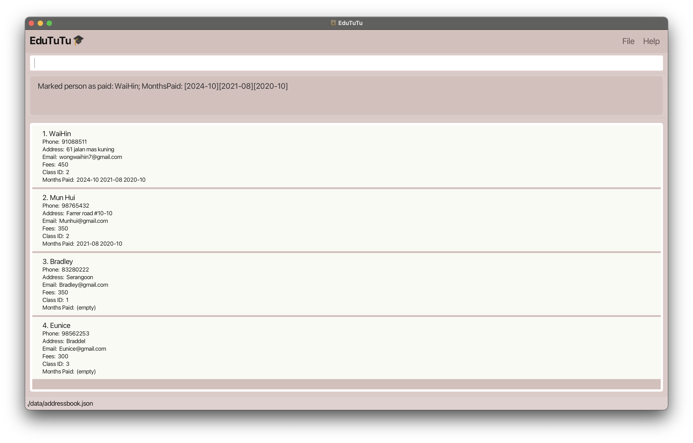
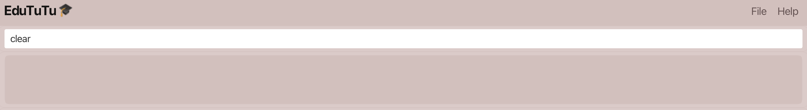
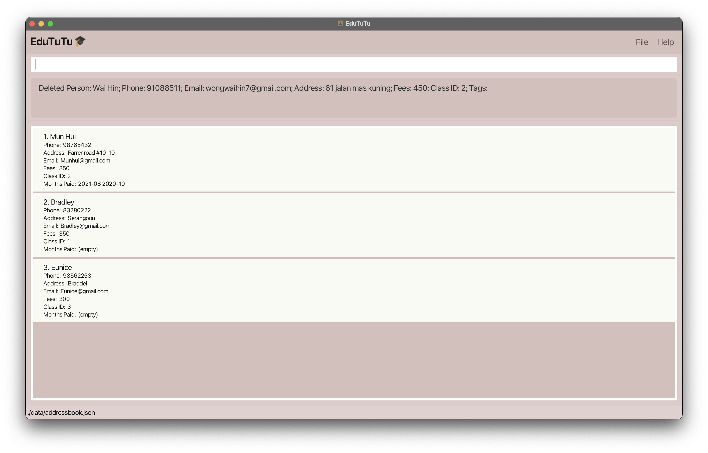
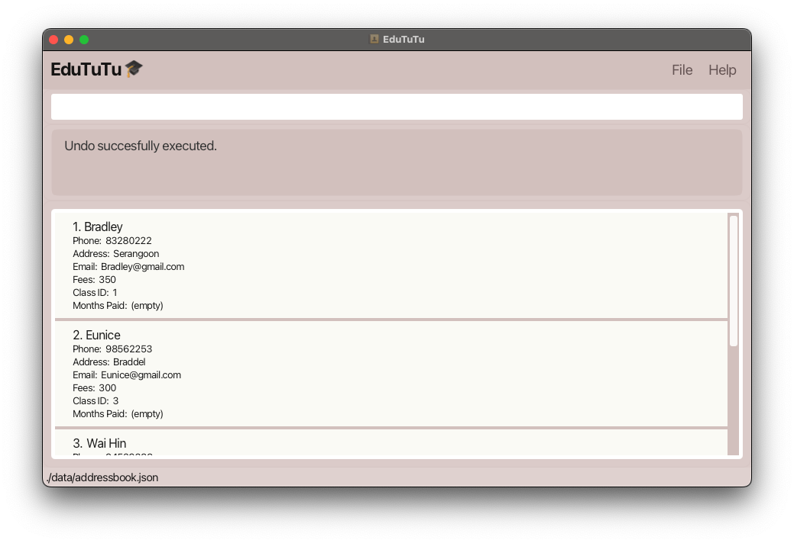
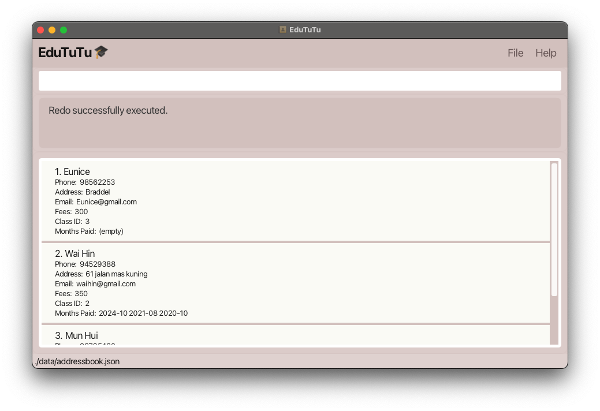
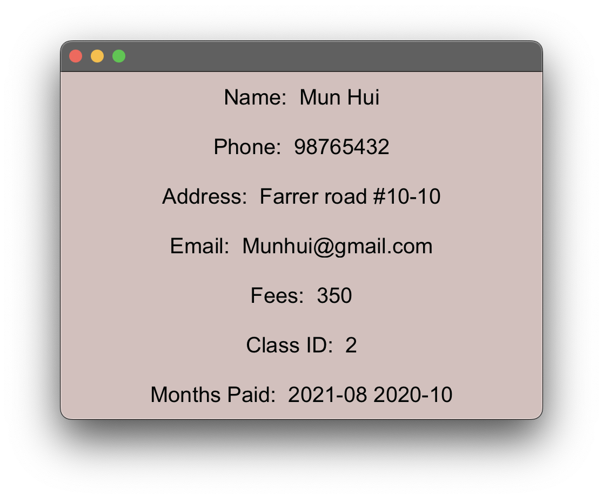

**EduTUTU** is a desktop application designed to streamline contact management for tuition centers, making it easier to 
organise and access student information. Optimised for use through a Command Line Interface (CLI) while incorporating 
the convenience of a Graphical User Interface (GUI), EduTUTU allows you to manage student details with speed and 
efficiency. Whether you’re handling student registrations, updating records, or searching for students, EduTUTU helps 
you complete these tasks more quickly than traditional applications, making it an ideal solution for tuition center 
administrators.

***

## Table of Contents

1. [Installation](#1-installation)
2. [Command Instructions](#2-command-instructions)
   - [2.1 Viewing Help](#21-viewing-help-help)
   - [2.2 Adding a Person](#22-adding-a-person-add)
   - [2.3 Deleting a Person](#23-deleting-a-person-delete)
   - [2.4 Marking a Payment Date](#24-marking-a-payment-date-markpaid)
   - [2.5 Editing a Person](#25-editing-a-person-edit)
   - [2.6 Listing All Persons](#26-listing-all-persons-list)
   - [2.7 Finding a Person](#27-finding-a-person-find)
   - [2.8 Clearing All Entries](#28-clearing-all-entries-clear)
   - [2.9 Undo/Redo Commands](#29-undoredo-commands-undo-and-redo)
   - [2.10 Displaying Pie Chart of Class Distribution](#210-displaying-pie-chart-of-class-distribution-pie)
   - [2.11 Displaying Bar Chart](#211-displaying-bar-chart-bar)
   - [2.12 Viewing Command History](#212-viewing-command-history-arrow-keys)
   - [2.13 View Student Details](#213-view-student-details-info)
   - [2.14 Editing the Data File](#214-editing-the-data-file)
   - [2.15 Saving the Data](#215-saving-the-data)
   - [2.16 Exiting the Program](#216-exiting-the-program-exit)
3. [FAQ](#3-faq)
4. [Glossary](#4-glossary)

***

## 1. Installation

1. Ensure you have Java `17` or above installed in your Computer.

1. Download the latest `.jar` file from [here](https://github.com/AY2425S1-CS2103T-T15-2/tp/releases/tag/v1.3).

1. Copy the file to the folder you want to use as the _home folder_ for your AddressBook.

1. Open a command terminal, `cd` into the folder you put the jar file in, and use the `java -jar edututu.jar` command to run the application. 
   A GUI similar to the below should appear in a few seconds. Note how the app contains some sample data. 
   

1. Type the command in the command box and press Enter to execute it. e.g. typing **`help`** and pressing Enter will open the help window. 
   Some example commands you can try:

   * `list` : Lists all contacts.

   * `add n/John Doe p/98765432 e/johnd@example.com a/John street, block 123, #01-01 f/250, c/1 ` : Adds a contact named `John Doe` to the Address Book.

   * `delete 3` : Deletes the 3rd contact shown in the current list.

   * `clear` : Deletes all contacts.

   * `exit` : Exits the app.

1. Refer to the features below for details of each command.

[Back to Table of Contents](#table-of-contents)

***

## 2. Command Instructions

### Command Format Guidelines

* Words in `UPPER_CASE` are the parameters to be supplied by the user. 
  e.g. in `add n/NAME`, `NAME` is a parameter which can be used as `add n/John Doe`.

* Items in square brackets are optional. 
  e.g `n/NAME [t/TAG]` can be used as `n/John Doe t/friend` or as `n/John Doe`.

* Items with `…​` after them can be used multiple times including zero times. 
  e.g. `[t/TAG]…​` can be used as ` ` (i.e. 0 times), `t/friend`, `t/friend t/family` etc.

* Parameters can be in any order. 
  e.g. if the command specifies `n/NAME p/PHONE_NUMBER`, `p/PHONE_NUMBER n/NAME` is also acceptable.

* Extraneous parameters for commands that do not take in parameters (such as `help`, `list`, `exit` and `clear`) will be ignored. 
  e.g. if the command specifies `help 123`, it will be interpreted as `help`.

* If you are using a PDF version of this document, be careful when copying and pasting commands that span multiple lines as space characters surrounding line-breaks may be omitted when copied over to the application.

[Back to Table of Contents](#table-of-contents)

***

### 2.1 Viewing Help: `help`

Command Format: `help`

Shows a message explaining how to access the help page.

[Back to Table of Contents](#table-of-contents)

***

### 2.2 Adding a Person: `add`

Adds a person to Edututu.

**Command Format:** `add n/NAME p/PHONE_NUMBER e/EMAIL a/ADDRESS f/FEES c/CLASSID [t/TAG]…​`

> **Remark:** A person can have any number of tags (including 0).

**Example Usage:**

`add n/Ryan p/82154565 e/Ryan@gmail.com a/3 Padang Chancery f/550 c/1`

*Input: User enters the `add` command.*  

*Output: The UI updates to show the added person.*  

**Tips:**

- Use the `add` command to add a new person with their name, phone number, email, address, fees, and class ID.
- Tags can be added to classify or group persons for easier management.
- The `add` command is helpful when setting up new contacts in EduTuTu.

[Back to Table of Contents](#table-of-contents)

***

### 2.3 Deleting a Person: `delete`

Deletes the specified person from the address book.

**Command Format:** `delete INDEX`

* Deletes the person at the specified `INDEX`.
* The index refers to the index number shown in the displayed person list.
* The index **must be a positive integer** 1, 2, 3, …​

**Example Usage:**

`delete 3`

*Input: User enters the `delete 3` command to remove the 3rd person in the displayed list.*  

*Output: The UI updates to reflect the deletion of the person.*  

**Tips:**

- Use the `delete` command to remove outdated or incorrect entries from the address book.
- Make sure to confirm the index number before deleting to avoid removing the wrong person.
- The `delete` command is especially useful when cleaning up your list of contacts.

[Back to Table of Contents](#table-of-contents)

***

### 2.4 Marking a Payment Date: `markpaid`

Updates the payment status of a student to completed.

**Format:** `markpaid INDEX m/YEAR-MONTH`

* Marks the payment of the person at the specified `INDEX` for the given month and year.
* The `INDEX` refers to the index number shown in the displayed person list.
* The `YEAR-MONTH` should be in the format `YYYY-MM` (e.g., `2024-10` for October 2024).
* The index **must be within the range** of the number of people in the list.
* The year must be within the range of 1900 to 2100, and the month must be within the valid 1-12 range.

**Example Usage:**
*Input: User enters the `markpaid 1 m/2024-10` mark the first student as paid for October 2024.*

*Output: The UI updates to show the payment status of the student.*

[Back to Table of Contents](#table-of-contents)

***

### 2.5 Editing a Person: `edit`

Edits an existing person in the address book.

**Command Format:** `edit INDEX [n/NAME] [p/PHONE] [e/EMAIL] [a/ADDRESS] [f/FEES] [c/CLASSID] [t/TAG]…​`

* Edits the person at the specified `INDEX`. The index refers to the index number shown in the displayed person list. The index **must be a positive integer** 1, 2, 3, …​
* At least one of the optional fields must be provided.
* Existing values will be updated to the input values.
* When editing tags, the existing tags of the person will be removed, i.e., adding of tags is not cumulative.
* You can remove all the person’s tags by typing `t/` without specifying any tags after it.

**Example Usage:**

`edit 1 p/91088511 e/wongwaihin7@gmail.com`

*Input: User enters the `edit` command to change the phone number and email address of the 1st person.*  

*Output: The UI updates to show the edited details.*  

**Tips:**

- Use the `edit` command to update a person’s details when changes occur.
- Make sure to use the correct `INDEX` as shown in the displayed list to edit the right person.
- The `edit` command is particularly useful for keeping contact information up to date.

[Back to Table of Contents](#table-of-contents)

***

### 2.6 Listing All Persons: `list`

The `list` command displays a list of all persons currently stored in EduTuTu.

**Command Format:** `list`

After entering the `list` command, all persons stored in the address book will be displayed in the UI.

**Example Usage:**

*Input: User enters the `list` command.*

*Output: The UI updates to show all persons.*
  

**Tips:**

- Use the `list` command whenever you want to view all entries in your address book.
- The `list` command is particularly useful after adding, editing, or deleting records to confirm changes.

[Back to Table of Contents](#table-of-contents)

***

### 2.7 Finding A Person: `find`

The `find` command allows you to list persons by their names, class IDs, or payment status (paid/unpaid).

**Command Format:**
- **By Name:** `find n/KEYWORD [MORE_KEYWORDS]`
- **By Class ID:** `find c/KEYWORD [MORE_KEYWORDS]`
- **By Name and Class ID:** `find n/KEYWORD [MORE_KEYWORDS] c/KEYWORD2 [MORE_KEYWORDS2]`
- **By Payment Date:** `find m/YEAR-MONTH` – Finds people who have completed payment for the specified month and year (e.g., `find m/2024-10` to find those who paid in October 2024).
- **By Unpaid Status:** `find !m/YEAR-MONTH` – Finds people who have **not** completed payment for the specified month and year (e.g., `find !m/2024-10` to find those who haven’t paid in October 2024).

* The search is case-insensitive. e.g., `kim` will match `Kim`.
* The order of the keywords does not matter. e.g., `Esther Kim` will match `Kim Esther`.
* Only the name is searched when using `n/` format.
* Partially matched words will be matched, e.g., `Han` will match `Hans`.
* find `n/KEYWORD c/KEYWORD2` will match persons with names containing `KEYWORD` and class IDs containing `KEYWORD2`.
* For payment search, use the format YEAR-MONTH (e.g., m/2024-10).

**Example Usage:**

`find n/Kim`

*Input: User enters the `find` command to search for persons whose names contain the keyword `Kim`.*  

*Output: The UI updates to show persons matching the search keyword.*  

**Tips:**

- Use the `find` command to quickly locate persons based on their names or class IDs.
- The `find` command is particularly useful when you have a large list and need to filter by specific attributes.

[Back to Table of Contents](#table-of-contents)

***

### 2.8 Clearing All Entries: `clear`

Clears all entries from the address book.

**Command Format:** `clear`

Upon entering the command, all entries will be cleared from Edututu. A message  
"Address book has been cleared!" will be displayed in the command box.

**Example Usage:**

`clear`

*Input: User enters the `clear` command to remove all entries.*  

*Output: The UI updates to show that all entries have been cleared.*

**Tips:**

- Use the `clear` command when you want to start fresh with an empty address book.
- Be careful when using this command, as it permanently deletes all current entries.
- Consider exporting your data before using the `clear` command if you need a backup.

[Back to Table of Contents](#table-of-contents)

***

### 2.9 Undo/Redo Commands: `undo` and `redo`

**Command Format:** `undo` and `redo`

The `undo` and `redo` commands allow you to reverse or reapply the most recent changes made to the address book.

**Format:**
- `undo` – Reverses the most recent change to the address book.
- `redo` – Reapplies the most recent change that was undone.

* The `undo` command can be used to revert the last command that modified the address book.
* The `redo` command can be used only if an `undo` was performed previously.
* Both commands are also accessible through the GUI toolbar, where clicking `Undo` or `Redo` will perform the respective action.

**Example Usage:**
*Input: User enters the `undo` command to reverse the last change.*

*Output: The UI updates to reflect the reversal of the most recent change.*

*Input: User then enters the `redo` command to reapply the change.
The UI updates to reflect the reapplication of the previously undone change*

**Tips:**

- Use the `undo` command immediately after making a change you wish to revert. This is helpful if you've added, deleted, or modified an entry by mistake.
- The `redo` command is only available after an `undo`, allowing you to reapply the change if needed.
- Remember that `undo` and `redo` are limited to the most recent changes. For more comprehensive backups, consider exporting your data regularly.
- Both `undo` and `redo` can be accessed through the toolbar in the GUI for quick navigation.

[Back to Table of Contents](#table-of-contents)

***

### 2.10 Displaying Pie Chart of Class Distribution: `pie`

Creates a pie chart showing the distribution of students in each class. This feature allows tuition center administrators to quickly visualise the number of students in each class, helping them efficiently allocate class sizes.

**Command Format:** `pie`

For example, given the following data set with 4 students:
- 1 student in class 1
- 2 students in class 2
- 1 student in class 3

*Input: User enters the `pie` command.*  

*Output: A pie chart is displayed, showing the distribution of students in each class.*  

**Tips:**

- Use the `pie` command to get a quick overview of class sizes, which is particularly useful for planning and class allocation.
- Make sure the data is up-to-date before using the `pie` command for accurate visualisation.

[Back to Table of Contents](#table-of-contents)

***

### 2.11 Displaying Bar Chart: `bar`

Displays a bar chart showing the number of students who made payments for each month. This feature allows you to visually track payment trends over time.

Command Format: `bar`

* The x-axis represents the months (e.g., 2024-01, 2024-02, etc.).
* The y-axis shows the number of students who made their payments during each month.
* If no payments were made in a given month, the value for that month will be zero.

*Input: User enters the bar command.*  

Tips:

- Use the bar command to monitor payment trends and identify any seasonal patterns.
- This feature can help tuition center administrators manage cash flow and forecast future payment periods.
- Ensure that all payment records are updated for accurate chart visualisation.

[Back to Table of Contents](#table-of-contents)

***

### 2.12 Viewing Command History: `Arrow Keys`

Allows users to quickly access previously entered commands using the up and down arrow keys.

**Command Format:** *No specific command required.*

* Press the **up arrow key** to cycle back through previously entered commands.
* Press the **down arrow key** to move forward through the command history.
* This feature is useful for repeating recent commands without needing to retype them.

**Tips:**

- Use the arrow keys to quickly correct or modify a recent command.
- This feature can save time when you need to execute similar commands repeatedly.

[Back to Table of Contents](#table-of-contents)

***

### 2.13 View Student Details: `info`

Displays the detailed information of a student in the list.

**Command Format:** `info`

* Shows the detailed information of the person at the specified `INDEX`.
* The `INDEX` refers to the index number shown in the displayed person list.
* The index **must be within the range** of the number of people in the list.
* Additionally, clicking on a student’s entry in the GUI triggers a pop-up window displaying the same detailed information.

Displaying the detailed command window can be done in two ways:

Method 1:
**Example Usage:**
*Input: User enters the `info 1` command to display detailed information for the first student.*

*Output: A window pops up with the detailed information of the student.*

Method 2:
**Example Usage:**
*Double click on the student’s entry in the GUI to display detailed information in a pop-up window.*

***

### 2.14 Editing the Data File

EduTuTu data is saved automatically as a JSON file at `[JAR file location]/data/addressbook.json`. Advanced users can update data directly by editing this data file.

> **Caution:**
> - If your changes to the data file make its format invalid, EduTuTu will discard all data and start with an empty data file at the next run. It is highly recommended to take a backup of the file before making any edits.
> - Certain edits can cause EduTuTu to behave unexpectedly (e.g., if a value entered is outside the acceptable range). Edit the data file only if you are confident in your ability to update it correctly.

[Back to Table of Contents](#table-of-contents)

***

### 2.15 Saving the Data

EduTuTu data are saved in the hard disk automatically after any command that changes the data. There is no need to save manually.

[Back to Table of Contents](#table-of-contents)

***

### 2.16 Exiting the Program: `exit`

**Command Format:** exit

Exits the program.

Exiting the program can be done in two ways:

Method 1:
1. Click the File button at the top right corner of the window.  
   
2. Click on the Exit button.
3. The program will close.

Method 2:
1. Type the command exit in the command box and press Enter.
   

2. The program will close.

Tips:

- Use the exit command when you want to close the program quickly through the command box.
- Both methods achieve the same result, so use whichever is more convenient.

[Back to Table of Contents](#table-of-contents)

***

# 3. FAQ

**Q**: How do I transfer my data to another Computer? 
**A**: Install the app in the other computer and overwrite the empty data file it creates with the file that contains the data of your previous AddressBook home folder.

[Back to Table of Contents](#table-of-contents)

***

# 4. Glossary

- **EduTuTu**: A desktop application designed for tuition centers to streamline student information management. It combines the speed of a Command Line Interface (CLI) with the convenience of a Graphical User Interface (GUI).

- **CLI (Command Line Interface)**: An interface where users type commands to interact with the application. CLI allows for quick and precise control, often preferred by users familiar with typing commands.

- **GUI (Graphical User Interface)**: A user-friendly interface with graphical elements like buttons, icons, and windows, allowing users to interact with the application more visually.

- **Command Format**: The specific way a command should be typed to work properly in EduTuTu. Following the exact format is essential for the command to be understood by the application.

- **Index**: A unique number assigned to each person entry in EduTuTu, used to identify and select entries for actions like editing or deleting.

- **Tag**: A label or keyword associated with a person, which helps categorise or organise entries (e.g., `student`, `alumni`, `parent`).

- **Class ID**: A unique identifier assigned to each class within EduTuTu, helping to organise and locate students in specific classes (e.g., `CS2100`, `ES2660`).

- **Pie Chart**: A circular chart divided into slices that shows the proportion of students in each class. It provides a visual overview of class distributions.

- **Bar Chart**: A chart with rectangular bars representing data (e.g., monthly payments) on the x-axis and values on the y-axis, helpful for viewing trends over time.

- **Undo/Redo**: Commands that let users revert (undo) the last action or reapply (redo) a previous action. Useful for correcting mistakes.

- **Command History**: A feature that stores a log of previously entered commands. Users can navigate this history using arrow keys to quickly repeat recent commands.

- **JSON File**: A text file format for storing data in an organised way, readable by humans and computers. EduTuTu saves all data in a JSON file for easy access and editing.

- **Payment Status**: Indicates whether a student’s monthly payment is complete or pending. EduTuTu includes commands to mark payments as completed.

- **Parameter**: A value or setting provided by the user within a command to specify details like a name or phone number. Parameters help customise commands to suit specific actions.

- **Backup**: A saved copy of data, which can be restored if the original data is lost or corrupted. It’s advisable to back up the JSON data file before editing it directly.

- **Clear**: A command used to remove all entries from the address book, resetting the data.

- **Exit**: A command that closes the EduTuTu application safely.

- **Storage File**: The file where EduTuTu data is automatically saved. No manual saving is needed, as data is updated after every command.

[Back to Table of Contents](#table-of-contents)

***

## Known issues

1. **When using multiple screens**, if you move the application to a secondary screen, and later switch to using only the primary screen, the GUI will open off-screen. The remedy is to delete the `preferences.json` file created by the application before running the application again.
2. **If you minimise the Help Window** and then run the `help` command (or use the `Help` menu, or the keyboard shortcut `F1`) again, the original Help Window will remain minimised, and no new Help Window will appear. The remedy is to manually restore the minimised Help Window.

[Back to Table of Contents](#table-of-contents)

***

## Command summary

| Action                      | Format, Examples                                                                                                                                                      |
|-----------------------------|-----------------------------------------------------------------------------------------------------------------------------------------------------------------------|
| **Add**                     | `add n/NAME p/PHONE_NUMBER e/EMAIL a/ADDRESS [t/TAG]…​`   e.g., `add n/James Ho p/22224444 e/jamesho@example.com a/123, Clementi Rd, 1234665 t/friend t/colleague` |
| **Bar Chart**               | `bar`                                                                                                                                                                 |
| **Clear**                   | `clear`                                                                                                                                                               |
| **Delete**                  | `delete INDEX`  e.g., `delete 3`                                                                                                                                   |
| **Edit**                    | `edit INDEX [n/NAME] [p/PHONE_NUMBER] [e/EMAIL] [a/ADDRESS] [t/TAG]…​`  e.g.,`edit 2 n/James Lee e/jameslee@example.com`                                           |
| **Exit**                    | `exit`                                                                                                                                                                |
| **Help**                    | `help`                                                                                                                                                                |
| **Find**                    | `find KEYWORD [MORE_KEYWORDS]`  e.g., `find n/James Jake`                                                                                                          |
| **List**                    | `list`                                                                                                                                                                |
| **Mark Paid**               | `markpaid INDEX YEAR_MONTH`  e.g., `markpaid 1 2024-10` (Marks the payment for October 2024 as completed for the student at index 1)                               |
| **Pie Chart**               | `pie`                                                                                                                                                                 |
| **Undo**                    | `undo`  Reverts the last action taken                                                                                                                              |
| **Redo**                    | `redo`  Reapplies the last action that was undone                                                                                                                  |
| **Viewing Command History** | *No command needed*  Use the arrow keys to navigate through previous commands                                                                                      |
| **View Student Details**    | `info INDEX`   isplays detailed information of a specific student at the given `INDEX` in a new window                                                             |
| **Editing the Data File**   | *No command*  Direct editing of the data JSON file (backup recommended)                                                                                            |
| **Saving the Data**         | *Automatic*  Data is saved automatically to the storage file after each command                                                                                    |

[Back to Table of Contents](#table-of-contents)
