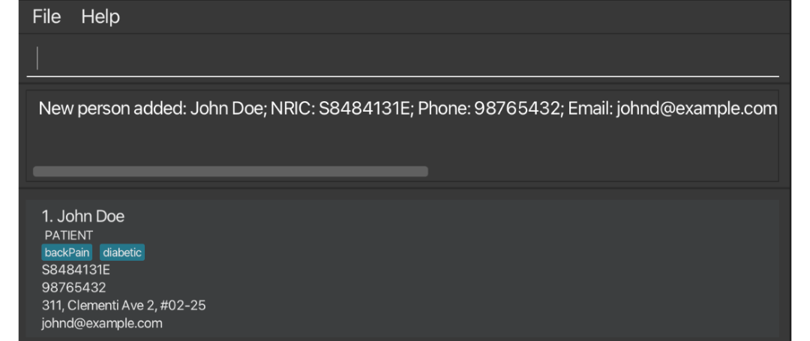
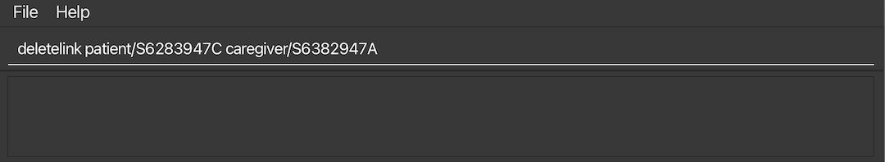
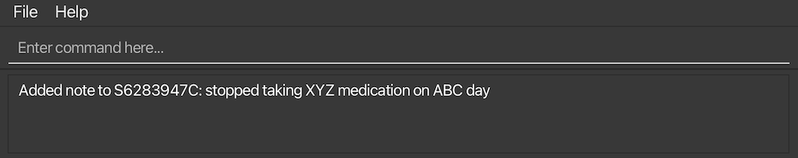
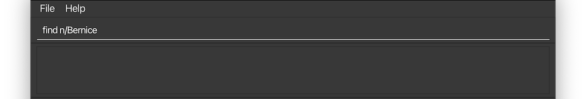
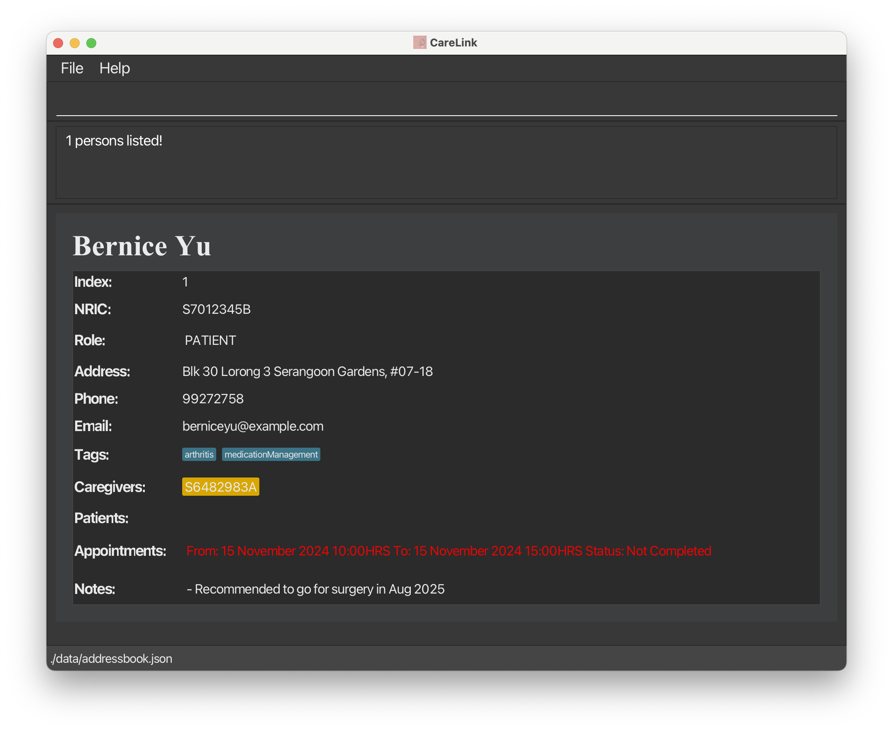
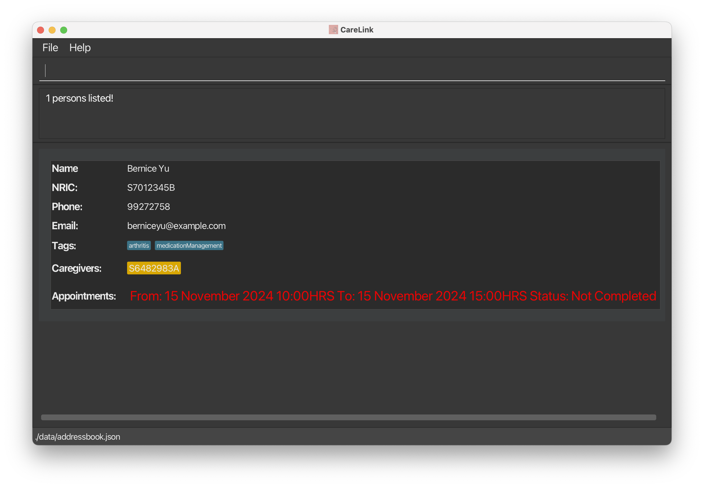
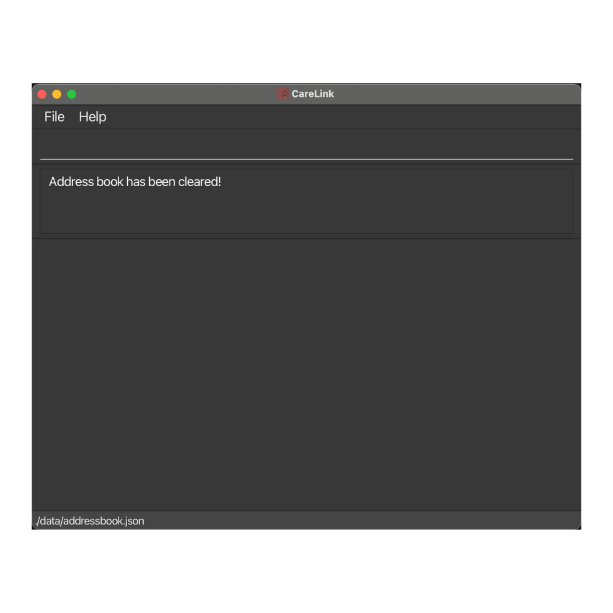

# CareLink User Guide

- [CareLink User Guide](#carelink-user-guide)
  - [Quick start](#quick-start)
  - [Features](#features)
    - [Viewing help : `help`](#viewing-help--help)
    - [Adding a person: `add`](#adding-a-person-add)
    - [Linking a patient and a caregiver: `link`](#linking-a-patient-and-a-caregiver-link)
    - [Deleting a link between patient and a caregiver: `deletelink`](#deleting-a-link-between-patient-and-a-caregiver-deletelink)
    - [Adding Notes to a Person: `addnote`](#adding-notes-to-a-person-addnote)
    - [Listing all persons : `list`](#listing-all-persons--list)
    - [Editing a person : `edit`](#editing-a-person--edit)
    - [Locating persons by name, NRIC, phone, email, role, or tags: `find`](#locating-persons-by-name-nric-phone-email-role-or-tags-find)
    - [Prefixes:](#prefixes)
    - [Examples:](#examples)
    - [Managing Appointments](#managing-appointments)
      - [Adding an appointment: `addapp`](#adding-an-appointment-addapp)
      - [Editing an appointment: `editapp`](#editing-an-appointment-editapp)
      - [Updating Status of an appointment: `updatestatus`](#updating-status-of-an-appointment-updatestatus)
      - [Deleting an appointment: `deleteapp`](#deleting-an-appointment-deleteapp)
      - [Locating appointments by date-time range: `findapp`](#locating-appointments-by-date-time-range-findapp)
      - [Examples:](#examples-1)
    - [Deleting a person : `delete`](#deleting-a-person--delete)
    - [Clearing all entries: `clear confirm`](#clearing-all-entries-clear-confirm)
    - [Exiting the program : `exit`](#exiting-the-program--exit)
    - [Saving the data](#saving-the-data)
    - [Editing the data file](#editing-the-data-file)
    - [Archiving data files `[coming in v2.0]`](#archiving-data-files-coming-in-v20)
  - [FAQ](#faq)
  - [Known issues](#known-issues)
  - [Command summary](#command-summary)

CareLink is a desktop application designed for independent geriatricians managing elderly patients with chronic conditions. The application features a Command Line Interface (CLI) optimized for users who can type fast and prefer CLI over GUI, allowing efficient management of multiple patients.

## Quick start

1. Ensure you have Java `17` or above installed in your Computer.

1. Download the latest `.jar` file from [here](https://github.com/se-edu/addressbook-level3/releases).

1. Copy the file to the folder you want to use as the _home folder_ for your AddressBook.

1. Open a command terminal, `cd` into the folder you put the jar file in, and use the `java -jar carelink.jar` command to run the application. 
   A GUI similar to the below should appear in a few seconds. Note how the app contains some sample data. 
   

1. Type the command in the command box and press Enter to execute it. e.g. typing **`help`** and pressing Enter will open the help window. 
   Some example commands you can try:

   - `list` : Lists all contacts.

   - `add n/John Doe p/98765432 e/johnd@example.com a/John street, block 123, #01-01` : Adds a contact named `John Doe` to the Address Book.

   - `delete S6483749D` : Deletes the person with NRIC `S6483749D`.

   - `clear confirm` : Deletes all contacts.

   - `exit` : Exits the app.

1. Refer to the [Features](#features) below for details of each command.

---

## Features

**:information_source: Notes about the command format:** 

- Words in `UPPER_CASE` are the parameters to be supplied by the user. 
  e.g. in `add n/NAME`, `NAME` is a parameter which can be used as `add n/John Doe`.

- Items in square brackets are optional. 
  e.g `n/NAME [t/TAG]` can be used as `n/John Doe t/friend` or as `n/John Doe`.

- Items with `…`​ after them can be used multiple times including zero times. 
  e.g. `[t/TAG]…​` can be used as ` ` (i.e. 0 times), `t/friend`, `t/friend t/family` etc.

- Parameters can be in any order. 
  e.g. if the command specifies `n/NAME p/PHONE_NUMBER`, `p/PHONE_NUMBER n/NAME` is also acceptable.

- Extraneous parameters for commands that do not take in parameters (such as `help`, `list`, `exit` and `clear`) will be ignored. 
  e.g. if the command specifies `help 123`, it will be interpreted as `help`.

- If you are using a PDF version of this document, be careful when copying and pasting commands that span multiple lines as space characters surrounding line-breaks may be omitted when copied over to the application.

### Viewing help : `help`

Shows a message explaning how to access the help page.

Format: `help`

### Adding a person: `add`

Adds a person to the address book.

Format: `add n/NAME p/PHONE_NUMBER e/EMAIL a/ADDRESS r/ROLE [t/TAG]…​`

**The role must be either a patient or a caregiver**

:bulb: **Tip:**
A person can have any number of tags (including 0)

Examples:

- `add n/John Doe nric/S8484131E p/98765432 e/johnd@example.com a/311, Clementi Ave 2, #02-25 t/backPain role/patient`

An example for adding a patient to the address book is given below.

Once the command succeeds, the person will be added to the address book and the following message will be displayed.

- `add n/John Doe p/98765432 e/johnd@example.com a/John street, block 123, #01-01`
- `add n/Betsy Crowe t/friend e/betsycrowe@example.com a/Newgate Prison p/1234567 t/criminal`

### Linking a patient and a caregiver: `link`

Links a patient to the caregiver in CareLink.

Format: `link patient/PATIENT_NRIC caregiver/CAREGIVER_NRIC`

Examples:

- `link patient/S6283947C caregiver/S6382947A`
- `link caregiver/S6382947A patient/S7193475F`

An example of using CareLink to link a patient and a caregiver is given below.

Once the command succeeds, the patient will be linked with the caregiver and the following message will be displayed.

### Deleting a link between patient and a caregiver: `deletelink`

Removes the link between patient and caregiver in CareLink.

Format: `deletelink patient/PATIENT_NRIC caregiver/CAREGIVER_NRIC`

Examples:

- `deletelink patient/S6283947C caregiver/S6382947A`
- `deletelink caregiver/S6382947A patient/S7193475F`

An example of using CareLink to delete a link between a patient and a caregiver is given below.

Once the command succeeds, the link will be removed and the following message will be displayed.

### Adding Notes to a Person: `addnote`

Adds notes to existing person in the CareLink app.

Format: `addnote nric/NRIC note/NOTES`

Examples:

- `addnote nric/S6283947C note/stopped taking XYZ medication on ABC day`
- `addnote nric/S7012345B note/is caregiver for patient XYZ only until ABC day`

An example of using CareLink to add notes to a person is given below.

Once the command succeeds, the notes will be added to the person and the following message will be displayed.

### Listing all persons : `list`

Shows a list of all persons in Care Link App.

Format: `list`

### Editing a person : `edit`

Edits an existing person in the address book.

Format: `edit NRIC [n/NAME] [p/PHONE] [e/EMAIL] [a/ADDRESS] [t/TAG]…​`

- Edits the person with the specified `NRIC`. The `NRIC` must be a valid Singapore National Identification Card Number.
- At least one of the optional fields must be provided.
- Existing values will be updated to the input values.
- When editing tags, the existing tags of the person will be removed i.e adding of tags is not cumulative.
- You can remove all the person’s tags by typing `t/` without
  specifying any tags after it.

Examples:

- `edit S1234567D p/91234567 e/johndoe@example.com` Edits the phone number and email address of the person with `S1234567D` to be `91234567` and `johndoe@example.com` respectively.
- `edit S6483749D n/Betsy Crower t/` Edits the person with NRIC `S6483749D` to be `Betsy Crower` and clears all existing tags.

### Locating persons by name, NRIC, phone, email, role, or tags: `find`

Finds persons based on the specified criteria using the provided prefixes.

**Format**: `find [n/NAME] [nric/NRIC] [p/PHONE] [e/EMAIL] [role/ROLE] [t/TAG]…​`

- The search is case-insensitive. e.g `n/alex` will match `Alex`.
- The order of the prefixes and keywords does not matter. e.g `n/Alex nric/S1234567D` is equivalent to `nric/S1234567D n/Alex`.
- Persons matching any of the provided criteria will be returned (i.e., `OR` search). For example, `n/Alex t/friend` will return persons whose name contains "Alex" or have the tag "friend".

### Prefixes:

- `n/NAME`: Searches by name.
- `nric/NRIC`: Searches by Singapore National ID.
- `role/ROLE`: Searches by role (e.g `role/patient` or `role/caregiver`).
- `t/TAG`: Searches by tag (e.g `t/friend`, `t/family`).
- `p/PHONE`: Searches by phone number.
- `e/EMAIL`: Searches by email address.
- `role/ROLE`: Searches by role (e.g `role/patient` or `role/caregiver`).

### Examples:

- `find n/John` returns `John`, `John Doe`.
- `find n/Alex nric/S1234567D` returns persons whose name contains `Alex` or with NRIC `S1234567D`.
- `find role/patient t/friend` returns all patients or persons with the tag `friend`.
- `find role/caregiver` returns all caregivers.
- `find p/1234567 e/johndoe@example.com` returns persons with phone number `1234567` or email address `johndoe@example.com`.

An example of using the find command in CareLink is given below.

Once the command succeeds, the persons found will be displayed providing comprehensive information about the persons.

### Managing Appointments

#### Adding an appointment: `addapp`

Adds an appointment for a person in CareLink.

Format: `addapp nric/NRIC d/DATE start/START_TIME end/END_TIME`

- The `NRIC` must belong to a person already in CareLink
- `DATE` must be in the format DD/MM/YYYY (e.g. 01/01/2025)
- `START_TIME` and `END_TIME` must be in 24-hour format HH:MM (e.g 14:30)
- The appointment must follow these rules:
  - Start time must be before end time
  - Appointment must be in the future
  - Must not overlap with existing appointments

Examples:

- `addapp nric/S1234567D d/01/01/2025 start/10:00 end/11:00` adds a one-hour appointment on January 1st, 2025
- `addapp nric/S9876543B d/15/03/2025 start/14:30 end/16:00` adds a 90-minute appointment on March 15th, 2025

Common errors and their meanings:

- `Incorrect NRIC. Person not found` - Check that the NRIC exists in CareLink
- `Invalid date` - Make sure to use DD/MM/YYYY format (e.g 01/01/2025)
- `Invalid time` - Make sure to use HH:MM format in 24-hour time (e.g 14:30)
- `Start time must be before end time` - Check your appointment times
- `Start time must be in the future` - Can't schedule appointments in the past
- `An appointment already exists at this date and time` - The person or another person already has an appointment that overlaps with this time slot

#### Editing an appointment: `editapp`

Edits an existing appointment for a person in CareLink

Format: `editapp nric/NRIC d/DATE start/START_TIME [newd/DATE] [newstart/START_TIME] [newend/END_TIME]`

- The `NRIC` must belong to a person already in CareLink
- `DATE` must be in the format DD/MM/YYYY (e.g 01/01/2025)
- `START_TIME` and `END_TIME` must be in 24-hour format HH:MM (e.g 14:30)
  The edited appointment follows the same rules as add appointment:
  - Start time must be before end time
  - Appointment must be in the future
  - Must not overlap with existing appointments

Examples:

- `editapp nric/S1234567D d/01/01/2025 start/10:00 end/11:00 newd/02/01/2025` changes the appointment date, timings remain the same
- `editapp nric/S1234567D d/02/01/2025 start/10:00 end/11:00 newstart/08:00  newend/09:00` Shifts the appointment timing forward, appointment remains on the same day.

Common errors and their meanings:

- `Incorrect NRIC. Person not found` - Check that the NRIC exists in CareLink
- `Invalid date` - Make sure to use DD/MM/YYYY format (e.g 01/01/2025)
- `Invalid time` - Make sure to use HH:MM format in 24-hour time (e.g 14:30)
- `Start time must be before end time` - Check your edited appointment times
- `Start time must be in the future` - Can't schedule appointments in the past
- `An appointment already exists at this date and time` - The person or another person already has an appointment that overlaps with this time slot

#### Updating Status of an appointment: `updatestatus`

Updates the status of an existing appointment. The status can be `PENDING` or `COMPLETED`.

Format: `updatestatus nric/NRIC d/DATE start/START_TIME status/STATUS`

- The `NRIC` must belong to a person with an existing appointment
- `DATE` must be in the format DD/MM/YYYY (e.g 01/01/2025)
- `START_TIME` must be in 24-hour format HH:MM (e.g 14:30)
- The `STATUS` must be either `PENDING` or `COMPLETED`. It is case insensistive.
- The appointment must exist at the specified date and time for the person

Examples:

- `updatestatus nric/S1234567D d/01/01/2025 start/10:00 status/completed` updates the status to completed for the appointment on January 1st, 2025 at 10:00
- `updatestatus nric/S1234567D d/01/01/2025 start/10:00 status/pending` updates the status to pending for the appointment on January 1st, 2025 at 10:00

:bulb: **Tip:**
To change the status of an appointment, you only need the start time. The end time is not required since CareLink can identify the appointment uniquely by the person, date, and start time.

- `Incorrect NRIC. Person not found` - Check that the NRIC exists in CareLink
- `Invalid date` - Make sure to use DD/MM/YYYY format (e.g. 01/01/2025)
- `Invalid time` - Make sure to use HH:MM format in 24-hour time (e.g. 14:30)
- `This appointment does not exist in CareLink` - There is no appointment at the specified date and time for this person
- `Status should only be 'COMPLETED' or 'PENDING'` - The status can only take in 2 options, completed or pending.

#### Deleting an appointment: `deleteapp`

Deletes an existing appointment for a person in CareLink.

Format: `deleteapp nric/NRIC d/DATE start/START_TIME`

- The `NRIC` must belong to a person with an existing appointment
- `DATE` must be in the format DD/MM/YYYY (e.g 01/01/2025)
- `START_TIME` must be in 24-hour format HH:MM (e.g 14:30)
- The appointment must exist at the specified date and time for the person

Examples:

- `deleteapp nric/S1234567D d/01/01/2025 start/10:00` deletes the appointment on January 1st, 2025 at 10:00
- `deleteapp nric/S9876543B d/15/03/2025 start/14:30` deletes the appointment on March 15th, 2025 at 14:30

:bulb: **Tip:**
To delete an appointment, you only need the start time. The end time is not required since CareLink can identify the appointment uniquely by the person, date, and start time.

Common errors and their meanings:

- `Incorrect NRIC. Person not found` - Check that the NRIC exists in CareLink
- `Invalid date` - Make sure to use DD/MM/YYYY format (e.g. 01/01/2025)
- `Invalid time` - Make sure to use HH:MM format in 24-hour time (e.g. 14:30)
- `This appointment does not exist in CareLink` - There is no appointment at the specified date and time for this person

#### Locating appointments by date-time range: `findapp`

Finds and lists appointment that falls within the specified date-time range. The command displays detailed information about the appointments such as the patient's name, phone, email, NRIC, caregivers, tags, and the appointment's start and end dates and times.

**Format**: `findapp sdate/START_DATE start/START_TIME edate/END_DATE end/END_TIME​`

- `sdate/01/01/2024` sets the search start date to January 1, 2024.
- `start/10:00` sets the search start time to 10:00 AM.
- `edate/30/10/2024` sets the search end date to October 30, 2024.
- `end/12:00` sets the search end time to 12:00 PM.
- `findapp sdate/01/01/2024 start/10:00 edate/30/10/2024 end/12:00` does not list an appointment that starts before 12:00 PM and ends after 12:00 PM on 30/10/2024.
- `findapp sdate/01/01/2024 start/10:00 edate/30/10/2024 end/12:00` does not list an appointment that starts before 10:00 AM and ends after 10:00 PM on 01/01/2024.

#### Examples:

- `findapp sdate/01/01/2024 start/10:00 edate/30/10/2024 end/12:00` finds and lists appointments that starts and ends within the specified date-time range.

An example of the result obtained from the `findapp` command is given below.

### Deleting a person : `delete`

Deletes the specified person from the address book.

Format: `delete NRIC`

- Deletes the person with the specified `NRIC`.
- The NRIC **must be a valid Singapore National ID** (eg. S1234567D)​

Examples:

- `find n/David` returns `David LI` with NRIC `S6483749D`
- `delete S6483749D` deletes the person with the NRIC `S6483749D` in the address book.

An example of using the delete command in CareLink is given below.
Notice the NRIC used in the example belongs to `David LI`.

Once the command succeeds, notice that David is removed and hence no longer displayed.

### Clearing all entries: `clear confirm`

Clears all entries from the address book after receiving confirmation.

**Warning**: This command will permanently delete all entries from the address book. Ensure that you want to proceed before executing this command.

**Format**: `clear confirm`

- You must type `confirm` explicitly to execute this command. Any other input will not clear the address book.

**Example**:

- `clear confirm` clears all entries from the address book.
  
- `clear` without `confirm` will prompt the user to include the confirmation keyword.
  

### Exiting the program : `exit`

Exits the program.

Format: `exit`

### Saving the data

AddressBook data are saved in the hard disk automatically after any command that changes the data. There is no need to save manually.

### Editing the data file

AddressBook data are saved automatically as a JSON file `[JAR file location]/data/addressbook.json`. Advanced users are welcome to update data directly by editing that data file.

:exclamation: **Caution:**
If your changes to the data file makes its format invalid, AddressBook will discard all data and start with an empty data file at the next run. Hence, it is recommended to take a backup of the file before editing it. 
Furthermore, certain edits can cause the AddressBook to behave in unexpected ways (e.g if a value entered is outside of the acceptable range). Therefore, edit the data file only if you are confident that you can update it correctly.

### Archiving data files `[coming in v2.0]`

_Details coming soon ..._

---

## FAQ

**Q**: How do I transfer my data to another Computer? 
**A**: Install the app in the other computer and overwrite the empty data file it creates with the file that contains the data of your previous AddressBook home folder.

---

## Known issues

1. **When using multiple screens**, if you move the application to a secondary screen, and later switch to using only the primary screen, the GUI will open off-screen. The remedy is to delete the `preferences.json` file created by the application before running the application again.
2. **If you minimize the Help Window** and then run the `help` command (or use the `Help` menu, or the keyboard shortcut `F1`) again, the original Help Window will remain minimized, and no new Help Window will appear. The remedy is to manually restore the minimized Help Window.

---

## Command summary

| Action                 | Format, Examples                                                                                                                                                                                                |
| ---------------------- | --------------------------------------------------------------------------------------------------------------------------------------------------------------------------------------------------------------- |
| **Add**                | `add n/NAME p/PHONE_NUMBER e/EMAIL a/ADDRESS [t/TAG]…`   e.g `add n/James Ho p/22224444 e/jamesho@example.com a/123, Clementi Rd, 1234665 t/friend t/colleague`                                              |
| **Link**               | `link patient/PATIENT_NRIC caregiver/CAREGIVER_NRIC`   e.g. `link patient/S6283947C caregiver/S7012345B`                                                                                                     |
| **Deletelink**         | `deletelink patient/PATIENT_NRIC caregiver/CAREGIVER_NRIC`   e.g. `deletelink patient/S6283947C caregiver/S6382947A`                                                                                         |
| **Addnote**            | `addnote nric/NRIC note/NOTES`   e.g. `addnote nric/S6283947C note/stopped taking XYZ medication on ABC day`                                                                                                 |
| **Clear**              | `clear`                                                                                                                                                                                                         |
| **Delete**             | `delete NRIC`  e.g `delete S6483749D`                                                                                                                                                                        |
| **Edit**               | `edit NRIC [n/NAME] [p/PHONE_NUMBER] [e/EMAIL] [a/ADDRESS] [t/TAG]…`   e.g`edit S1234567D n/James Lee e/jameslee@example.com`                                                                                |
| **Find**               | `find [n/NAME] [nric/NRIC] [role/ROLE] [t/TAG]...`  e.g `find n/Alex nric/S1234567D`                                                                                                                         |
| **Find Appointment**   | `findapp [sdate/START_DATE] [start/START_TIME] [edate/END_DATE] [end/END_TIME]`  e.g `findapp sdate/01/01/2024 start/10:00 edate/30/10/2024 end/12:00`                                                       |
| **Add Appointment**    | `addapp nric/NRIC d/DATE start/START_TIME end/END_TIME`  e.g `addapp nric/S1234567D d/01/01/2025 start/10:00 end/11:00`                                                                                      |
| **Edit Appointment**   | `editapp nric/NRIC d/DATE start/START_TIME [newd/DATE] [newstart/START_TIME] [newend/END_TIME]`  e.g `editapp nric/S1234567D d/01/01/2025 start/10:00 end/11:00 newd/02/01/2025 newstart/08:00 newend/09:00` |
| **Update Appointment** | `updatestatus nric/NRIC d/DATE start/START_TIME status/STATUS`   e.g `updatestatus nric/S1234567D d/01/01/2025 start/10:00 status/completed`                                                                 |
| **Delete Appointment** | `deleteapp nric/NRIC d/DATE start/START_TIME`  e.g `deleteapp nric/S9876543B d/15/03/2025 start/14:30`                                                                                                       |
| **List**               | `list`                                                                                                                                                                                                          |
| **Help**               | `help`                                                                                                                                                                                                          |
