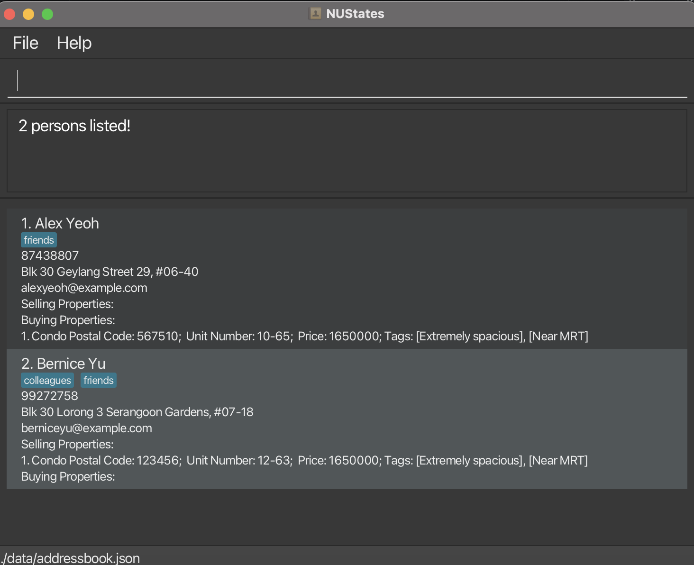

# NUStates User Guide

NUStates is a **desktop app for managing contacts, optimized for use via a  Line Interface** (CLI) for Real Estate Agents to organize and categorize client and seller contacts, manage property listings, and easily search through client information. With NUStates, agents can add and categorize clients, list properties for sale or purchase,and find contacts by name or phone number.

It has the benefits of a Graphical User Interface (GUI). If you can type fast, NUStates can get your contact management tasks done faster than traditional GUI apps.

<!-- * Table of Contents -->
# Table of Contents
- [Quick Start](#quick-start)
- [Features](#features)
- [FAQ](#faq)
- [Known Issues](#known-issues)
- [Command Summary](#command-summary)

--------------------------------------------------------------------------------------------------------------------

## Quick start

1. Ensure you have Java `17` or above installed in your Computer.

1. Download the latest `.jar` file from [here](https://github.com/AY2425S1-CS2103T-F10-3/tp/releases).

1. Copy the file to the folder you want to use as the _home folder_ for your AddressBook.

1. Open a command terminal, `cd` into the folder you put the jar file in, and use the `java -jar nustates.jar` command to run the application. 
   A GUI similar to the below should appear in a few seconds. Note how the app contains some sample data. 
   

1. Type the command in the command box and press Enter to execute it. e.g. typing **`help`** and pressing Enter will open the help window. 
   Some example commands you can try:

   * `list` : Lists all contacts.

   * `add n/John Doe p/98765432 e/johnd@example.com a/John street, block 123, #01-01` : Adds a contact named `John Doe` to the Address Book.

   * `addBuy 1 ht/c bp/1650000 pc/567510 un/10-65 t/Extremely spacious t/Near MRT` : Adds a property of type `Condo` to the Address Book for the contact at index 1.

   * `addBuy 1 ht/c bp/1750000 pc/567510 un/10-65 t/Extremely spacious t/Near MRT` : Adds a property of type `Condo` to the Address Book for the contact at index 1. 

   * `delete 3` : Deletes the 3rd contact shown in the current list.

   * `clear` : Deletes all contacts.

   * `exit` : Exits the app.

1. Refer to the [Features](#features) below for details of each command.

--------------------------------------------------------------------------------------------------------------------

## Features

<box type="info" seamless>

**Notes about the command format:** 

* Words in `UPPER_CASE` are the parameters to be supplied by the user. 
  e.g. in `add n/NAME`, `NAME` is a parameter which can be used as `add n/John Doe`.

* Items in square brackets are optional. 
  e.g `n/NAME [t/TAG]` can be used as `n/John Doe t/friend` or as `n/John Doe`.

* Items with `…`​ after them can be used multiple times including zero times. 
  e.g. `[t/TAG]…​` can be used as ` ` (i.e. 0 times), `t/friend`, `t/friend t/family` etc.

* Parameters can be in any order. 
  e.g. if the command specifies `n/NAME p/PHONE_NUMBER`, `p/PHONE_NUMBER n/NAME` is also acceptable.

* Extraneous parameters for commands that do not take in parameters (such as `help`, `list`, `exit` and `clear`) will be ignored. 
  e.g. if the command specifies `help 123`, it will be interpreted as `help`.

* If you are using a PDF version of this document, be careful when copying and pasting commands that span multiple lines as space characters surrounding line-breaks may be omitted when copied over to the application.
</box>

### Viewing help : `help`

Shows a message explaning how to access the help page.

Format: `help`

### Adding a person: `add`

Adds a person to the address book.

Format: `add n/NAME p/PHONE_NUMBER e/EMAIL a/ADDRESS [t/TAG]…​`

<box type="tip" seamless>

**Tip:** A person can have any number of tags (including 0)
</box>

Examples:
* `add n/John Doe p/98765432 e/johnd@example.com a/John street, block 123, #01-01`
* `add n/Betsy Crowe t/friend e/betsycrowe@example.com a/Newgate Prison p/1234567 t/criminal`

### Adding a property to buy: `addBuy`

Adds a property which has to be bought to the address book. The property is associated to a contact in the Address Book.

Format: `addBuy INDEX_NUMBER ht/HOUSING TYPE bp/BUYING_PRICE pc/POSTAL_CODE un/UNIT_NUMBER [t/TAG]…​`

<box type="tip" seamless>

**Tip:** A property can have any number of tags (including 0)
</box>

Examples:
* `addBuy 1 ht/c bp/1650000 pc/189651 un/5-10`
* `addBuy 5 ht/h bp/735000 pc/138600 un/30-05 t/Extremely spacious/Near MRT`

### Adding a property to sell: `addSell`

Adds a property which has to be sold to the address book. The property is associated to a contact in the Address Book.

Format: `addSell INDEX_NUMBER ht/HOUSING TYPE sp/SELLING_PRICE pc/POSTAL_CODE un/UNIT_NUMBER [t/TAG]…​`

<box type="tip" seamless>

**Tip:** A property can have any number of tags (including 0)
</box>

Examples:
* `addSell 1 ht/c sp/1650000 pc/189651 un/5-10`
* `addSell 5 ht/h sp/735000 pc/138600 un/30-05 t/Extremely spacious/Near MRT`

### Listing all persons : `list`

Shows a list of all persons along with the properties associated with them in the address book.

Format: `list`

### Editing a person : `edit`

Edits an existing person in the address book.

Format: `edit INDEX [n/NAME] [p/PHONE] [e/EMAIL] [a/ADDRESS] [t/TAG]…​`

* Edits the person at the specified `INDEX`. The index refers to the index number shown in the displayed person list. The index **must be a positive integer** 1, 2, 3, …​
* At least one of the optional fields must be provided.
* Existing values will be updated to the input values.
* When editing tags, the existing tags of the person will be removed i.e adding of tags is not cumulative.
* You can remove all the person’s tags by typing `t/` without
    specifying any tags after it.

Examples:
*  `edit 1 p/91234567 e/johndoe@example.com` Edits the phone number and email address of the 1st person to be `91234567` and `johndoe@example.com` respectively.
*  `edit 2 n/Betsy Crower t/` Edits the name of the 2nd person to be `Betsy Crower` and clears all existing tags.

### Locating persons by name: `findn`

Finds persons whose names contain any of the given keywords.

Format: `findn KEYWORD [MORE_KEYWORDS]`

* The search is case-insensitive. e.g `hans` will match `Hans`
* The order of the keywords does not matter. e.g. `Hans Bo` will match `Bo Hans`
* Only the name is searched.
* Only full words will be matched e.g. `Han` will not match `Hans`
* Persons matching at least one keyword will be returned (i.e. `OR` search).
  e.g. `Hans Bo` will return `Hans Gruber`, `Bo Yang`

Examples:
* `findn John` returns `john` and `John Doe`
* `findn alex david` returns `Alex Yeoh`, `David Li` 
  

### Locating persons by phone number: `findp`

Finds persons whose phone number contain any of the given keywords.

Format: `findp KEYWORD [MORE_KEYWORDS]`

* The KEYWORD can only be numeric values
* The order of the keywords does not matter. e.g. `86796692 98765432` will match `98765432 86796692`
* Only the phone number is searched.
* Only full phone numbers will be matched e.g. `867966` will not match `86796692`
* Persons matching at least one keyword will be returned (i.e. `OR` search).
  e.g. ` 87438807 99272758` will return `Alex Yeah`, `Bernice Yu`

Examples:
* `findp 87438807` returns `Alex Yeah`
* `findp 87438807 99272758` returns `Alex Yeoh`, `Bernice Yu` 
  

### Deleting a person : `delete`

Deletes the specified person from the address book.

Format: `delete INDEX`

* Deletes the person at the specified `INDEX`.
* The index refers to the index number shown in the displayed person list.
* The index **must be a positive integer** 1, 2, 3, …​

Examples:
* `list` followed by `delete 2` deletes the 2nd person in the address book.
* `find Betsy` followed by `delete 1` deletes the 1st person in the results of the `find` command.

### Deleting a property to be sold : `delSell`

Deletes the specified property to be sold under specified person from the address book.

Format: `delSell INDEX_PERSON INDEX_PROPERTY`

* Deletes the property to be sold at the specified `INDEX_PROPERTY` under the person at the specified `INDEX_PERSON`.
* The index refers to the index number displayed in the selling properties list and person list.
* The index **must be a positive integer** 1, 2, 3, …​

Examples:
* `list` followed by `delSell 2 1` deletes the 1st selling property under 2nd person in the address book.

### Deleting a property to be bought : `delSell`

Deletes the specified property to be bought under specified person from the address book.

Format: `delBuy INDEX_PERSON INDEX_PROPERTY`

* Deletes the property to be bought at the specified `INDEX_PROPERTY` under the person at the specified `INDEX_PERSON`.
* The index refers to the index number displayed in the buying properties list and person list.
* The index **must be a positive integer** 1, 2, 3, …​

Examples:
* `list` followed by `delBuy 2 1` deletes the 1st buying property under 2nd person in the address book.

### Clearing all entries : `clear`

Clears all entries from the address book.

Format: `clear`

### Exiting the program : `exit`

Exits the program.

Format: `exit`

### Saving the data

AddressBook data are saved in the hard disk automatically after any command that changes the data. There is no need to save manually.

### Editing the data file

AddressBook data are saved automatically as a JSON file `[JAR file location]/data/addressbook.json`. Advanced users are welcome to update data directly by editing that data file.

<box type="warning" seamless>

**Caution:**
If your changes to the data file makes its format invalid, AddressBook will discard all data and start with an empty data file at the next run.  Hence, it is recommended to take a backup of the file before editing it. 
Furthermore, certain edits can cause the AddressBook to behave in unexpected ways (e.g., if a value entered is outside the acceptable range). Therefore, edit the data file only if you are confident that you can update it correctly.
</box>

### Archiving data files `[coming in v2.0]`

_Details coming soon ..._

--------------------------------------------------------------------------------------------------------------------

## FAQ

**Q**: What platform does NUStates support? 
**A**: NUStates is available for Windows, macOS, and Linux. Please ensure your system meets the minimum requirements for installation. Check [Quick Start](#quick-start) for system requirements.

**Q**: How do I transfer my data to another Computer? 
**A**: Install the app in the other computer and overwrite the empty data file it creates with the file that contains the data of your previous AddressBook home folder.

**Q**: The app is running slowly; What should i do? 
**A**: Try restarting the application. If the problem persists, ensure your computer meets the app’s performance requirements and consider clearing any unnecessary data.

--------------------------------------------------------------------------------------------------------------------

## Known issues

1. **When using multiple screens**, if you move the application to a secondary screen, and later switch to using only the primary screen, the GUI will open off-screen. The remedy is to delete the `preferences.json` file created by the application before running the application again.
2. **If you minimize the Help Window** and then run the `help` command (or use the `Help` menu, or the keyboard shortcut `F1`) again, the original Help Window will remain minimized, and no new Help Window will appear. The remedy is to manually restore the minimized Help Window.
3. **After a property is added** it is not instantly reflected on the Ui. It is reflected on the Ui after a delay. To resolve this,can either wait for a bit or scroll the screen up and down or click on the contact you added the property to.
4. **Bug in edit command**, the edit command overwrites the property list and deletes them when a person is edited/modified.
5. **Same Property to Sell** can be tagged to various contacts
6. **delSell and delBuy** only works with the index displayed using the `list` command and not `findn` or `findp` command.

--------------------------------------------------------------------------------------------------------------------

## Command summary

Action     | Format, Examples
-----------|----------------------------------------------------------------------------------------------------------------------------------------------------------------------
**Add**    | `add n/NAME p/PHONE_NUMBER e/EMAIL a/ADDRESS [t/TAG]…​`   e.g., `add n/James Ho p/22224444 e/jamesho@example.com a/123, Clementi Rd, 1234665 t/friend t/colleague`
**Add Property** | `addBuy INDEX_NUMBER ht/HOUSING TYPE bp/BUYING_PRICE pc/POSTAL_CODE un/UNIT_NUMBER [t/TAG]…​`   e.g., `addBuy 5 ht/h bp/735000 pc/138600 un/30-05 t/Extremely spacious/Near MRT`
**Add Property** | `addSell INDEX_NUMBER ht/HOUSING TYPE sp/SELLING_PRICE pc/POSTAL_CODE un/UNIT_NUMBER [t/TAG]…​`   e.g., `addSell 5 ht/h sp/735000 pc/138600 un/30-05 t/Extremely spacious/Near MRT`
**Clear**  | `clear`
**Delete** | `delete INDEX`  e.g., `delete 3`
**Delete Property** | `delSell INDEX_PERSON INDEX_PROPERTY`  e.g., `delSell 3 2`
**Delete Property** | `delBuy INDEX_PERSON INDEX_PROPERTY`  e.g., `delBuy 3 2`
**Edit**   | `edit INDEX [n/NAME] [p/PHONE_NUMBER] [e/EMAIL] [a/ADDRESS] [t/TAG]…​`  e.g.,`edit 2 n/James Lee e/jameslee@example.com`
**Find Name**   | `findn KEYWORD [MORE_KEYWORDS]`  e.g., `findn James Jake`
**Find Phone Number**   | `findp KEYWORD [MORE_KEYWORDS]`  e.g., `findn 98272758 85495438`
**List**   | `list`
**Help**   | `help`
