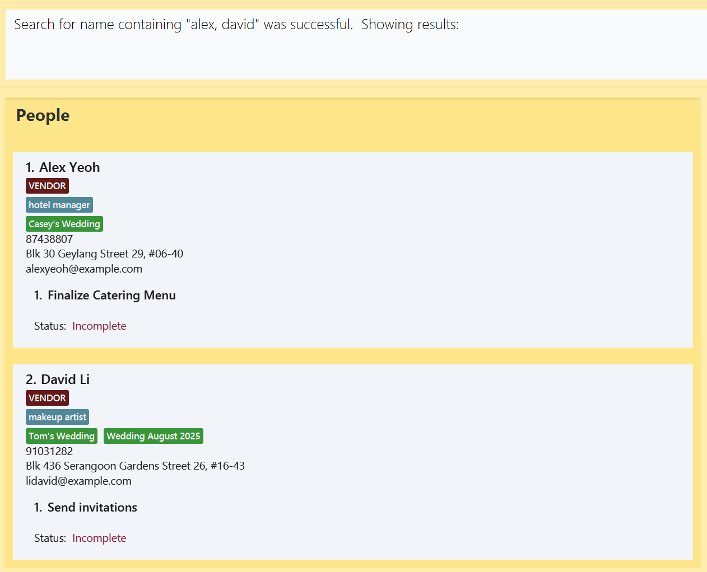
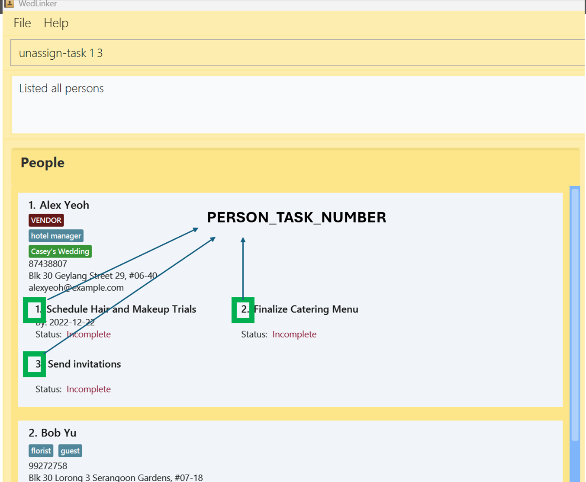

# WedLinker User Guide

WedLinker is your **essential desktop app for managing wedding-related contacts**, designed specifically for professional wedding planners.
**With a powerful Command Line Interface (CLI)**, WedLinker streamlines contact management through quick, intuitive commands. This means you can accomplish your tasks faster than with traditional GUI apps, giving you more time to focus on what matters most—creating memorable experiences for your clients.

While WedLinker excels with its CLI for speed, it still offers the valuable visual elements of a Graphical User Interface (GUI). The GUI provides an organised and intuitive layout, making it easy to visualise your contacts, weddings, and tasks at a glance.
This combination of efficiency and clarity ensures that you can manage your wedding planning responsibilities with ease and precision.

<!-- * Table of Contents -->
<page-nav-print />

--------------------------------------------------------------------------------------------------------------------

## Quick start

1. Ensure you have `Java 17` or above installed on your computer by performing the following:
   1. Open your system terminal
      1. Windows: <br>
         1. Hold down Windows button and R (⊞ Win + R ) 
         2. Type `cmd` and press enter
         
      1. MacOS -- do one of the following: <br>
          - Click the Launchpad icon in the Dock, type `Terminal` in the search field, then click Terminal, OR
          - In the Finder, open the `/Applications/Utilities` folder, then double-click Terminal.
   1. Type `java -version` and press enter
   1. If you have `Java 17 installed, the terminal should look something like:
   ```
         C:\Users\UserName>java -version
         java version "17.0.12" 2024-07-16 LTS
         Java(TM) SE Runtime Environment (build 17.0.12+8-LTS-286)
         Java HotSpot(TM) 64-Bit Server VM (build 17.0.12+8-LTS-286, mixed mode, sharing)
    ```
2. If you do not have Java 17 installed, or you are unsure, refer to the guide below.
   1. Download `Java 17` from the official website: https://www.oracle.com/java/technologies/javase/jdk17-archive-downloads.html
   2. Select the installation package based on your Operating System. For Apple users select macOS, for Windows users select Windows.
   3. Follow the instruction guide to install Java on your device. For more information use this guide: https://docs.oracle.com/en/java/javase/23/install/overview-jdk-installation.html

2. Download the latest version of WedLinker from [here](https://github.com/AY2425S1-CS2103T-F15-4/tp/releases/). Select `WedLinker.jar` to begin the download.


3. Copy the file to the folder you want to use as the _home folder_ for your WedLinker.

4. Open WedLinker by double clicking the program file, `WedLinker.jar`.<br>
   A GUI similar to the below should appear in a few seconds. Note how the app contains some sample data.<br>
   

5. Type the command in the command box and press Enter to execute it. e.g. typing **`help`** and pressing Enter will open the help window.<br>
   Some example commands you can try:

   * `list` : Lists all contacts.

   * `add n/John Doe p/98765432 e/johnd@example.com a/ABC Photography Studio` : Adds a contact named `John Doe` to WedLinker.

   * `delete 3` : Deletes the 3rd contact shown in the current list.

   * `clear` : Deletes all contacts.

   * `exit` : Exits the app.

6. Refer to the [Features](#features) below for details of each command.

--------------------------------------------------------------------------------------------------------------------

# Features

<box type="info" seamless>

**Notes about the command format:**<br>

* Words in `UPPER_CASE` are the parameters to be supplied by the user.<br>
  e.g. in `add n/NAME`, `NAME` is a parameter which can be used as `add n/John Doe`.

* Items in square brackets are optional.<br>
  e.g `n/NAME [t/TAG_NAME]` can be used as `n/John Doe t/guest` or as `n/John Doe`.

* Items with `…`​ after them can be used multiple times including zero times.<br>
  e.g. `[t/TAG_NAME]…​` can be used as ` ` (i.e. 0 times), `t/guest`, `t/guest t/photographer` etc.

* Commands in WedLinker uses labels to specify the parameters, the labels are stated as such:
  * n/ Name
  * a/ Address
  * p/ Phone Number
  * e/ Email
  * t/ Tag
  * w/ Wedding
  * tk/ Task
  * d/ Date

* Parameters can be in any order.<br>
  * e.g. if the command specifies `n/NAME p/PHONE_NUMBER`, `p/PHONE_NUMBER n/NAME` is also acceptable.

* Extraneous parameters for commands that do not take in parameters (such as `help`, `list`, `exit` and `clear`) will be ignored.<br>
  * e.g. if the command specifies `help 123`, it will be interpreted as `help`.

* Similarly, extraneous prefixes (e.g. n/ or tk/) for commands that do not take in those prefixes will be processed as part of other inputs.<br>
  * e.g. when [adding a person](#adding-a-person-add), you can specify the prefixes `n/, p/, e/, a/, t/, and w/`. If the command specifies
  `add n/Betsy Crowe d/2020-04-11 tk/Buy place settings`, it will be interpreted as adding a person with the name `Betsy Crowe d/2020-04-11 tk/Buy place settings`

* If you are using a PDF version of this document, be careful when copying and pasting commands that span multiple lines as space characters surrounding line-breaks may be omitted when copied over to the application.
  </box>

## General Features

### Viewing help : `help`

Shows a message explaning how to access the help page.


Format: `help`

### Listing all Persons : `list`

Shows a list of all saved [Persons](#person-features) in the WedLinker.

Format: `list`

### Listing all Weddings : `list-weddings`

Shows a list of all [Weddings](#wedding-features) in the WedLinker.

Format: `list-weddings` or `lw`

### Listing all Tasks : `list-tasks`

Shows a list of all [Tasks](#task-features) in the WedLinker

Format: `list-tasks` or `ltasks`

### Listing all Tags : `list-tags`

Shows a list of all [Tags](#tag-features) in the WedLinker

Format: `list-tags` or `ltags`

### Clearing all entries : `clear`

Clears all entries from WedLinker.

Format: `clear`

<box type="warning" seamless>

**Caution:**
This action is irreversible and cannot be undone. Please ensure you have backed up any important information before proceeding.
</box>

### Exiting the program : `exit`

Exits the program.

Format: `exit`

### Saving the data

WedLinker data are saved in the hard disk automatically after any command that changes the data. There is no need to save manually.

### Editing the data file

WedLinker data are saved automatically as a JSON file `[JAR file location]/data/WedLinker.json`. Advanced users are welcome to update data directly by editing that data file.

<box type="warning" seamless>

**Caution:**
If your changes to the data file makes its format invalid, WedLinker will discard all data and start with an empty data file at the next run.  Hence, it is recommended to take a backup of the file before editing it.<br>
Furthermore, certain edits can cause the WedLinker to behave in unexpected ways (e.g., if a value entered is outside the acceptable range). Therefore, edit the data file only if you are confident that you can update it correctly.
</box>

## Person Features

### Adding a person: `add`

Use the add command to add a new contact to WedLinker.

Format: `add n/NAME [p/PHONE_NUMBER] [e/EMAIL] [a/ADDRESS] [t/TAG_NAME]…​ [w/WEDDING_NAME]…​`


<box type="tip" seamless>

**Tip:** A person can have any number of tags (including 0)
</box>

To add a contact to WedLinker, type `add` followed by details such as the name, phone number, and email.

* **People in Wedlinker cannot have the same names**
  * So, if `John Doe` is already in Wedlinker, adding another `John Doe` with different details will not work
* If the tags or weddings specified in the add command do not exist yet, they will be created

Examples:
* To add a contact named John Doe with a phone number of 98765432, email johnd@example.com, and address XYZ Floral Services, enter the command:
  * `add n/John Doe p/98765432 e/johnd@example.com a/XYZ Floral Services`
* To add a contact named Betsy Crowe with a phone number of 1234567, with tags Photographer and Guest, enter the command:
  * `add n/Betsy Crowe p/1234567 t/Photographer t/Guest`

<box type="tip" seamless>

**Tip:** 
* Adding a person with tags or weddings that do not exist in Wedlinker will create all the tags and weddings!
Created weddings will have the person automatically assigned to their guest lists.

* A person can have any number of tags or weddings (including 0)

* A person's name must contain only alphanumeric characters, spaces, or the following characters: / . - '
</box>

<box type="warning" seamless>

**Warning:** Extraneous prefixes in the add command will be processed as part of other inputs.<br>
* e.g. when adding a person, you can specify the prefixes `n/, p/, e/, a/, t/, and w/`. If the command specifies
`add n/Betsy Crowe d/2020-04-11 tk/Buy place settings`, it will be interpreted as adding a person with the name `Betsy Crowe d/2020-04-11 tk/Buy place settings`
</box>


### Editing a person : `edit`

Use the edit command to edit details of an existing contact in WedLinker.

Format: `edit PERSON_NUMBER [n/NAME] [p/PHONE] [e/EMAIL] [a/ADDRESS]`

To edit the details of an existing contact in WedLinker, type `edit` followed by the positional number of the person in the contact list, and details you wish to update, such as the name, phone number, and email.

> [!IMPORTANT]
> The `PERSON_NUMBER` referenced in any action will always correspond to the `PERSON_NUMBER` in the person list that is currently visible.
* The `PERSON_NUMBER` **must be a positive integer** 1, 2, 3, …​
* At least one of the optional fields must be provided.
* Existing details will be updated to the input values.


<p align="center">
The PERSON_NUMBER corresponds to each person's position in the `Person` list. <br>
</p>

* In this example, the PERSON_NUMBER of 2 refers to the person named "Bernice Yu", and the command `edit 2 n/Bob Yu` will change the contact's name from "Bernice Yu" to "Bob Yu" 

Examples:
* To change the phone number of the first contact to 91234567, enter the command:  
  * `edit 1 p/91234567`
* To change the name and address of the second contact, enter the command:
  * `edit 2 n/Betsy Crower a/XYZ Flower Shop`
  * This updates the contact's name to `Betsy Crower` and address to `XYZ Flower Shop`

### Deleting a person : `delete`

Use the delete command to remove a contact from WedLinker.

Format: `delete PERSON_NUMBER`

To remove a contact from WedLinker, type `delete` followed by the positional number of the person in the contact list

* The `PERSON_NUMBER` **must be a positive integer** 1, 2, 3, …​

Examples:
* To delete the second contact in WedLinker:
  * First, enter the command: `list`, 
  * Then, enter the command: `delete 2`
* To delete the first contact found when searching for the name `Betsy`:
  * First, enter the command: `find n/Betsy`
  * Then, enter the command: `delete 1` 

### Locating contacts by any field, similar to a search function: `find`

Finds all persons based on the specified keywords (case-insensitive) after the labels representing the field, and displays them as a list with respective numbers.

Format: `find LABEL KEYWORD [KEYWORD]…​`

* The search is case-insensitive. e.g `hans` will match `Hans`.
* The label that corresponds to the field you want to search should be specified. e.g. use `find n/Alex` to search by name, use `find e/alex@gmail.com` to search by email.
* The search will return partial matches and full matches.
* Only one field can be searched at a time, but multiple keywords can be searched for the same field by using the by placing each keyword after the appropriate label.
* Only the first label entered will be used for the search. For example, if you enter find `find n/Alex a/`, the search will only look for matches in the name field and ignore the address field.
* The order of the keywords does not matter. e.g. `n/Hans n/Bo` will return the same contacts as `n/Bo n/Hans`.

* `find p/973` returns all Contacts whose phone number contains 973
* `find n/alex n/david` returns `Alex Yeoh`, `David Li`<br>
  
* `find t/friends` returns all Contacts tagged with 'friends' <br>
  
* `find w/Casey's Wedding` returns all Contacts assigned to Casey's Wedding <br>

## Tag Features

### Creating a tag : `create-tag`

Use the create-tag command to create a `tag` within WedLinker, which you can assign to contacts.

Format: `create-tag t/TAG_NAME`

To create a tag, type `create-tag` followed by the name of the tag.

* The `TAG_NAME` is alphanumeric and can contain whitespaces.
* Tags are unique in WedLinker, there would not be any duplicated Tags.
* Multiple contacts can share the same tag.
* Tags are case-insensitive, so you cannot have both a 'hotel manager' and 'Hotel Manager' tag

Examples:
* To create a tag named `Florist`, enter the command:
    * `create-tag t/Florist`


### Assign tag to contact : `tag`

Use the tag command when you want to assign a `tag` to a specific contact in WedLinker.

Format: `tag PERSON_NUMBER t/TAG_NAME [f/]`

To assign a tag to a contact, type `tag` followed by the positional number of the person in the contact list

* The `PERSON_NUMBER` **must be a positive integer** 1, 2, 3, …​.
* The `Tag` must exists in WedLinker before it can be assigned.
* If the `Tag` does not exist, you can use the label `f/` to force the creation and assignment of the `Tag`.

Examples:
* To assign an existing tag named `Florist` to the first person in the list, enter the command:
    * `tag 1 t/Florist`
* To assign a new tag named `Musician` (that doesn't currently exist) to the second person in the list, enter the command:
    * `tag 2 t/Musician f/`

<box type="tip" seamless>

**Tip:** To see all current tags, use the [list-tags](#listing-all-tags--list-tags) command
</box>

### Unassign tag to contacts : `untag`

Use the untag command when you want to remove a `Tag` from a specific contact in WedLinker

Format: `untag PERSON_NUMBER t/TAG_NAME`

To remove a tag from a contact, type `untag` followed by the positional number of the person in the contact list

* The `PERSON_NUMBER` **must be a positive integer** 1, 2, 3, …​.

Examples:
* To remove the tag named `Florist` from the first person in the list, enter the command:
    * `untag 1 t/Florist`

### Deleting a tag : `delete-tag`

Use the delete-tag command to delete a tag you no longer have a use for.

Format: `delete-tag t/TAG_NAME [f/]`

To delete a tag from WedLinker, type `delete-tag` followed by the name of the tag

* The `Tag` must exist in WedLinker.
* The `Tag` cannot be assigned to any contacts.
* If the `Tag` is currently being used, you can use `f/` to force its deletion and remove the tag from all contacts.

Examples:
* To delete the tag named `Florist` from WedLinker, enter the command:
    * `delete-tag t/Florist`

## Wedding Features

### Creating a Wedding : `create-wedding`

Use the create-wedding command to create a `Wedding` within WedLinker that can be linked to contacts.

Format: `create-wedding w/WEDDING_NAME`

To create a `Wedding`, type `create-wedding` followed by the name of the wedding.

* The `WEDDING_NAME` is alphanumeric and can contain whitespaces.
* Weddings are unique in WedLinker, there would not be any duplicated Weddings.
* Contacts can be assigned to the Wedding using the [assign-wedding](#assign-contact-to-a-wedding--assign-wedding) command.

Examples:
* To create a Wedding named `Wedding 1`, enter the command:
    * `create-wedding w/Wedding 1`

### Assign contact to one or more Weddings : `assign-wedding`

Use the assign-wedding command to assign a contact to one or more `Weddings`.

Format: `assign-wedding PERSON_NUMBER w/WEDDING_NAME [w/ADDITIONAL_WEDDING_NAME]...`

To assign a contact to one or more `Weddings`, type `assign-wedding`, followed by the positional number of the person in the contact list and the name(s) of the wedding(s).

* The `PERSON_NUMBER` **must be a positive integer** 1, 2, 3, …​.
* The `Wedding` must exists in WedLinker before it can be assigned.
* If the `Wedding` does not exist, you can use `f/` to force its creation and assignment to the contact.

Examples:
* To assign the Wedding named `Wedding 1` to the third person in the list, enter the command:
    * `assign-wedding 3 w/Wedding 1`

### Edit Wedding details : `edit-wedding`

Use the edit-wedding command to edit details of a `Wedding`.

Format: `edit-wedding WEDDING_NUMBER [w/WEDDING_NAME] [a/ADDRESS]`

To edit the details of a `Wedding`, enter the command [list-weddings](#listing-all-weddings-list-weddings) to identify the Wedding number in the `Wedding` list. <br>
Following that, type "edit-wedding" followed by the Wedding number enter the details you wish to edit and the name of the wedding.

* Edits the specific `Wedding` at the WEDDING_NUMBER when in [list-wedding](#listing-all-weddings-list-weddings) view.
* The WEDDING_NUMBER **must be a positive integer** 1, 2, 3, …​.
* Existing values in the specified fields will be overwritten with the specified values.


<p align="center">
The WEDDING_NUMBER corresponds to each Wedding's position in the `Wedding` list
</p>

* In this example, the WEDDING_NUMBER 2 refers to the wedding named "Wedding 2", and the command `edit-wedding 2 w/Bob's Wedding` will change the Wedding name from "Wedding 2" to "Bob's Wedding".


Examples:
* To edit the address of the Wedding named `Wedding!`, to XYZ street:
    * First, identify the Wedding number by entering the command: `list-weddings`
    * If the wedding number is 1, enter the command: `edit-wedding 1 a/XYZ street`

### Unassign contacts from one or more Weddings : `unassign-wedding`

Use the unassign-wedding command to remove a contact from one or more `Weddings`.

Format: `unassign-wedding PERSON_NUMBER w/WEDDING_NAME`

To remove a contact from one or more `Weddings`, type "unassign-wedding", followed by the positional number of the person in the contact list and the name(s) of the wedding(s).

* The `PERSON_NUMBER` **must be a positive integer** 1, 2, 3, …​.

Examples:
* To remove the second person in the list from the Wedding named `Wedding 1`, enter the command:
    * `unassign-wedding 2 w/Wedding 1`

### Deleting a Wedding : `delete-wedding`

Use the delete-wedding command to delete a `Wedding` from WedLinker.

Format: `delete-wedding w/WEDDING_NAME [f/]`

To delete a `Wedding`, type "delete-wedding", followed by the name of the wedding.

* There should be no contacts assigned to the `Wedding` before it is deleted.
* If there are still contacts assigned to the `Wedding`, you can use `f/` to force its deletion and the removal of all contacts from the `Wedding`. The `Wedding` will also be removed from all contacts who were previously assigned to it."

Examples:
* To delete the wedding named `Wedding 1`, enter the command:
    * `delete-wedding w/Wedding 1`
  
## Task Features

### Creating a Task : `create-task`

Use the create-task command to create one or more `Tasks`.

Format: `create-task tk/TASK_DESCRIPTION [d/DATE] [d/DATE]`

To create a `task`, type `create-task` followed by the description of the task. <br>
You can also include up to two dates if needed, with a single date indicating a deadline and two dates to define a start and end period.

* The dates must be specified with the format `d/YYYY-MM-DD`
* Tasks are unique in WedLinker, there would not be any duplicated tasks.
* You can assign tasks to a contact using the [assign-task](#assigning-a-task-to-a-contact--assign-task-) command.

Examples:
* To create a task with the description of `Buy cake`, enter the command:
    * `create-task tk/Buy cake`
* To create a task with the description of `Finalise itinerary` with a specified deadline of `2024-12-22`, enter the command:
    * `create-task tk/Finalise itinerary d/2024-12-22`


### Assigning a Task to a contact : `assign-task` 

Use the assign-task command to assign one or more `Tasks` to a contact.

Format: `assign-task PERSON_NUMBER TASK_NUMBER [ADDITIONAL_TASK_NUMBER]...`

To assign `task(s)` to a contact, enter the command [list-tasks](#listing-all-tasks--list-tasks) to identify the Task number in the `task` list. <br>
Following that, type "assign-task" followed by assigned person's positional number. and Task number(s) of tasks you wish to assign to the person.

* The `PERSON_NUMBER` and `TASK_NUMBER` **must be positive integers** 1, 2, 3, …​.


<p align="center">
The TASK_NUMBER corresponds to each Task's position in the `Task` list
</p>

* In this example, the TASK_NUMBER 2 refers to the task with the description "Send invitations", and the command `assign-task 1 2` will assign the "Send invitations" task to the contact "Alex Yeoh".


Examples:
* To assign two tasks with the descriptions `Buy cake` and `Finalise itinerary`:
    * Firstly, enter the command `list-tasks` to see all contacts and tasks.
    * Secondly, identify the positional number of the person you wish to assign tasks to
    * Thirdly, identify the Task numbers of the two tasks you wish to assign.
    * Lastly, if the Person number is 1, and the task numbers are 2 and 3, enter the command: `assign-task 1 2 3`
  
### Un-assigning a Task from a contact : `unassign-task` 

Use the unassign-task command to remove one or more `Tasks` from a contact.

Format: `unassign-task PERSON_NUMBER PERSON_TASK_NUMBER [ADDITIONAL_PERSON_TASK_NUMBER]...`

To remove a `task` from a contact, type `unassign-task` followed by the positional number of the person and the person's Task number(s) 

**Important Note:** The `PERSON_TASK_NUMBER` here refers to the task's position within a contact's assigned tasks, not the main task list number.* 
* The `PERSON_NUMBER` and `PERSON_TASK_NUMBER` **must be positive integers** 1, 2, 3, …​.


<p align="center">
The PERSON_TASK_NUMBER corresponds to each task's position within a contact's assigned tasks.
</p>

* In this example, the PERSON_TASK_NUMBER 3 for the first person refers to the task with the description "Send invitations", and the command `unassign-task 1 3` will remove the "Send invitations" task from the contact "Alex Yeoh".

Examples:
* To remove the tasks with the descriptions `Buy cake` and `Finalise itinerary` from the first person in the contact list:
    * First, identify the assigned Task numbers of the two tasks assigned to the person
    * If the assigned task numbers are 2 and 3, enter the command: `unassign-task 1 2 3`

### Mark a task as completed : `mark-task` 

Use the mark-task command to mark one or more `Tasks` as completed.

Format: `mark-task TASK_NUMBER [ADDITIONAL_TASK_NUMBER]...`

To mark a `task` to be completed, enter the command [list-tasks](#listing-all-tasks--list-tasks) to identify the Task number(s) of task(s) you wish to mark <br>
Following that, type `mark-task` followed by the Task number(s).

* The TASK_NUMBER **must be a positive integer** 1, 2, 3, …​.

Examples:
* To mark the task with the description `Finalise itinerary` as complete:
    * First, identify the Task number of the task by entering the command: `list-tasks`.
    * If the Task number is 1, enter the command `mark-task 1`.

### Un-mark a task  : `unmark-task` 

Use the unmark-task command to mark one or more `Tasks` as incomplete.

Format: `unmark-task TASK_NUMBER [ADDITIONAL_TASK_NUMBER]`

To mark a `task` as incomplete, enter the command [list-tasks](#listing-all-tasks--list-tasks) to identify the Task number(s) of task(s) you wish to mark <br>
Following that, type `unmark-task` followed by the Task number(s).

* The `TASK_NUMBER` **must be a positive integer** 1, 2, 3, …​.

Examples:
* To mark the completed task with the description `Finalise itinerary` as incomplete:
    * First, identify the Task number of the task.
    * If the Task number is 1, enter the command `unmark-task 1`.

### Delete a Task : `delete-task`

Use the delete-task command to delete a specific `Task`.

Format: `delete-task TASK_NUMBER`

To delete a `task`, enter the command [list-tasks](#listing-all-tasks--list-tasks) to identify the Task number in the `task` list. <br>
Following that, type "delete-task" and the task number of the task that you wish to delete.

* The `TASK_NUMBER` **must be a positive integer** 1, 2, 3, …​.

Examples:
* To delete a task with the description `Buy cake`:
    * First, identify the Task number by entering the command: `list-tasks`
    * If the task number is 1, enter the command: `delete-task 1`

## Vendor Features

### Assigning a Vendor : `assign-vendor`

Use the assign-vendor command to designate a contact as a vendor.

Format: `assign-vendor PERSON_NUMBER`

To designate a contact as a vendor, type "assign-vendor" followed by the positional number of the person.

> [!NOTE]
> Vendors can be managed with the same functionalities as a regular contact, e.g. Vendors can be assigned to Weddings, be assigned with tags etc.

* The `PERSON_NUMBER` **must be a positive integer** 1, 2, 3, …​.
* The `Vendor` can have `Tasks` assigned to them.


Examples:
* To designate the first contact as a vendor, enter the command:
    * `assign-vendor 1`.

### Unassigning a Vendor : `unassign-vendor`

Use the unassign-vendor command to remove a vendor designation from a contact, making them a regular contact in WedLinker.

Format: `unassign-vendor PERSON_NUMBER [f/]`

To remove a vendor designation from a contact, type "unassign-vendor" followed by the positional number of the person.

* The `PERSON_NUMBER` **must be a positive integer** 1, 2, 3, …​.
* A regular contact cannot have `Tasks` assigned them.
* If the specified `Vendor` has tasks assigned to them, you can use the label `f/` to force the removal of the vendor designation and remove all tasks from the contact.

Examples:
* To remove a vendor designation from the first contact, enter the command:
    * `unassign-vendor 1`.

--------------------------------------------------------------------------------------------------------------------

## FAQ

**Q**: How do I transfer my data to another Computer?<br>
**A**: Install the app in the other computer and overwrite the empty data file it creates with the file that contains the data of your previous WedLinker home folder.

--------------------------------------------------------------------------------------------------------------------

## Known issues

1. **When using multiple screens**, if you move the application to a secondary screen, and later switch to using only the primary screen, the GUI will open off-screen. The remedy is to delete the `preferences.json` file created by the application before running the application again.
2. **If you minimize the Help Window** and then run the `help` command (or use the `Help` menu, or the keyboard shortcut `F1`) again, the original Help Window will remain minimized, and no new Help Window will appear. The remedy is to manually restore the minimized Help Window.

--------------------------------------------------------------------------------------------------------------------

## Command summary

Action     | Format, Examples
-----------|----------------------------------------------------------------------------------------------------------------------------------------------------------------------
**Add**    | `add n/NAME p/PHONE_NUMBER e/EMAIL a/ADDRESS [t/TAG_NAME]…​` <br> e.g., `add n/James Ho p/22224444 e/jamesho@example.com a/123, Clementi Rd, 1234665 t/florist`
**Assign Wedding**    | `assign-wedding PERSON_NUMBER w/WEDDING_NAME…​` or `asw PERSON_NUMBER w/WEDDING_NAME…​` <br> e.g., `asw 2 w/Casey's Wedding w/Wedding August 29th`
**Clear**  | `clear`
**Create Tag**  | `create-tag t/TAG_NAME` or `ctag t/TAG_NAME` <br> e.g., `create-tag t/photographer`
**Create Task**  | `create-task tk/TASK_DESCRIPTION [d/DATE] [d/DATE]` or `ctask tk/TASK_DESCRIPTION [d/DATE] [d/DATE]` <br> e.g., `create-task tk/Order Wedding Cake` <br> `create-task tk/Book Venue d/2025-02-01` <br> `create-task tk/Meet Caterer d/2024-11-19 d/2024-11-20`
**Create Wedding**  | `create-wedding w/WEDDING_NAME` or `cw w/WEDDING_NAME` <br> e.g., `cw w/JJ's Wedding`
**Delete** | `delete PERSON_NUMBER`<br> e.g., `delete 3`
**Delete Tag** | `delete-tag t/TAG_NAME` or `dtag t/TAG_NAME` <br> e.g., `delete-tag t/photographer`
**Delete Task** | `delete-task TASK_NUMBER` or `dtask TASK_NUMEBR` <br> e.g., `dtask 6`
**Delete Wedding** | `delete-wedding w/WEDDING_NAME` or `dw w/WEDDING_NAME` <br> e.g., `delete-wedding w/Lav's Wedding`
**Edit**   | `edit PERSON_NUMBER [n/NAME] [p/PHONE_NUMBER] [e/EMAIL] [a/ADDRESS] [t/TAG_NAME]…​`<br> e.g.,`edit 2 n/James Lee e/jameslee@example.com`
**Edit Wedding**   | `edit-wedding WEDDING_NUMBER [p1/PERSON_NUMBER] [p2/PERSON_NUMBER] [a/ADDRESS] [d/DATE]…​`<br> or <br> `ew WEDDING_NUMBER [p1/PERSON_NUMBER] [p2/PERSON_NUMBER] [a/ADDRESS] [d/DATE]…​` <br> e.g.,`edit-wedding 2 p1/3 a/Jurong Christian Church`
**Exit**   | `exit`
**Find**   | `find [n/NAME] [p/PHONE_NUMBER] [e/EMAIL] [a/ADDRESS] [t/TAG_NAME] [w/WEDDING_NAME]`<br> e.g., `find n/James Jake`
**Help**   | `help`
**List**   | `list`
**List Weddings**   | `list-weddings` or `lw`
**List Tasks**   | `list-tasks` or `ltasks`
**Mark Task**   | `mark-task TASK_NUMBER [ADDITIONAL_TASK_NUMBER]...` or `mtask TASK_NUMBER [ADDITIONAL_TASK_NUMBER]...` <br> e.g., `mark-task 1 ` <br>  `mark-task 1 2 3`
**Tag**   | `tag PERSON_NUMBER [t/TAG_NAME]…​` <br> e.g., `tag 2 t/florist t/photographer`
**Unassign Wedding**    | `unassign-wedding PERSON_NUMBER w/WEDDING_NAME…​` or `uw PERSON_NUMBER w/WEDDING_NAME…​` <br> e.g., `uw 2 w/John's Wedding`
**Unmark Task**   | `unmark-task TASK_NUMBER [ADDITIONAL_TASK_NUMBER]...` or `untask TASK_NUMBER [ADDITIONAL_TASK_NUMBER]...` <br> e.g., `unmark-task 1 ` <br>  `unmark-task 1 2 3`
**Untag**   | `untag PERSON_NUMBER [t/TAG_NAME]…​` <br> e.g., `untag 4 t/available t/chef`
