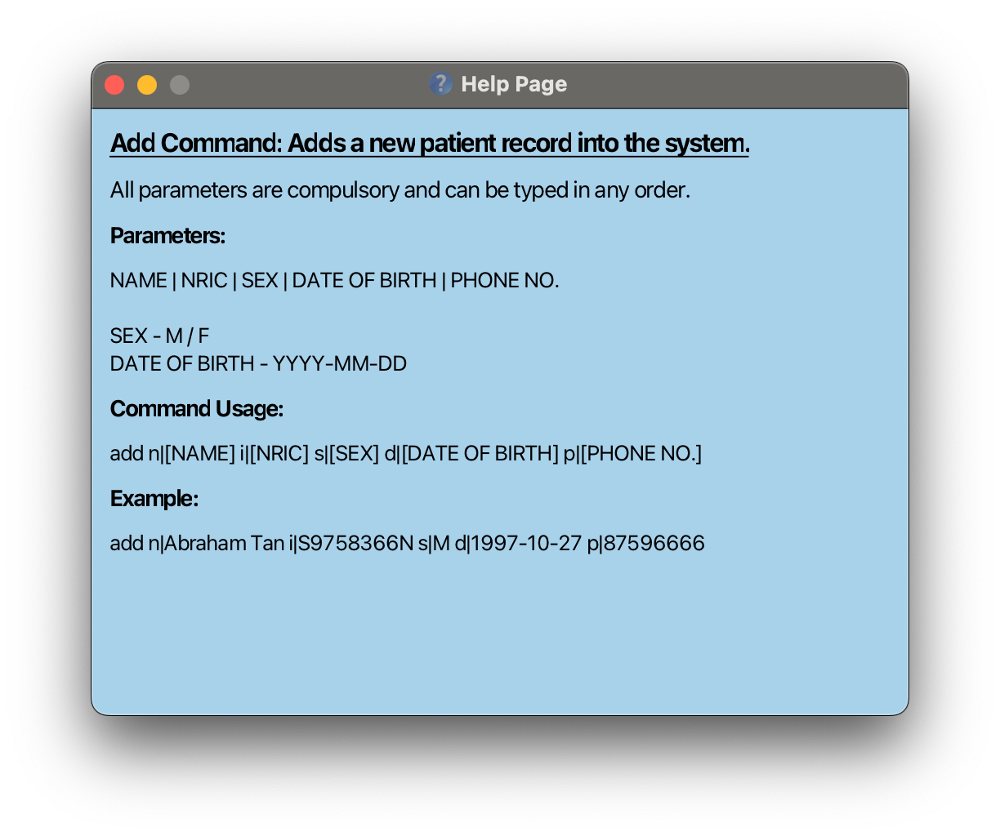
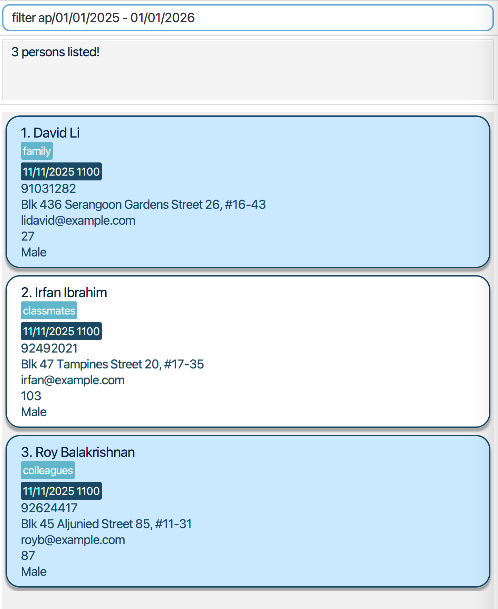

ClinicConnect is **the *ideal* patient management and appointment tracker system for health screening clinics.** With *unique* functions and layouts tailored to your workflows as health screening clinic assistants, ClinicConnect can get your patient management tasks done faster, more efficiently, and hassle-free.

---

## Table of Contents
1. [Quick Start](#quick-start)
2. [ClinicConnect Features](#clinicconnect-features)
    * [Viewing help : `help`](#viewing-help--help)
    * [Adding a patient : `add`](#adding-a-patient--add)
    * [Adding a patient with additional information : `addf`](#adding-a-patient-with-additional-information--addf)
    * [Viewing a patient's full profile : `view`](#viewing-a-patients-full-profile--view)
    * [Editing a patient : `edit`](#editing-a-patient--edit)
    * [Returning to home page : `home`](#returning-to-home-page--home)
    * [Booking an upcoming appointment : `bookappt`](#booking-an-upcoming-appointment--bookappt)
    * [Deleting an appointment : `deleteappt`](#deleting-an-appointment--deleteappt)
    * [Filtering appointments : `filter`](#filtering-appointments--filter)
    * [Deleting a patient : `delete`](#deleting-a-patient--delete)
    * [Clearing all entries : `clear`](#clearing-all-entries--clear)
    * [Exiting the program : `exit`](#exiting-the-program--exit)
    * [Saving the data](#saving-the-data)
    * [Editing the data file](#editing-the-data-file)
3. [FAQ](#faq)
4. [Known Issues](#known-issues)
5. [Command Summary](#command-summary)
6. [Command Parameters Summary](#command-parameters-summary)
7. [Appendix : Planned Enhancements](#appendix--planned-enhancements)

---

## Quick start

1. Ensure you have Java `17` or above installed in your computer.

1. Download the latest `ClinicConnect.jar` file from [here](https://github.com/AY2425S1-CS2103T-F10-2/tp/releases).

1. Copy the file to the folder you want to use as the _home folder_ for your ClinicConnectSystem.

1. Open a command terminal, `cd` into the folder you put the jar file in, and use the `java -jar ClinicConnect.jar` command to run the application. 
   A window similar to the one below should appear in a few seconds. Note how the app contains some sample data. 
   

1. Refer to the [Features](#clinicconnect-features) below for instructions on the available commands.

--------------------------------------------------------------------------------------------------------------------
## ClinicConnect Features

ClinicConnect is designed to streamline clinic processes with various functionalities to book appointments and manage patient details effectively. These features allow you to perform a range of operations, from adding new patient records, managing patient details, scheduling appointments to filtering appointments.

The following sections will delve into the individual features, providing detailed descriptions and guidance on how to utilize each feature to make the most out of the system's capabilities.

### Legend
These boxes might offer some additional information of different types:

**:information_source: Important:** 
Highlights important information that you should know.

:bulb: **Tip:** 
Provides you with tips to use our system more effectively.

:exclamation: **Caution:** 
Provides you with warnings about potential issues you might encounter.

Before we proceed with the commands, here are some important points to note on their formatting.

**:information_source: Important:** 

<ul>
<li>

Words in <code>UPPER_CASE</code> are the parameters to be supplied by the user. 
e.g. in <code>add n|NAME</code>, <code>NAME</code> is a parameter which can be used as <code>add n|John Doe</code>.
</li>
<li>

Parameters in square brackets are optional. 
  e.g. <code>n|NAME [al|ALLERGY]</code> can be used as <code>n|John Doe al|nuts</code> or as <code>n|John Doe</code>.
</li>
<li>

Parameters immediately preceding an ellipsis(...) can appear more than once, to add multiple arguments of the same type. 
  e.g. <code>al|ALLERGY...</code> can be used as <code>al|fish al|nuts</code> or <code>al|nuts</code>.
</li>
<li>

Parameters can be in any order. 
e.g. if the command specifies <code>n|NAME p|PHONE_NUMBER</code>, <code>p|PHONE_NUMBER n|NAME</code> is also acceptable.
</li>
<li>

Extraneous parameters for commands that do not take in parameters (such as <code>home</code>, <code>exit</code> and <code>clear</code>) will be ignored. 
e.g. if the command specifies <code>home 123</code>, it will be interpreted as <code>home</code>.
</li>
<li>

For these commands requiring NRIC to specify the patient (<code>bookappt</code>, <code>deleteappt</code>, <code>delete</code>, <code>edit</code> and <code>view</code>), NRIC should:
<ul>
<li>
Be a 9 character uppercase sequence with an alphabet at the start and at the end
</li>
<li>

Start with an uppercase <code>S</code>, <code>T</code>, <code>F</code>, <code>G</code>, <code>M</code> followed by 7 numbers and ending with an uppercase alphabet
</li>
<li>
Be registered in the system
</li></ul>
</li>
<li>
If you are using a PDF version of this document, be careful when copying and pasting commands that span multiple lines as space characters surrounding line-breaks may be omitted when copied over to the application.
</li>
</ul>

:bulb: **Tip:** 
You can search for relevant info in the user guide by typing <code>Ctrl + F</code> for Windows and Linux computers and <code>⌘ + F</code> for Mac.

### Viewing help : `help`

`help` opens a separate help window detailing a summary of the commands available and their functions.

`help [COMMAND_KEYWORD]` opens a separate help window showing more information about a specific command.

Format: `help [COMMAND_KEYWORD]`  

**:information_source: Important:** 
This command only takes in one command keyword.

:bulb: **Tip:** 
Multiple help windows can be open at any point in time, but only one help window per command keyword can be open.

:bulb: **Tip:** 
Press `esc` to close the help window.

:bulb: **Tip:** 
You can keep the help windows open and refer to it while using our application.

Examples:
* `help`
* `help add`
* `help edit`

To check out the list of all commands in ClinicConnect, click [here](#command-summary).

### Adding a patient : `add`

Adds a new patient record into the system.

Format: `add n|NAME i|NRIC s|SEX d|DATE_OF_BIRTH p|PHONE_NUMBER`

**:information_source: Important:** 
Each person should have a unique NRIC.
ClinicConnect does not allow two patients with the same NRIC to exist in the system.

:bulb: **Tip:** 
Use this command to quickly add a patient with only the required information.

Example:
* Adds a patient named Abraham Tan with his NRIC, Sex, Date-of-Birth and Phone Number.
  * `add n|Abraham Tan i|S9758366N s|M d|1997-10-27 p|87596666`

For more information on each individual parameter, click [here](#command-parameters-summary).

### Adding a patient with additional information : `addf`

Adds a new patient record into the system with additional information.

Format: `addf n|NAME i|NRIC s|SEX d|DATE_OF_BIRTH p|PHONE_NUMBER [e|EMAIL] [a|ADDRESS] [b|BLOOD_TYPE]
[nokn|NEXT_OF_KIN_NAME] [nokp|NEXT_OF_KIN_PHONE_NUMBER] [al|ALLERGY]…​ [rl|RISK_LEVEL] [ec|EXISTING_CONDITIONS] [no|NOTES]`

**:information_source: Important:** 
Each person should have a unique NRIC.
ClinicConnect does not allow two patients with the same NRIC to exist in the system.

:bulb: **Tip:** 
Use this command if you want to add a patient with additional information in addition to the required fields
(NAME, NRIC, SEX, DATE_OF_BIRTH, PHONE_NUMBER).

:bulb: **Tip:** 

Multiple allergies can be added using multiple `al` prefixes.

Examples:
* Adds a patient named Abraham Tan with all fields and two allergies.
  * `addf n|Abraham Tan i|S9758366N s|M d|1997-10-27 p|87596666
     e|abramhamtan@gmail.com a|Blk 123, NUS Road, S123123 b|A+ nokn|Licoln Tan nokp|91234567
     al|nuts al|shellfish rl|HIGH ec|Diabetes no|Patient needs extra care`
* Adds a patient named Lincoln Park with compulsory fields and some optional fields.
  * `addf n|Lincoln Park i|S9751269M s|M d|1980-04-01 p|87296619
     e|linkinpark@gmail.com a|Blk 516, Clementi Road, S661836 b|AB- al|wheat`

For more information on each individual parameter, click [here](#command-parameters-summary).

### Viewing a patient's full profile : `view`

Displays all information of an existing patient in the system with the corresponding NRIC.

Format: `view NRIC`

Example:
* View all information of the patient with NRIC T0123456A.
  * `view T0123456A`

### Editing a patient : `edit`

Edits the information of an existing patient in the system with the corresponding NRIC.

Format: `edit NRIC [n|NAME] [i|NRIC] [s|SEX] [d|DATE_OF_BIRTH] [p|PHONE_NUMBER] [e|EMAIL] [a|ADDRESS] [b|BLOOD_TYPE]
[nokn|NEXT_OF_KIN_NAME] [nokp|NEXT_OF_KIN_PHONE_NUMBER] [al|ALLERGY]…​ [rmal|ALLERGY_TO_BE_REMOVED]…​ [rl|RISK_LEVEL]
[ec|EXISTING_CONDITIONS] [no|NOTES]`

**:information_source: Important:** 
<ul>
<li>
Except for allergies, input values will replace existing values.
</li>
<li>
Editing EXISTING_CONDITIONS and NOTES is not cumulative (i.e. the existing conditions and notes of the patient will be removed).
</li>
<li>
Input must contain at least one parameter for patient to be edited.
</li>
</ul>

:bulb: **Tip:** 
Multiple allergies can be added using multiple `al` prefixes. Ensure allergies to be added are not current allergies of the patient.

:bulb: **Tip:** 
Multiple allergies can be removed using multiple `rmal` prefixes. Ensure allergies to be removed are current allergies of the patient.

Examples:
* Edits the name and date-of-birth of the patient with NRIC S9758366N.
  * `edit S9758366N n|Abraham Lee d|1997-10-28`
* Edits the allergies of the patient with NRIC S9758366N where wheat and egg allergies are added and fish allergy is removed.
  * `edit S9758366N al|wheat al|eggs rmal|fish`

For more information on each individual parameter, click [here](#command-parameters-summary).

### Returning to home page : `home`

Returns to home page which displays a list of all patients in the ClinicConnect System.

Format: `home`

:bulb: **Tip:** 
Home Command also informs you on the number of patients currently registered in the system.

### Booking an upcoming appointment : `bookappt`

Books an upcoming appointment for an existing patient in the system with the corresponding NRIC.

Format: `bookappt NRIC dt|APPOINTMENT_DATE_TIME h|HEALTH_SERVICE`

**:information_source: Important:** 
Appointments can only be booked for future dates and times.

Example:
* Books a vaccination appointment for the patient with NRIC T0123456A on 29 Dec 2024 at 1:00pm.
  * `bookappt T0123456A dt|2024-12-29 13:00 h|Vaccination`

For more information on each individual parameter, click [here](#command-parameters-summary).

### Deleting an appointment : `deleteappt`

Deletes the specified appointment of an existing patient in the system with the corresponding NRIC.

Format: `deleteappt NRIC dt|APPOINTMENT_DATE_TIME`

Example:
* Deletes the appointment for the patient with NRIC T0123456A on 29 Dec 2024 at 1:00pm.
  * `deleteappt T0123456A dt|2024-12-29 13:00`

For more information on each individual parameter, click [here](#command-parameters-summary).

### Filtering appointments : `filter`

Filters existing patient records based on the specified parameters.

Format: `filter [sd|START DATE] ed|END DATE [h|HEALTH SERVICE]`

**:information_source: Important:** 

* Specify the start and end date to display appointments from the start to the end date.
* Specify the end date to display appointments from today's date to end date.
* Specify the health service to display appointments that matches the health service.

:bulb: **Tip:** 
To retrieve appointments on a single date e.g. 2024/10/20, you can input the same start and end date.

`filter sd|2024-10-20 ed|2024-10-20`

Examples:
* Filters the blood test appointments of patients from Oct 01 2012 to Nov 01 2012.
  * `filter sd|2012-10-01 ed|2012-11-01 h|blood test`
* Filters the vaccination appointments from today's date to Dec 12 2024.
  *  `filter ed|2024-12-12 h|vaccination`
* Filters all appointments from Oct 01 2012 to Nov 01 2012.
  * `filter sd|2012-10-01 ed|2012-11-01`
* Filters all appointments from today's date to Oct 01 2028.
  *  `filter ed|2028-10-01`

For more information on each individual parameter, click [here](#command-parameters-summary).

### Deleting a patient : `delete`

Deletes the patient with the corresponding NRIC.

Format: `delete NRIC`

Example:
* Deletes the patient with NRIC T0123456A.
  * `delete T0123456A`

### Clearing all entries : `clear`

Clears ***ALL*** patient entries and data in the system.

Format: `clear`

:exclamation: **Caution:** 
Using clear will delete all data in the system. Please use it carefully.

### Exiting the program : `exit`

Exits the system and closes all windows of ClinicConnect.

Format: `exit`

:bulb: **Tip:** 
Using exit command will also close any help windows that are currently open.

### Saving the data

ClinicConnectSystem data are saved in the hard disk automatically after any command that changes the data. There is no need to save manually.

### Editing the data file

ClinicConnectSystem data are saved automatically as a JSON file `[JAR file location]/data/clinicconnectsystem.json`. Advanced users are welcome to update data directly by editing that data file.

:exclamation: **Caution:** 
If your changes to the data file makes its format invalid, ClinicConnectSystem will discard all data and start with an empty data file at the next run. Hence, it is recommended to save a backup of the file before editing it. 
Furthermore, certain edits can cause the ClinicConnectSystem to behave in unexpected ways (e.g., if a value entered is outside of the acceptable range). Therefore, edit the data file only if you are confident that you can update it correctly.

--------------------------------------------------------------------------------------------------------------------
## FAQ

**Q**: How do I transfer my data to another computer? 
**A**: Install the app in the other computer and overwrite the empty data file it creates with the file that contains the data of your previous ClinicConnectSystem home folder.

**Q**: How do I remove a patient's `EXISTING_CONDITIONS` and `NOTES` from the patient's record?  
**A**: Use the `edit` command to edit the respective fields to NIL e.g.`edit T0123456A ec|NIL no|NIL`.

--------------------------------------------------------------------------------------------------------------------
## Known Issues

1. **When using multiple screens**, if you move the application to a secondary screen, and later switch to using only the primary screen, the window will open off-screen. The remedy is to delete the `preferences.json` file created by the application before running the application again.
2. **If you minimize the Help Window** and then run the `help` command (or use the `Help` menu, or the keyboard shortcut `F1`) again, the original Help Window will remain minimized, and no new Help Window will appear. The remedy is to manually restore the minimized Help Window.
3. **When adding or editing patient entries**, the combination of an NRIC starting with the character "S" and a birthdate after 1 January 2000 will be accepted by the
system, despite this being an impossible combination of NRIC and birthdate for a patient.
4. **When adding allergies**, it is case-sensitive and allows for both plural and singular variations.
5. **For `no` and `ec` parameters**, the parameter summary has stated that it has to be non-empty. However,
   * for `addf` command, the parameters can be left empty and the patient will still be added.
   * for `edit` command, if either of the two parameters are used with other parameters, the edit command will delete the existing notes and existing conditions of the patient if left empty.

--------------------------------------------------------------------------------------------------------------------
## Command summary
<table>
  <thead>
    <tr>
      <th style="text-align:center;">Command</th>
      <th style="text-align:center;">Format, Example</th>
    </tr>
  </thead>
  <tbody>
    <tr>
      <td style="text-align:center;"><b>Add</b></td>
      <td><code>add n|NAME i|NRIC s|SEX d|DATE_OF_BIRTH p|PHONE_NUMBER</code>    e.g. <code>add n|Abraham Tan i|S9758366N s|M d|1997-10-27 p|87596666</code></td>
    </tr>
    <tr>
      <td style="text-align:center;"><b>Add Full</b></td>
      <td><code>addf n|NAME i|NRIC s|SEX d|DATE OF BIRTH p|PHONE NUMBER [e|EMAIL] [a|ADDRESS] [b|BLOOD TYPE] [nokn|NEXT-OF-KIN NAME] [nokp|NEXT-OF-KIN PHONE NUMBER] [al|ALLERGIES]…​ [rl|HEALTH RISK LEVEL] [ec|EXISTING CONDITIONS] [no|ADDITIONAL NOTES]</code>    e.g. <code>addf n|Abraham Tan i|S9758366N s|M d|1997-10-27 p|87596666 e|abrahamtan@gmail.com a|Blk 123, NUS Road, S123123 b|A+ nokn|Lincoln Tan nokp|91234567 al|nuts al|shellfish rl|HIGH ec|Diabetes no|Patient needs extra care</code></td>
    </tr>
    <tr>
      <td style="text-align:center;"><b>Book Appointment</b></td>
      <td><code>bookappt NRIC dt|APPOINTMENT_DATE_TIME h|HEALTH_SERVICE</code>    e.g. <code>bookappt S9758366N dt|2024-12-29 13:30 h|Vaccination</code></td>
    </tr>
    <tr>
      <td style="text-align:center;"><b>Clear</b></td>
      <td>   <code>clear</code>    </td>
    </tr>
    <tr>
      <td style="text-align:center;"><b>Delete Appointment</b></td>
      <td><code>deleteappt NRIC dt|APPOINTMENT_DATE_TIME</code>    e.g. <code>deleteappt S9758366N dt|2024-12-29 13:30</code></td>
    </tr>
    <tr>
      <td style="text-align:center;"><b>Delete</b></td>
      <td><code>delete NRIC</code>    e.g. <code>delete S0123456Z</code></td>
    </tr>
    <tr>
      <td style="text-align:center;"><b>Edit</b></td>
      <td><code>edit NRIC [n|NAME] [i|NRIC] [s|SEX] [d|DATE_OF_BIRTH] [p|PHONE_NUMBER] [e|EMAIL] [a|ADDRESS] [b|BLOOD_TYPE] [nokn|NEXT_OF_KIN_NAME] [nokp|NEXT_OF_KIN_PHONE] [al|ALLERGY]…​ [rmal|ALLERGY_TO_BE_REMOVED]…​ [rl|RISK_LEVEL] [ec|EXISTING_CONDITIONS] [no|NOTES]</code>    e.g. <code>edit S9758366N n|Keanu Reeves i|S9975483H s|M s|1997-11-30 p|86526969 e|keanureeves@gmail.com a|Blk 512 Ang Mo Kio Ave 2 b|O+ nokn|Mila Kunis nokp|84126990 al|nuts al|shellfish rmal|cake rmal|wheat rl|LOW ec|diabetes no|Patient is a fall risk</code></td>
    </tr>
    <tr>
      <td style="text-align:center;"><b>Exit</b></td>
      <td>   <code>exit</code>    </td>
    </tr>
    <tr>
      <td style="text-align:center;"><b>Filter</b></td>
      <td><code>filter [sd|START DATE] ed|END DATE [h|HEALTH SERVICE]</code>    e.g. <code>filter sd|2024-12-29 ed|2024-12-30 h|Blood Test</code></td>
    </tr>
    <tr>
      <td style="text-align:center;"><b>Home</b></td>
      <td>   <code>home</code>    </td>
    </tr>
    <tr>
      <td style="text-align:center;"><b>View</b></td>
      <td><code>view NRIC</code>    e.g. <code>view S9758366N</code></td>
    </tr>
    <tr>
      <td style="text-align:center;"><b>Help</b></td>
      <td><code>help [COMMAND_KEYWORD]</code>    e.g. <code>help add</code></td>
    </tr>
  </tbody>
</table>

--------------------------------------------------------------------------------------------------------------------
## Command Parameters Summary

Some commands include parameters which are identified by prefixes. Here is a table showing the prefixes and what each entails:

**:information_source: Important:** 
All Prefixes/Parameters should:
<li>
Not be blank.
</li>
<li>
Not start with a whitespace.
</li>
<li>
Follow the specifications given below.
</li>

<table>
  <thead>
    <tr>
      <th style="text-align:center;">No.</th>
      <th style="text-align:center;">Parameter</th>
      <th style="text-align:center;">Prefix Format</th>
      <th style="text-align:center;">Specifications</th>
    </tr>
  </thead>
  <tbody>
    <tr>
      <td style="text-align:center;">1</td>
      <td style="text-align:center;">Address</td>
      <td style="text-align:center;">a|</td>
      <td>Takes all values.</td>
    </tr>
    <tr>
      <td style="text-align:center;">2</td>
      <td style="text-align:center;">Allergy</td>
      <td style="text-align:center;">al|</td>
      <td>Takes all values.</td>
    </tr>
    <tr>
      <td style="text-align:center;">4</td>
      <td style="text-align:center;">Birthdate</td>
      <td style="text-align:center;">d|</td>
      <td>Should be a valid calendar date and follow the format YYYY-MM-DD. Should not be after today's date.</td>
    </tr>
    <tr>
      <td style="text-align:center;">5</td>
      <td style="text-align:center;">Blood Type</td>
      <td style="text-align:center;">b|</td>
      <td>Should be either A/B/AB/O followed by the Rhesus factor (+/-).</td>
    </tr>
    <tr>
      <td style="text-align:center;">6</td>
      <td style="text-align:center;">Date and Time</td>
      <td style="text-align:center;">dt|</td>
      <td>Should be a valid calendar date followed by a valid time in the format YYYY-MM-DD HH:MM separated by a single whitespace. </td>
    </tr>
    <tr>
      <td style="text-align:center;">7</td>
      <td style="text-align:center;">Email</td>
      <td style="text-align:center;">e|</td>
      <td>Should be of the format local-part@domain. The <code>local-part</code> section should only contain alphanumeric characters and the special characters i.e. <code>+_.-</code>. The <code>local-part</code> section may not start or end with special characters. The <code>domain</code> section must:
        <ul>
          <li>start with a domain name (<em>gmail</em>.com) at least 1 character long.</li>
          <li>end with a domain label (.<em>com</em>) at least 2 characters long.</li>
          <li>have each domain label start and end with alphanumeric characters.</li>
          <li>have each domain label consist only of alphanumeric characters, which can be separated by hyphens.</li>
        </ul>
      </td>
    </tr>
    <tr>
      <td style="text-align:center;">8</td>
      <td style="text-align:center;">Existing Condition</td>
      <td style="text-align:center;">ec|</td>
      <td>Takes all values.</td>
    </tr>
    <tr>
      <td style="text-align:center;">9</td>
      <td style="text-align:center;">Health Risk</td>
      <td style="text-align:center;">rl|</td>
      <td>Should be either <code>HIGH</code>, <code>MEDIUM</code> or <code>LOW</code>. Case-insensitive.</td>
    </tr>
    <tr>
      <td style="text-align:center;">10</td>
      <td style="text-align:center;">Health Service</td>
      <td style="text-align:center;">h|</td>
      <td>Should be either <code>BLOOD TEST</code>, <code>CANCER SCREENING</code>, <code>VACCINATION</code>, or <code>CONSULT</code>.</td>
    </tr>
    <tr>
      <td style="text-align:center;">11</td>
      <td style="text-align:center;">Name</td>
      <td style="text-align:center;">n|</td>
      <td>Should only contain alphanumeric values (A-Z, 0-9) and spaces.</td>
    </tr>
    <tr>
      <td style="text-align:center;">12</td>
      <td style="text-align:center;">Note</td>
      <td style="text-align:center;">no|</td>
      <td>Takes all values.</td>
    </tr>
    <tr>
      <td style="text-align:center;">13</td>
      <td style="text-align:center;">NRIC</td>
      <td style="text-align:center;">i|</td>
      <td>Should be 9 character uppercase sequence with an alphabet at the start and at the end. Starting character should either be an uppercase "S", "T", "F", "G" or "M", followed by 7 numbers and ending with an uppercase alphabet.</td>
    </tr>
    <tr>
      <td style="text-align:center;">14</td>
      <td style="text-align:center;">Next-of-Kin Name</td>
      <td style="text-align:center;">nokn|</td>
      <td>Should only contain alphanumeric values (A-Z, 0-9) and spaces.</td>
    </tr>
    <tr>
      <td style="text-align:center;">15</td>
      <td style="text-align:center;">Next-of-Kin Phone Number</td>
      <td style="text-align:center;">nokp|</td>
      <td>Should only contain numbers. Should be at least 3 digits long.</td>
    </tr>
    <tr>
      <td style="text-align:center;">16</td>
      <td style="text-align:center;">Phone Number</td>
      <td style="text-align:center;">p|</td>
      <td>Should only contain numbers. Should be at least 3 digits long.</td>
    </tr>
    <tr>
      <td style="text-align:center;">17</td>
      <td style="text-align:center;">Remove Allergy</td>
      <td style="text-align:center;">rmal|</td>
      <td>Takes all values. Can be multiple values.</td>
    </tr>
    <tr>
      <td style="text-align:center;">18</td>
      <td style="text-align:center;">Sex</td>
      <td style="text-align:center;">s|</td>
      <td>Should either be uppercase characters M or F.</td>
    </tr>
    <tr>
      <td style="text-align:center;">19</td>
      <td style="text-align:center;">Start Date</td>
      <td style="text-align:center;">sd|</td>
      <td>Should be a valid calendar date and follow the format YYYY-MM-DD.</td>
    </tr>
    <tr>
      <td style="text-align:center;">20</td>
      <td style="text-align:center;">End Date</td>
      <td style="text-align:center;">ed|</td>
      <td>Should be a valid calendar date and follow the format YYYY-MM-DD.</td>
    </tr>
  </tbody>
</table>

--------------------------------------------------------------------------------------------------------------------
## Appendix : Planned Enhancements

Team size: 5

1. Special characters in names should be accepted e.g. Yugan S/O Murali.
2. A more comprehensive NRIC validity check could be performed to ensure proper correspondence between birthdate and NRIC.
3. Allowing NRIC to be parsed case-insensitively for all commands.
4. More specific error messages based on users' input.
5. For `edit`, `ec` and `no` prefixes can allow empty existing conditions and notes respectively to delete those fields.
6. For `add`, names should have a character limit.
7. For `al` and `rmal` prefixes, case-insensitive and singular and plural forms of the allergy are considered the same.
