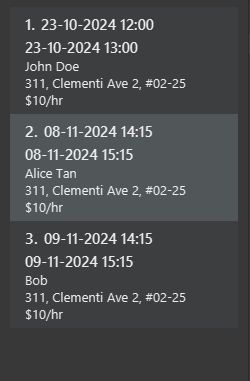
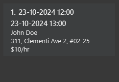

# TutorEase User Guide

TutorEase is a **desktop app for managing contacts, optimized for use via a Line Interface** (CLI) while
still having the benefits of a Graphical User Interface (GUI). If you can type fast, AB3 can get your contact management
tasks done faster than traditional GUI apps.

<!-- * Table of Contents -->
<page-nav-print />

--------------------------------------------------------------------------------------------------------------------

## Quick start

1. Ensure you have Java `17` or above installed in your Computer.

1. Download the latest `.jar` file from [here](https://github.com/AY2425S1-CS2103-F11-2/tp/releases).

1. Copy the file to the folder you want to use as the _home folder_ for TutorEase.

1. Open a command terminal, `cd` into the folder you put the jar file in, and use the `java -jar tutorease.jar`
   command to run the application. 
   A GUI similar to the below should appear in a few seconds. Note how the app contains some sample data. 
   

1. Type the command in the command box and press Enter to execute it. e.g. typing **`help`** and pressing Enter will
   open the help window. 
   Some example commands you can try:

    * `contact list` : Lists all contacts.

    * `contact add /n John Doe /p 98765432 /e johnd@example.com /a John street, block 123, #01-01 /r Student /tfriends`:
      Adds a contact named `John Doe` to the Address Book.

    * `contact delete 3` : Deletes the 3rd contact shown in the current list.

    * `clear` : Deletes all contacts.

    * `exit` : Exits the app.

1. Refer to the [Features](#features) below for details of each command.

--------------------------------------------------------------------------------------------------------------------

## Features

<box type="info" seamless>

**Notes about the command format:** 

* Words in `UPPER_CASE` are the parameters to be supplied by the user. 
  e.g. in `contact add /nNAME`, `NAME` is a parameter which can be used as `contact add /nJohn Doe`.

* Items in square brackets are optional. 
  e.g `/nNAME [/tTAG]` can be used as `/nJohn Doe /tfriend` or as `/nJohn Doe`.

* Items with `…`​ after them can be used multiple times including zero times. 
  e.g. `[/tTAG]…​` can be used as ` ` (i.e. 0 times), `/tfriend`, `/tfriend /tfamily` etc.

* Parameters can be in any order. 
  e.g. if the command specifies `/nNAME /pPHONE_NUMBER`, `/pPHONE_NUMBER /nNAME` is also acceptable.

* Extraneous parameters for commands that do not take in parameters (such as `help`, `list`, `exit` and `clear`) will be
  ignored. 
  e.g. if the command specifies `help 123`, it will be interpreted as `help`.

* If you are using a PDF version of this document, be careful when copying and pasting commands that span multiple lines
  as space characters surrounding line-breaks may be omitted when copied over to the application.
  </box>

### Viewing help : `help`

Shows a message explaning how to access the help page.

Format: `help`

### Adding a person: `contact add`

Adds a person to Address Book.

Format: `contact add /nNAME /pPHONE_NUMBER /eEMAIL /aADDRESS /rROLE [/tTAG]…​`

<box type="tip" seamless>

**Tip 1:** A person can have any number of tags (including 0)

**Tip 2:** Role can only be Student or Guardian
</box>

Examples:

* `contact add /nJohn Doe /p98765432 /ejohnd@example.com /aJohn street, block 123, #01-01 /rStudent`
* `contact add /nBetsy Crowe /tfriend /ebetsycrowe@example.com /rGuardian /aNewgate Prison /p1234567 /tcriminal`

### Adding a lesson : `lesson add`

Adds a lesson tied to a student with start and end date time.

Format: `lesson add sid/STUDENTID f/PRICEPERHOUR d/STARTDATETIME h/DURATION`

* Add a lesson with the student at specified `STUDENTID`.
* The student ID refers to the index number shown in the displayed person list.
* The lesson starts at the specified `STARTDATETIME` in the format `dd-MM-yyyy HH:mm`.
* The lesson is held at the address of the student.
* The price per hour refers to the price of the lesson per hour.
* The price per hour **must be a non-negative integer**.
* The duration **must be a decimal number or an integer** between 0 and 24 inclusive.
* The duration of the lesson is specified by the `DURATION` in hours.
* The student ID **must be a positive integer** 1, 2, 3, …​

### Listing all persons : `contact list`

Shows a list of all persons in the address book.

Format: `contact list`

### Listing all lessons : `lesson list`

Shows a list of all lessons in the schedule.

Format: `lesson list`

### Editing a person : `contact edit`

Edits an existing person in the address book.

Format: `contact edit INDEX [/nNAME] [/pPHONE] [/eEMAIL] [/aADDRESS] [/tTAG]…​`

* Edits the person at the specified `INDEX`. The index refers to the index number shown in the displayed person list.
  The index **must be a positive integer** 1, 2, 3, …​
* At least one of the optional fields must be provided.
* Existing values will be updated to the input values.
* When editing tags, the existing tags of the person will be removed i.e adding of tags is not cumulative.
* You can remove all the person’s tags by typing `/t` without
  specifying any tags after it.
* Role is not editable!

Examples:

* `contact edit 1 /p91234567 /ejohndoe@example.com` Edits the phone number and email address of the 1st person to 
  be `91234567` and `johndoe@example.com` respectively.
* `contact edit 2 /nBetsy Crower /t` Edits the name of the 2nd person to be `Betsy Crower` and clears all existing tags.

### Locating persons by name: `contact find`

Finds persons whose names contain any of the given keywords.

Format: `contact find KEYWORD [MORE_KEYWORDS]`

* The search is case-insensitive. e.g `hans` will match `Hans`.
* The order of the keywords does not matter. e.g. `Hans Bo` will match `Bo Hans`.
* Only the name is searched.
* Only full words will be matched e.g. `Han` will not match `Hans`.
* Persons matching at least one keyword will be returned (i.e. `OR` search).
  e.g. `Hans Bo` will return `Hans Gruber`, `Bo Yang`.

Examples:

* `contact find John` returns `john` and `John Doe`.
* `contact find alex david` returns `Alex Yeoh`, `David Li.` 
  

### Deleting a person : `contact delete`

Deletes the specified person from the address book.

Format: `contact delete INDEX`

* Deletes the person at the specified `INDEX`.
* The index refers to the index number shown in the displayed person list.
* The index **must be a positive integer** 1, 2, 3, …​

Examples:

* `contact list` followed by `contact delete 2` deletes the 2nd person in the address book.
* `contact find Betsy` followed by `contact delete 1` deletes the 1st person in the results of the `find` command.

### Deleting a lesson : `lesson delete`

Deletes the lesson at the specified index from the lesson schedule.

Format: `lesson delete INDEX`

* Deletes the lesson at the specified `INDEX`.
* The index refers to the index number shown in the displayed lesson schedule.
* The index **must be a positive integer** 1, 2, 3, …​

Examples:

* `lesson delete 2` deletes the 2nd lesson in the lessons schedule.

### Finding lessons : `lesson find`

Find lessons with students whose names contain any of the specified keywords.

Format: `lesson find KEYWORD [MORE_KEYWORDS]`

* The search is case-insensitive. e.g `hans` will match `Hans`.
* The order of the keywords does not matter. e.g. `Hans Bo` will match `Bo Hans`.
* Only the name is searched.
* Only full words will be matched e.g. `Han` will not match `Hans`.
* Lessons with students whose names match at least one of the specified keywords will be returned (i.e., 
  an OR search).
  e.g. `Hans Bo` will return lessons with `Hans Gruber` if any and `Bo Yang` if any. 

Examples:

* View all lessons using `lesson list` command. 
  
* `lesson find John` returns `John Doe`'s lessons. 
  
* `lesson find John Alice` returns lessons with `John Doe` if any and `Alice Tan` if any. 
  

### Clearing all entries : `clear`

Clears all entries from the address book.

Format: `clear`

### Exiting the program : `exit`

Exits the program.

Format: `exit`

### Saving the data

AddressBook data are saved in the hard disk automatically after any command that changes the data. There is no need to
save manually.

### Editing the data file

AddressBook data are saved automatically as a JSON file `[JAR file location]/data/addressbook.json`. Advanced users are
welcome to update data directly by editing that data file.

<box type="warning" seamless>

**Caution:**
If your changes to the data file makes its format invalid, AddressBook will discard all data and start with an empty
data file at the next run. Hence, it is recommended to take a backup of the file before editing it. 
Furthermore, certain edits can cause the AddressBook to behave in unexpected ways (e.g., if a value entered is outside
the acceptable range). Therefore, edit the data file only if you are confident that you can update it correctly.
</box>

### Archiving data files `[coming in v2.0]`

_Details coming soon ..._

--------------------------------------------------------------------------------------------------------------------

## FAQ

**Q**: How do I transfer my data to another Computer? 
**A**: Install the app in the other computer and overwrite the empty data file it creates with the file that contains
the data of your previous AddressBook home folder.

--------------------------------------------------------------------------------------------------------------------

## Known issues

1. **When using multiple screens**, if you move the application to a secondary screen, and later switch to using only
   the primary screen, the GUI will open off-screen. The remedy is to delete the `preferences.json` file created by the
   application before running the application again.
2. **If you minimize the Help Window** and then run the `help` command (or use the `Help` menu, or the keyboard
   shortcut `F1`) again, the original Help Window will remain minimized, and no new Help Window will appear. The remedy
   is to manually restore the minimized Help Window.

--------------------------------------------------------------------------------------------------------------------

## Command summary

 Action             | Format, Examples                                                                                                                                                      
--------------------|-----------------------------------------------------------------------------------------------------------------------------------------------------------------------
 **Add Contact**    | `contact add /nNAME /pPHONE_NUMBER /eEMAIL /aADDRESS [/tTAG]…​`   e.g., `contact add /nJames Ho /p22224444 /ejamesho@example.com /rStudent /a123, Clementi Rd, 1234665 /tfriend /tcolleague` 
 **Clear**          | `clear`                                                                                                                                                               
 **Delete Contact** | `contact delete INDEX`  e.g., `contact delete 3`                                                                                                                                   
 **Edit Contact**   | `contact edit INDEX [/nNAME] [/pPHONE_NUMBER] [/eEMAIL] [/aADDRESS] [/tTAG]…​`  e.g.,`contact edit 2 /nJames Lee /ejameslee@example.com`                                           
 **Find Contact**   | `contact find KEYWORD [MORE_KEYWORDS]`  e.g., `contact find James Jake`                                                                                                            
 **List Contacts**  | `contact list`                                                                                                                                                                
 **Add Lesson**     | `lesson add sid/STUDENTID f/PRICEPERHOUR d/STARTDATETIME h/DURATION`   e.g., `lesson add sid/1 f/10 d/23-10-2024 12:00 h/1`                                         
 **List Lessons**   | `lesson list`                                                                                                                                                         
 **Delete Lessons** | `lesson delete INDEX`   e.g., `lesson delete 1`
 **Find Lessons**   | `lesson find KEYWORD [MORE_KEYWORDS]`   e.g., `lesson find John Alice`
 **Help**           | `help`                                                                                                                                                                
