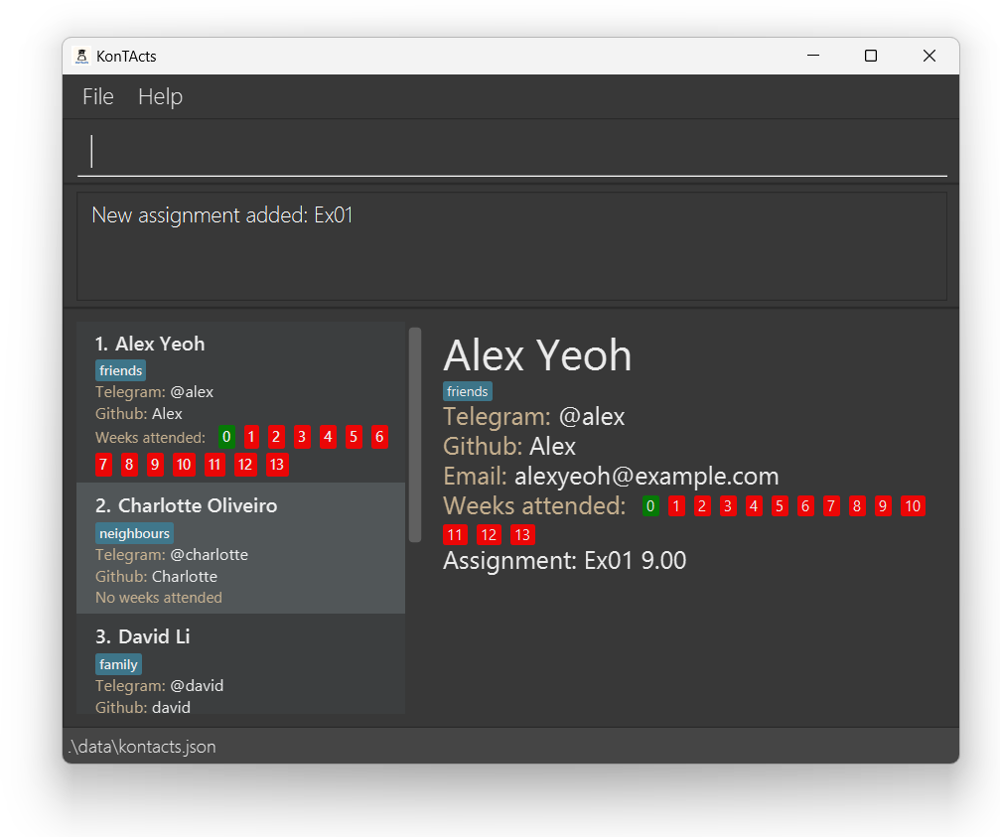
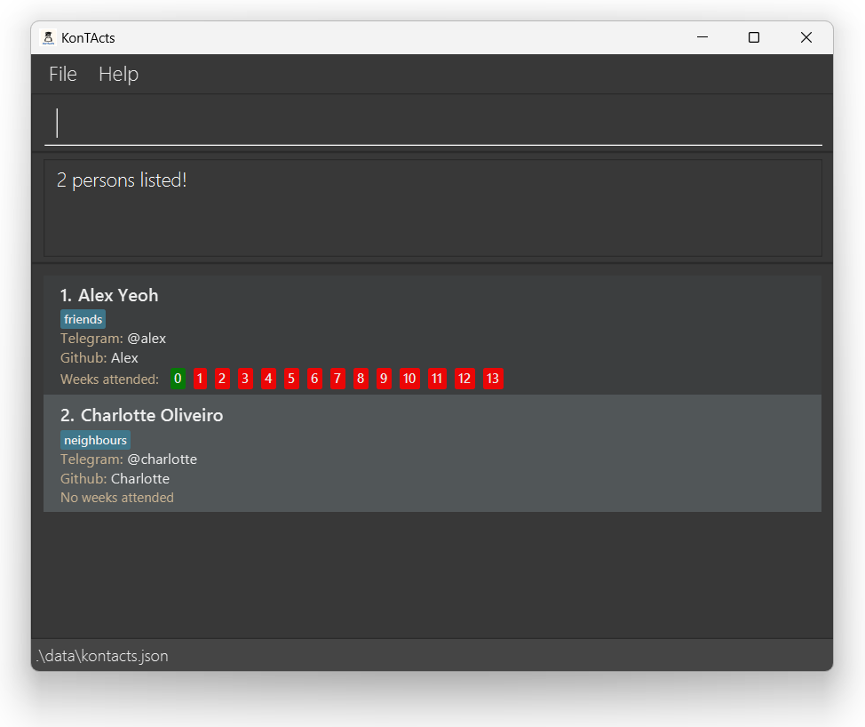
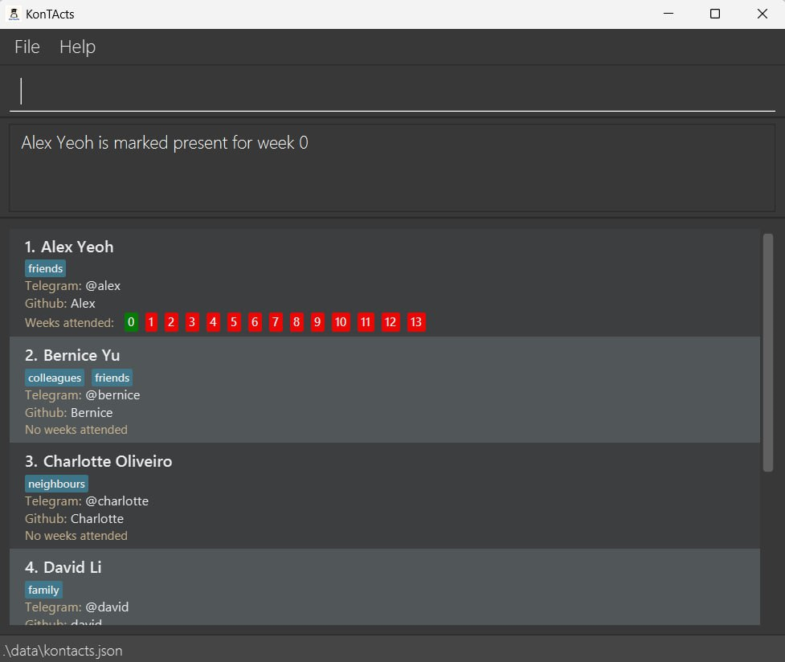
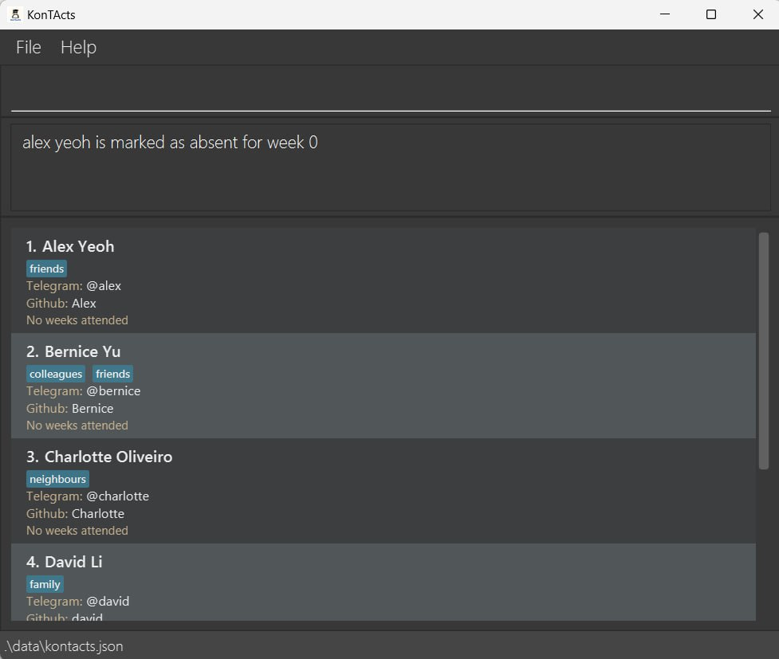
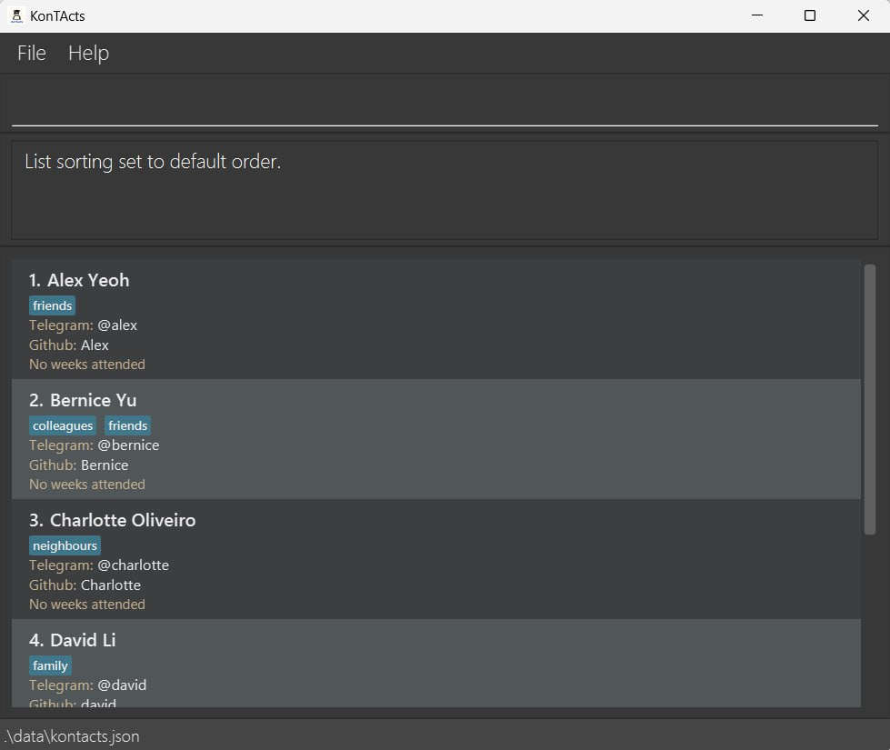

<center>
<pic src="images/kontactsLogo.png" width="300" alt="Logo" lazy>


# **KonTActs User Guide**
</pic>
</center>

KonTActs is a **desktop app for managing your contacts, optimized for use via a Command Line Interface** (CLI) while still having the benefits of a Graphical User Interface (GUI). 

KonTActs streamlines contact management, helping you keep track of students, professors, and fellow TAs more effectively than traditional GUI apps.


{{ newPageBetween }}

<!-- * Table of Contents -->
<page-nav-print />

{{ newPage }}

--------------------------------------------------------------------------------------------------------------------

## Quick start

To get started,

1. Ensure you have Java `17` or above installed in your Computer. Refer [here](https://nus-cs2103-ay2425s1.github.io/website/admin/programmingLanguages.html) for the specific version.

2. Download the latest `.jar` file from [here](https://github.com/AY2425S1-CS2103T-T11-2/tp/releases).

3. Copy the file to the folder you want to use as the _home folder_ for KonTActs.

4. Open a command terminal, `cd` into _home folder_ you put the jar file in, and enter `java -jar KonTActs.jar` to run the application and type `view name/Alex Yeoh`.<br>
   A interface similar to the one below should appear in a few seconds. Note how the app contains some sample data.<br>
   
   {{ newPage }}
--------------------------------------------------------------------------------------------------------------------

5. Type the command in the command box and press Enter to execute it. e.g. typing **`help`** and pressing Enter will open the help window.<br>
   Some example commands you can try:

    * `list` : Lists all contacts.

    * `mark name/Alex Yeoh week/0` : Marks `Alex Yeoh` attendance in KonTActs.

    * `delete name/Bernice Yu` : Deletes `Bernice Yu` from KonTActs.

    * `addGrade name/Alex Yeoh assignment/Ex01 score/9` : Assigns and adds `Ex01` with a score of 9 to `Alex Yeoh`.

   * The GUI should now look something like this.<br>
   

   * `clear` : Deletes all contacts.

6. Refer to the [Features](#features) below for details of each command.
   <br><br>

{{ newPage }}

--------------------------------------------------------------------------------------------------------------------

## Summary of commands

| Action                                                          | Format, Examples                                                                                                                                                                            |
|-----------------------------------------------------------------|---------------------------------------------------------------------------------------------------------------------------------------------------------------------------------------------|
| [**Add**](#adding-a-person-add)                                 | `add name/NAME email/EMAIL telegram/TELEGRAM [tag/TAG]…​ github/GITHUB` <br> e.g., `add name/James Ho email/jamesho@example.com telegram/@James tag/friend tag/colleague github/james-cool` |
| [**Clear**](#clearing-all-entries-clear)                        | `clear`                                                                                                                                                                                     |
| [**Delete**](#deleting-a-person-delete)                         | `delete name/NAME`<br> e.g., `delete name/James`                                                                                                                                            |
| [**Edit**](#editing-a-person-edit)                              | `edit INDEX [name/NAME] [email/EMAIL] [telegram/TELEGRAM] [tag/TAG]…​ [github/GITHUB]`<br> e.g.,`edit 2 name/James Lee email/jameslee@example.com`                                          |
| [**Find**](#finding-persons-by-name-find)                       | `find KEYWORD [MORE_KEYWORDS]`<br> e.g., `find James Jake`                                                                                                                                  |
| [**Filter**](#filtering-persons-by-tag-filter)                  | `filter tag/[TAG] tag/[MORE_TAG]…​`<br> e.g., `filter tag/friends tag/family`                                                                                                               |
| [**List**](#listing-all-persons-list)                           | `list`                                                                                                                                                                                      |
| [**Help**](#viewing-help-help)                                  | `help`                                                                                                                                                                                      |
| [**View**](#viewing-a-contact-s-full-details-view)              | `view [name/NAME]` <br> e.g., `view name/John Doe`                                                                                                                                          |
| [**Github**](#launching-github-repository-github)               | `github name/NAME`  <br> e.g., `github name/Harry`                                                                                                                                          |
| [**Mark**](#marking-a-student-as-present-mark)                  | `mark name/NAME week/WEEK_NUMBER` <br> e.g. `mark name/John Doe week/1`                                                                                                                     |
| [**Unmark**](#unmarking-a-student-as-present-unmark)            | `unmark name/NAME week/WEEK_NUMBER` <br> e.g. `unmark name/John Doe week/1`                                                                                                                 |
| [**Sort**](#sorting-the-displayed-list-sort)                    | `sort FIELD order/ORDER` <br> e.g. `sort name order/asc`                                                                                                                                    |
| [**Import**](#importing-data-from-csv-file-import)              | `import path/CSV_FILE_PATH` <br> e.g `import path/user/data/xxx.csv`                                                                                                                        |
| [**Export**](#exporting-data-into-csv-file-export)              | `export path/DESIRED_FILE_DESTINATION` <br> e.g `export path/user/data/xxx.csv`                                                                                                             |
| [**Command History**](#accessing-command-history-and)           | <kbd>↑</kbd> and <kbd>↓</kbd>                                                                                                                                                               |## Features
| [**Add grade**](#adding-grades-to-a-contact-addgrade)           | `addGrade name/NAME assignment/ASSIGNMENT_NAME score/SCORE` <br> e.g. `addGrade n/JohnDoe assignment/Ex01 score/5`                                                                          |
| [**Remove grade**](#removing-grades-from-a-contact-removegrade) | `removeGrade name/NAME assignment/ASSIGNMENT_NAME` <br> e.g. `removeGrade name/John Doe assignment/Ex01`                                                                                    |

{{ newPage }}

--------------------------------------------------------------------------------------------------------------------
## <i class="fa-solid fa-bolt-lightning"></i> Parameter shortcuts

All parameters in KonTActs come equipped with their equivalent shortcuts.

| Parameter     | Shortcut |
|---------------|----------|
| `name/`       | `n/`     |
| `email/`      | `e/`     |
| `tag/`        | `t/`     |
| `assignment/` | `a/`     |
| `score/`      | `s/`     |
| `telegram/`   | `tele/`  |
| `github/`     | `g/`     |
| `week/`       | `w/`     |
| `order/`      | `o/`     |
| `path/`       | `p/`     |

--------------------------------------------------------------------------------------------------------------------
{{ newPage }}

--------------------------------------------------------------------------------------------------------------------
## <i class="fa-solid fa-bolt-lightning"></i> Command shortcuts

All commands in KonTActs come equipped with their equivalent shortcuts.

| Command       | Shortcut |
|---------------|----------|
| `mark`        | `m`      |
| `unmark`      | `um`     |
| `import`      | `im`     |
| `export`      | `ex`     |
| `find`        | `fd`     |
| `filter`      | `f`      |
| `view`        | `v`      |
| `addGrade`    | `ag`     |
| `removeGrade` | `rg`     |
| `delete`      | `rm`     |
| `edit`        | `e`      |
| `gitHub`      | `git`    |

{{ newPage }}

--------------------------------------------------------------------------------------------------------------------

## <i class="fa-solid fa-address-book"></i> Features

<box type="info" icon=":fa-solid-circle-info:" light>

**Notes about the command format:**<br>

* Words in `UPPER_CASE` are the parameters supplied by you.<br>
  e.g. `add name/NAME`, `NAME` is a parameter which can be used as `add name/John Doe`.

* Items in square brackets are optional.<br>
  e.g `name/NAME [tag/TAG]` can be used as `name/John Doe tag/friend` or as `name/John Doe`.

* Items with `…`​ after them can be used multiple times including zero times.<br>
  e.g. `[tag/TAG]…​` can be used as ` ` (i.e. 0 times), `tag/friend`, `tag/friend tag/family` etc.

* Parameters can be in any order.<br>
  e.g. if the command specifies `name/NAME telegram/TELEGRAM`, `telegram/TELEGRAM name/NAME` is also acceptable.

* Extra parameters for commands that do not take in parameters (such as `help`, `list`, `exit` and `clear`) will be ignored.<br>
  e.g. if the command specifies `help 123`, it will be interpreted as `help`.

* If you are using a PDF version of this document, be careful when copying and pasting commands that span multiple lines as space characters surrounding line-breaks may be omitted when copied over to the application.
  </box>

{{ newPage }}

--------------------------------------------------------------------------------------------------------------------
### <i class="fa-solid fa-circle-question"></i> Viewing help : `help`

The help command opens the help window that shows the link to this user guide. The window adds access to copy the url to the clipboard or directly launch this user guide from the browser.

A compact reference guide is also provided for quick reference.

<box type="definition" icon=":fa-solid-spell-check:" light>

<md>**Format: `help`**</md>
</box>

<box type="info" icon=":fa-solid-circle-info:" light>
<md>**The help window is launched in a separate window.**</md><br><br>

<br><br>
</box>

{{ newPage }}

--------------------------------------------------------------------------------------------------------------------
### <i class="fa-solid fa-user-plus"></i> Adding a person: `add`

Adds a person's contact detail to KonTActs.

<box type="definition" icon=":fa-solid-spell-check:" light>

<md>**Format: `add name/NAME email/EMAIL telegram/TELEGRAM [tag/TAG]…​ github/GITHUB`**</md><br>
</box>

<box type="definition" icon=":fa-solid-spell-check:" light>

<md>**Shortcut: `add n/NAME e/EMAIL tele/TELEGRAM [t/TAG]…​ g/GITHUB`**</md>
</box>

<box type="warning" icon=":fa-solid-circle-exclamation:" light>

<md>**Email restrictions**</md>
Emails should be of the format `local-part@domain` and adhere to the following constraints:
1. `local-part` should only contain alphanumeric characters and `+`, `_` , `.` , `-`. 
2. `local-part` may not start or end with any special characters.
3. This is followed by an `@` and then a `domain` name. The domain name is made up of domain labels separated by periods.
The `domain name` must:
    - end with a domain label at least 2 characters long
    - have each domain label start and end with alphanumeric characters
    - have each domain label consist of alphanumeric characters, separated only by hyphens, if any.

Eg. `t/friend t/family`

</box>

<box type="success" icon=":fa-solid-lightbulb:" light>

A person can have any number of tags (including 0)
  </box>

<box type="warning" icon=":fa-solid-circle-exclamation:" light>

<md>**Tag restrictions**</md>
* Tags must be a single word containing only alphanumeric characters (no spaces or special symbols are allowed).
* To specify multiple tags, separate each tag parameter with a space.

Eg. `t/friend t/family`

</box>

<box type="warning" icon=":fa-solid-circle-exclamation:" light>

<md>**Telegram username restrictions**</md>
* Usernames must start with an `@`, and can only contain underscores (`_`) and alphanumeric characters.

</box>

{{ newPage }}

<box type="warning" icon=":fa-solid-circle-exclamation:" light>

<md>**GitHub username restrictions**</md>
* Length of username must between 1 and 39 characters
* Can contain only alphanumeric characters and hyphens ('-').
* Hyphens cannot appear at the start or end, nor consecutively within the username

**Valid examples**

`user123`, `user-name`, `username456`

**Invalid examples**

`very-mega-ultra-super-duper-long-username`, `-username`, `username-`, `user--name`, `username_with_special$chars`
</box>


<box type="definition" icon=":fa-solid-book:" light>

<md>**Examples:**</md>
* `add n/John Doe e/johnd@example.com telegram/@john github/swag-john33` adds John Doe's contact details with no tags.
* `add n/Betsy Crowe t/friend e/betsycrowe@example.com telegram/@Betsy t/criminal github/betsy-29` adds Betsy Crowe's contact details with a friend and criminal tag.
</box>


{{ newPage }}

--------------------------------------------------------------------------------------------------------------------

### <i class="fa-solid fa-list"></i> Listing all persons : `list`

Displays all persons in KonTActs.


<box type="definition" icon=":fa-solid-spell-check:" light>

<md>**Format: `list`**</md>
</box>

--------------------------------------------------------------------------------------------------------------------

### <i class="fa-solid fa-pen"></i> Editing a person : `edit`

Edits an existing person detail in KonTActs.

<box type="definition" icon=":fa-solid-spell-check:" light>

<md>**Format: `edit INDEX [name/NAME] [email/EMAIL] [telegram/TELEGRAM] [tag/TAG]…​ [github/GITHUB]`**</md>
</box>

<box type="definition" icon=":fa-solid-spell-check:" light>

<md>**Shortcut: `e INDEX [n/NAME] [e/EMAIL] [tele/TELEGRAM] [t/TAG]…​ [g/GITHUB]`**</md>
</box>

<box type="warning" icon=":fa-solid-circle-exclamation:" light>

* Edits the person at the specified `INDEX`. The index refers to the index number shown in the displayed person list. The index **must be a positive integer** 1, 2, 3, …​
* At least one of the optional fields must be provided.
* Existing values will be updated to the input values.
* When editing tags, the existing tags of the person will be removed i.e adding of tags is not cumulative.
* You can remove all the person’s tags by typing `t/` without
    specifying any tags after it.
</box>


<box type="definition" icon=":fa-solid-book:" light>

<md>**Examples:**</md>
*  `edit 1 e/johndoe@example.com` Edits the email address of the 1st person to be `johndoe@example.com` respectively.
*  `edit 2 n/Betsy Crower t/` Edits the name of the 2nd person to be `Betsy Crower` and clears all existing tags.
*  `edit 1 github/cool-james12 n/James` Edits the name of the 1st person to `James` and github username to `cool-james12`.
*  `edit 2 telegram/@Mary n/Mary` Edits the name of the 2nd person to `Mary` and telegram ID to `@Mary`.
</box>

{{ newPage }}

--------------------------------------------------------------------------------------------------------------------

### <i class="fa-solid fa-magnifying-glass"></i> Finding persons by name: `find`

Find all persons whose names contains any of the given keywords.

<box type="definition" icon=":fa-solid-spell-check:" light>

<md>**Format: `find KEYWORD [MORE_KEYWORDS]`**</md>
</box>

<box type="definition" icon=":fa-solid-spell-check:" light>

<md>**Shortcut: `f KEYWORD [MORE_KEYWORDS]`**</md>
</box>


<box type="warning" icon=":fa-solid-circle-exclamation:" light>

* The search is case-insensitive. e.g `hans` will match `Hans`
* The order of the keywords does not matter. e.g. `Hans Bo` will match `Bo Hans`
* Only the name is searched.
* Only full words will be matched e.g. `Han` will not match `Hans`
* Persons matching at least one keyword will be returned (i.e. `OR` search).
  e.g. `Hans Bo` will return `Hans Gruber`, `Bo Yang`
  </box>

<box type="definition" icon=":fa-solid-book:" light>

<md>**Examples:**</md>
* `find John` returns `john` and `John Doe`
* `find alex charlotte` returns `Alex Yeoh`, `Charlotte`<br>
  
</box>

{{ newPage }}

--------------------------------------------------------------------------------------------------------------------

### <i class="fa-solid fa-filter"></i> Filtering persons by tag: `filter`

Finds persons whose names contain any of the given tag keywords.

<box type="definition" icon=":fa-solid-spell-check:" light>

<md>**Format: `filter tag/TAG [tag/MORE_TAG]...`**</md>
</box>

<box type="definition" icon=":fa-solid-spell-check:" light>

<md>**Shortcut: `f t/TAG [t/MORE_TAG]...`**</md>
</box>

<box type="warning" icon=":fa-solid-circle-exclamation:" light>

* The search is case-insensitive. e.g `friends` will match `Friends`
* At least one tag must be provided.
* The order of the keywords does not matter. e.g. `t/friends t/family` will match `t/family t/friends`
* Only the tags is searched.
* Only full tag name will be matched e.g. `friend` will not match `friends`
* Persons matching at least one keyword will be returned (i.e. `OR` search).
  e.g. `t/friends t/family` will return any contact tagged with `friend` or `family`.
</box>

{{ newPageBetween }}

<box type="definition" icon=":fa-solid-book:" light>

<md>**Examples:**</md>
* `filter t/friends` returns any contact tagged with `friends`<br>
  
</box>

{{ newPage }}

--------------------------------------------------------------------------------------------------------------------

### <i class="fa-solid fa-user-slash"></i> Deleting a person : `delete`

Deletes the specified person from the address book.

<box type="definition" icon=":fa-solid-spell-check:" light>

<md>**Format: `delete name/NAME`**</md>
</box>

<box type="definition" icon=":fa-solid-spell-check:" light>

<md>**Shortcut: `rm n/NAME`**</md>
</box>

<box type="warning" icon=":fa-solid-circle-exclamation:" light>

* Deletes the person with the specified name.
* The name refers to the full name of the person shown in the displayed person list.
* If a person matches the name but is not shown in the list, it will not be deleted.
  </box>

<box type="definition" icon=":fa-solid-book:" light>

<md>**Examples:**</md>
* `list` followed by `delete n/Betsy` deletes the person with the name `Betsy`.
* `find Betsy` followed by `delete Alex` will not delete the person named `Alex`.
* `delete n/Betsy` deletes the person named `Betsy` if it is shown on the filtered list.
</box>

{{ newPage }}

--------------------------------------------------------------------------------------------------------------------

### <i class="fa-brands fa-github"></i> Launching GitHub repository : `github`

Launches GitHub repository of the specified person on the browser from the address book.

<box type="definition" icon=":fa-solid-spell-check:" light>

<md>**Format: `github name/NAME`**</md>
</box>

<box type="definition" icon=":fa-solid-spell-check:" light>

<md>**Shortcut: `git n/NAME`**</md>
</box>

<box type="warning" icon=":fa-solid-circle-exclamation:" light>

* Launches the GitHub repository of the specified person.
* Person specified needs to have a GitHub username assigned in the Address Book.
* The name refers to the full name of the person shown in the Address Book.
  </box>

<box type="definition" icon=":fa-solid-book:" light>

<md>**Examples:**</md>

* `github n/Harry` launches the GitHub repository of the person named `Harry`, using the GitHub username assigned to `Harry`.
  
</box>

{{ newPage }}

--------------------------------------------------------------------------------------------------------------------

### <i class="fa-solid fa-eye"></i> Viewing a contact's full details : `view`

Opens a window at the side with the full details of the specified person from the address book.

<box type="definition" icon=":fa-solid-spell-check:" light>

<md>**Format: `view [name/NAME]`**</md>
</box>

<box type="definition" icon=":fa-solid-spell-check:" light>

<md>**Shortcut: `v [n/NAME]`**</md>
</box>

<box type="warning" icon=":fa-solid-circle-exclamation:" light>

* View the full details of the contact you specify.
* `NAME` refers to the full name of the person shown in the displayed person list.
* Calling `view` without any name parameter closes any windows previously opened by `view`.
* Deleting or editing name of the current contact opened by `view` closes `view`.
  </box>


<box type="definition" icon=":fa-solid-book:" light>

<md>**Examples:**</md>

* `view n/John Doe` opens a window at the side showing the full details of the person named `John Doe`.
* Calling `view n/John Doe` followed by `view` closes the window showing the full contact details of `John Doe`.
  
  </box>

{{ newPage }}

--------------------------------------------------------------------------------------------------------------------

### <i class="fa-solid fa-square-check"></i> Marking a student as present : `mark`

Marks a student as present for a particular week.

<box type="definition" icon=":fa-solid-spell-check:" light>

<md>**Format: `mark name/NAME week/WEEK_NUMBER`**</md>
</box>

<box type="definition" icon=":fa-solid-spell-check:" light>

<md>**Shortcut: `m n/NAME w/WEEK_NUMBER`**</md>
</box>

<box type="warning" icon=":fa-solid-circle-exclamation:" light>

* Marks the particular student as present in that week.
* The full name and week number is **compulsory**.
* The name is **case-sensitive**.
* The range of the WEEK_NUMBER is between 0 and 13, both inclusive. Rationale being there are 14 weeks per semester.
  </box>

<box type="definition" icon=":fa-solid-book:" light>

<md>**Examples:**</md>

* `mark n/Alex Yeoh w/0` marks the student named `Alex Yeoh` as present for week 0.
    
</box>
  {{ newPage }}

--------------------------------------------------------------------------------------------------------------------

### <i class="fa-solid fa-square-xmark"></i> Unmarking a student as present : `unmark`

Unmarks a student as present for a particular week.

<box type="definition" icon=":fa-solid-spell-check:" light>

<md>**Format: `unmark n/NAME w/WEEK_NUMBER`**</md>

</box>

<box type="definition" icon=":fa-solid-spell-check:" light>

<md>**Shortcut: `um n/NAME w/WEEK_NUMBER`**</md>
</box>

<box type="warning" icon=":fa-solid-circle-exclamation:" light>

* Unmarks the particular student as present in that week.
* The full name and week number is **compulsory**.
* The name is **case-sensitive**. 
* The range of the WEEK_NUMBER is between 0 and 13, both inclusive. Rationale being there are 14 weeks per semester.
</box>

<box type="definition" icon=":fa-solid-book:" light>

<md>**Examples:**</md>

* `unmark n/Alex Yeoh w/0` marks the student named `Alex Yeoh` as absent for week 0.
  
  </box>

{{ newPage }}

--------------------------------------------------------------------------------------------------------------------

### <i class="fa-solid fa-arrow-up-wide-short"></i> Sorting the displayed list : `sort`

Sorts the displayed list based on the given field and order.

<box type="definition" icon=":fa-solid-spell-check:" light>
<md>**Format: `sort FIELD order/ORDER`**</md>

<md>**Reset Format: `sort reset`**</md>

</box>

<box type="success" icon=":fa-solid-lightbulb:" light>

Order of contact details can be reset to default by calling `sort reset`.
</box>

<box type="warning" icon=":fa-solid-circle-exclamation:" light>

* `FIELD` that can be sorted by: `github`, `name`, `telegram`.
* `ORDER` that is accepted: `asc`, `desc`.
* The sort order persists between commands.
* The sort order will reset when `sort reset` command is given.
* The sorting is **case-insensitive**: upper and lower case are treated as the same values.
  </box>

<box type="definition" icon=":fa-solid-book:" light>

<md>**Examples:**</md>

* `sort name order/desc` will sort the displayed list based on their name in ascending order.
  

{{ newPage}}

* `sort reset` will reset the displayed list to its default order.
  

  </box>

--------------------------------------------------------------------------------------------------------------------

### <i class="fa-solid fa-broom"></i> Clearing all entries : `clear`

Clears all entries from the KonTActs.

<box type="definition" icon=":fa-solid-spell-check:" light>

<md>**Format: `clear`**</md>
</box>

{{ newPage }}

--------------------------------------------------------------------------------------------------------------------

### <i class="fa-solid fa-file-import"></i> Importing data from CSV file : `import`

Imports contacts based on CSV file

<box type="definition" icon=":fa-solid-spell-check:" light>

<md>**Format: `import path/CSV_FILE_PATH`**</md>
</box>

<box type="definition" icon=":fa-solid-spell-check:" light>

<md>**Shortcut: `im p/CSV_FILE_PATH`**</md>
</box>

<box type="warning" icon=":fa-solid-circle-exclamation:" light>

* File path can be relative or absolute, but must end with .csv
* Importing a file will delete **ALL** existing contacts before adding the contacts from the file
</box>

<box type="definition" icon=":fa-solid-book:" light>

<md>**Examples:**</md>

* `import path/data/group12.csv` will import the contacts found from the CSV (group12.csv from relative path given)
  </box>

<box type="definition" icon=":fa-solid-book:" light>

<md>**CSV file formatting:**</md>

* The CSV file must have header with the exact required order {"Name", "Email", "Telegram", "Tags", "Github",
  "Assignments", "WeeksPresent"} (Case-insensitive)
* The CSV file must contain information about at least 1 person
* The data fields for Name, Email, Telegram, Github is compulsory
  * Do note that each of these field have their own restrictions 
  [(refer above)](#i-classfa-solid-fa-user-plusi-adding-a-person-add)
* Tags format: enclose tag in square brackets ("[tag]"). If a person has multiple tags, separate the tags within 
the same entry with commas. (e.g."[tag1],[tag2],[tag3].....")
  * Duplicate tags will be ignored (e.g."[Group1],[Group1]" will be treated as "[Group1]")
  * This field can be empty (will be treated as no tags for specific person)
* Assignment format: Assignment name and assignment score should be separated with "|" (e.g. Ex01|10). If multiple 
assignments are present for a person, separate them within the same entry using commas. (e.g. Ex01|9, Ex02|5)
  * If an assignment name appears twice, the later instance will be used (e.g. Ex01|10, Ex01|5 will cause KonTActs
  to record 5 marks for Assignment Ex01)
  * This field can be empty (will be treated as no assignments for specified person)
* WeeksPresent format: Each integer represents a specific week, with each week separated by a comma. (e.g. 1,2,3,4)
  * Duplicate weeks will be ignored (e.g. 1,2,3,4,1 will be treated as 1,2,3,4)
  * This field can be empty (will be treated as no weeks attended for specific person)
</box>

{{ newPage }}


<box type="definition" icon=":fa-solid-book:" light>

<md>**Example of acceptable CSV file:**</md>

```
"Name","Email","Telegram","Tags","Github","Assignments","WeeksPresent"
"Alex Yeoh","alexyeoh@example.com","@alex","[friends]","Alex","Ex02 | 5.0,Ex01 | 5.0","3"
"Bernice Yu","berniceyu@example.com","@bernice","[colleagues],[friends]","Bernice","Ex02 | 5.0",""
"Charlotte Oliveiro","charlotte@example.com","@charlotte","[neighbours]","Charlotte","",""
"David Li","lidavid@example.com","@david","[family]","david","","5,6,10"
"Irfan Ibrahim","irfan@example.com","@irfan","[classmates]","Irfan","",""
"Roy Balakrishnan","royb@example.com","@roy","[colleagues]","Roy","",""
```


</box>

{{ newPage }}

--------------------------------------------------------------------------------------------------------------------

### <i class="fa-solid fa-file-export"></i> Exporting data into CSV file : `export`

Exports contacts based on contacts and their details stored in KonTActs.

<box type="definition" icon=":fa-solid-spell-check:" light>

<md>**Format: `export path/DESIRED_FILE_DESTINATION`**</md>
</box>

<box type="definition" icon=":fa-solid-spell-check:" light>

<md>**Shortcut: `ex p/DESIRED_FILE_DESTINATION`**</md>
</box>

<box type="warning" icon=":fa-solid-circle-exclamation:" light>

* File path can be relative or absolute but must end with .csv
  </box>
* You must have write permission in order to export CSV file to specified location

<box type="definition" icon=":fa-solid-book:" light>

<md>**Examples:**</md>

* `export path/data/group12.csv` will export the contacts in the Address book as a csv file (group12.csv at the 
relative path given)
  </box>

{{ newPage }}

--------------------------------------------------------------------------------------------------------------------

### <i class="fa-solid fa-clock-rotate-left"></i> Accessing command history : <kbd>↑</kbd> and <kbd>↓</kbd>

KonTActs automatically saves every (valid or invalid) command entered which can then be retrieved later by using the <kbd>↑</kbd> and <kbd>↓</kbd> arrow keys.

<box type="definition" icon=":fa-solid-spell-check:" light>

<md>**Format: <kbd>↑</kbd> and <kbd>↓</kbd> arrow keys**</md>
</box>

<box type="warning" icon=":fa-solid-circle-exclamation:" light>

* Current input in the text field is erased when accessing the command history.
* If the current session of KonTActs has no commands added, pressing the <kbd>↑</kbd> and <kbd>↓</kbd> arrow keys will not have any effect.

  </box>

<box type="definition" icon=":fa-solid-book:" light>

<md>**Examples:**</md>

1. `github n/Harry` launches the github account of Harry on the browser
2. The command text field box is now empty.
3. Pressing <kbd>↑</kbd> will retrieve the last input command which will populate the command text field box with `github n/Harry`
4. Continuously pressing <kbd>↑</kbd> will scroll through all commands that have been previously input.
5. Pressing <kbd>↓</kbd> will scroll down to the more recent commands that was last input.
  </box>

{{ newPage }}

--------------------------------------------------------------------------------------------------------------------
### <i class="fa-solid fa-marker"></i>  Adding grades to a contact : `addGrade`

Adds an assignment and its grades to a contact.

<box type="definition" icon=":fa-solid-spell-check:" light>

<md>**Format: `addGrade name/NAME assignment/ASSIGNMENT_NAME score/SCORE`**</md>
</box>

<box type="definition" icon=":fa-solid-spell-check:" light>

<md>**Shortcut: `ag n/NAME a/ASSIGNMENT_NAME s/SCORE`**</md>
</box>

<box type="warning" icon=":fa-solid-circle-exclamation:" light>

* Assignments that can be added to a contact are specified in path `/data/assignment.json`.
* If `assignment.json` is missing from `/data`, KonTActs will load a default assignment database.
* `assignment.json` needs to be manually created in `/data`.
* Each assignment must have a unique `ASSIGNMENT_NAME`.
* If `SCORE` has more than 2 decimal places, its display will be truncated to 2 decimal places.

  </box>

<box type="definition" icon=":fa-solid-book:" light>

<md>**Examples:**</md>

Example with the following assignment.json file:
```json
{
  "assignments" : [
    {
      "name": "Ex01",
      "maxScore": 10
    }, {
      "name": "Ex02",
      "maxScore": 10
    }, {
      "name": "Ex03",
      "maxScore": 15
    }
  ]
}
```
`addGrade n/JohnDoe a/Ex01 s/5` will add an assignment name
Assignment01 with score 5 to contact JohnDoe.

`addGrade n/JohnDoe a/Ex01 s/12` will not add the assignment to contact JohnDoe
as the input score is greater than the max, as specified in the `assignment.json` file.

`addGrade n/JohnDoe a/Ex05 s/5` will not add the assignment to contact JohnDoe
as the assignment is not specified `assignment.json`
   </box>

<box type="success" icon=":fa-solid-lightbulb:" light>

Calling `addGrade` without any fields will show the list of assignments in `assignment.json`.
</box>


--------------------------------------------------------------------------------------------------------------------

### <i class="fa-solid fa-square-minus"></i> Removing grades from a contact : `removeGrade`

Removes an assignment and its grades from a contact.

<box type="definition" icon=":fa-solid-spell-check:" light>

<md>**Format: `removeGrade n/NAME assignment/ASSIGNMENT_NAME`**</md>

</box>

<box type="definition" icon=":fa-solid-spell-check:" light>

<md>**Shortcut: `rg n/NAME a/ASSIGNMENT_NAME`**</md>

</box>

<box type="definition" icon=":fa-solid-book:" light>

<md>**Examples:**</md>

Assuming John Doe has `Ex01` assignment with a score of `5`.

Calling `removeGrade n/John Doe a/Ex01` will remove the `Ex01` assignment from contact John Doe.

Calling `removeGrade n/John Doe a/Ex01` again will throw an error since the assignment has already been removed.
To add a new assignment, refer to [`addGrade`](#adding-grades-to-a-contact-addgrade) command above.

</box>

--------------------------------------------------------------------------------------------------------------------

### <i class="fa-solid fa-right-from-bracket"></i> Exiting the program : `exit`

Exits the program.

<box type="definition" icon=":fa-solid-spell-check:" light>

<md>**Format: `exit`**</md>
</box>

{{ newPage }}

--------------------------------------------------------------------------------------------------------------------

### <i class="fa-solid fa-floppy-disk"></i> Saving the data

KonTActs data are automatically saved in the hard disk after every command that changes data. You do not need to save the data manually.

However, it is always good practice to have a local backup :D You can do this with the [export](#exporting-data-into-csv-file-export) command.

--------------------------------------------------------------------------------------------------------------------

### <i class="fa-solid fa-pen"></i> Editing the data file

KonTActs data are saved automatically as a JSON file `[JAR file location]/data/kontacts.json`.

<box type="warning" icon=":fa-solid-circle-exclamation:" light>

**Recommended for more advanced and seasoned users**
- Data in the JSON file can be edited.
- If your changes to the data file results in an invalid format, KonTActs will discard all data and start with an empty data file at the next run.  
- It is recommended to create a backup of the file before editing it. This can be done with the [export](#exporting-data-into-csv-file-export) command.
- Certain edits can also cause the KonTActs to behave in unexpected ways (e.g., if a value entered is outside the acceptable range). Therefore, edit the data file only if you are confident that you can update it correctly.

</box>

--------------------------------------------------------------------------------------------------------------------

## <i class="fa-solid fa-question"></i> FAQ

**Q**: How do I transfer my data to another Computer?<br>
**A**: Install the app in the other computer and overwrite the empty data file it creates with the file that contains the data of your previous KonTActs home folder. Alternatively, you can use the [export](#exporting-data-into-csv-file-export) command to export the data into a CSV file and [import](#importing-data-from-csv-file-import) the CSV file into your other device.

{{ newPage }}

--------------------------------------------------------------------------------------------------------------------

## <i class="fa-solid fa-triangle-exclamation"></i> Known issues

1. **When using multiple screens**, if you move the application to a secondary screen, and later switch to using only the primary screen, the GUI will open off-screen. The remedy is to delete the `preferences.json` file created by the application before running the application again.
2. **If you minimize the Help Window** and then run the `help` command (or use the `Help` menu, or the keyboard shortcut `F1`) again, the original Help Window will remain minimized, and no new Help Window will appear. The remedy is to manually restore the minimized Help Window.
3. **When using excel to edit telegram username**, typing "@" will trigger the command function which will output a "Function is not valid" error. The remedy is to prefix the telegram username with an apostrophe `'` to escape from the command function. For example: typing `'@james`.

4. **Certain fields such as email are not displayed on the list view**, and can only be seen via `view`. This is intended so that the list view does not become cluttered with too much information.
--------------------------------------------------------------------------------------------------------------------
