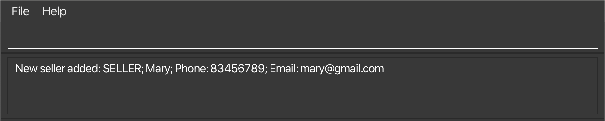
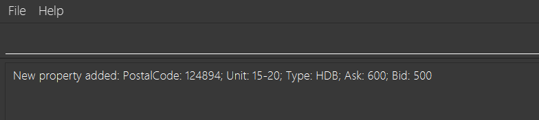

# Client Grid User guide

ClientGrid is an **address book** designed for real estate agents to efficiently manage client contacts, including buyers and sellers. It provides a streamlined way to organize client data and monitor the buying or selling process while maintaining core address book functionality.

<!-- * Table of Contents -->
<page-nav-print />

--------------------------------------------------------------------------------------------------------------------

## Quick start

1. Ensure you have Java `17` or above installed in your Computer.

1. Download the latest `.jar` file from [here](https://github.com/se-edu/addressbook-level3/releases).

1. Copy the file to the folder you want to use as the _home folder_ for your AddressBook.

1. Open a command terminal, `cd` into the folder you put the jar file in, and use the `java -jar addressbook.jar` command to run the application. 
   A GUI similar to the below should appear in a few seconds. Note how the app contains some sample data. 
   

1. Type the command in the command box and press Enter to execute it. e.g. typing **`help`** and pressing Enter will open the help window. 
   Some example commands you can try:

   * `list` : Lists all contacts.

   * `add n/John Doe p/98765432 e/johnd@example.com a/John street, block 123, #01-01` : Adds a contact named `John Doe` to the Address Book.

   * `addbuyer n/John p/12345678 e/john@gmail.com` : Add a buyer whose name is `John`, phone number is `12345678` and email is `john@gmail.com`.

   * `deletebuyer p/81234567` : Deletes the buyer with contact number `81234567`.

   * `clear` : Deletes all contacts.

   * `exit` : Exits the app.

1. Refer to the [Features](#features) below for details of each command.

--------------------------------------------------------------------------------------------------------------------

## Features

<box type="info" seamless>

**Notes about the command format:** 

* Words in `UPPER_CASE` are the parameters to be supplied by the user. 
  e.g. in `add n/NAME`, `NAME` is a parameter which can be used as `add n/John Doe`.

* Items in square brackets are optional. 
  e.g `n/NAME [t/TAG]` can be used as `n/John Doe t/friend` or as `n/John Doe`.

* Items with `…`​ after them can be used multiple times including zero times. 
  e.g. `[t/TAG]…​` can be used as ` ` (i.e. 0 times), `t/friend`, `t/friend t/family` etc.

* Parameters can be in any order. 
  e.g. if the command specifies `n/NAME p/PHONE_NUMBER`, `p/PHONE_NUMBER n/NAME` is also acceptable.

* Extraneous parameters for commands that do not take in parameters (such as `help`, `list`, `exit` and `clear`) will be ignored. 
  e.g. if the command specifies `help 123`, it will be interpreted as `help`.

* If you are using a PDF version of this document, be careful when copying and pasting commands that span multiple lines as space characters surrounding line-breaks may be omitted when copied over to the application.
</box>

### Viewing help : `help`

Shows a message explaning how to access the help page.

Format: `help`

### Adding a person: `add`

Adds a person to the address book.

Format: `add n/NAME p/PHONE_NUMBER e/EMAIL a/ADDRESS [t/TAG]…​`

<box type="tip" seamless>

**Tip:** A person can have any number of tags (including 0)
</box>

Examples:
* `add n/John Doe p/98765432 e/johnd@example.com a/John street, block 123, #01-01`
* `add n/Betsy Crowe t/friend e/betsycrowe@example.com a/Newgate Prison p/1234567 t/criminal`

### Listing all persons : `list`

Shows a list of all persons in the address book.

Format: `list`

### Editing a person : `edit`

Edits an existing person in the address book.

Format: `edit INDEX [n/NAME] [p/PHONE] [e/EMAIL] [a/ADDRESS] [t/TAG]…​`

* Edits the person at the specified `INDEX`. The index refers to the index number shown in the displayed person list. The index **must be a positive integer** 1, 2, 3, …​
* At least one of the optional fields must be provided.
* Existing values will be updated to the input values.
* When editing tags, the existing tags of the person will be removed i.e adding of tags is not cumulative.
* You can remove all the person’s tags by typing `t/` without
    specifying any tags after it.

Examples:
*  `edit 1 p/91234567 e/johndoe@example.com` Edits the phone number and email address of the 1st person to be `91234567` and `johndoe@example.com` respectively.
*  `edit 2 n/Betsy Crower t/` Edits the name of the 2nd person to be `Betsy Crower` and clears all existing tags.

### Locating persons by name: `find`

Finds persons whose names contain any of the given keywords.

Format: `find KEYWORD [MORE_KEYWORDS]`

* The search is case-insensitive. e.g `hans` will match `Hans`
* The order of the keywords does not matter. e.g. `Hans Bo` will match `Bo Hans`
* Only the name is searched.
* Only full words will be matched e.g. `Han` will not match `Hans`
* Persons matching at least one keyword will be returned (i.e. `OR` search).
  e.g. `Hans Bo` will return `Hans Gruber`, `Bo Yang`

Examples:
* `find John` returns `john` and `John Doe`
* `find alex david` returns `Alex Yeoh`, `David Li` 
  

### Adding a buyer : `addbuyer`

Add a specified buyer into the client book.

Format: `addbuyer n/BUYER_NAME p/BUYER_PHONE_NUMBER e/BUYER_EMAIL`

* Adds a buyer with the specified `BUYER_NAME`, `BUYER_PHONE_NUMBER`, and `BUYER_EMAIL`.
* The `BUYER_NAME` ignores extra/leading/trailing spaces. Extra/leading/trailing spaces will be trimmed and the name will be converted into an array of words. The `BUYER_NAME` also ignores UPPER/lower case. All names will be converted to lower case and checked against the in-memory database
* The `BUYER_PHONE_NUMBER` must be 8 numbers in the range [0-9] and can only start with ‘8’ or ‘9’
* The `BUYER_EMAIL` should follow the format local-part@domain and adhere to the following constraints: The local-part must consist only of alphanumeric characters and allowed special characters, with no special characters at the beginning or end. After the local-part, there must be an '@' followed by the domain name. The domain name consists of domain labels separated by periods. Each domain label must start and end with an alphanumeric character and may contain hyphens in between. Additionally, the domain must end with a domain label that is at least two characters long.

Examples:
* `addbuyer n/John p/12345678 e/john@gmail.com` adds a buyer whose name is `John`, phone number is `12345678` and email is `john@gmail.com`.

  

### Adding a seller : `addseller`

Add a specified seller into the client book.

Format: `addseller n/SELLER_NAME p/SELLER_PHONE_NUMBER e/SELLER_EMAIL`

* Adds a seller with the specified `SELLER_NAME`, `SELLER_PHONE_NUMBER`, and `SELLER_EMAIL`.
* The `SELLER_NAME` ignores extra/leading/trailing spaces. Extra/leading/trailing spaces will be trimmed and the name will be converted into an array of words. The `SELLER_NAME` also ignores UPPER/lower case. All names will be converted to lower case and checked against the in-memory database
* The `SELLER_PHONE_NUMBER` must be 8 numbers in the range [0-9] and can only start with ‘8’ or ‘9’
* The `SELLER_EMAIL` should follow the format local-part@domain and adhere to the following constraints: The local-part must consist only of alphanumeric characters and allowed special characters, with no special characters at the beginning or end. After the local-part, there must be an '@' followed by the domain name. The domain name consists of domain labels separated by periods. Each domain label must start and end with an alphanumeric character and may contain hyphens in between. Additionally, the domain must end with a domain label that is at least two characters long.

Examples:
* `addseller n/Mary p/83456789 e/mary@gmail.com` adds a seller whose name is `Mary`, phone number is `23456789` and email is `mary@gmail.com`.

  

### Deleting a buyer : `deletebuyer`

Deletes the specified buyer from the client book.

Format: `deletebuyer p/PHONE_NUMBER`

* Deletes the buyer with the specified `PHONE_NUMBER`.
* The `PHONE_NUMBER` must be 8 numbers in the range [0-9] and can only start with ‘8’ or ‘9’

Examples:
* `deletebuyer p/94351253` deletes the buyer with phone number `94351253` from the client book.
  

### Deleting a seller : `deleteseller`

Deletes the specified seller from the client book.

Format: `deleteseller p/PHONE_NUMBER`

* Deletes the seller with the specified `PHONE_NUMBER`.
* The `PHONE_NUMBER` must be 8 numbers in the range [0-9] and can only start with ‘8’ or ‘9’

Examples:
* `deleteseller p/98765432` deletes the seller with phone number `98765432` from the client book.

    

### Adding a property : `addproperty`

Add a specified property into the client book.

Format: `addproperty c/POSTAL_CODE u/UNIT_NUMBER`

* Adds a property with the specified `POSTAL_CODE` and `UNIT_NUMBER`.
* The `POSTAL_CODE` must be exactly 6 digits with each digit in the range [0-9]. It does not accept any non-integer characters or spaces
* The `UNIT_NUMBER` comprises of numbers that is delimited by exactly one dash(-). On either side of the dash are numbers comprising of two or more digit. The range of numbers of the left hand side of the dash is [00-148] and the right hand side is [00-111110]. Other than the dash bo other non-integer characters or spaces are accepted

Examples:
* `addproperty c/124894 u/15-20` adds a property with postal code `124894` and unit number is `15-20`.

  
* 
### Clearing all entries : `clear`

Clears all entries from the address book.

Format: `clear`

### Exiting the program : `exit`

Exits the program.

Format: `exit`

### Saving the data

AddressBook data are saved in the hard disk automatically after any command that changes the data. There is no need to save manually.

### Editing the data file

AddressBook data are saved automatically as a JSON file `[JAR file location]/data/addressbook.json`. Advanced users are welcome to update data directly by editing that data file.

<box type="warning" seamless>

**Caution:**
If your changes to the data file makes its format invalid, AddressBook will discard all data and start with an empty data file at the next run.  Hence, it is recommended to take a backup of the file before editing it. 
Furthermore, certain edits can cause the AddressBook to behave in unexpected ways (e.g., if a value entered is outside the acceptable range). Therefore, edit the data file only if you are confident that you can update it correctly.
</box>

### Archiving data files `[coming in v2.0]`

_Details coming soon ..._

--------------------------------------------------------------------------------------------------------------------

## FAQ

**Q**: How do I transfer my data to another Computer? 
**A**: Install the app in the other computer and overwrite the empty data file it creates with the file that contains the data of your previous AddressBook home folder.

--------------------------------------------------------------------------------------------------------------------

## Known issues

1. **When using multiple screens**, if you move the application to a secondary screen, and later switch to using only the primary screen, the GUI will open off-screen. The remedy is to delete the `preferences.json` file created by the application before running the application again.
2. **If you minimize the Help Window** and then run the `help` command (or use the `Help` menu, or the keyboard shortcut `F1`) again, the original Help Window will remain minimized, and no new Help Window will appear. The remedy is to manually restore the minimized Help Window.

--------------------------------------------------------------------------------------------------------------------

## Command summary

Action     | Format, Examples
-----------|----------------------------------------------------------------------------------------------------------------------------------------------------------------------
**Add**    | `add n/NAME p/PHONE_NUMBER e/EMAIL a/ADDRESS [t/TAG]…​`   e.g., `add n/James Ho p/22224444 e/jamesho@example.com a/123, Clementi Rd, 1234665 t/friend t/colleague`
**Clear**  | `clear`
**Delete** | `delete INDEX`  e.g., `delete 3`
**Edit**   | `edit INDEX [n/NAME] [p/PHONE_NUMBER] [e/EMAIL] [a/ADDRESS] [t/TAG]…​`  e.g.,`edit 2 n/James Lee e/jameslee@example.com`
**Find**   | `find KEYWORD [MORE_KEYWORDS]`  e.g., `find James Jake`
**List**   | `list`
**Help**   | `help`
**Add Buyer** | `addbuyer n/BUYER_NAME p/BUYER_PHONE_NUMBER e/BUYER_EMAIL`
**Add Seller** | `addseller n/SELLER_NAME p/SELLER_PHONE_NUMBER e/SELLER_EMAIL`
**Delete Buyer** | `deletebuyer p/PHONE_NUMBER`
**Delete Seller** | `deleteseller p/PHONE_NUMBER`

