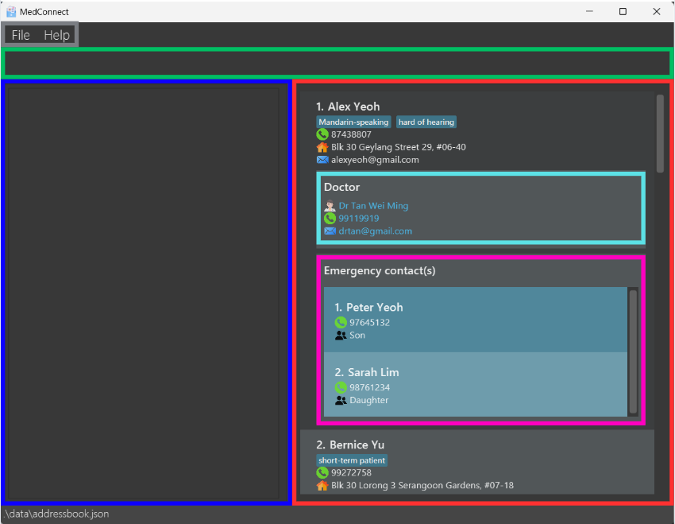

<div markdown="block" class="alert alert-warning">
**:warning: Disclaimer**:
<br>
MedConnect is only designed to support the **English language** and for use in a **single timezone**.
<br>
Using MedConnect with other languages or across timezones may cause unexpected behaviour.
</div>
<br>

MedConnect is a **desktop app designed for healthcare administrators in elderly care homes for dementia patients**. This app consolidates crucial contact information into a single, accessible database, allowing administrative staff to manage patient and doctor contacts efficiently under high-pressure conditions.

MedConnect combines the speed of a Command Line Interface ([CLI](#cli)) with the visual clarity of a Graphical User Interface ([GUI](#gui)), making it ideal for administrators who can type fast and need rapid access to information. MedConnect can get your contact management tasks done faster than traditional [GUI](#gui) apps.

With MedConnect, connecting with on-call doctors, family members, or other essential contacts becomes seamless, helping you respond quickly when every second counts.


## Table of Contents
{:.no_toc}

* Table of Contents
{:toc}

---

## How to use this User Guide
This User Guide is designed to help you understand and use MedConnect effectively. Here are some tips on how to navigate and use this guide:
1. **[Table of Contents](#table-of-contents)**: At the beginning of the guide, you will find a Table of Contents. Use this to quickly jump to the section you are interested in.
1. **[Quick Start](#quick-start)**: If you are new to MedConnect, start with the Quick Start section. It provides step-by-step instructions on how to set up and start using the application.
1. **[Features](#features)**: This section details all the commands available in MedConnect. Each command is explained with its format, parameters, and examples. Use this section to learn how to perform specific tasks.
1. **[Command Summary](#command-summary)**: At the end of the guide, there is a Command Summary table that provides a quick reference for all commands. Use this table to quickly look up the format of a command.
1. **[FAQ](#faq)**: The FAQ section addresses common questions and issues. Check this section if you encounter any problems or have questions about using MedConnect.
1. **[Known Issues](#known-issues)**: This section lists any known issues with the application and their workarounds. Refer to this section if you experience any unexpected behavior.
1. **[Glossary](#glossary)**: This section explains unfamiliar terms that we use in this User Guide. Check out the glossary if you're unsure what a certain word means.
1. **Notes and Tips**: Throughout the guide, you will find notes and tips highlighted in different styles. These provide additional information and helpful hints for using MedConnect effectively.

By following these sections, you can quickly find the information you need and make the most out of MedConnect.

## Quick start

1. Ensure you have Java `17` or above installed in your Computer.
   * You can check your Java version by following the instructions [here](https://www.wikihow.com/Check-Your-Java-Version-in-the-Windows-Command-Line).
   * If you do not have Java `17` or above installed in your Computer, you can download Java from [here](https://www.oracle.com/java/technologies/downloads/#java17).

2. Download the latest release of the `medconnect.jar` file from [here](https://github.com/AY2425S1-CS2103T-T13-1/tp/releases).

3. Copy the file to the folder you want to use as the _home folder_. The _home folder_ will be where all the data files will be saved.

4. *Windows:* Open the home folder and right click anywhere in the red box, as shown in the image below. Click "Open in Terminal". A terminal window will pop up, then type in the command `java -jar medconnect.jar` to run the application.<br><br>
<br><br>
*MacOS:* Right click home folder. Hover over "Services". Select "New Terminal at folder". A terminal window will pop up, then type in the command `java -jar medconnect.jar` to run the application.<br><br>
   

5. Type the command in the [command box](#command-box) and press Enter to execute it. e.g. typing **`help`** and pressing Enter will open the help window.<br>
   Some example commands you can try:

   * `list` : [List](#listing-all-persons--list) all contacts.

   * `add n/John Doe p/98765432 e/johnd@example.com a/John street, block 123, #01-01 ecname/Charlotte Lim ecphone/81243564 ecrs/Sibling dname/Ronald Lee dphone/99441234 demail/ronaldlee@gmail.com`<br>
   [Add](#adding-a-person-add) a contact named `John Doe` to the Address Book with emergency contact `Charlotte Lim` and doctor `Ronald Lee`.

   * `delete 3` : [Delete](#deleting-a-person--delete) the 3rd contact shown in the current list.

   * `clear` : [Clear](#clearing-all-entries--clear) the contacts list of all contacts.

   * `undo` : [Undo](#undoing-previous-command--undo) previous command.

   * `exit` : [Exit](#exiting-the-program--exit) the app.

1. Refer to the [Features](#features) below for details of each command.

[↑ Back to top](#table-of-contents)

---

## Quick Tutorial on MedConnect's [GUI](#gui)



* The headers are colour-coded to match the GUI screenshot's boxes above!

<span style="font-size: 20px; font-weight: bold; color: #7a7d82">Menu Bar</span>
* Clicking `File` will show the option to exit the application.
* Clicking `Help` will show `Help F1` which when clicked will link you to this User Guide!

<span style="font-size: 20px; font-weight: bold; color: #00bf63">Command Box</span><a name="command-box"></a>
* This is where you will be typing the commands for MedConnect! The full list of commands can be found at [Features](#features)!

<span style="font-size: 20px; font-weight: bold; color: #0d00ff">Result Box</span>
* This is where MedConnect will give you feedback after you type in a command! It will provide information on whether a command was successful or an invalid input was provided! For more information on the valid command inputs, head to [Features](#features).

<span style="font-size: 20px; font-weight: bold; color: #ff3131">Patients List</span>
* The list of patients will be shown here.
* You can scroll down the list to see more patients.

<span style="font-size: 20px; font-weight: bold; color: #5ce1e6">Doctor Details</span>
* Each patient has a doctor assigned to them.
* The name, phone number and email of the assigned doctor can be easily identified by the blue text colour!

<span style="font-size: 20px; font-weight: bold; color: #ff00bf">Emergency Contact Details</span>
* Each patient will have at least one emergency contact listed.
* The name, phone number and relationship to the patient of each emergency contact is listed here.
* If a patient has multiple emergency contacts, this box will become scrollable to be able to view more contacts.

[↑ Back to top](#table-of-contents)

## Features

<div markdown="block" class="alert alert-info">

**:information_source: Notes about the command format:**<br>

* Words in `UPPER_CASE` are the parameters to be supplied by the user.<br>
  e.g. in `add n/NAME`, `NAME` is a parameter which can be used as `add n/John Doe`.

* Items in square brackets are optional.<br>
  e.g `n/NAME [t/TAG]` can be used as `n/John Doe t/friend` or as `n/John Doe`.

* Items with `…`​ after them can be used multiple times including zero times.<br>
  e.g. `[t/TAG]…​` can be used as ` ` (i.e. 0 times), `t/friend`, `t/friend t/family` etc.

* Parameters can be in any order.<br>
  e.g. if the command specifies `n/NAME p/PHONE_NUMBER`, `p/PHONE_NUMBER n/NAME` is also acceptable.

* Extraneous parameters for commands that do not take in parameters (such as `help`, `exit` and `clear`) will be ignored.<br>
  e.g. if the command specifies `help 123`, it will be interpreted as `help`.

* If you are using a PDF version of this document, be careful when copying and pasting commands that span multiple lines as space characters surrounding line-breaks may be omitted when copied over to the application.
</div>

---

### Suggestion and Autocomplete Feature

### Overview

The CommandBox in the MedConnect application offers two major features to assist users while typing commands:

- **Suggestion**: Provides visible hints about the expected command syntax as the user types.
- **Autocomplete**: Helps complete partially typed commands when pressing the `Control` key.

These features aim to enhance the user's command entry experience, reduce the need for memorizing syntax, and avoid typing errors.

---

### Suggestion Feature


> **Description**: As you begin typing a command, suggestions are displayed to provide context about the expected syntax. For example, if you start typing `add`, the suggestion will provide all required and optional parameters related to the `add` command.

**Usage**:
- As soon as you begin typing a valid command (e.g., `add`, `edit`, `find`), a suggestion will be displayed showing the entire command syntax.
- If you make an incorrect entry (e.g., type `adding`), the suggestion will be hidden to indicate a problem with the syntax.

**Example**:
```
add (n/NAME p/PHONE e/EMAIL a/ADDRESS ecname/EMERGENCY_CONTACT_NAME ...)

add n/Saajid Shaik p/82617860 (e/EMAIL a/ADDRESS ecname/EMERGENCY_CONTACT_NAME ...)

where the words in brackets "()", are suggested by the system
```
This suggestion will be displayed as soon as you start typing `add`.

### Autocomplete Feature


> **Description**: The Autocomplete feature allows the user to complete partially typed commands or parameters by pressing the `Control` key.

**Usage**:
- When a command is partially typed (e.g., `ad`), pressing `Control` will automatically complete it to the full command (`add`).
- When the command word 'add' is typed, we move on to the slash commands where the autocompletes stops at the slash to allow users to type their personal details. E.g. `add` ->`add n/`
- Autocomplete works for command words as well as parameters, helping you quickly complete complex entries without fully typing each part.
- Autocomplete will only work if the input before pressing `Control` is a part of a valid command.

Do take note, for commands like `delete index`, since index can be any number, there will be no autocomplete as there is no meaning to autocomplete the name "INDEX" itself.
Other examples include `add n/` -> `add n/ p/` as there is no value in autocomplete the name "NAME" itself.

**Example**:
- Type `add`, and then press `Control` to autocomplete `add n/`.
- Type `add n/Saajid Shaik`, and then press `Control` to autocomplete `add n/Saajid Shaik p/`.

### Additional Notes

- **Incorrect Inputs**: If the input is incorrect or deviates from the expected syntax, suggestions will disappear, and autocomplete will not work. This helps users recognize mistakes early.
- **Separation**: The suggestion is a passive visual cue, while autocomplete requires user action (pressing `Control`). Both features work together but serve different purposes.

---

### Viewing help : `help`

Shows a message explaining how to access the help page.


Format: `help`

[↑ Back to top](#table-of-contents)

### Adding a person: `add`

Adds a person to the address book.

Format: `add n/NAME p/PHONE_NUMBER e/EMAIL a/ADDRESS ecname/EMERGENCY_CONTACT_NAME ecphone/EMERGENCY_CONTACT_PHONE
ecrs/EMERGENCY_CONTACT_RELATIONSHIP dname/DOCTOR_NAME dphone/DOCTOR_PHONE demail/DOCTOR_EMAIL [t/TAG]…​`

<div markdown="span" class="alert alert-primary">:bulb: **Tip:**
A person can have any number of tags (including 0)
</div>

* MedConnect will automatically add the `Dr` prefix to the Doctor Name.
* Valid inputs for `EMERGENCY_CONTACT_RELATIONSHIP` can be found in the [glossary](#glossary).

Examples:
* `add n/John Doe p/98765432 e/johnd@example.com a/John street, block 123, #01-01 ecname/Charlotte Lim ecphone/94681352 ecrs/daughter dname/Ronald Lee dphone/99441234 demail/ronaldlee@gmail.com`<br>
Adds John Doe as a patient with his daughter Charlotte Lim as his emergency contact and Dr Ronald Lee as his assigned doctor.

* `add n/Betsy Crowe t/friend ecname/Matthew Tan e/betsycrowe@example.com a/Newgate Prison p/1234567 ecrs/son ecphone/94873631 ecname/Bob Builder demail/liampayne@gmail.com dphone/91231231 dname/Liam Payne t/criminal` <br>
Adds Betsy Crowe as a patient with her son Bob Builder as her emergency contact and Dr Liam Payne as her assigned doctor.

[↑ Back to top](#table-of-contents)

### Listing all persons : `list`

Shows a list of every patient in the address book.

Format: `list [SORT_ORDER]`

<div markdown="block" class="alert alert-info">

Valid inputs for sort order parameter: `timeadded`, `timeadded asc`, `timeadded desc`, `name`, `name asc`, `name desc`

</div>

* `SORT_ORDER` parameter is **optional**. <br>
If `SORT_ORDER` is not provided, the patients listed will be sorted in the order they were added. The patient who was added the most recently will be at the bottom of the list.
<br><br>
* `timeadded`, `timeadded asc` and `timeadded desc` will sort the patient list according to the time they were added to Medconnect.
* `timeadded` and `timeadded asc` will sort the patient list from least to most recently added. `timeadded desc` will sort the patient list from most to least recently added.
<br><br>
* `name`, `name asc` and `name desc` will sort the patient list according to their name in alphabetical order.
* `name` and `name asc` will sort by the patients' names from A to Z. `name desc` will sort by the patients' names from Z to A.

[↑ Back to top](#table-of-contents)

### Editing a person : `edit`

Edits an existing person in the address book.

Format: `edit INDEX [n/NAME] [p/PHONE] [e/EMAIL] [a/ADDRESS] [ec/ECINDEX] [ecname/EMERGENCY_CONTACT_NAME] [ecrs/EMERGENCY_CONTACT_RELATIONSHIP] [dname/DOCTOR_NAME] [dphone/DOCTOR_PHONE] [demail/DOCTOR_EMAIL] [t/TAG]…`

* Edits the person at the specified `INDEX`. Existing values will be updated to the input values.
* `INDEX` refers to the index number shown in the displayed person list. `INDEX` **must be a positive integer** (e.g. 1, 2, 3, …)
* Valid inputs for `EMERGENCY_CONTACT_RELATIONSHIP` can be found in the [glossary](#glossary).
* At least one of the optional fields must be provided.
* When editing an emergency contact, the index of the emergency contact to edit and at least one emergency contact field must be provided
* When editing tags, all the existing tags of the person will be removed (i.e adding of tags is not cumulative.)
* You can remove all of a person’s existing tags by typing `t/` without specifying any tags after it.

Examples:
*  `edit 1 p/91234567 e/johndoe@example.com` Edits the phone number and email address of the 1st person to be `91234567` and `johndoe@example.com` respectively.

*  `edit 2 n/Betsy Crower t/` Edits the name of the 2nd person to be `Betsy Crower` and clears all existing tags.

*  `edit 2 n/Betsy Crower ec/1 ecname/Peter Tan` Edits the name of the first emergency contact of the 2nd person in the list to be `Peter Tan`.

[↑ Back to top](#table-of-contents)

### Locating persons by name: `find`

Finds persons whose names contain any of the given keywords.

Format: `find KEYWORD [MORE_KEYWORDS]`

* **Only the patient's name is searched.**
* The search is case-insensitive. (e.g `hans` will match `Hans`)
* The order of the keywords does not matter. (e.g. `Hans Bo` will match `Bo Hans`)
* Names will match if the keyword is found in any part of the name. (e.g. `Ha` will match `Hans`)
* All persons matching at least one keyword will be returned.
  (e.g. `Hans Bo` will return `Hans Gruber`, `Bo Yang`)

Examples:
* `find Alex` returns `Alex Yeoh` and `Alexis Tan`
* `find dav Roy` returns `David Li` and `Roy Balakrishnan`<br><br>
  
Entering the command `find dav Roy` returns the above list, finding David Li and Roy Balakrishnan.

[↑ Back to top](#table-of-contents)

### Locating persons by name: `finddoc`

Finds persons by checking if their doctor's names contain any of the provided keywords.

Format: `finddoc KEYWORD [MORE_KEYWORDS]`

* **Only the doctor's name is searched.**
* The search is case-insensitive. (e.g `hans` will match `Hans`)
* The order of the keywords does not matter. (e.g. `Hans Bo` will match `Bo Hans`)
* Names will match if the keyword is found in any part of the doctor's name. (e.g. `Ha` will match `Hans`)
* Persons matching at least one keyword in their doctor's name will be returned. (e.g. `Hans Bo` will return persons whose doctors are `Hans Gruber`, `Bo Yang`)

Examples:
* `finddoc John` returns persons with doctors `john` and `John Doe`
* `finddoc tan ed` returns persons with doctors `Tan Wei Ming`, `Ed Sheeran`<br><br>
  Entering the command `finddoc zhou` returns the above result of Irfan Ibrahim since Dr Zhou Jie Lun is his assigned doctor.

[↑ Back to top](#table-of-contents)

### Deleting a person : `delete`

Deletes the specified person or emergency contact from the address book.

Format: `delete INDEX [ec/EMERGENCY_CONTACT_INDEX]`

* Deletes the person at the specified `INDEX` **OR** deletes the emergency contact at the specified `EMERGENCY_CONTACT_INDEX` of the person at the specified `INDEX`.
* The index refers to the index number shown in the displayed person list.
* The index **must be a positive integer** 1, 2, 3, …​

Examples:
* `delete 2 ec/2` deletes the 2nd emergency contact of the 2nd person in the address book.
* `list` followed by `delete 2` deletes the 2nd person in the address book.
* `find Betsy` followed by `delete 1` deletes the 1st person in the results of the `find` command.

[↑ Back to top](#table-of-contents)

### Adding an emergency contact : `addec`

Adds an emergency contact to a specified person in the address book.

Format: `addec INDEX ecname/EMERGENCY_CONTACT_NAME ecphone/EMERGENCY_CONTACT_PHONE ecrs/EMERGENCY_CONTACT_RELATIONSHIP`

* Valid inputs for `EMERGENCY_CONTACT_RELATIONSHIP` can be found in the [glossary](#glossary).

Examples:
* `addec 1 ecname/Shannon Wong ecphone/84651325 ecrs/Daughter` Adds a new emergency contact Shannon Wong to the 1st person in the address book.

[↑ Back to top](#table-of-contents)

### Archiving data files: `archive`

Archives the current address book data to a timestamped data file with an optional description.

Format: `archive [DESCRIPTION]`

* The description is optional and must be a valid file name (i.e., it cannot contain any of the following special characters: `\/:*?"<>|`).
* The archive data file will be saved as a JSON file in the `[JAR file location]/data/archive/` folder.

Examples:
* `archive` Archives the current address book data to a timestamped data file.
* `archive "before major update"` Archives the current address book data to a timestamped data file with the description "before major update".

[↑ Back to top](#table-of-contents)

### Listing all archived data files: `listarchives`

Lists the names of all the archived data files in the archive folder.

Format: `listarchives`

[↑ Back to top](#table-of-contents)

### Loading data from an archived data file: `loadarchive`

Loads the data from an archived data file into the address book.

Format: `loadarchive FILE_NAME`

* `FILE_NAME` must be the name of an archived data file in the archive folder.
* The data from the archived file will replace the current data in the address book.
* The data in the archived file will not be deleted.

<div markdown="span" class="alert alert-primary">:bulb: **Tip:**
Did you accidentally load an archive and want your old data back? Enter the 'undo' command!
</div>

Examples:
* `loadarchive addressbook-2024-11-06T20-29-05.7609475-example.json` Loads the data from the archived file named `addressbook-2024-11-06T20-29-05.7609475-example.json` into the address book.


[↑ Back to top](#table-of-contents)

### Deleting an archived data file: `deletearchive`

<div markdown="span" class="alert alert-warning">:exclamation: **Caution:**
Deleting an archive file is **permanent**. The `undo` command cannot restore a deleted archive file.
</div>

Deletes the data of an existing archived data file in the archive folder.

Format: `deletearchive FILE_NAME`

* `FILE_NAME` must be the name of an archived data file in the archive folder.

Examples:
* `deletearchive addressbook-20241023_114324-example.json` Deletes the archived file with the file name `addressbook-20241023_114324-example.json`.

[↑ Back to top](#table-of-contents)

### Clearing all entries : `clear`

Clears all entries from the address book.

Format: `clear`

[↑ Back to top](#table-of-contents)

### Undoing previous command : `undo`
Restores the previous state of the address book after any change, such as an addition, edit, or deletion of a person or entry.

Format: `undo`

<div markdown="span" class="alert alert-warning">:exclamation: **Warning:**
An action cannot be undone once you close the MedConnect application.
</div>

[↑ Back to top](#table-of-contents)

### Redoing previous command : `redo`

Restores the state of the address book **after an undo operation has been executed**, effectively "redoing" the undone changes, such as an addition, edit, or deletion of a person or entry.

Format: `redo`

[↑ Back to top](#table-of-contents)

### Exiting the program : `exit`

Exits the program.

Format: `exit`

[↑ Back to top](#table-of-contents)

### Saving the data

AddressBook data are saved in the hard disk automatically after any command that changes the data. There is no need to save manually.

### Editing the data file

AddressBook data are saved automatically as a JSON file `[JAR file location]/data/addressbook.json`. Advanced users are welcome to update data directly by editing that data file.

<div markdown="span" class="alert alert-warning">
:exclamation: **Caution:**
<br>
If your changes to the data file makes its format invalid, AddressBook will discard all data and start with an empty data file at the next run. Hence, it is recommended to take a backup of the file before editing it.
<br><br>
Furthermore, certain edits can cause the AddressBook to behave in unexpected ways (e.g., if a value entered is outside of the acceptable range). Therefore, edit the data file only if you are confident that you can update it correctly.
</div>

[↑ Back to top](#table-of-contents)

---

## FAQ

**Q**: How do I transfer my data to another computer?<br>
**A**: Install the app in the other computer and overwrite the empty data file it creates with the file that contains the data of your previous MedConnect home folder.

**Q**: How do I change the MedConnect home folder?<br>
**A**: The MedConnect home folder is set to the folder where the `medconnect.jar` file is located. If you want to change it, move the `medconnect.jar` file and all the files in the original home folder to the new folder.

[↑ Back to top](#table-of-contents)

---

## Known issues

1. **When using multiple screens**, if you move the application to a secondary screen, and later switch to using only the primary screen, the GUI will open off-screen. The remedy is to delete the `preferences.json` file created by the application before running the application again.
2. **If you minimize the Help Window** and then run the `help` command (or use the `Help` menu, or the keyboard shortcut `F1`) again, the original Help Window will remain minimized, and no new Help Window will appear. The remedy is to manually restore the minimized Help Window.
3. **When typing commands in the CommandBox**, inserting a space, e.g. `he lp` in between `he` and `lp`, will cause the suggestion and autocorrection to bug out and display incorrecty.
[↑ Back to top](#table-of-contents)


## Glossary

| Term                                               | Details                                                                                                                                                                                                                                                                        | Example                                                                                                                                                                                                                                              |
|----------------------------------------------------|--------------------------------------------------------------------------------------------------------------------------------------------------------------------------------------------------------------------------------------------------------------------------------|------------------------------------------------------------------------------------------------------------------------------------------------------------------------------------------------------------------------------------------------------|
| **Alphanumeric**                                   | Characters that are either numbers or letters.                                                                                                                                                                                                                                 | 1, 2, 3, A, b, c are alphanumeric characters.                                                                                                                                                                                                        |
| **Command**                                        | Instructions that are given to MedConnect to execute.                                                                                                                                                                                                                          | [Features](#features) are commands that MedConnect can execute. [`add`](#adding-a-person-add) is one such command!                                                                                                                                   |
| **Command Line Interface (CLI)**<a name="cli" />   | A Command Line Interface allows users to interact with an application by typing commands to execute actions.                                                                                                                                                                   | The command line acts as a CLI in MedConnect.                                                                                                                                                                                                        |
| **Graphical User Interface (GUI)**<a name="gui" /> | A Graphical User Interface allows users to interact with an application through graphics like buttons or icons.                                                                                                                                                                | MedConnect acts as a GUI.                                                                                                                                                                                                                            |
| **Keyword**                                        | The word you want to search for in a `find` or `finddoc` command.                                                                                                                                                                                                              | Searching for a patient named Bernice Yu could be done by using keywords `Bern` or `Yu`.                                                                                                                                                             |
| **Parameter**                                      | Information that you are required to provide to the MedConnect command.                                                                                                                                                                                                        | `NAME` and `EMAIL` are examples of parameters you have to provide in an [`add`](#adding-a-person-add) command.<br><br>`Paul` and `paul@gmail.com` are possible examples to provide to the respective parameters.                                     |
| **`ecrs/` EMERGENCY_CONTACT_RELATIONSHIP**         | This field accepts the following valid inputs:<br/>`Parent, Mother, Father, Child, Son, Daughter, Sibling, Brother, Sister, Friend, Spouse, Husband, Wife, Partner, Cousin, Relative, Uncle, Aunt, Grandparent, Grandmother, Grandfather, Grandchild, Grandson, Granddaughter` | `Spouse` and `GRANDcHILD` are examples of relationships you can provide in an [`add`](#adding-a-person-add), [`edit`](#editing-a-person--edit) or [`addec`](#adding-an-emergency-contact--addec) command `ecrs/` parameter.

[↑ Back to top](#table-of-contents)

---
## Command summary

| Action                    | Format, Examples                                                                                                                                                                                                                                                                                                                                                                         |
|---------------------------|------------------------------------------------------------------------------------------------------------------------------------------------------------------------------------------------------------------------------------------------------------------------------------------------------------------------------------------------------------------------------------------|
| **Add**                   | `add n/NAME p/PHONE_NUMBER e/EMAIL a/ADDRESS ecname/EMERGENCY_CONTACT_NAME ecphone/EMERGENCY_CONTACT_PHONE ecrs/EMERGENCY_CONTACT_RELATIONSHIP [t/TAG]…​` <br><br> e.g., `add n/James Ho p/81234567 e/jamesho@example.com a/123, Clementi Rd, 123465` `ecname/Lim Jun Wei ecphone/98765678 ecrs/Brother` `dname/Sam Lim dphone/9987766 demail/samlim@hotmail.com` `t/friend t/colleague` |
| **Add Emergency Contact** | `addec INDEX ecname/EMERGENCY_CONTACT_NAME ecphone/EMERGENCY_CONTACT_PHONE ecrs/EMERGENCY_CONTACT_RELATIONSHIP`<br> e.g., `addec 1 ecname/Shannon Wong ecphone/84651325 ecrs/Daughter`                                                                                                                                                                                                   |
| **Archive**               | `archive [DESCRIPTION]` <br> e.g., `archive before major update`                                                                                                                                                                                                                                                                                                                         |
| **Clear**                 | `clear`                                                                                                                                                                                                                                                                                                                                                                                  |
| **Delete**                | `delete INDEX`<br> e.g., `delete 3`                                                                                                                                                                                                                                                                                                                                                      |
| **Delete Archive File**   | `deletearchive FILE_NAME` <br> e.g., `deletearchive addressbook-2024-11-06T20-29-05.7609475-example.json`                                                                                                                                                                                                                                                                                |
| **Edit**                  | `edit INDEX [n/NAME] [p/PHONE_NUMBER] [e/EMAIL] [a/ADDRESS] [dname/DOCTOR_NAME] [dphone/DOCTOR_PHONE] [demail/DOCTOR_EMAIL] [t/TAG]…​`<br> e.g.,`edit 2 n/James Lee e/jameslee@example.com`                                                                                                                                                                                              |
| **Find**                  | `find KEYWORD [MORE_KEYWORDS]`<br> e.g., `find James Jake`                                                                                                                                                                                                                                                                                                                               |
| **Find Doctor**           | `finddoc KEYWORD [MORE_KEYWORDS]` <br> e.g., `find Tan Sheeran`                                                                                                                                                                                                                                                                                                                          |
| **Help**                  | `help`                                                                                                                                                                                                                                                                                                                                                                                   |
| **List**                  | `list [SORT_ORDER]` <br> e.g., `list timeadded desc`                                                                                                                                                                                                                                                                                                                                     |
| **List Archive Files**    | `listarchives`                                                                                                                                                                                                                                                                                                                                                                           |
| **Load Archive File**     | `loadarchive FILE_NAME` <br> e.g., `loadarchive addressbook-2024-11-06T20-29-05.7609475-example.json`                                                                                                                                                                                                                                                                                    |
| **Redo**                  | `redo`                                                                                                                                                                                                                                                                                                                                                                                   |
| **Undo**                  | `undo`                                                                                                                                                                                                                                                                                                                                                                                   |

[↑ Back to top](#table-of-contents)
