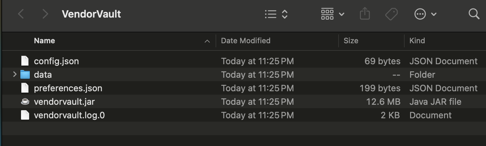
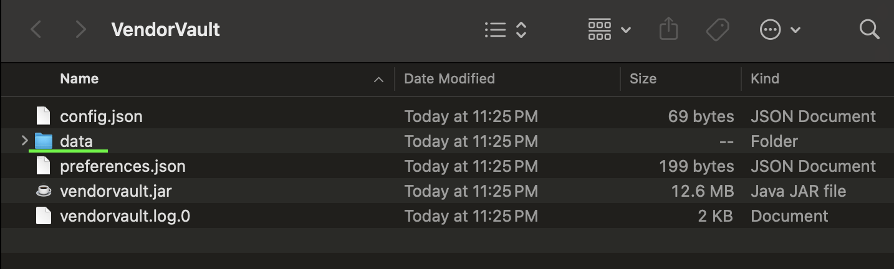

# VendorVault User Guide

VendorVault is a **desktop app for managing supplier contact information and deliveries, optimized for use via a Command Line Interface** (CLI). If you can type fast, VendorVault can get your contact and delivery management tasks done faster than traditional GUI apps. VendorVault specifically targets small convenience/grocery stores and aims to help them achieve higher efficiency!

Overview of key features:
* Supplier Contact Management
* Delivery Detail Management
* Multi-level Filtering
* Sort supplier contacts and delivery information

--- {.thick-1}
# Table of Contents
<!-- * Table of Contents -->
1. [How to get started](#1-how-to-get-started)
2. [Setting up VendorVault](#2-setting-up-vendorvault)
3. [Features](#3-features)
    - 3.1. [Understanding the Command Syntax](#3-1-understanding-the-command-syntax)
    - 3.2. [General commands](#3-2-general-commands)
        - 3.2.1. [Viewing help](#3-2-1-viewing-help-help)
        - 3.2.2. [Viewing all deliveries and suppliers](#3-2-2-viewing-all-deliveries-and-suppliers-list-a)
        - 3.2.3. [Clearing all suppliers and deliveries](#3-2-3-clearing-all-suppliers-and-deliveries-clear)
        - 3.2.4. [Exiting the program](#3-2-4-exiting-the-program-exit)
    - 3.3. [Supplier commands](#3-3-supplier-commands)
        - 3.3.1. [Adding a supplier](#3-3-1-adding-a-supplier-add-s)
        - 3.3.2. [Listing all suppliers](#3-3-2-listing-all-suppliers-list-s)
        - 3.3.3. [Deleting a supplier](#3-3-3-deleting-a-supplier-delete-s)
        - 3.3.4. [Marking a supplier](#3-3-4-marking-a-supplier-mark-s)
        - 3.3.5. [Finding suppliers](#3-3-5-finding-suppliers-find-s)
        - 3.3.6. [Sorting suppliers](#3-3-6-sorting-suppliers-sort-s)
    - 3.4. [Delivery commands](#3-4-delivery-commands)
        - 3.4.1. [Adding a delivery](#3-4-1-adding-a-delivery-add-d)
        - 3.4.2. [Listing all deliveries](#3-4-2-listing-all-deliveries-list-d)
        - 3.4.3. [Deleting a delivery](#3-4-3-deleting-a-delivery-delete-d)
        - 3.4.4. [Marking a delivery](#3-4-4-marking-a-delivery-mark-d)
        - 3.4.5. [Finding deliveries](#3-4-5-finding-deliveries-find-d)
        - 3.4.6. [Sorting deliveries](#3-4-6-sorting-deliveries-sort-d)
        - 3.4.7. [Upcoming deliveries](#3-4-7-upcoming-deliveries-upcoming)
    - 3.5. [Extended format guidelines](#3-5-extended-format-guidelines)
        - 3.5.1. [Valid email address format](#3-5-1-valid-email-address-format)
        - 3.5.2. [Valid company name format](#3-5-2-valid-company-name-format)
4. [Managing your data](#4-managing-your-data)
   - 4.1. [Saving your data](#4-1-saving-the-data)
   - 4.2. [Editing your data directly](#4-2-editing-the-data-file)
   - 4.3. [Archiving your data files](#4-3-archiving-data-files-coming-in-v2-0)
5. [FAQ](#5-faq)
6. [Known Issues](#6-known-issues)
7. [Command Summary](#7-command-summary)
    - 7.1. [General Commands](#7-1-general-commands)
    - 7.2. [Supplier-specific Commands](#7-2-supplier-specific-commands)
    - 7.3. [Delivery-specific Commands](#7-3-delivery-specific-commands)
8. [Glossary](#8-glossary)

--- {.thick-1}

# 1. How to get started

1. If you are new to VendorVault, we suggest starting from the [Setting up VendorVault section](#2-setting-up-vendorvault).

2. If you have already set up VendorVault and are looking for information of our commands and features, take a look at our [Features](#3-features) or [Command Summary](#7-command-summary) sections. 

3. If you’re unsure about any of the terms used in this User Guide, please refer to the [Glossary](#8-glossary) section for definitions and explanations.

[[Back to Table of Contents]](#table-of-contents)

--- {.thick-1}

# 2. Setting up VendorVault 

1. Java is the toolset that will allow you to use VendorVault on your system. Hence, first you need to ensure that you have Java `17` or above installed on your Computer. If you are unsure, you can check by following the steps below:
   - 1a. Open up your command terminal. 
     * Windows users can open the terminal by typing in `Command Prompt` in the search bar located at the bottom left of the screen. 
     * Mac users can open the terminal by typing in `Terminal` using the spotlight search bar (accessed by pressing Command + Space). 
     * Linux users can open the command terminal by searching for `Terminal` or `Console` in the Applications Menu.
   
   - 1b. Type in `java -version` to check if you have Java installed. If you have Java installed you should see something like this:   
     
   
   - 1c. If you do not have Java installed or are currently on a different version, you can download it from [here](https://www.oracle.com/java/technologies/downloads/#java17?er=221886).

2. Download the latest `vendorvault.jar` file from [here](https://github.com/AY2425S1-CS2103T-W14-1/tp/releases).   
      

3. Upon downloading the `vendorvault.jar` file, copy the file to the folder you want to use as the _home folder_ for your VendorVault Application.

4. Open the command terminal (same as step 1a), type `cd [path-to-your-folder]` (path to the folder you placed the jar file in step 3) and use the `java -jar vendorvault.jar` command in the terminal to run the application.   
       If you encounter difficulties in this step, you may follow these guides below:
    * Windows users follow this [guide](https://www.geeksforgeeks.org/change-directories-in-command-prompt/).
    * Mac users follow this [guide](https://darkroomphotos.com/mac-terminal-navigate-folders/).
    * Linux users follow this [guide](https://www.redhat.com/en/blog/Linux-file-navigation-commands).

A GUI similar to the below should appear in a few seconds. Note how the app contains some sample data:

 

5. In the application, the box that says **Enter command here ...** is called the command box. This is where you will input in your commands. 

6. The box below the command box is called the **results display box**. This is where the result of your inputted command will be displayed. 

7. You can type a command in the **command box** and press Enter to execute it. e.g. typing `help` and pressing Enter will open the help window.   Some example commands you can try:

   * `list -a` : Lists all suppliers and deliveries.

   * `add -s n/John Doe p/98765432 e/johnd@example.com com/John street, block 123, #01-01 pro/iPhone` : Adds a supplier named `John Doe` to VendorVault.

   * `delete -d 3` : Deletes the 3rd delivery shown in the current delivery list.

   * `exit` : Exits the app.

8. Refer to the [Features](#3-features) section below for details of each command.
 

[[Back to Table of Contents]](#table-of-contents)

--- {.thick-1}

# 3. Features

## 3.1. Understanding the Command Syntax

<box type="info" seamless>

* Words in `UPPER_CASE` are the parts of the parameters to be supplied by the user. 
  e.g. the parameter `add n/NAME` can be used as `add n/John Doe`.

* Parameters in square brackets are optional. 
  e.g. `n/NAME [t/TAG]` can be used as `n/John Doe t/friend` or as `n/John Doe`.

* Parameters **with** `…`​ after them can be used multiple times including zero times. 
  e.g. `[t/TAG]…​` can be used as ` ` (i.e. 0 times), `t/friend`, `t/friend t/family` etc.

* Parameters **without** `…`​ after them can only be used once. 
  e.g. `n/NAME` can only be used once.

* Parameters can be in any order. 
  e.g. if the command specifies `n/NAME p/PHONE_NUMBER`, `p/PHONE_NUMBER n/NAME` is also acceptable.

* For the commands `help` `clear` and `exit`, extra information/words following the command after a space will be ignored. 
  e.g. if the command specifies `exit 123 `, it will be interpreted as `exit`. However, `exit1` will not be recognized as a command.

* For all parameters, starting and ending spaces will be trimmed.

* For all commands except `find`, `sort` and `upcoming`, the displayed list of suppliers/deliveries will be the unfiltered and unsorted list of all suppliers/deliveries after executing the command. 
  For `find`, `sort` and `upcoming` commands, the displayed list will be the corresponding filtered/sorted list of supplier/deliveries. 

* If you are using a PDF version of this document, be careful when copying and pasting commands that span multiple lines as space characters surrounding line-breaks may be omitted when copied over to the application.
</box>

[[Back to Table of Contents]](#table-of-contents)

---

## 3.2. General Commands

### 3.2.1. Viewing help : `help`

Shows a message containing a link to this user guide.

Format: `help`

##### Here's how it would look like in the app:

[[Back to Table of Contents]](#table-of-contents)

---

### 3.2.2. Viewing all deliveries and suppliers : `list -a`

Lists all suppliers and deliveries in VendorVault.

Format: `list -a`

<box type="warning" seamless>

**Warnings**:
- No other parameters should be given for this command.
- Give at least one space between list and -a.

</box>

[[Back to Table of Contents]](#table-of-contents)

---

### 3.2.3. Clearing all suppliers and deliveries : `clear`

Clears all data regarding suppliers and deliveries in VendorVault.

Format: `clear`

[[Back to Table of Contents]](#table-of-contents)

---

### 3.2.4. Exiting the program : `exit`

Exits the program.

Format: `exit`

[[Back to Table of Contents]](#table-of-contents)

---

## 3.3. Supplier Commands 

### 3.3.1. Adding a supplier: `add -s`

Adds a supplier to VendorVault.

Format: `add -s n/NAME p/PHONE e/EMAIL com/COMPANY [t/TAG]…​ [pro/PRODUCT]…​`

<box type="info" seamless>

Parameters:
- `n/NAME`: `NAME` is the supplier's name. It must be alphanumeric, and cannot be blank.
- `p/PHONE`: `PHONE` is the supplier's phone number. It must be numeric, and contain at least 3 digits.
- `e/EMAIL`: `EMAIL` is the supplier's email address. It must be in a valid email address format, and cannot be blank.
  - Please see [below](#3-5-1-valid-email-address-format) for more information on what constitutes a valid email address format.
- `com/COMPANY`: `COMPANY` is the company associated with the supplier. It must be in a valid company name format, and cannot be blank.
  - Please see [below](#3-5-2-valid-company-name-format) for more information on what constitutes a valid company name format.
- `[t/TAG]`: `TAG` is the tag(s) associated with the supplier. It must be alphanumeric, and only contain between 1 and 50 (inclusive) characters.
- `[pro/PRODUCT]`: `PRODUCT` is the product(s) associated with the supplier. It must be alphanumeric, only contain between 1 and 50 (inclusive) characters, and spaces are also allowed.
  - One space is counted as one character.
  - A `PRODUCT` cannot be made up of only spaces.

</box>

<box type="tip" seamless>

**Tips:** A supplier can have any number of `TAG` and `PRODUCT` (including 0).
- To include multiple `TAG`/`PRODUCT`, use multiple `t/TAG`/`pro/PRODUCT` respectively.

</box>

<box type="warning" seamless>

**Warnings**:
- At least one space is needed between `add` and `-s`.
- At least one space is needed between `-s` and the first parameter.
- At least one space is needed between parameters.
- An error message will be shown if the user tries to add a duplicate supplier.
- A supplier is considered duplicate if they have the same `NAME` and `COMPANY`.
  - Comparison between different `NAME` is case-sensitive.
  - Comparison between different `COMPANY` is case-insensitive.
- Adding duplicate `TAG`/`PRODUCT` will result in only one copy being added to the supplier.
  - Comparison between different `TAG`/`PRODUCT` is case-sensitive.
- A supplier has a default `STATUS` of `active`.

</box>

Examples:
- `add -s n/John Doe p/98765432 e/johnd@example.com com/companyA t/friends t/owesMoney pro/rice pro/bread`
- `add -s n/Betsy Crowe p/98223232 e/betsycrowe@example.com com/Newgates t/urgent pro/soap`

Expected outputs:
- `New supplier added: John Doe; Phone: 98765432; Email: johnd@example.com; Company: companyA; Tags: [owesMoney][friends]; Products: [bread][rice]; Status: active`
- `New supplier added: Betsy Crowe; Phone: 98223232; Email: betsycrowe@example.com; Company: Newgates; Tags: [urgent]; Products: [soap]; Status: active`

#### Here's how it would look like in the app:

[[Back to Table of Contents]](#table-of-contents)

---

### 3.3.2. Listing all suppliers: `list -s`

Shows a list of all suppliers in VendorVault. The delivery list will not be affected.

Format: `list -s`

<box type="warning" seamless>

**Warnings**:
- At least one space is needed between `list` and `-s`.
- No other parameters should be given for this command.

</box>

[[Back to Table of Contents]](#table-of-contents)

---

### 3.3.3. Deleting a supplier : `delete -s`

Deletes a supplier from the list of suppliers in VendorVault.

Format: `delete -s INDEX`

<box type="info" seamless>

Parameters:
- `INDEX`: The index of the supplier to be deleted in the displayed list. It must be a number between 1 and the total number of suppliers displayed (inclusive), and cannot be blank.

</box>

<box type="warning" seamless>

**Warnings**:
- At least one space is needed between `delete` and `-s`.
- A space is not necessary between `-s` and `INDEX`.
- All parameters must be given.
- Only one supplier can be deleted by one command.
  - `delete -s 1 2` is not allowed.

</box>

Example:
- `delete -s 3`

Expected output:
- Supplier at index 3 is deleted, assuming there is at least three suppliers displayed. Otherwise, an error message will be shown.

#### Here's how it would look like in the app:

[[Back to Table of Contents]](#table-of-contents)

---

### 3.3.4. Marking a supplier : `mark -s`

Marks a specified supplier with the specified status in VendorVault.

Format: `mark -s INDEX STATUS`

<box type="info" seamless>

Parameters:
- `INDEX`: The index of the supplier to be marked in the displayed list. It must be a number between 1 and the total number of suppliers displayed (inclusive), and cannot be blank.
- `STATUS`: The supplier status that you want to change to. It must be one of the following values: `active`, `inactive`, and cannot be blank.

</box>

<box type="warning" seamless>

**Warnings**:
- At least one space is needed between `mark` and `-s`.
- At least one space is needed between `-s` and `INDEX`.
- At least one space is needed between `INDEX` and `STATUS`.
- All parameters must be given.
- At least one space is needed between parameters.
- `STATUS` is case-sensitive.
- An error message will be shown if the user tries to mark a supplier with the same status.
- A supplier with an `inactive` status signifies that the supplier is not currently active for deliveries.
  However, marking an `active` supplier as `inactive` will not delete the delivery associated with the supplier from the delivery list
  or affect the delivery status in any way.

</box>

Examples:
- `mark -s 3 inactive`
- Sorting by name using `sort -s so/a sb/n` followed by `mark -s 1 active`

Expected outputs:
- Supplier at index 3 of the displayed list will be marked as `inactive`, assuming there is at least three suppliers displayed and the third supplier is not currently `inactive`. Otherwise, an error message will be shown.
- Supplier at index 1 of the displayed list will be status marked as `active`, assuming there is at least one supplier displayed and the first supplier is not currently `active`. Otherwise, an error message wil be shown.

#### Here's how it would look like in the app:

[[Back to Table of Contents]](#table-of-contents)

---

### 3.3.5. Finding suppliers: `find -s`

Finds suppliers in VendorVault.

Format: `find -s n/NAME com/COMPANY pro/PRODUCT`

<box type="info" seamless>

Parameters:
- `n/NAME`: `NAME` is the supplier's name. It must be alphanumeric, and cannot be blank.
- `com/COMPANY`: `COMPANY` is the company associated with the supplier. It must be in a valid company name format, and cannot be blank.
    - Please see [below](#3-5-2-valid-company-name-format) for more information on what constitutes a valid company name format.
- `pro/PRODUCT`: `PRODUCT` is the product associated with the supplier. It must be alphanumeric, only contain between 1 and 50 (inclusive) characters, and spaces are also allowed.
    - One space is counted as one character.
    - A `PRODUCT` cannot be made up of only spaces.

</box>

<box type="tip" seamless>

**Tips:**
- The find result(s) will contain/satisfy all the given parameters.
- You can provide all the parameters or any combination of parameters, as long as at least one is given!

</box>

<box type="warning" seamless>

**Warnings**:
- At least one space is needed between `find` and `-s`.
- At least one space is needed between `-s` and the first parameter.
- At least one parameter must be given.
- At least one space is needed between parameters.
- `NAME`, `COMPANY` and `PRODUCT` are case-insensitive.

</box>

Example:
- `find -s n/john com/companya`

Expected output:
- All suppliers with `name` containing `john` and `COMPANY` containing `companya` are shown.

#### Here's how it would look like in the app:

[[Back to Table of Contents]](#table-of-contents)

---

### 3.3.6. Sorting suppliers: `sort -s`

Sorts suppliers based on their name in VendorVault.

Format: `sort -s so/SORT_ORDER sb/SORT_BY`

<box type="info" seamless>

Parameters:
- `so/SORT_ORDER`: `SORT_ORDER` is the sorting order. It must be either `a` for ascending or `d` for descending, and cannot be blank.
- `sb/SORT_BY`: `SORT_BY` is the field to sort by. It must be `n` for name, and cannot be blank.

</box>

<box type="warning" seamless>

**Warnings**:
- At least one space between `sort` and `-s` is needed.
- At least one space between `-s` and `so` is needed.
- At least one space between `SORT_ORDER` and `sb` is needed.
- All parameters must be given.
- `SORT_ORDER` and `SORT_BY` are case-sensitive.
- The sort command will sort all suppliers in VendorVault, not just the displayed list.
  - e.g. If you have searched for suppliers using the `find -s` command, the sort command will not sort the previous results of the `find -s` command, but will sort all suppliers in VendorVault.

</box>

Example:
- `sort -s so/a sb/n`

Expected output:
- Suppliers sorted by their `NAME` in ascending order are shown.

#### Here's how it would look like in the app:

[[Back to Table of Contents]](#table-of-contents)

---

## 3.4. Delivery Commands 

### 3.4.1. Adding a delivery: `add -d`

Adds a delivery to VendorVault.

Format: `add -d on/DELIVERY_DATE_TIME s/SUPPLIER_INDEX pro/PRODUCT q/QUANTITY c/COST`

<box type="info" seamless>

Parameters:
- `on/DELIVERY_DATE_TIME`: `DELIVERY_DATE_TIME` is the date and time of delivery. It must be in dd-MM-yyyy hh:mm format, and cannot be blank.
- `s/SUPPLIER_INDEX`:`SUPPLIER_INDEX` is the index of supplier currently displayed. It must be a number between 1 and the total number of suppliers currently displayed (inclusive), and cannot be blank.
- `pro/PRODUCT`: `PRODUCT` is the product associated with the delivery. It must be alphanumeric, only contain between 1 and 50 (inclusive) characters, and spaces are also allowed.
    - One space is counted as one character.
    - `PRODUCT` cannot be made up of only spaces.
- `q/QUANTITY`: `QUANTITY` is the amount of product to be delivered with units. It must be a number greater than 0 followed by at least one space, and then a unit. This parameter must not be blank.
    - `QUANTITY` cannot have decimal places.
    - `QUANTITY` units are case sensitive.
    - Accepted units for `QUANTITY` are `kg`, `g`, `L`, `mL`, `units`. 
- `c/COST`: `COST` is the total cost for the delivery. It must be a number greater than 0 with up to 2 decimal places allowed, and cannot be blank.

</box>

<box type="tip" seamless>

**Tips:** 
- Day, month, hour and minute of DELIVERY_DATE_TIME must be in double digits!
  - example: 03-03-2024 02:01

</box>

<box type="warning" seamless>

**Warnings**:
- At least one space is needed between `add` and `-d`.
- At least one space is needed between `-d` and the first parameter.
- At least one space is needed between parameters.
- All parameters must be given.
- An error message will be shown if the user tries to add a duplicate delivery.
  - A delivery is considered duplicate and will not be added again if it has the same `DELIVERY_DATE_TIME`, `SUPPLIER`, `PRODUCT`, `QUANTITY`, `COST` and `STATUS` as an existing delivery.
      - Comparison between different `PRODUCT`is case-sensitive.
- A delivery has a default `STATUS` of `PENDING`.
- A delivery cannot be added if the supplier of the chosen `SUPPLIER_INDEX` has status `INACTIVE`.

</box>

Examples:
- `add -d on/18-06-2024 17:00 s/1 pro/bread q/500 g c/25.50`
- `add -d on/19-12-2022 08:00 s/2 pro/rice q/50 kg c/50.20`

Expected output:
- Delivery details are shown and paired to supplier at index 1, assuming there is a supplier at index 1 with an `ACTIVE` status. Otherwise, an error message will be shown.
- Delivery details are shown and paired to supplier at index 2, assuming there is a supplier at index 2 with an `ACTIVE` status. Otherwise, an error message will be shown.

#### Here's how it would look like in the app:

[[Back to Table of Contents]](#table-of-contents)

---

### 3.4.2. Listing all deliveries: `list -d`

Shows a list of all deliveries in VendorVault. The supplier list will not be affected.

Format: `list -d`

<box type="warning" seamless>

**Warnings**:
- At least one space is needed between `list` and `-d`.
- No other parameters should be given for this command.

</box>

[[Back to Table of Contents]](#table-of-contents)

---

### 3.4.3. Deleting a delivery : `delete -d`

Deletes the specified delivery from the address book.

Format: `delete -d INDEX`

<box type="info" seamless>

Parameters:
- `INDEX`: The index of the delivery to be deleted in the displayed list. It must be a number between 1 and the total number of deliveries displayed (inclusive), and cannot be blank.

</box>

<box type="warning" seamless>

**Warnings**:
- At least one space is needed between `delete` and `-d`.
- A space is not necessary between `-d` and `INDEX`.
- All parameters must be given.
- Only one delivery can be deleted by one command.
  - e.g. `delete -d 1 3 5` is not allowed.

</box>

Examples:
- `delete -d 2`
- `find -d pro/ bread` followed by `delete -d 1` deletes the 1st delivery in the results of the `find -d` command.

Expected output:
- Delivery at index 2 of the displayed list will be deleted, assuming there are at least 2 deliveries in the displayed list. Otherwise, an error message will be shown.
- Delivery at index 1 of the displayed list will be deleted, assuming there is at least 1 delivery in the displayed list after the find command is executed. Otherwise, an error message will be shown.

#### Here's how it would look like in the app:

[[Back to Table of Contents]](#table-of-contents)

---

### 3.4.4. Marking a delivery : `mark -d`

Marks the specified delivery with the specified status in VendorVault.

Format: `mark -d INDEX STATUS`

<box type="info" seamless>

Parameters:
- `INDEX`: The index of the delivery to be marked in the displayed list. It must be a number between 1 and the total number of deliveries displayed (inclusive), and cannot be blank.
- `STATUS`: The delivery status that you want to change to. It must be one of the following values: `PENDING`, `DELIVERED`, `CANCELLED`, and cannot be blank.

</box>

<box type="warning" seamless>

**Warnings**:
- At least one space is needed between `mark` and `-d`.
- A space is not necessary between `-d` and `INDEX`.
- At least one space is needed between `INDEX` and `STATUS`.
- All parameters must be given.
- At least one space is needed between parameters.
- `STATUS` is not case-sensitive. `pending`, `delivered`, `cancelled` can be accepted as well.
- An error message will be shown if the user tries to mark a delivery with a status that is the same as the existing status.

</box>

Examples:
- `mark -d 2 DELIVERED`
- Searching by product using `find -d pro/bread` followed by `mark -d 1 cancelled`

Expected outputs:
- Delivery at index 2 of the displayed list will be marked as `DELIVERED`, assuming there is at least 2 deliveries displayed and the second delivery has a different status initially. Otherwise, an error message will be shown.
- Delivery at index 1 of the displayed list will be marked as `CANCELLED`, assuming there is at least 1 delivery displayed and the first delivery has a different status initially. Otherwise, an error message will be shown.

#### Here's how it would look like in the app:

[[Back to Table of Contents]](#table-of-contents)

---

### 3.4.5. Finding deliveries: `find -d`

Find deliveries based on attributes of the delivery, like the delivery date and time, status, supplier and product.

Format: `find -d on/DELIVERY_DATE_TIME stat/STATUS s/SUPPLIER_INDEX pro/PRODUCT`

<box type="info" seamless>

Parameters:

- `on/DELIVERY_DATE_TIME`: `DELIVERY_DATE_TIME` must be in dd-MM-yyyy hh:mm format and must not be blank.
- `stat/STATUS`: `STATUS` must be one of the following: PENDING, DELIVERED, CANCELLED and must not be blank.
- `s/SUPPLIER_INDEX`: `SUPPLIER_INDEX` must be a number between 1 and the total number of suppliers displayed (inclusive), and cannot be blank.
- `pro/PRODUCT`: `PRODUCT` must be alphanumeric, only contain between 1 and 50 (inclusive) characters, and spaces are also allowed.
    - One space is counted as one character.
    - `PRODUCT` cannot be made up of only spaces.

</box>

<box type="tip" seamless>

**Tips:**
- The find result(s) will contain/satisfy all the given parameters.
- You can provide all the parameters or any combination of parameters, as long as at least one is given!

</box>

<box type="warning" seamless>

**Warnings**:
- At least one space is needed between `find` and `-d`.
- At least one space is needed between `-d` and the first parameter.
- At least one parameter must be given.
- At least one space is needed between parameters.
- `STATUS` and `PRODUCT` are case-insensitive.

</box>

Example:
- `find -d on/18-06-2024 15:00 pro/rice`

Expected output:
- Deliveries of products that contains "rice" on "18-06-2024 15:00", if any, will be displayed.

#### Here's how it would look like in the app:

[[Back to Table of Contents]](#table-of-contents)

---

### 3.4.6. Sorting deliveries: `sort -d`

Sorts deliveries based on their cost, date and time, or status in VendorVault.

Format: `sort -d so/SORT_ORDER sb/SORT_BY`

<box type="info" seamless>

Parameters:

- `so/SORT_ORDER`: `SORT_ORDER` is the sorting order. It must be either `a` for ascending or `d` for descending, and cannot be blank.
- `sb/SORT_BY`: `SORT_BY` is the field to sort by. It must be either `c` for `COST`, `d` for `DELIVERY_DATE_TIME` or `s` for `STATUS`, and cannot be blank.

</box>

<box type="tip" seamless>

**Tips:**
- Sorting deliveries by status in ascending order will display deliveries in the following order: `CANCELLED`, `DELIVERED`, `PENDING`

</box>

<box type="warning" seamless>

**Warnings**:
- At least one space is needed between `sort` and `-d`.
- At least one space is needed between `-d` and `so/SORT_ORDER`.
- At least one space is needed between `so/SORT_ORDER` and `sb/SORT_BY`.
- All parameters must be given.
- `SORT_ORDER` and `SORT_BY` are case-sensitive.
- Using `sort -d` command will sort all deliveries in VendorVault, not just the displayed list.
  - e.g. If you have searched for deliveries using the `find -d` command, the sort command will not sort the previous results of the `find -d` command, but will sort all deliveries in VendorVault.

</box>

Example:
- `sort -d so/a sb/c`

Expected output:
- Deliveries sorted by their `COST` in ascending order are shown.

#### Here's how it would look like in the app:

[[Back to Table of Contents]](#table-of-contents)

---

### 3.4.7. Upcoming deliveries: `upcoming`

Shows a list of **pending** deliveries in VendorVault based on delivery date and time. You can choose to view all **pending** deliveries within a specified date range or
before or after a given date.

Format: `upcoming aft/DELIVERY_DATE_TIME bef/DELIVERY_DATE_TIME`

<box type="info" seamless>

Parameters:
- `aft/DELIVERY_DATE_TIME`: `DELIVERY_DATE_TIME` is the start date and time in which only deliveries with status`PENDING` after this date and time would be displayed. It must be in dd-MM-yyyy hh:mm format.
- `bef/DELIVERY_DATE_TIME`: `DELIVERY_DATE_TIME` is the end date and time in which deliveries with status `PENDING` before this date and time would be displayed. It must be in dd-MM-yyyy hh:mm format.

</box>

<box type="tip" seamless>

**Tips:**
- You can provide both parameters or just one parameter!

</box>

<box type="warning" seamless>

**Warnings**:
- At least one space is needed between `upcoming` and the first parameter.
- At least one parameter must be provided.
- At least one space is needed between parameters.
- If both parameters are provided, then only deliveries with status`PENDING` and `DELIVERY_DATE_TIME` between the two specified parameters are displayed (not inclusive).

</box> 

Examples:
- `upcoming aft/19-12-2022 08:00 bef/20-06-2024 17:00`
- `upcoming aft/19-12-2022 08:00`

Expected output:
- All deliveries with status `PENDING` and `DELIVERY_DATE_TIME` after 19-12-2022 08:00 and before 20-06-2024 17:00 are shown.
- All deliveries with status `PENDING` and `DELIVERY_DATE_TIME` after 19-12-2022 08:00 are shown.

#### Here's how it would look like in the app:

[[Back to Table of Contents]](#table-of-contents)

---

## 3.5. Extended format guidelines

#### 3.5.1. Valid email address format

Valid email addresses are of the format: `local-part@domain`.  
Both `local-part` and `domain` must start and end with alphanumeric characters.  
Special characters cannot be used consecutively.

`local-part` must be alphanumeric, or these special characters: `+.-_`.

`domain` must be alphanumeric, or these special characters: `.-`.  
`domain` can be separated into multiple parts with `.`, and the last part must be at least 2 alphanumeric characters.
- Each part must start and end with alphanumeric characters.
- e.g. `example.com` is separated into two parts, `example` and `com`, and is a valid `domain`.

Valid email address examples:
- john.doe@example.com
- user123@my-website.com
- first.last@school.edu.sg

Invalid email address examples:
- john.@example.com (`local-part` (i.e. `john.`) cannot end in a `.`)
- john--doe@example.com (Special character `-` cannot be used consecutively)
- john.doe@example.c (Final `domain` part (i.e. `c`) must have at least 2 alphanumeric characters)

[[Back to Table of Contents]](#table-of-contents)

---

#### 3.5.2. Valid company name format

Valid company names must be alphanumeric or punctuation characters, and spaces are allowed.  
Punctuation characters include ``!"#$%&'()*+,-./:;<=>?@[\]^_\\`{|}~``

[[Back to Table of Contents]](#table-of-contents)

--- {.thick-1}

# 4. Managing your data

## 4.1. Saving the data

VendorVault data are saved in the hard disk automatically after any command that changes the data. There is no need to save manually.

## 4.2. Editing the data file

VendorVault automatically saves your data as a JSON file `[JAR file location]/data/vendorvault.json`. Advanced users are welcome to update data directly by editing that data file. Find out how you can access the data file in the [FAQ section](#5-faq).

<box type="warning" seamless>

**Warnings:**
- **Backup before editing!** If the file is not edited correctly, VendorVault may not be able to read it which will cause all your data to be erased, and the app will start with an empty data file the next time you open it.  
- Furthermore, certain edits can cause VendorVault to behave in unexpected ways (e.g. if a value entered is outside the acceptable range). Therefore, edit the data file only if you are confident that you can update it correctly.

</box>

## 4.3. Archiving data files `[coming in v2.0]`

_Details coming soon ..._

[[Back to Table of Contents]](#table-of-contents)

--- {.thick-1}

# 5. FAQ

**Q**: What are the platforms that are compatible with VendorVault? 
**A**: VendorVault can be used on macOS, Microsoft Windows and Linux systems.

**Q**: How much space will VendorVault take up? 
**A**: We recommend that you have at least 13MB of available storage space to use VendorVault.

**Q**: How do I access my data? 
**A**: 

- Step 1: Open the folder that contains vendorvault.jar and the data folder.

- Step 2: Open the folder named "data" to access the data file "vendorvault.json". This vendorvault.json file contains the stored data.

**Q**: How do I transfer my data to another Computer? 
**A**:

- Step 1: Download the vendorvault.jar file and place it into an empty folder on your new computer.

- Step 2: Run the app and execute the `exit` command to create a data folder.

- Step 3: Delete the vendorvault.json file in the data folder (underlined in green) of the new computer.

- Step 4: On the previously used computer, copy the vendorvault.jar file which can be accessed by following the "How do I access my data?" FAQ above.

- Step 5: Transfer the copied file to the data folder (underlined in green) in the new computer.

**Q**: Will I be able to see my data the next time I use VendorVault after exiting? 
**A**: Yes, all existing data that you have added will be loaded automatically and displayed.

**Q**: Do I need to manually save my data before exiting VendorVault? 
**A**: No, all data is saved automatically.

**Q**: Do I need any prior technical knowledge to use VendorVault? 
**A**: No, VendorVault is designed to be user-friendly and accessible, regardless of technical experience. However, being able to type fast can allow you to use the app more efficiently.

**Q**: Can I undo my commands? 
**A**: Currently there isn't a way to undo your commands. Hence, be careful before inputting in your commands!

[[Back to Table of Contents]](#table-of-contents)

--- {.thick-1}

# 6. Known issues

1. **Using multiple screens**: if you move the application to a secondary screen, and later switch to using only the primary screen, the application window will open off-screen. The remedy is to delete the `preferences.json` file created by the application and then run the application again.
2. **Running application in multiple windows simultaneously**: There will data synchronization issues. For example, if you add a new supplier named John Doe in one window, this change will not automatically reflect in other open windows. As a result, attempting to search for John Doe in a second window will not yield any results unless the application is restarted or refreshed. Avoid running multiple instances of the application at the same time to ensure consistent data access.
3. **Minimizing the Help Window**: If the Help Window is minimized, and you try to reopen it (using the help command, Help menu, or F1), it will continue to stay minimized. To fix this, you need to manually restore the minimized Help Window.
4. **App currently accepts certain invalid dates**: This is due to the automatic behavior of the `LocalDateTime` module, which adjusts certain invalid dates to the nearest valid date. We recommend checking the validity of dates manually before entering them. Improving these input checks to prevent invalid dates is a planned enhancement.
    - For example, If an invalid day is entered for the month, such as `31-04-2023` (April has 30 days), it is automatically adjusted to `30-04-2023`. For non-leap years, dates like `29-02-2023` are adjusted to `28-02-2023`. No error message is displayed for these invalid dates.
    - However, when entering any day greater than `31`, such as `33-05-2023`, an error message is displayed

[[Back to Table of Contents]](#table-of-contents)

--- {.thick-1}

# 7. Command Summary

## 7.1. General Commands
Action     | Format, Examples
-----------|----------------------------------------------------------------------------------------------------------------------------------------------------------------------
**[Help](#3-2-1-viewing-help-help)**   | `help`
**[List](#3-2-2-viewing-all-deliveries-and-suppliers-list-a)**   | `list -a`
**[Clear](#3-2-3-clearing-all-suppliers-and-deliveries-clear)**   | `clear`
**[Exit](#3-2-4-exiting-the-program-exit)**   | `exit`

## 7.2. Supplier-specific Commands

Action     | Format, Examples
-----------|----------------------------------------------------------------------------------------------------------------------------------------------------------------------
**[Add](#3-3-1-adding-a-supplier-add-s)**    | `add -s n/NAME p/PHONE e/EMAIL com/COMPANY [t/TAG]…​ [pro/PRODUCT]…​`   e.g. `add -s n/John Doe p/98765432 e/johnd@example.com com/companyA t/friends t/owesMoney pro/rice pro/bread`
**[List](#3-3-2-listing-all-suppliers-list-s)**   | `list -s`
**[Delete](#3-3-3-deleting-a-supplier-delete-s)** | `delete -s INDEX`  e.g. `delete -s 3`
**[Mark](#3-3-4-marking-a-supplier-mark-s)**   | `mark -s INDEX STATUS`  e.g.`mark -s 2 active`
**[Find](#3-3-5-finding-suppliers-find-s)**   | `find -s n/NAME com/COMPANY pro/PRODUCT`   e.g. `find -s n/link com/NU`
**[Sort](#3-3-6-sorting-suppliers-sort-s)**   | `sort -s so/SORT_ORDER sb/SORT_BY_FIELD`  e.g. `sort -s so/a sb/n`

## 7.3. Delivery-specific Commands

Action     | Format, Examples
-----------|----------------------------------------------------------------------------------------------------------------------------------------------------------------------
**[Add](#3-4-1-adding-a-delivery-add-d)**    | `add -d on/DELIVERY_DATE_TIME s/SUPPLIER_INDEX pro/PRODUCT q/QUANTITY  c/COST`   e.g. `add -d on/18-06-2024 17:00 s/1 pro/bread q/500 g c/5.50`
**[List](#3-4-2-listing-all-deliveries-list-d)**   | `list -d`
**[Delete](#3-4-3-deleting-a-delivery-delete-d)** | `delete -d INDEX`  e.g. `delete -d 3`
**[Mark](#3-4-4-marking-a-delivery-mark-d)**   | `mark -d INDEX STATUS`  e.g. `mark -d 2 PENDING`
**[Find](#3-4-5-finding-deliveries-find-d)**   | `find -d on/DELIVERY_DATE_TIME stat/STATUS s/SUPPLIER_INDEX pro/PRODUCT`  e.g. `find -d on/ 28-06-2025 17:00 pro/ milk`
**[Sort](#3-4-6-sorting-deliveries-sort-d)**   | `sort -d so/SORT_ORDER sb/SORT_BY_FIELD`  e.g. `sort -d so/a sb/c`
**[Upcoming](#3-4-7-upcoming-deliveries-upcoming)** | `upcoming aft/DELIVERY_DATE_TIME bef/DELIVERY_DATE_TIME`  e.g. `upcoming aft/19-12-2022 08:00 bef/18-06-2023 17:00`

[[Back to Table of Contents]](#table-of-contents)

--- {.thick-1}

# 8. Glossary

* **CLI (Command-Line Interface)**: A text-based interface where users interact with the system by typing commands, as opposed to using a graphical interface with mouse clicks.
* **Command**: An instruction given to the application to perform a specific action. They are entered by the user in a text-based format and are used to interact with and manage data.
* **Command Terminal**: A text-based interface where users type commands to interact with the app or operating system.
* **Domain**: The part of an email address that comes after the "@" symbol, representing the email provider or organisation
* **GUI**: Graphical User Interface; a visual layout that allows users to interact with the application using elements like buttons, icons, and menus instead of text commands.
* **Index**: A number shown next to each supplier or delivery in the displayed list, used to identify and refer to specific suppliers or deliveries.
* **JAR File**: A Java ARchive file, which is a package file format that aggregates many Java class files and associated resources (text, images, etc.) into one file for distribution.
* **Java**: Java is the main programming language used to build and manage the app’s features, ensuring it runs smoothly and securely.
* **Parameter**: Contains words in `UPPER_CASE` that needs to be supplied by user. Some parameters also contain a prefix that should be followed by the user.
* **Supplier Contact**: A record containing information about a supplier, including name, company, contact number, email, associated products and tags.
* **Tag**: A one-word descriptive label users can add to a supplier to provide extra information.

[Back to Top](#vendorvault-user-guide)
