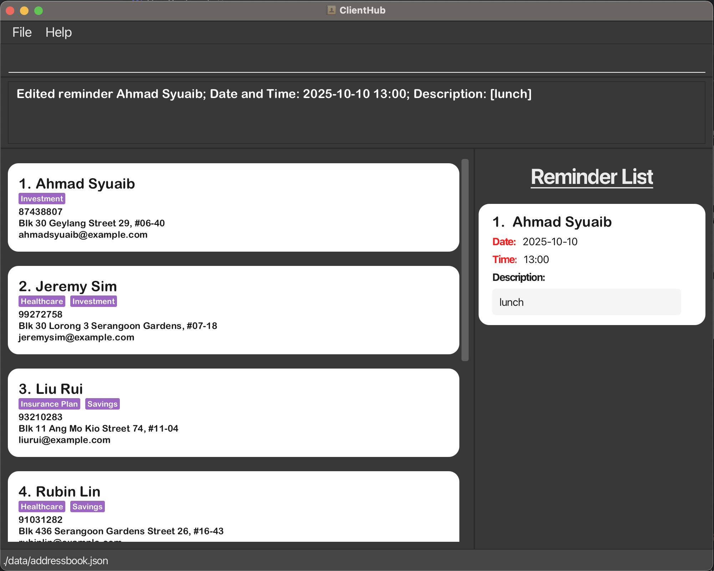
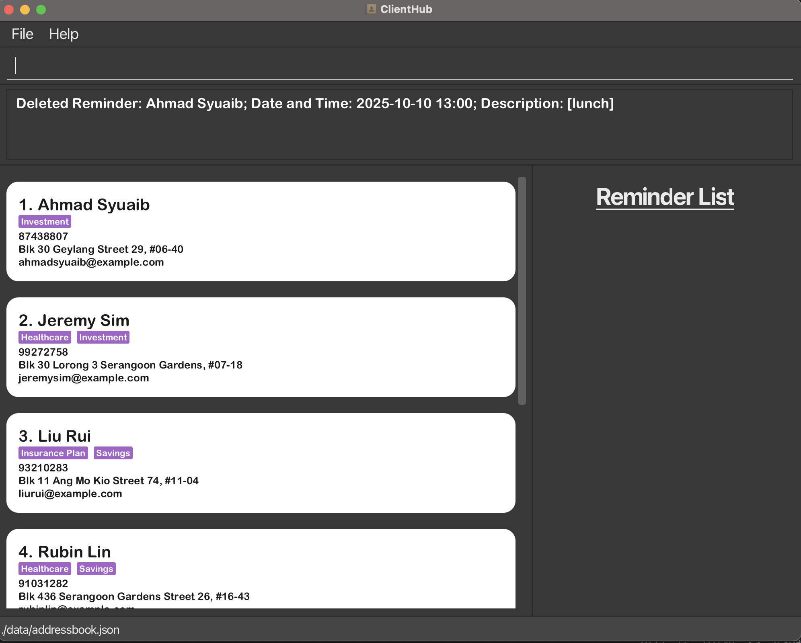

ClientHub is a **desktop app for managing contacts, optimized for use via a Command Line Interface** (CLI) while still having the benefits of a Graphical User Interface (GUI). If you can type fast, ClientHub can get your contact management tasks done faster than traditional GUI apps.

* Table of Contents
{:toc}

--------------------------------------------------------------------------------------------------------------------

## Quick start

1. Ensure you have Java `17` or above installed in your Computer.

1. Download the latest `.jar` file from [here](https://github.com/AY2425S1-CS2103T-F10-1/tp/releases).

1. Copy the file to the folder you want to use as the _home folder_ for your ClientHub.

Example:

**For Mac**
1. If you have downloaded the jar file into a folder in your `Downloads`
2. Open Terminal
3. Type `cd Downloads/[FolderName]` and press Enter
4. Type `java -jar clienthub.jar` and press Enter

**For Windows**
1. If you have downloaded the jar file into a folder in your `Downloads`
2. Open PowerShell
3. Type `cd Downloads/[FolderName]` and press Enter
4. Type `java -jar clienthub.jar` and press Enter

   A GUI similar to the below should appear in a few seconds. Note how the app contains some sample data. 
   

1. Type the command in the command box and press Enter to execute it. e.g. typing **`help`** and pressing Enter will open the help window. 
   Some example commands you can try:

   * `list` : Lists all contacts.

   * `add n/John Doe p/98765432 e/johnd@example.com a/John street, block 123, #01-01 d/likes ramen` : Adds a contact named `John Doe` to the Client Hub.

   * `delete John Doe` : Deletes John Doe from the Client Hub.

   * `clear` : Deletes all contacts.

   * `exit` : Exits the app.

1. Refer to the [Features](#features) below for details of each command.

--------------------------------------------------------------------------------------------------------------------

## Features

**:information_source: Notes about the command format:** 

* Words in `UPPER_CASE` are the parameters to be supplied by the user. 
  e.g. in `add n/NAME`, `NAME` is a parameter which can be used as `add n/John Doe`.

* Items in square brackets are optional. 
  e.g `n/NAME [c/CLIENT_TYPE]` can be used as `n/John Doe c/Plan A` or as `n/John Doe`.

* Items with `…`​ after them can be used multiple times including zero times. 
  e.g. `[c/CLIENT_TYPE]…​` can be used as ` ` (i.e. 0 times), `c/Plan A`, `c/Plan A c/Plan B` etc.

* Parameters can be in any order. 
  e.g. if the command specifies `n/NAME p/PHONE_NUMBER`, `p/PHONE_NUMBER n/NAME` is also acceptable.

* Adding `$` after the input name is used to indicate **specific** name. 
  e.g. `delete John Doe$` will delete the contact with the name `John Doe`.

* Extraneous parameters for commands that do not take in parameters (such as `help`, `list`, `exit` and `clear`) will be ignored. 
  e.g. if the command specifies `help 123`, it will be interpreted as `help`.

* If you are using a PDF version of this document, be careful when copying and pasting commands that span multiple lines as space characters surrounding line-breaks may be omitted when copied over to the application.

### Viewing help : `help`

Shows a message explaining how to access the help page.

Format: `help`

### Adding a client: `add`

Adds a client to Client Hub.

Format: `add n/NAME p/PHONE_NUMBER e/EMAIL a/ADDRESS d/DESCRIPTION c/CLIENT_TYPE…​`

A **valid** `NAME` should:
* Not be empty.
    * For eg. Just typing `n/` without providing any `NAME` will throw an error.
* Can only have one name.
    * For eg. Typing `n/John Doe n/John Eng` will throw an error.
* have **only letters** for the *first* character
* have **only letters** or **parenthesis** for the *last* character
* have **letters** or **parenthesis** or **slash** for the *middle* characters
  * eg. `John Doe`, `John (NUS)`, `John S/O Bob` is **valid** 
  * eg. `John 123`, `!John Doe` is **invalid**

A **valid** `PHONE_NUMBER` should:
* Only numbers are allowed.
    * For eg. Typing `find p/abc` will throw an error.
* Not be empty.
    * For eg. Just typing `p/` without providing any `PHONE_NUMBER` will throw an error.
* Only 8 digit phone numbers are allowed
    * For eg. Typing `p/123456789` will throw an error.
* Can only have one phone number.
    * For eg. Typing `p/12345678 p/12345678` will throw an error.

A **valid** `EMAIL` should:
* Not be empty.
    * For eg. Just typing `e/` without providing any `EMAIL` will throw an error.
* Can only have one email.
    * For eg. Typing `e/abc@mail.com e/example@mail.com` will throw an error.
* A valid email should be of the format local-part@domain and adhere to the following constraints:
* The local-part should only contain alphanumeric characters and these special characters, excluding the parentheses, (+_.-). The local-part may not start or end with any special characters.
* This is followed by a '@' and then a domain name. The domain name is made up of domain labels separated by periods.
       The domain name must:
  - end with a domain label at least 2 characters long
  - have each domain label start and end with alphanumeric characters
  - have each domain label consist of alphanumeric characters, separated only by hyphens, if any.

A **valid** `ADDRESS` should:
* Not be empty.
    * For eg. Just typing `a/` without providing any `ADDRESS` will throw an error.
* Can only have one address.
    * For eg. Typing `a/John street, block 123, #01-01 a/John street, block 123, #01-02` will throw an error.
* A valid address can only take in letters, numbers or the following characters: ,#-():; and it should not be blank.

A **valid** `DESCRIPTION` should:
* Not be empty.
  * For eg. Just typing `d/` without providing any `DESCRIPTION` will throw an error.
  * Be limited to 500 characters
  * For eg. Typing `d/Imagine this is a very long description that is more than 500 characters long` will throw an error.
* Can only have one description.
  * For eg. Typing `d/likes bubble tea d/likes bubble tea` will throw an error.

A **valid** `CLIENT_TYPE` should:
* Only be alphanumeric. Special Characters are not valid. (eg. Investment #1 is invalid)
    * `CLIENT_TYPE` will always be in alphanumeric format.
* Not be empty.
    * For eg. Just typing `c/` without providing any `CLIENT_TYPE` will throw an error.
* Client types names can have at most 30 characters (space inclusive).
    * For eg. Typing `c/InvestmentPlanHealthcarePlanInsurancePlan` will throw an error.
* Can have multiple client types.
    * For eg. Typing `c/Plan A c/Plan B` is valid.
* Not have duplicates.
    * For eg. Typing `c/Plan A c/Plan A` will combine the client types into `Plan A`.

Examples:
* `add n/John Doe p/98765432 e/johnd@example.com a/John street, block 123, #01-01  d/likes bubble tea c/Investment`
* `add n/Betsy Crowe p/1234567 e/betsycrowe@example.com a/Yishun Town d/Loves travelling c/Investment c/Healthcare `

Result for `add n/John Doe p/98765432 e/johnd@example.com a/John street, block 123, #01-01 d/likes bubble tea c/Investment`:

### Editing a client: `edit`

Edits an existing client in  Client Hub.

Format: `edit INDEX [n/NAME] [p/PHONE_NUMBER] [e/EMAIL] [a/ADDRESS] [d/DESCRIPTION] [c/CLIENT_TYPE]…​`

* Edits the client at the specified `INDEX`. The index refers to the index number shown in the displayed client list. The index **must be a positive integer** 1, 2, 3, …​
* The fields constraints are the same as the `add` command.
* At least one of the optional fields must be provided.
  * At most 1 of each field can be edited at a time.(excluding CLIENT_TYPE)
* Existing values will be updated to the input values.
* When editing `CLIENT_TYPE`, the existing `CLIENT_TYPE` of the person will be removed i.e adding of `CLIENT_TYPE` is not cumulative.
* When editing `NAME`, the client with the associated `NAME` should have **no** reminders.

Examples:
*  `edit 1 p/91234567 e/johndoe@example.com` Edits the phone number and email address of the 1st person to be `91234567` and `johndoe@example.com` respectively.
*  `edit 2 n/Betsy Crower c/investment c/healthcare` Edits the name of the 2nd person to be `Betsy Crower` and add 2 client types of `investment` and `healthcare`.

result for `edit 1 p/91234567`:

### Deleting a client: `delete`

Deletes the specified person from ClientHub.

Format: `delete NAME` or `d NAME` or `delete NAME$`

* Deletes the client with specified `NAME`
* `$` is used to indicate specific name to delete
    * For eg. if 2 contacts have names such as "David Li" and "David Lim", typing `delete David Li$` will delete the contact with the name "David Li".
    * However, deleting David Lim does not require `$` as it is already the **MOST** specific name.
    * Name written before `$` must be **EXACT** name of the contact to be deleted.
    * Order matters when using `$` to delete a contact.

A **valid** `NAME` for delete should:
* Not be empty.
* For eg. Just typing `delete` without providing any `NAME` will throw an error.
* Be a valid name that exists in the list of contacts.
* For eg. Typing `delete John Doe` when there is no contact with the name `John Doe` will throw an error.

Examples:
* `delete John Doe` deletes the person named `John Doe`
* `delete John Doe$` deletes the person named `John Doe` and not `John Doey`

Result for `delete John Doe`:

### Locating clients by key information: `find`

Finds clients by `NAME`, `PHONE_NUMBER`, `ADDRESS` or `CLIENT_TYPE`. 

#### Locating by `NAME`
Format: `find n/NAME` or `fn NAME` or `find NAME$`
  * Only the name is searched.
  * The search is case-insensitive. e.g `hans` will match `Hans`
  * The order of the keywords does not matter. e.g. `Hans Bo` will match `Bo Hans`
  * Prefix of words will be matched e.g. `Ha B` will match `Hans Bo`
  * `$` is used to indicate exact name to find
  * Clients matching all keyword prefix will be returned (i.e. `AND` search).
    e.g. `Hans Bo` will return `Hans Bo` but not `Hans Gruber`, `Bo Yang`

A **valid** `NAME` should:
* Not be empty.
    * For eg. Just typing `find n/` without providing any `KEYWORD` will throw an error.
* Be a valid name that exists in the list of contacts.
    * For eg. Typing `find n/John Doe` when there is no contact with the name `John Doe` will throw an error.

Examples:
* `find n/John` returns `john` and `John Doe`
* `find n/alex yeo` returns `Alex Yeoh`
* `fn John` returns `John`, `John Doe`, `Doe John`, `Doe John Eng`
* `fn Ale Yeo` returns `Alex Yeoh`
* `fn Yeoh Alex` returns `Alex Yeoh`
* `fn aLex yEOh` returns `Alex Yeoh`

Result for `find n/roy`:

#### Locating by `PHONE_NUMBER`
Format: `find p/PHONE_NUMBER` or `fp PHONE_NUMBER`
  *  Only numbers that begin with keyword will be matched e.g. `8765432` will not match `98765432`

A **valid** `PHONE_NUMBER` should:
* Only numbers are allowed.
    * For eg. Typing `find p/abc` will throw an error.
* Not be empty.
    * For eg. Just typing `find p/` without providing any `KEYWORD` will throw an error.

Examples:
* `find p/9103` returns `91031282`
* `fp 8433` returns `8433 4567`

Result for `find p/9103`:

#### Locating by `ADDRESS`
Format: `find a/ADDRESS` or `fa ADDRESS`
  * The search is case-insensitive. e.g `tampines` will match `Tampines`
  * Only the address of the contact is searched.
  * Clients with address with any matching substring to the keyword will be returned.

A **valid** `ADDRESS` should:
* Not be empty.
    * For eg. Just typing `find a/` without providing any `ADDRESS` will throw an error.

Examples:
* `find a/Blk 47` returns `Blk 47 Tampines Street 20`
* `fa Blk 47` returns `Blk 47 Tampines Street 20`

Result for `find a/tampines`:

#### Locating by `CLIENT_TYPE` 
Format: `find c/CLIENT_TYPE…​` or `fc CLIENT_TYPE…​`
* The search is case-insensitive. e.g `investment` will match `Investment`
* Only the `CLIENT_TYPE` of the person is searched.
* Clients whose `CLIENT_TYPE` contains a substring that matches the provided `CLIENT_TYPE` will be returned.
* Client with `CLIENT_TYPE` that has a prefix matching the input `CLIENT_TYPE` will be returned (i.e. `AND` search).
* Duplicate `CLIENT_TYPE` will be combined into 1 (No way to have duplicate client types showing)

A **valid** `CLIENT_TYPE` should:
* Only be alphanumeric. Special Characters are not valid. (eg. Investment #1 is invalid)
    * `client_type` will always be in alphanumeric format.
* Not be empty.
    * For eg. Just typing `find c/` without providing any `CLIENT_TYPE` will throw an error.
* Not have duplicates.
    * For eg. Typing `c/Plan A c/Plan A` will combine the client types into `Plan A`.

Examples:
* `find c/Investment` returns every contact that has a `client_type` beginning with `Investment`
* `find c/Invest` returns every contact that has `client_type` beginning with `Invest`
* `fc Investment` returns `Investment Plan`
* `fc Investment Healthcare` returns `Investment Plan` and `Healthcare Plan`

Result for `find c/Investment`:

### Reminder Features
ClientHub has a basic reminder list that keeps track of a users commitments to
specific clients. The reminder list is a list of reminders that can be added,
deleted, and edited.

#### Adding Reminder: `radd` 

Adds a reminder to the reminder list.

Format:
`radd n/NAME dt/DATETIME r/REMINDER_DESCRIPTION` or
`ra n/NAME dt/DATETIME r/REMINDER_DESCRIPTION`

A **valid** `NAME` for add should:
* Not be empty.
* Be a valid name that exists in the list of clients.
* For eg. Typing `radd John Doe` when there is no client with the name `John Doe` will throw an error.
* Be a prefix match of the client name.
  * `n/John Doe` will **add a reminder** for `John Doe` if there is `John Doe` and `John Doey` in the contact list.
  * `n/John Doe` will **throw an error** if there is `John Doe` and `John Doey` in the contact list.
  * to add a reminder for `John Doe`, type `radd John Doe$`

A **valid** `DATETIME` for add should:
* Not be empty.
* Be a valid date and time in the format `yyyy-MM-dd HH:mm`.
  * Time should be in 24-hour format.
* For eg. Typing `radd n/John Doe dt/2022-10-10 12:00 d/lunch` will add a reminder for `John Doe` for `lunch` at `2022-10-10 12:00`.

A **valid** `REMINDER_DESCRIPTION` for add should:
* Not be empty.
* Be limited to 300 characters
* For eg. Typing `radd n/John Doe dt/2022-10-10 12:00 d/` will throw an error.
* For eg. Typing `radd n/John Doe dt/2022-10-10 12:00 d/Meeting with John at 12pm` will add a reminder for `John Doe` for `Meeting with John at 12pm` at `2022-10-10 12:00`.

Result for `radd n/John Doe dt/2022-10-10 12:00 d/lunch`:

#### Editing a Reminder: `redit`

Edits an existing reminder in the reminder list.

Format:
`redit INDEX [dt/DATETIME] [d/REMINDER_DESCRIPTION]` or
`re INDEX [dt/DATETIME] [d/REMINDER_DESCRIPTION]`

* Edits the reminder at the specified `INDEX`. The index refers to the index number shown in the displayed reminder list. The index **must be a positive integer** 1, 2, 3, …​
* Have least one of the optional fields must be provided.
  * At most 1 of each field can be edited at a time.
* Existing values will be updated to the input values.

A **valid** `INDEX` for edit should:
* Not be empty.
* For eg. Just typing `edit` without providing any `INDEX` will throw an error.
* Be a valid index that exists in the list of contacts.
* For eg. Typing `redit 1` when there is no contact at index 1 will throw an error

A **valid** `DATETIME` for edit should:
* Be a valid date and time in the format `yyyy-MM-dd HH:mm`.
  * Time should be in 24-hour format.
* For eg. Typing `redit 1 dt/2022-10-10 12:00` will edit the `DATETIME` of the reminder at index `1` to `2022-10-10 12:00`.

A **valid** `REMINDER_DESCRIPTION` for edit should:
* Be limited to 300 characters
* For eg. Typing `redit 1 d/Meeting with John at 12pm` will edit the `REMINDER_DESCRIPTION` of the reminder at index `1` to `Meeting with John at 12pm`.

Examples:
* `redit 1 dt/2022-10-10 12:00 d/Meeting for lunch` Edits the date and time and description of the 1st reminder to be `2022-10-10 12:00` and `Meeting for lunch` respectively.
* `re 2 dt/2022-10-10 12:00` Edits the date and time of the 2nd reminder to be `2022-10-10 12:00`

Result for `redit 1 dt/2022-10-10 12:00 d/Meeting for lunch`:

#### Deleting a Reminder: `rdelete`

Deletes a reminder from the reminder list.

Format:
`rdelete INDEX` or
`rd INDEX`

* Deletes the person with specified INDEX. The index refers to the index number shown in the displayed reminder list. The index **must be a positive integer** 1, 2, 3, …​

A **valid** `INDEX` for delete should:
* Not be empty.
* For eg. Just typing `delete` without providing any `INDEX` will throw an error.
* Be a valid index that exists in the list of contacts.
* For eg. Typing `rdelete 1` when there is no contact at index 1 will throw an error

Examples:
* `rdelete 1` deletes the person at index 1 of the list
* `rd 2` will delete the person at index 2 of the list

Result for `rdelete 1`:

### Viewing a client: `view`

Creates a popup view of the specified client from ClientHub.

Format: `view NAME` or `v NAME` or `view NAME$`
* The command is case-insensitive. eg. `alice` will match `Alice`
* The command does a `find` and displays the popup view only if the no. of clients found is exactly 1.
* If duplicates are found, `view` will throw an error telling user to specify the name further.
    * For eg. if 2 contacts have names such as "David Li" and "David Lim", typing `view David` will throw an error.
* `$` is used to indicate **specific** name to view
    * If there are two contacts named `David Li` and `David Lim`, typing `view David Li$` will show the contact with the name `David Li`.
    * For contacts with names that are already unique, like `David Lim`, the `$` is not required.
    * The `NAME` before the `$` must match the contact's name **exactly**.
    * The order of the `NAME` and `$` matters - `David Li$` is different from `Li$David`.

A **valid** `NAME` for view should:
* Not be empty.
    * For eg. Just typing `view` without providing any `NAME` will throw an error.
* Be a valid name that exists in the list of contacts.
    * For eg. Typing `view John Doe` when there is no contact with the name `John Doe` will throw an error.
* Be a prefix match of the contact name.
    * Typing `view John` will **throw an error** if there is `John Doe` and `John Doey` in the contact list.
    * Typing `view John` if there is only `John Doe` in the contact list will **create a popup view** of `John Doe`.

Examples:
* `view John Doe` shows the contact named `John Doe`
* `view John` will throw an error if there is `John Doe` and `John Doey` in the list of contacts.

Result for `view jeremy`:

### Sort by name : `sort`
Sort the current list of clients on Client Hub according to their `NAME`.

Format: `sort`

* The list of clients is sorted alphabetically by their full names in ascending order, where no duplicate names are allowed.

Examples:
* `sort` sorts the list

### Listing all persons : `list`
Shows a list of all persons in the Client Hub.

Format: `list`

### Clearing all entries : `clear`
Clears all entries from ClientHub.

Format: `clear`

### Exiting the program : `exit`
Exits the program.

Format: `exit`

## Additional Features
### Command History Navigation
The command history feature allows users to easily navigate through previously entered commands using the **Up** and **Down** arrow keys. This is helpful for quickly accessing past commands without needing to retype them.

* **Up** Arrow: Moves to the previous command in the history.
* **Down** Arrow: Moves to the next command in the history.

This feature enables efficient command recall, streamlining the process of repeating or editing previous inputs.

### Saving the data

ClientHub data is saved in the hard disk automatically after any command that changes
the data. There is no need to save manually.

### Editing the data file

ClientHub data is saved automatically as a JSON file `[JAR file location]/data/clienthub.json`. Advanced users are welcome to update data directly by editing that data file.

:exclamation: **Caution:**
If your changes to the data file makes its format invalid, ClientHub will discard all data and start with an empty data file at the next run. Hence, it is recommended to take a backup of the file before editing it. 
Furthermore, certain edits can cause the ClientHub to behave in unexpected ways (e.g., if a value entered is outside of the acceptable range). Therefore, edit the data file only if you are confident that you can update it correctly.

### Archiving data files `[coming in v2.0]`

_Details coming soon ..._

--------------------------------------------------------------------------------------------------------------------

## FAQ

**Q**: How do I transfer my data to another Computer? 
**A**: Install the app in the other computer and overwrite the empty data file it creates with the file that contains the data of your previous ClientHub home folder.

--------------------------------------------------------------------------------------------------------------------

## Known issues

1. **When using multiple screens**, if you move the application to a secondary screen, and later switch to using only the primary screen, the GUI will open off-screen. The remedy is to delete the `preferences.json` file created by the application before running the application again.
2. **If you minimize the Help Window** and then run the `help` command (or use the `Help` menu, or the keyboard shortcut `F1`) again, the original Help Window will remain minimized, and no new Help Window will appear. The remedy is to manually restore the minimized Help Window.

--------------------------------------------------------------------------------------------------------------------

## Command summary

| Action                | Format, Examples                                                                                                                                                                                          |
|-----------------------|-----------------------------------------------------------------------------------------------------------------------------------------------------------------------------------------------------------|
| Help                  | `help`                                                                                                                                                                                                    |
| **Add**               | `add n/NAME p/PHONE_NUMBER e/EMAIL a/ADDRESS c/CLIENT_TYPE d/DESCRIPTION…​ `   e.g `add n/James Ho p/22224444 e/jamesho@example.com a/123, Clementi Rd, 1234665 c/Plan A c/Plan A d/crimefighter`   |    
| **Delete**            | `delete NAME`  e.g `delete JAMES`                                                                                                                                                                      |
| **Edit**              | `edit INDEX [n/NAME] [p/PHONE_NUMBER] [e/EMAIL] [a/ADDRESS] [c/CLIENT_TYPE] [d/DESCRIPTION]`  e.g `edit 2 n/James Lee e/jameslee@example.com`                                                          |
| **Find Name**         | `find n/NAME` or `fn NAME`   e.g `find n/John` or `fn John`                                                                                                                                            |
| **Find Phone Number** | `find p/PHONE_NUMBER` or `fp PHONE_NUMBER`   e.g `find p/98765432` or `fp 987654432`                                                                                                                   |
| **Find Address**      | `find a/ADDRESS` or `fa ADDRESS`   e.g `find a/Blk 30` or `fa Blk 30`                                                                                                                                  |
| **Find Client Type**  | `find c/CLIENT_TYPE` or `fc CLIENT_TYPE`  e.g `find c/Investment` or `fc Investment`                                                                                                                  |
| **Add Reminder**      | `radd n/NAME dt/DATETIME d/DESCRIPTION` or `ra /NAME dt/DATETIME d/DESCRIPTION`   e.g `radd n/John dt/2024-01-01 12:00 d/Appointment` or `ra n/John dt/2024-01-01 12:00 d/Appointment`                 |
| **Delete Reminder**   | `delete INDEX` or `rd INDEX`   e.g `delete 1` or `rd INDEX`                                                                                                                                            |
| **Edit Reminder**     | `redit INDEX [dt/DATETIME] [d/DESCRIPTION]` or `re INDEX [dt/DATETIME] [d/DESCRIPTION]`   e.g `redit 1 [dt/2024-02-02 13:00] [d/Review]` or `re 1 [dt/2024-02-02 13:00] [d/Review]`                    |                                                                                                                                                    
| **View**              | `view NAME`  e.g., `view James`                                                                                                                                                                        |
| **Sort**              | `sort`                                                                                                                                                                                                    |
| **List**              | `list`                                                                                                                                                                                                    |
| **CLear**             | `clear`                                                                                                                                                                                                   |
| **Exit**              | `exit`                                                                                                                                                                                                    |
