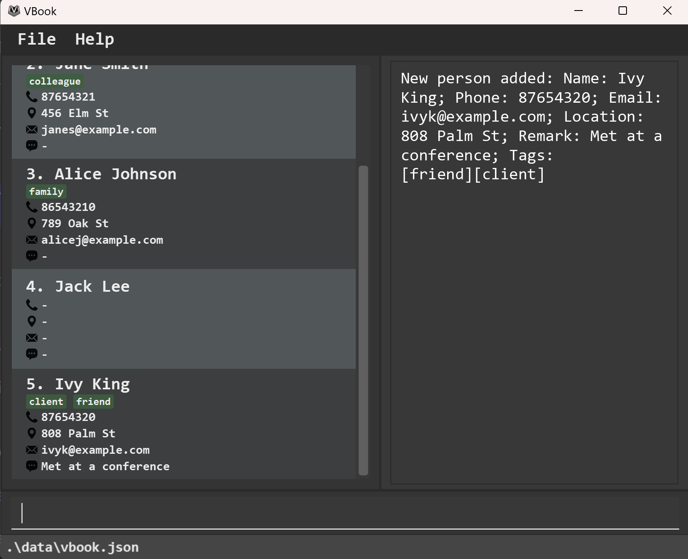

# VBook User Guide

VBook is a **desktop application for freelance software developers to store and organise client contact details and log client preferences.** VBook is optimized for use via a Command Line Interface (CLI) while still having the benefits of a Graphical User Interface (GUI).

Software developers who type fast can get their contact management tasks done at lightning speed with VBook's keyboard-only navigation feature. With advanced privacy features like password protection and encryption, VBook ensures that software developers’ client details remain secure and confidential at all times.

<!-- * Table of Contents -->
<page-nav-print />


--------------------------------------------------------------------------------------------------------------------

## Quick Start

<box type="info" seamless>

**Note:** This document assumes familiarity with the command line, though it is not required.

</box>

1. Ensure you have Java `17` or above installed in your computer. For Mac users, you should use the specific `Azul JDK 17` distribution following this [guide](https://se-education.org/guides/tutorials/javaInstallationMac.html).

2. Download the latest `{{ jarFile }}` file from [here](https://github.com/AY2425S1-CS2103T-F12-4/tp/releases/tag/v1.5).

3. Copy the file to the folder you want to use as the _home folder_ for VBook.

4. Open a command terminal, change directory (`cd`) into the folder you put the `{{ jarFile }}` file in, and use the `java -jar {{ jarFile }}` command to run the application.<br>

```shell
cd path/to/vbook
java -jar {{ jarFile}}
```

5. An initial dialog will appear to prompt you to set a new password.

{width=60%}


-  On subsequent logins, the password dialog will prompt you to enter the password that you set.

{width=60%}


6. A GUI similar to the screenshot below should appear upon successful login. The application contains some sample data for you to get familiar with the application.<br>


1) Contacts are shown in the Display List.
2) Commands are typed in the Command Box.
3) Results will be displayed in the Result Display.

7. Type any command in the Command Box and press <kbd>ENTER</kbd> to execute it. For example, typing **`:help`** and pressing <kbd>ENTER</kbd> will open the help window.

For a summary of all our commands, refer to this table below:

    {{ commandSummary }}

<box type="info" seamless>

**Notes about the command format:**<br>

* Words in `UPPERCASE` are the parameters to be supplied by the user.<br>
  e.g. in `:add -n NAME`, `NAME` is a parameter which can be used as `:add -n John Doe`.

* Items in square brackets are optional.<br>
  e.g. `-n NAME [-t TAG]` can be used as `-n John Doe -t friend` or as `-n John Doe`.

* Items with `…`​ after them can be used any number of times.<br>
  e.g. `[-t TAG]…​` can be used as ` ` (i.e. 0 times), `-t friend` (i.e. 1 time), `-t friend -t family` (i.e. 2 times) etc.

* Parameters can be in any order.<br>
  e.g. if the command specifies `-n NAME -p PHONE_NUMBER`, `-p PHONE_NUMBER -n NAME` is also acceptable.

* Extraneous parameters for commands that do not take in parameters (such as `:help`, `:list`, `:quit` and `:clear`) will be ignored.<br>
  e.g. if the command specifies `:help 123`, it will be interpreted as `:help`.

* If you are using a PDF version of this document, be careful when copying and pasting commands that span multiple lines
  as space characters surrounding line-breaks may be omitted when copied over to the application.

</box>

Refer to the [Features](#features) below for details of each command.

--------------------------------------------------------------------------------------------------------------------

## Features

### Commands

#### View Help

> Shows a command cheatsheet, as well as a link to access this user guide.


**Format** `:help`\
**Shortcut:** `:h`

#### Add Person

> Adds a person to the address book.


**Format:** `:add -n NAME [-p PHONE_NUMBER] [-e EMAIL] [-l LOCATION] [-t TAG]… [-r REMARK]`\
**Shortcut:** `:a`

<box type="tip" seamless>

**Tip:** A person can have any number of tags (including 0).

</box>

**Examples:**

{width=60%}

From an initial state of the address book as shown above, typing in the commands below will result in an output as shown below.

1. To add a client you met at a wedding named "Jack Lee", key in
   `:add -n Jack Lee`.

{width=60%}


2. To add a friend and client you met at a conference named "Ivy King", with a phone number of "87654320", an email of "ivyk@example.com", with location of "808 Palm St", key in
   `:a -n Ivy King -p 87654320 -e ivyk@example.com -l 808 Palm St -t friend -t client -r Met at a conference`.

{width=60%}

#### List All

> Shows a list of all persons in the address book.

**Format:** `:list`\
**Shortcut:** `:ls`

#### Edit Person

> Edits an existing person in the address book.

**Format:** `:edit INDEX [-n NAME] [-p PHONE] [-e EMAIL] [-l LOCATION] [-t TAG]…​`\
**Shortcut:** `:ed​`

* Edits the person at the specified index. The index refers to the index number shown in the displayed person list.
  The index **must be a positive integer** 1, 2, 3, …​
* At least one of the optional fields must be provided.
* Existing values will be updated to the input values.
* When editing tags, the existing tags of the person will be removed i.e. adding of tags is not cumulative.
* You can remove all the person’s tags by typing `-t ` without
  specifying any tags after it.

**Examples:**

{width=60%}

From an initial state of the address book as shown above, typing in the commands below will result in an output as shown below.

1. To edit the first person's phone number and email address to be "91234567" and "johndoe@example.com" respectively, key in: `:edit 1 -p 91234567 -e johndoe@example.com`.

{width=60%}

2. To edit the second person's name to "Betsy Crower" and clear all existing tags, key in: `:edit 2 -n Betsy Crower -t `.

{width=60%}

#### Find Person

> Finds persons whose names contain any of the given keywords.

**Format:** `:find [-n NAME] [-p PHONE] [-e EMAIL] [-a ADDRESS] [-t TAG]…​`\
**Shortcut:** `:f`

* The search is case-insensitive. \
  E.g. "hans" will match "Hans".
* Persons with a certain name, phone number, email, address and remark can be searched through flags.\
  E.g. to find a person with the name "david" and remark "busy", the arguments would be `-n david -r busy`.
* Each flag is optional, but there must be at least one flag in a query.
* As long as the contact contains the query, it is considered a match, e.g. searching "Han" will bring up "Hans".
* Only persons matching all keywords will be returned.\
  E.g. `:find -n Hans -p 98765432` will not return "Hans" if his phone number is not "98765432".

**Examples:**

{width=60%}

From an initial state of the address book as shown above, typing in the commands below will result in an output as shown below.

1. To find a person named "Alice" with location "789 Oak St", key in `:find -n alice -l oak`.

{width=60%}

#### Remove Person

> Removes the specified person(s) from the address book.

**Format:** `:remove -i INDEX1, INDEX2, ...`\
**Shortcut:** `:rm`

* Removes the person at the specified index.
* The index refers to the index number shown in the displayed list.
* Multiple persons can be deleted by listing their indexes, separated by commas.
* The index **must be a positive integer** 1, 2, 3, ...

**Examples:**

{width=60%}

From an initial state of the address book as shown above, typing in the commands below will result in an output as shown below.

1.  To remove the 1st and 3rd person in your address book, key in `:list` to list all your contacts, followed by `:remove -i 1, 3`.

{width=60%}

2. To remove a person named "Betsy Crower", key in `:find -n Betsy` followed by `:remove -i 1` to delete the 1st person named "Betsy" in the result of the `:find` command. If you have multiple people named "Betsy", you can delete them using their specified index as well.

{width=60%}

#### Undo

> Reverts the address book to the state before the last change.\
> User can undo up to **10 changes**.\
> Can undo commands that change the address book data, such as `:add`, `:remove`, `:edit`.

**Format:** `:undo`\
**Shortcut:** `:u`\
**Examples:**

1. If you accidentally added a person named "John Doe" to the address book (through an `:add` command), to undo the command and remove "John Doe", key in `:undo`.
2. If you accidentally deleted an important contact named "Betsy" (through a `:remove` command), to undo the command and restore the contact, key in `:undo`.

<box type="tip" seamless>

**Tip:** <kbd>Ctrl-Z</kbd> can also be used to undo the last change outside the command box.

</box>

#### Redo

> Reapplies the last change to the address book that was undone with the `:undo` command.\
> User can redo up to **10 changes** that were undone with the `:undo` command.

**Format:** `:redo`\
**Shortcut:** `:r`\
**Examples:**

1. Given that `:undo` was used to revert the addition of "John Doe", to add "John Doe" back to the address book, key in `:redo`.
2. Given that `:undo` was used to revert the deletion of "Betsy", to delete "Betsy" again, key in `:redo`.

<box type="tip" seamless>

**Tip:** <kbd>Ctrl-Shift-Z</kbd> can also be used to redo the last change outside the command box.

</box>

#### Export Data

> Exports the address book data to a specified file in JSON format. Upon command, user will be prompted to
> select a directory to save the file.

**Format:** `:export`\
**Shortcut**: `:exp`


<box type="important" seamless>

**Important:** If you want to transfer your data to a VBook application in another computer, use `:export` instead of directly copying the data file over. Refer to the [FAQ](#FAQ) for a detailed guide on this.

</box>

#### Clear Data

> Clears all entries from the address book's data.

**Format:** `:clear`\
**Shortcut:** `:cl`

#### Quit Program

> Quits the program.

**Format:** `:quit`\
**Shortcut:** `:q`

---
### Command Shortcuts

| Command       | Shortcut |
|---------------|----------|
| View Help     | `:h`     |
| Add Person    | `:a`     |
| List All      | `:ls`    |
| Edit Person   | `:ed `   |
| Find Person   | `:f`     |
| Remove Person | `:rm `   |
| Undo          | `:u`     |
| Redo          | `:r`     |
| Export Data   | `:exp`   |
| Clear Data    | `:cl`    |
| Quit          | `:q`     |


### Keyboard Shortcuts
There are two modes in VBook: Command Box and UI Navigation. The following keyboard shortcuts are available in each mode.

#### Command Box
* <kbd>Ctrl + Z</kbd> - Undo the last change in the command box.
* <kbd>F1</kbd> - Open the Help Window.
* <kbd>ESC</kbd> - Go back to UI Navigation Mode.

#### UI Navigation
* <kbd>Ctrl + Z</kbd> - Undo the last change made to the address book.
* <kbd>Ctrl + Shift + Z</kbd> - Redo the last undone change made to the address book.
* <kbd>F1</kbd> - Open the Help Window.
* <kbd>Up-arrow</kbd> - Highlight the previous contact in the list.
* <kbd>Down-arrow</kbd> - Highlight the next contact in the list.
* <kbd>:</kbd> - Focus on the Command Box.

---

### Privacy and Security

#### Password Prompt
**Initial Setup:**
When you launch VBook for the first time, you’ll be prompted to create a new password. This password will be used to control access to your address book.

<box type="info">

**Info:**
The password will be hashed with a salt and saved into a `password.txt` file stored in the same directory as {{ jarFile }}.

</box>

**Subsequent Logins:**
Each time you open VBook, you’ll be prompted to enter your password. This ensures that your data remains secure and accessible only to authorized users.

<box type="warning">

**Caution:**
If you forget your password, there is no way to retrieve your data. To re-enter the application, you can delete the `password.txt` file located in the same directory as VBook.jar. 
However, deleting this file will also permanently erase all your address book data. This safeguard is designed to prevent unauthorized users from bypassing the password prompt.

</box>

<box type="tip" seamless>

**Tip:** Store your password in a secure place to avoid losing access to your data.

</box>

#### Encryption
**How it Works:**

- When you enter your password during the initial setup, it generates an encryption key saved as `vbook.jks` stored in the same directory as `{{ jarFile }}`.
- All your address book data is encrypted using this key and saved securely on your device.
- Each time you open the app, the password is used to decrypt the data for access.

<box type="info" seamleass>

**Info:**
Encryption only happens the first time you make changes to the address book from the VBook GUI. Loading a JSON file to your directory will not automatically encrypt the file.

</box>

--------------------------------------------------------------------------------------------------------------------

## File Management

### Save Data

> VBook data are saved in the hard disk automatically after any command that changes the data. There is no need to
> save manually.

### Edit Data File

> The encrypted VBook data are saved automatically as a JSON file `[JAR file location]/data/addressbook.json`.

<box type="warning">

**Caution:**
Do not make changes to the encrypted JSON file, as it can corrupt the data and make it unreadable. If you want to manually edit the data file, follow these instructions:

1. Export your data by running `:export`.
2. Overwrite the empty data file in the new computer's `data/addressbook.json` with the `addressbook.json` file from your export in Step 1.
3. Run VBook and your modified data should appear.

</box>

<box type="tip" seamless>

**Note:**
If your changes to the data file makes its format invalid, VBook will discard all data and start with an empty data file at the next run. Hence, it is recommended to take a backup of the file before editing it.<br>
Furthermore, certain edits can cause the VBook to behave in unexpected ways (e.g. if a value entered is outside the acceptable range). Therefore, edit the data file only if you are confident that you can update it correctly.

</box>

--------------------------------------------------------------------------------------------------------------------

## FAQ

**Q**: How do I transfer my data to another computer?<br>
**A**: To transfer your data over, follow these steps:
1. Export your data from your current computer by running `:export`.
2. Install VBook in the other computer (refer to [Quick Start](#Quick-start) for more information).
3. Overwrite the empty data file in the new computer's `data/addressbook.json` with the `addressbook.json` file from your export in Step 1.
4. Run VBook and your data should appear in your new computer.

<box type="tip" seamless>

**Note:** Your data in your new VBook application will only be encrypted when you make a change to it in the application, through commands (i.e. `:add`, `:edit`).


</box>


--------------------------------------------------------------------------------------------------------------------

## Known issues

1. **When using multiple screens**, if you move the application to a secondary screen, and later switch to using only
   the primary screen, the GUI will open off-screen. The remedy is to delete the `preferences.json` file created by the
   application before running the application again.
2. **If you minimize the Help Window** and then run the `:help` command (or use the `Help` menu, or the keyboard shortcut <kbd>F1</kbd>) again, the original Help Window will remain minimized, and no new Help Window will appear. The remedy is to manually restore the minimized Help Window.

--------------------------------------------------------------------------------------------------------------------
