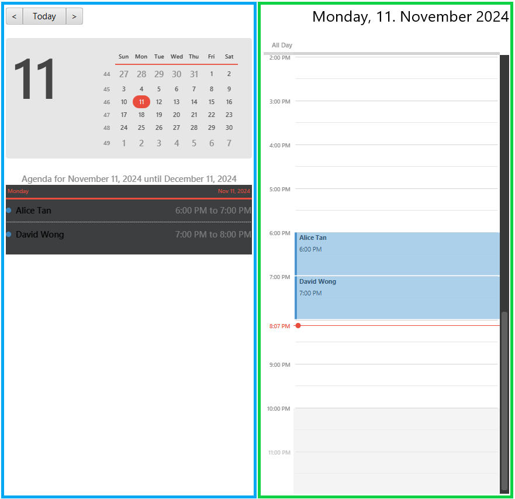

# SocialBook User Guide

AddressBook Level 3 (AB3) is a **desktop app for managing contacts, optimized for use via a  Line Interface** (CLI) while still having the benefits of a Graphical User Interface (GUI). If you can type fast, AB3 can get your contact management tasks done faster than traditional GUI apps.

<!-- * Table of Contents -->
<page-nav-print />

--------------------------------------------------------------------------------------------------------------------

## Quick start

1. Ensure you have Java `17` or above installed in your Computer.

1. Download the latest `.jar` file from [here](https://github.com/se-edu/addressbook-level3/releases).

1. Copy the file to the folder you want to use as the _home folder_ for your AddressBook.

1. Open a command terminal, `cd` into the folder you put the jar file in, and use the `java -jar addressbook.jar` command to run the application. 
   A GUI similar to the below should appear in a few seconds. Note how the app contains some sample data. 
   

1. Type the command in the command box and press Enter to execute it. e.g. typing **`help`** and pressing Enter will open the help window. 
   Some example commands you can try:

   * `list` : Lists all current (i.e. not archived) contacts.

   * `add n/John Doe p/98765432 e/johnd@example.com a/John street, block 123, #01-01` : Adds a contact named `John Doe` to the Address Book.

   * `delete 3` : Deletes the 3rd contact shown in the current list.

   * `clear` : Deletes all contacts.

   * `exit` : Exits the app.

1. Refer to the [Features](#features) below for details of each command.

--------------------------------------------------------------------------------------------------------------------

## Features

<box type="info" seamless>

**Notes about the command format:** 

* Words in `UPPER_CASE` are the parameters to be supplied by the user. 
  e.g. in `add n/NAME`, `NAME` is a parameter which can be used as `add n/John Doe`.

* Items in square brackets are optional. 
  e.g `n/NAME [t/TAG]` can be used as `n/John Doe t/friend` or as `n/John Doe`.

* Items with `…`​ after them can be used multiple times including zero times. 
  e.g. `[t/TAG]…​` can be used as ` ` (i.e. 0 times), `t/friend`, `t/friend t/family` etc.

* Parameters can be in any order. 
  e.g. if the command specifies `n/NAME p/PHONE_NUMBER`, `p/PHONE_NUMBER n/NAME` is also acceptable.

* Extraneous parameters for commands that do not take in parameters (such as `listappt`, `statistics`, `exit` and `clear`) will be ignored. 
  e.g. if the command specifies `statistics 123`, it will be interpreted as `statistics`.

* If you are using a PDF version of this document, be careful when copying and pasting commands that span multiple lines as space characters surrounding line-breaks may be omitted when copied over to the application.
</box>

### Viewing help: `help`

Shows a message explaining how to access the help page or display how to use a specified command.

Format: `help [COMMAND]`

Examples:
* `help` 
* `help add`
* `help edit`

### Adding a person: `add`

Adds a person to the address book.

Format: `add n/NAME p/PHONE_NUMBER e/EMAIL a/ADDRESS [t/TAG]…​`

<box type="tip" seamless>

**Tip:** A person can have any number of tags (including 0)
</box>

Examples:
* `add n/John Doe p/98765432 e/johnd@example.com a/John street, block 123, #01-01`
* `add n/Betsy Crowe t/friend e/betsycrowe@example.com a/Newgate Prison p/1234567 t/criminal`

### Listing all persons: `list`

Shows a list of persons in the address book, sorted according to the latest sorting order specified by the `sort` command. If no sorting order has been specified, the list will be sorted by priority from HIGH to LOW.

Format: `list [archive/] [all/]`

- `list`: Shows a list of people who are current contacts (i.e. not archived)
- `list archive/`: Shows a list of people who are archived
- `list all/`: Shows a list of all people

<box type="warning" seamless>

**Caution:**
- Should not be used with both `archive/` and `all/` concurrently, e.g. `list archive/ all/` ❌, `list archive/` ✅
- `archive/` and `all/` should not have parameter values, e.g. `list archive/bob` ❌, `list archive/` ✅
</box>

### Editing a person: `edit`

Edits an existing person in the address book.

Format: `edit INDEX [n/NAME] [p/PHONE] [e/EMAIL] [a/ADDRESS] [dob/DATE_OF_BIRTH] [pri/PRIORITY] [income/INCOME] [famsize/FAMILY_SIZE] [r/REMARK] [t/TAG]…​`

* Edits the person at the specified `INDEX`. The index refers to the index number shown in the displayed person list. The index **must be a positive integer** 1, 2, 3, …​
* At least one of the optional fields must be provided.
* Existing values will be updated to the input values.
* When editing tags, the existing tags of the person will be removed i.e adding of tags is not cumulative.
* You can remove all the person’s tags by typing `t/` without
    specifying any tags after it.

Examples:
*  `edit 1 p/91234567 e/johndoe@example.com` Edits the phone number and email address of the 1st person to be `91234567` and `johndoe@example.com` respectively.
*  `edit 2 n/Betsy Crower t/` Edits the name of the 2nd person to be `Betsy Crower` and clears all existing tags.

### Finding persons: `find`

Finds persons that match the specified filters.

Format: `find [n/START_OF_NAME]... [a/PART_OF_ADDRESS]... [pri/PRIORITY]... [income/INCOME]...`

* The search is case-insensitive. e.g `n/alice` will match `Alice`.
* At least one filter must be specified (i.e. no empty `find` command).
* For names, only those that start with the given filter will be matched e.g. `find n/A` returns all persons whose first name starts with A only. 
* For addresses, those that contain the part of the address given are returned e.g. `find a/clementi` returns all persons who stay at clementi only.
* For priorities, exact priorities must be specified to filter accurately e.g. `find pri/high` returns all persons with high priority only.
* For income, those with income less than or equal to the specified float value are listed e.g. `find income/2000` returns all persons with income less than or equal to 2000.00 only.
* To specify multiple filters of the same type, use the corresponding prefix for every new filter e.g. `find n/alex n/david n/bobby`
* Per type of prefix, all persons matching any of the filters given will be returned (i.e. `OR`search) but when combined, only those who also pass the filters of other types are are returned (i.e. `AND` search) e.g. `find n/A n/B pri/HIGH` returns all persons whose name starts with either A or B but have high priority. 

Examples:
* `find pri/high` returns `Alice Tan` and `David Wong` (from sample data)
* `find n/a n/b n/c pri/high pri/medium` returns `Alice Tan` and `Benny Lim` 
  

### Sorting persons: `sort`

Sorts persons in the order of the specified parameter.

Format: `sort PARAMETER`

* The only valid parameters are: name, address, priority, income, updated.
* Only one parameter can be specified at any time.
* The parameter is case-insensitive. e.g `sort name` works the same as `sort NAME`.
* Whenever SocialBook is launched, persons are automatically sorted in order of their priority from HIGH to LOW. 
  * Therefore, if the sorting order is changed, SocialBook should be kept open for as long as the new sorting order is required, as closing it and relaunching will mean that the persons are sorted once again in the above stated priority order. 
* For name, the sorting is in alphabetical order.
* For address, the sorting is in lexicographical order (similar to alphabetical order but also takes the special characters and numerical digits into account). 
  * Because numbers are considered "smaller" than letters in this ordering, sorting by address is perhaps best used after filtering the contact list by a region e.g. `find a/clementi` `sort address` will sort the contact list of those staying in Clementi in order of their address. 
* For priority, the sorting is in order from HIGH to LOW.
* For income, the sorting order is in increasing order from the lowest to highest.
* For updated, the sorting order is from the person updated least recently to the one updated most recently.

Examples:
* `sort name`
* `sort updated`

### Deleting people: `delete`

Deletes the specified people from the address book.

Format: `delete INDEXES`

* Deletes the people at the specified `INDEXES`.
* The indexes refer to the index numbers shown in the displayed person list.
* The indexes **must be positive integers** not exceeding 2^31 - 1 e.g. 1, 2, 3, …
* The indexes can be in **any order** so long as all the indexes fall within the size of the current list.
* Duplicated valid index inputs would be treated as unique index inputs.

Examples:
* `list` followed by `delete 2,3` or `delete 3,2` deletes the 2nd and 3rd person in the address book.
* `find Betsy` followed by `delete 1` deletes the 1st person in the results of the `find` command.
* list followed by delete 1,1,2 deletes the 1st and 2nd person from current SocialBook.

### Getting the parameters of these people: `get` 

Gets the specified parameters of each individual person in current person list.

Format: `get PARAMETERS`

* The only valid parameters are: name, phone, email, address.
* Parameters are not case sensitive, which means `get PHONE name` will return phone number and name details too.
* All inputted parameters must be valid for the details to be displayed. 
* The details will be displayed in the order of the inputted parameters.
* Executing the same parameter multiple times in the same command will still only return one set of that detail.

Examples:
* `list` followed by `get phone EMAIL` gets the phone numbers followed by the emails of the people in SocialBook.
* `list` followed by `get pHone phone` gets only one set of the phone numbers of the people in SocialBook.
* `find pri/HIGH` followed by `get nAmE ADDress` gets the names followed by the addresses of the high priority people.

### Clearing all entries: `clear`

Clears all entries from the address book.

Format: `clear`

### Adding an appointment: `addappt`

Adds an appointment with a person to the address book.

Format: `addappt INDEX date/yyyy-MM-dd from/HH:mm to/HH:mm`

* Adds an appointment with a person at the specified `INDEX`.
  * The index refers to the index number shown in the displayed person list.
  * The index should be a **positive integer** not exceeding the last index number in the list.
* `date` specifies the date of the appointment in the `yyyy-MM-dd` format, where:
  * `yyyy` is the four-digit year (e.g., `2024`)
  * `MM` is the two-digit month (e.g., `01`)
  * `dd` is the two-digit day of the month (e.g., `08`)
* `from` and `to` specify the start and end times of the appointment in the `HH:mm` format (24-hour clock).
* The start time should be before the end time, and the appointment should not conflict with any existing appointments.

For more details on the command format, refer to the [notes about the command format](#features).

<box type="info" seamless>
Adding appointments in the past is allowed for record-keeping purposes and to store historical data,
as future appointments will eventually become past appointments.
</box>

<box type="tip" seamless>
To add an appointment that spans multiple days, add separate consecutive appointments for each day
to cover the entire period.
</box>

Examples:

* `addappt 1 date/2024-11-08 from/16:00 to/17:00`
* `addappt 2 date/2024-11-26 from/17:00 to/18:30`

### Listing all appointments: `listappt`

Displays a list of all appointments in the address book.

Format: `listappt`

<box type="info">
Appointments are displayed in order of date and time, with the earliest shown first.
</box>

### Editing an appointment: `editappt`

Edits an existing appointment in the address book.

Format: `editappt INDEX [date/yyyy-MM-dd] [from/HH:mm] [to/HH:mm]`

* Edits the appointment at the specified `INDEX`.
  * The index refers to the index number shown in the displayed appointment list.
  * The index should be a **positive integer** not exceeding the last index number in the list.
* `date` specifies the new date of the appointment in the `yyyy-MM-dd` format, where:
    * `yyyy` is the four-digit year (e.g., `2024`)
    * `MM` is the two-digit month (e.g., `01`)
    * `dd` is the two-digit day of the month (e.g., `08`)
* `from` and `to` specify the new start and end times of the appointment in the `HH:mm` format (24-hour clock).
* The start time should be before the end time, and the updated appointment should not conflict with any existing appointments.
* At least one of the optional fields must be provided.

For more details on the command format, refer to the [notes about the command format](#features).

Examples:

* `editappt 1 date/2024-11-15 from/16:00 to/18:00`: Updates the first appointment to November 15, 2024, from 4:00 to 6:00 PM.
* `editappt 2 from/10:00 to/11:30`: Updates the start and end times of the second appointment to 10:00 AM and 11:30 AM, respectively, on the same date.

### Deleting an appointment: `deleteappt`

Deletes the specified appointment from the address book.

Format: `deleteappt INDEX`

* Deletes the appointment at the specified `INDEX`.
  * The index refers to the index number shown in the displayed appointment list.
  * The index should be a **positive integer** not exceeding the last index number in the list.

Examples:

* `listappt` followed by `deleteappt 2` deletes the second appointment from the address book.

### Undo the previous command: `undo`

Undoes the previous command from SocialBook.

Format: `undo`

* Undo works only on commands that alter the contents of SocialBook e.g. add, edit, delete, clear
* Undo can be called multiple times till there is no more previous command for the current execution.

Examples:
* `delete 1,2` followed by `undo` will add persons at index 1 and 2 back to that index on SocialBook.
* `clear` followed by `undo` will retrieve back the uncleared SocialBook.
* `edit 1 n/John` followed by `undo` will change name back to what it was before.

### Displaying overall statistics: `statistics`

Displays the statistics of current person list.

Statistics include: 
* Number of People
* Number of HIGH Priority People
* Number of MEDIUM Priority People
* Number of LOW Priority People
* Number of People With Monthly Household Income <= 4000
* Number of Appointments Scheduled Within Next 7 Days From Current Date
* Number Of People Eligible For At Least One Scheme

Format: `statistics`

### Displaying eligible schemes: `scheme`

Displays the schemes that specified people from the address book are eligible for.

Format: `scheme INDEXES`

* Displays the schemes that the people at the specified `INDEXES` are eligible for.
* The indexes refer to the index numbers shown in the displayed person list.
* The indexes **must be a positive integer** 1, 2, 3, …​
* Only 1 index can be inputted at a time.

Examples:
* `scheme 1` shows scheme that the 1st person in the address book is eligible for.

### Adding a scheme to a person: `addscheme`

Adds a scheme to the specified person in the address book.

Format: `addscheme PERSON_INDEX i/SCHEME_INDEX`

* Adds the scheme at the specified `SCHEME_INDEX` to the person at the specified `PERSON_INDEX`.
* The person index refers to the index number shown in the displayed person list.
* The scheme index refers to the index number shown in the displayed scheme list with scheme command.
* The indexes **must be a positive integer** 1, 2, 3, …​
* Only 1 scheme index and 1 person index can be inputted at a time.

Examples:
* `addscheme 1 i/1` adds the 1st scheme to the 1st person in the address book.

### Viewing schemes attached to a person: `viewscheme`

Displays the schemes that the specified person in the address book is attached to.

Format: `viewscheme INDEX`
* Displays the schemes that the person at the specified `INDEX` is attached to.
* The index refers to the index number shown in the displayed person list.
* The index **must be a positive integer** 1, 2, 3, …​
* Only 1 index can be inputted at a time.
* The index must be within the size of the current list.

Examples:
* `viewscheme 1` shows the schemes that the 1st person in the address book is attached to.

### Delete a scheme from a person: `deletescheme`

Deletes the specified scheme from the specified person in the address book.

Format: `deletescheme PERSON_INDEX i/SCHEME_INDEXS`

* Deletes the schemes at the specified `SCHEME_INDEXES` from the person at the specified `PERSON_INDEX`.
* The person index refers to the index number shown in the displayed person list.
* The scheme index refers to the index number shown in the displayed scheme list with viewscheme command.
* The indexes **must be a positive integer** 1, 2, 3, …​
* Multiple scheme indexes can be inputted at a time but only 1 person index can be inputted at a time.
* The scheme indexes can be in **any order** so long as all the indexes fall within the size of the current list.
* Duplicated valid scheme index inputs would be treated as unique scheme index inputs.

Examples:
* `deletescheme 1 i/1` deletes the 1st scheme from the 1st person in the address book.
* `deletescheme 1 i/1, 2` deletes the 1st and 2nd scheme from the 1st person in the address book.

### Archiving a person: `archive`

Archives the specified person from the address book.

Format: `archive INDEX`

* Archives the person at the specified `INDEX`.
* The index refer to the index number shown in the displayed person list.
* The index **must be a positive integer** not exceeding the last index number e.g. 1, 2, 3, …
* The specified person must currently not be archived.

Examples:
* `list` followed by `archive 2` archives the 2nd person in the address book.

<box type="info" seamless>

**Info:** It is still possible to make changes to archived people
</box>

### Unarchiving a person: `unarchive`

Unarchives the specified person from the address book.

Format: `unarchive INDEX`

* Unarchives the person at the specified `INDEX`.
* The index refer to the index number shown in the displayed person list.
* The index **must be a positive integer** not exceeding the last index number e.g. 1, 2, 3, …
* The specified person must be currently archived.

Examples:
* `list archive/` followed by `unarchive 1` unarchives the 1st person in the address book.

### Exiting the program: `exit`

Exits the program.

Format: `exit`

### Saving the data

AddressBook data are saved in the hard disk automatically after any command that changes the data. There is no need to save manually.

### Editing the data file

AddressBook data are saved automatically as a JSON file `[JAR file location]/data/addressbook.json`. Advanced users are welcome to update data directly by editing that data file.

<box type="warning" seamless>

**Caution:**
If your changes to the data file makes its format invalid, AddressBook will discard all data and start with an empty data file at the next run.  Hence, it is recommended to take a backup of the file before editing it. 
Furthermore, certain edits can cause the AddressBook to behave in unexpected ways (e.g., if a value entered is outside the acceptable range). Therefore, edit the data file only if you are confident that you can update it correctly.
</box>

--------------------------------------------------------------------------------------------------------------------

## Calendar

The calendar UI allows you to visualize your appointments throughout the day.

The **right side of the calendar** shows a timeline view of today's appointments. Each appointment is represented
by a blue box with the person's name. For appointments lasting 30 minutes or more, the start time is also displayed.
The height of the box represents the duration of the appointment.

The **left side of the calendar** shows a monthly calendar view along with an agenda view that lists appointments 
for the next 30 days, including today (e.g., November 7 to December 7). The agenda view provides detailed information
for each appointment, including the person's name and the start and end times.

You can also navigate the calendar using these keyboard shortcuts:

* `Ctrl + P`: Go to the previous day
* `Ctrl + N`: Go to the next day
* `Ctrl + T`: Go to today

<box type="info">
The current time marker (denoted by the red line on the right side of the calendar) is updated every 10 seconds.
</box>

--------------------------------------------------------------------------------------------------------------------

## FAQ

**Q**: How do I transfer my data to another computer? 
**A**: Install the app in the other computer and overwrite the empty data file it creates with the file that contains the data of your previous AddressBook home folder.

--------------------------------------------------------------------------------------------------------------------

## Known issues

1. **When using multiple screens**, if you move the application to a secondary screen, and later switch to using only the primary screen, the GUI will open off-screen. The remedy is to delete the `preferences.json` file created by the application before running the application again.
2. **If you minimize the Help Window** and then run the `help` command (or use the `Help` menu, or the keyboard shortcut `F1`) again, the original Help Window will remain minimized, and no new Help Window will appear. The remedy is to manually restore the minimized Help Window.

--------------------------------------------------------------------------------------------------------------------

## Command summary

| Command          | Format, Examples                                                                                                                                                                                                |
|------------------|-----------------------------------------------------------------------------------------------------------------------------------------------------------------------------------------------------------------|
| **help**         | `help [COMMAND]`                                                                                                                                                                                                |
| **add**          | `add n/NAME p/PHONE_NUMBER e/EMAIL a/ADDRESS [t/TAG]…​`   e.g., `add n/James Ho p/98765432 e/jamesho@example.com a/123, Clementi Rd, 1234665 t/friend t/colleague`                                           |
| **list**         | `list [archive/] [all/]`   e.g., `list`, `list archive/`, `list all/`                                                                                                                                        |
| **edit**         | `edit INDEX [n/NAME] [p/PHONE_NUMBER] [e/EMAIL] [a/ADDRESS] [dob/DATE_OF_BIRTH] [pri/PRIORITY] [income/INCOME] [famsize/FAMILY_SIZE] [r/REMARK] [t/TAG]…​`  e.g.,`edit 2 n/James Lee e/jameslee@example.com` |
| **find**         | `find [n/START_OF_NAME]... [a/PART_OF_ADDRESS]... [pri/PRIORITY]... [income/INCOME]...`  e.g.,`find n/A n/B a/clementi pri/High`                                                                             |
| **sort**         | `sort [name] [address] [priority] [income] [updated]`  e.g.,`sort name`                                                                                                                                      |
| **delete**       | `delete INDEXES`  Indexes are the index of the person in the person list  e.g., `delete 2,3`                                                                                                              |
| **get**          | `get PARAMETERS`  e.g.,`get email phone`                                                                                                                                                                     |
| **clear**        | `clear`                                                                                                                                                                                                         |
| **addappt**      | `addappt INDEX date/yyyy-MM-dd from/HH:mm to/HH:mm`  e.g., `addappt 1 date/2024-11-08 from/16:00 to/17:00`                                                                                                   |
| **listappt**     | `listappt`                                                                                                                                                                                                      |
| **editappt**     | `editappt INDEX [date/yyyy-MM-dd] [from/HH:mm] [to/HH:mm]`  e.g., `editappt 2 from/10:00 to/11:30`                                                                                                           |
| **deleteappt**   | `deleteappt INDEX`                                                                                                                                                                                              |
| **undo**         | `undo`                                                                                                                                                                                                          |
| **statistics**   | `statistics`   Shows general statistics                                                                                                                                                                      |
| **scheme**       | `scheme INDEX`   e.g., `scheme 1`                                                                                                                                                                            |
| **addscheme**    | `addscheme PERSON_INDEX i/SCHEME_INDEX`   e.g., `addscheme 1 i/1`                                                                                                                                            |
| **viewscheme**   | `viewscheme INDEX`   e.g., `viewscheme 1`                                                                                                                                                                    |
| **deletescheme** | `deletescheme PERSON_INDEX i/SCHEME_INDEX`   e.g., `deletescheme 1 i/1`                                                                                                                                      |
| **archive**      | `archive INDEX`   e.g., `archive 1`                                                                                                                                                                          |
| **unarchive**    | `unarchive INDEX`   e.g., `unarchive 1`                                                                                                                                                                      |
