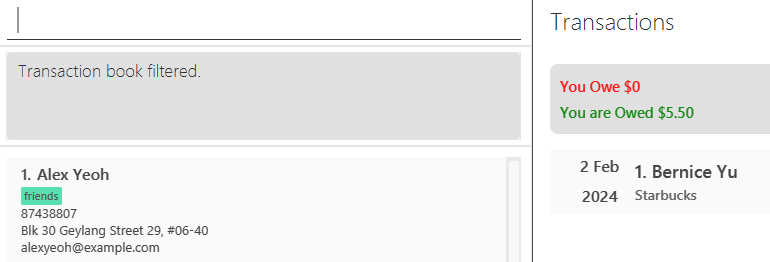

SpleetWaise builds on [AddressBook Level 3 (AB3)](https://se-education.org/addressbook-level3/), **a desktop app for managing contacts, optimized for use via a Command Line Interface** (CLI) while still offering the benefits of a Graphical User Interface (GUI). Designed to streamline expense tracking for students, SpleetWaise makes it easy to record and monitor both personal and shared expenses with contacts saved in the address book. With features to keep track of balances with friends, it eliminates the confusion often associated with managing shared costs, providing a clear, organised view of who has owes what. If you can type fast, SpleetWaise lets you handle your contact and expense management tasks more efficiently than traditional GUI apps, offering students a stress-free way to manage their expenses and shared balances with contacts.

* Table of Contents
{:toc}

--------------------------------------------------------------------------------------------------------------------

## Quick start

1. Ensure you have Java `17` or above installed in your Computer.

2. Download the latest `.jar` file from [here](https://github.com/AY2425S1-CS2103-F13-1/tp/releases).

3. Copy the file to the folder you want to use as the _home folder_ for SpleetWaise.

4. Open a command terminal, `cd` into the folder you put the jar file in, and use the `java -jar spleetwaise-[version].jar`
   command to run the application (*replace `[version]` with the release version you chose, for example, 1.5). 
   A GUI similar to the below should appear in a few seconds. Note how the app contains some sample data. 
   

5. Type the command in the command box and press Enter to execute it. e.g. typing **`help`** and pressing Enter will
   open the help window. 
   Some example commands you can try:

    * `list` : Lists all contacts.

    * `add n/John Doe p/98765432 e/johnd@example.com a/John street, block 123, #01-01` : Adds a contact named `John Doe`
      to the Address Book.

    * `delete 3` : Deletes the 3rd contact shown in the current list.

    * `clear` : Deletes all contacts.

    * `exit` : Exits the app.

6. Refer to the [Features](#features) below for details of each command.

--------------------------------------------------------------------------------------------------------------------

## Features

**:information_source: Notes about the command format:** 

* Words in `UPPER_CASE` are the parameters to be supplied by the user. 
  e.g. in `add n/NAME`, `NAME` is a parameter which can be used as `add n/John Doe`.

* Items in square brackets are optional. 
  e.g `n/NAME [t/TAG]` can be used as `n/John Doe t/friend` or as `n/John Doe`.

* Items with `…`​ after them can be used multiple times including zero times. 
  e.g. `[t/TAG]…​` can be used as ` ` (i.e. 0 times), `t/friend`, `t/friend t/family` etc.

* Parameters can be in any order. 
  e.g. if the command specifies `n/NAME p/PHONE_NUMBER`, `p/PHONE_NUMBER n/NAME` is also acceptable.

* Extraneous parameters for commands that do not take in parameters (such as `help`, `list`, `exit` and `clear`) will be
  ignored. 
  e.g. if the command specifies `help 123`, it will be interpreted as `help`.

* If you are using a PDF version of this document, be careful when copying and pasting commands that span multiple lines
  as space characters surrounding line-breaks may be omitted when copied over to the application.

### Viewing help : `help`

Shows a message explaining how to access the help page.

Format: `help`

### Adding a person: `add`

Adds a person to the address book.

Format: `add n/NAME p/PHONE_NUMBER e/EMAIL a/ADDRESS [t/TAG]…​`

* The `NAME` input allows a wide variety of characters but has some restrictions. Below are examples of valid and invalid inputs.
  * Valid inputs include those that contain **letters, numbers, spaces, and certain special characters** such as apostrophes (`'`), hyphens (`-`), periods (`.`), slashes (`/`), ampersands (`&`), quotation marks (`"`), and parentheses (`()`). 
    - `John Doe` (letters and space)
    - `Betsy O'Connor` (apostrophe)
    - `Jean-Luc` (hyphen)
    - `J.P. Morgan` (period)
    - `John s/o Tan` (slash)
    - `Anne-Marie & Sons` (ampersand and hyphen)
    - `John "Johnny" Doe` (quotation marks)
    - `Richard (Rick) Roe` (parentheses)
  * Invalid inputs include those that contain special characters such as `*`, `@`, `#`, `!`, `^`, `%`, `$`, or any characters from Arabic, or Latin scripts like `Æ` or Chinese characters.
    - `peter*` (contains `*`)
    - `john@doe` (contains `@`)
    - `王小明` (non-Latin characters like Chinese)
    - `X Æ A-12` (non-Latin characters like `Æ` or Arabic `عبد العزيز`)

:bulb: **Tip:**
A person with an Indian name containing "s/o" denoting "son of" can be added as `add n/John s/o Jason p/98765432 e/johnd@example.com a/John street, block 123, #01-01`

:bulb: **Tip:**
A person with an Indian name containing "d/o" denoting "daughter of" can be added as `add n/Genevieve d/o Jason p/98765432 e/johnd@example.com a/John street, block 123, #01-01`

:bulb: **Tip:**
A person can have any number of tags (including 0)

Examples:

* `add n/John Doe p/98765432 e/johnd@example.com a/John street, block 123, #01-01`
* `add n/Betsy Crowe t/friend e/betsycrowe@example.com a/Newgate Prison p/1234567 t/criminal`

### Adding a transaction: `addTxn`

Adds a transaction to the transaction book.

Format: `addTxn INDEX amt/AMOUNT desc/DESCRIPTION [date/DATE] [status/STATUS] [cat/CATEGORY]...`

* The `INDEX` refers to the index of the person currently displayed in the address book panel (as we are adding the transaction related to the person).
* The `AMOUNT` accepts a decimal number with up to 2 decimal places. A `-` symbol should be added before the number to indicate negative amount, indicating the transaction is one that the user owes the chosen person at the index.
* The `DESCRIPTION` accepts a string of words with a limit of 120 characters.
* The `DATE` accepts date formatted in the form `DDMMYYYY` i.e.`10102024`.
* The `STATUS` accepts case-sensitive string that is either 'Done' or 'Not Done'. 
* The `CATEGORY` accepts non-empty strings that are alphanumeric with spaces. Category will be capitalised automatically.

:exclamation: **Important:** Two identical Transactions with duplicated fields cannot be added into the transaction 
book. The duplicated fields refers to `INDEX`, `AMOUNT`, `DESCRIPTION`, and `DATE` fields where combined it should 
form a unique transaction. 
> For consistency and to avoid redundancy, identical transactions with the same details across all fields will not be added to the transaction book. This ensures that each entry remains unique, preventing accidental duplicates and maintaining the clarity of transaction records. If a similar transaction occurs on a different occasion in the same day, we recommend users to tweak the desc field to reflect the specific context. 
>
> For example:  - `addTxn 1 amt/2.50 desc/sean owes me for morning latte` - `addTxn 1 amt/2.50 desc/sean owes me for afternoon latte`

:bulb: **Tip:** The index aligns with the address book including when it is filtered.  
:bulb: **Tip:** If the transaction happened on the current day, the date parameter can be omitted. 
:bulb: **Tip:** A person can have any number of categories (including 0) 
:bulb: **Tip:** Positive Amount Transaction indicates someone owes <ins>_the user_</ins> an amount. 
:bulb: **Tip:** Negative Amount Transaction indicates <ins>_the user_</ins> owes someone an amount. 
:bulb: **Tip:** Categories can be keyed in both lower and upper case without worrying about duplication as it will be capitalised automatically. 
:bulb: **Tip:** By default, a newly created transaction is set as undone - _e.g._ if the transaction is added as `addTxn 1 amt/12.3 desc/John owes me for dinner`, this transaction is not done, John still owes <ins>_the user_</ins>.

Examples:

* `addTxn 1 amt/12.3 desc/John owes me for dinner `
* `addTxn 1 amt/-24.3 desc/I owe John for dinner date/10102024`
* `addTxn 1 amt/-24.3 desc/I owe John for dinner date/10102024 cat/FOOD`

### Listing all persons : `list`

Shows a list of all persons in the address book.

Format: `list`

:bulb: **Tip:** This command can be used to reset the filter applied on the person list caused by a `find` command 
operation.

### Listing all transactions : `listTxn`

Shows a list of all transactions in the transaction book.

Format: `listTxn`

:bulb: **Tip:** This command can be used to reset the filter applied on transaction list caused by a `fitlerTxn` 
command operation.

### Editing a person : `edit`

Edits an existing person in the address book.

Format: `edit INDEX [n/NAME] [p/PHONE] [e/EMAIL] [a/ADDRESS] [r/REMARK] [t/TAG]…​`

* Edits the person at the specified `INDEX`. The index refers to the index number shown in the displayed person list.
  The index **must be a positive integer** 1, 2, 3, …​
* At least one of the optional fields must be provided.
* Existing values will be updated to the input values.
* When editing tags, the existing tags of the person will be removed i.e adding of tags is not cumulative.
* You can remove all the person’s tags by typing `t/` without specifying any tags after it.
* You can remove the person’s remark by typing `r/` without specifying any remark after it.

Examples:

* `edit 1 p/91234567 e/johndoe@example.com` Edits the phone number and email address of the 1st person to be `91234567`
  and `johndoe@example.com` respectively.
* `edit 2 r/` Edits the 2nd person by deleting the remark.
* `edit 2 n/Betsy Crower t/` Edits the name of the 2nd person to be `Betsy Crower` and clears all existing tags.

### Editing a transaction : `editTxn `

Edits an existing transaction in the transaction book.

Format: `editTxn INDEX [p/PHONE_NUMBER] [amt/AMOUNT] [desc/DESCRIPTION] [date/DATE] [cat/CATEGORY]...`

* Edits the transaction at the specified `INDEX`. The index refers to the index number shown in the displayed transaction list.
  The index **must be a positive integer** 1, 2, 3, …
* At least one of the optional fields must be provided.
* Existing values will be updated to the input values.
* When editing categories, the existing categories of the transaction will be removed i.e adding of categories is not
  cumulative.
* You can remove all the person’s categories by typing `cat/` without specifying any categories after it.
* When editing the person related to the transaction through specifying `[p/PHONE_NUMBER]`, the person with the input phone number must be in the address book.

:bulb: **Tip:** Status can be edited via `markDone` or `markUndone` command. Support for editing status through `editTxn` may be considered by the devs in future releases.

Examples:

* `editTxn 1 p/92624417 desc/Hello world` Edits the 1st transaction to be related to the person with phone number `92624417` and edits the description of the 1st transaction to be `Hello world` (ensure that the phone number is valid, i.e. it exists in the address book).
* `editTxn 2 cat/` Edits the 2nd transaction by removing all existing categories.

### Locating persons by name: `find`

Finds persons whose names contain any of the given keywords.

Format: `find KEYWORD [MORE_KEYWORDS]`

* The search is case-insensitive. e.g `hans` will match `Hans`
* The order of the keywords does not matter. e.g. `Hans Bo` will match `Bo Hans`
* Only the name is searched.
* Only full words will be matched e.g. `Han` will not match `Hans`
* Persons matching at least one keyword will be returned (i.e. `OR` search).
  e.g. `Hans Bo` will return `Hans Gruber`, `Bo Yang`

Examples:

* `find John` returns `john` and `John Doe`
* `find alex david` returns `Alex Yeoh`, `David Li` 
  

### Filtering transactions: `filterTxn`

Filter transactions with a any combination of the following parameters:
* the specified person identified by their index in the displayed person list
* and/or amount 
* and/or description 
* and/or date
* and/or status
* and/or positive/negative amount
* and/or category

Format: `filterTxn [INDEX] [amt/AMOUNT] [desc/DESCRIPTION] [date/DATE] [status/STATUS] [amtsign/AMOUNT_SIGN] [cat/CATEGORY]`

* The command requires at least one of the above optional prefixes to be provided.
* As more prefixes are provided, the filter becomes more specific.
* The `INDEX` refers to the index number shown in the displayed person list.
  The index **must be a positive integer** 1, 2, 3, …​
* The `AMOUNT` accepts a decimal number with up to 2 decimal places. A `-` symbol should be added before the number to indicate negative amount, indicating the transaction is one that the user owes the chosen person at the index. Results will display transactions with the exact amount if it exists.
* The `DATE` accepts date formatted in the form `DDMMYYYY` i.e.`10102024`.
* The `DESCRIPTION` accepts a string of words.
    * The description filter is case-insensitive. e.g `hans` will match `Hans`
* The `STATUS` accepts either `Done` or `Not Done` to indicate filtering for transactions that are done or not done.
* The `AMOUNT_SIGN` accepts either `Pos` or `Neg` to indicate filtering for transactions with amount that are 
  positive or negative respectively.
* The `CATEGORY` accepts non-empty strings that are alphanumeric with spaces. Category will be capitalised automatically.

Examples: 

* Given the example transaction book: 
  
* `filterTxn 1` returns all transactions with the person `Alex Yeoh`. Given that `1` is the index of `Alex Yeoh` in the displayed person list. 
  
* `filterTxn 2 amt/5.5` returns all transactions with the person `Bernice Yu` with amount `5.50`. Given that `2` is the index of `Bernice Yu` in the displayed person list. 
  

### Adding/Deleting Remarks for a person : `remark`

Add/Delete remarks for the specified person from the address book.

Format: `remark INDEX r/REMARK`

* Add/delete remarks for the person at the specified `INDEX`.
* The index refers to the index number shown in the displayed person list.
* The index **must be a positive integer** 1, 2, 3, …​

Examples:

* `list` followed by `remark 2 r/remark for person 2` adds remarks for the 2nd person in the address book.
* `list` followed by `remark 1 r/` deletes the remarks for the 1st person in the address book.
* `find Betsy` followed by `remark 1 r/remark for betsy` adds remarks for the 1st person in the results of the `find`
  command.
* `find Betsy` followed by `remark 1 r/` deletes the remarks for the 1st person in the results of the `find` command.

### Deleting a person : `delete`

Deletes the specified person from the address book.

Format: `delete INDEX`

* Deletes the person at the specified `INDEX`.
* The index refers to the index number shown in the displayed person list.
* The index **must be a positive integer** 1, 2, 3, …​

Examples:

* `list` followed by `delete 2` deletes the 2nd person in the address book.
* `find Betsy` followed by `delete 1` deletes the 1st person in the results of the `find` command.

### Deleting a transaction : `deleteTxn`

Deletes the specified transaction from the transaction book.

Format: `deleteTxn INDEX`

* Deletes the transaction at the specified `INDEX`.
* The `INDEX` refers to the index number shown in the displayed transaction list.
* The index **must be a positive integer** 1, 2, 3, …​

Examples:

* `listTxn` followed by `delete 2` deletes the 2nd person in the address book.
* `filterTxn 1` followed by `delete 1` deletes the 1st transaction in the results of the `filterTxn` command.

### Clearing all entries of AddressBook and TransactionBook: `clear`

Clears all entries from the address book and transaction book.

Format: `clear`

### Clearing all entries of TransactionBook : `clearTxn`

Clears all entries from the transaction book.

Format: `clearTxn`

### Marking a transaction as done : `markDone`

Marks a specified transaction from the transaction book as done.

Format: `markDone INDEX`

* Marks a transaction at the specified `INDEX` as done.
* The index refers to the index number shown in the displayed transaction list.
* The index **must be a positive integer** 1, 2, 3, …​

:bulb: **Tip:**
If a transaction is marked as done, a done icon appears for the transaction in GUI. 

Examples:

* `listTxn` followed by `markDone 2` marks the 2nd transaction in the transaction book as done.
* If a done transaction is marked as done again, the transaction remains done.

### Unmarking a transaction as done : `markUndone`

Unmarks a specified transaction from the transaction book as undone.

Format: `markUndone INDEX`

* Unmarks a transaction at the specified `INDEX` as undone.
* The index refers to the index number shown in the displayed transaction list.
* The index **must be a positive integer** 1, 2, 3, …​

:bulb: **Tip:** By default, a new transaction is undone.  
:bulb: **Tip:** If a done transaction is marked as undone, the existing done icon for the transaction in GUI disappears. 

Examples:

* `listTxn` followed by `markUndone 2` unmarks the 2nd transaction in the transaction book as undone.
* if an undone transaction is marked as undone again, the transaction remains undone.

### Exiting the program : `exit`

Exits the program.

Format: `exit`

### Saving the data

AddressBook and Transaction data are saved in the hard disk automatically after any command that changes the data. There is no need to save manually.

### Editing the data file

- AddressBook data are saved automatically as a JSON file `[JAR file location]/data/addressbook.json`
- TransactionBook data are saved automatically as a JSON file `[JAR file location]/data/transactionbook.json` 
- Advanced users are welcome to update data directly by editing that data file.

:exclamation: **Caution:**
If changes to the data file make its format invalid, SpleetWaise will discard corrupted data and start as usual. To avoid data loss, it’s recommended to back up the file before making edits. Person and Transactions with invalid fields will be discarded before the application starts. 
Furthermore, certain edits can cause the AddressBook or TransactionBook to behave in unexpected ways (e.g., if a value entered is outside the acceptable range). Therefore, edit the data file only if you are confident that you can update it correctly.
Notably, if SpleetWaise encounter a person/transaction with an existing person/transaction ID in the 
address/transaction book, it will be discarded. Similarly, if SpleetWaise encounter a transaction with the same 
person ID, amount, date and description as an existing transaction in the transaction book, it will be discarded as 
well.

### Archiving data files `[coming in v2.0]`

_Details coming soon ..._

--------------------------------------------------------------------------------------------------------------------

## FAQ

**Q**: How do I transfer my data to another Computer? 
**A**: Install the app in the other computer and before launching the app, copy the `data` folder over to its home folder from your previous SpleetWaise home folder.

--------------------------------------------------------------------------------------------------------------------

## Known issues

1. **When using multiple screens**, if you move the application to a secondary screen, and later switch to using only the primary screen, the GUI will open off-screen. The remedy is to delete the `preferences.json` file created by the application before running the application again.
2. **If you minimize the Help Window** and then run the `help` command (or use the `Help` menu, or the keyboard shortcut`F1`) again, the original Help Window will remain minimized, and no new Help Window will appear. The remedy is to manually restore the minimized Help Window.

--------------------------------------------------------------------------------------------------------------------

## Command Summary for Address Book

| Action     | Format, Examples                                                                                                                                                                                                              |
|------------|-------------------------------------------------------------------------------------------------------------------------------------------------------------------------------------------------------------------------------|
| **Add**    | `add n/NAME p/PHONE_NUMBER e/EMAIL a/ADDRESS [r/REMARK] [t/TAG]…​`   e.g., `add n/James Ho p/22224444 e/jamesho@example.com a/123, Clementi Rd, 1234665 r/James is poor af, do not loan him money t/friend t/colleague`    |
| **Clear**  | `clear`                                                                                                                                                                                                                       |
| **Delete** | `delete INDEX`  e.g., `delete 3`                                                                                                                                                                                           |
| **Edit**   | `edit INDEX [n/NAME] [p/PHONE_NUMBER] [e/EMAIL] [a/ADDRESS] [r/REMARK] [t/TAG]…​`  e.g.,`edit 2 n/James Lee e/jameslee@example.com`                                                                                        |
| **Find**   | `find KEYWORD [MORE_KEYWORDS]`  e.g., `find James Jake`                                                                                                                                                                    |
| **List**   | `list`                                                                                                                                                                                                                        |
| **Remark** | `remark INDEX r/REMARK`                                                                                                                                                                                                       |
| **Help**   | `help`                                                                                                                                                                                                                        |

--------------------------------------------------------------------------------------------------------------------

## Command Summary for Transactions

| Action          | Format, Examples                                                                                                                                                                                                             |
|-----------------|------------------------------------------------------------------------------------------------------------------------------------------------------------------------------------------------------------------------------|
| **Add**         | `addTxn INDEX amt/AMOUNT desc/DESCRIPTION [date/DATE] [status/STATUS] [cat/CATEGORY]`   e.g., `addTxn 1 amt/9999999999.99 desc/Sean owes me a lot for a plot of land in sentosa date/10102024 status/Done cat/LOAN`       |
| **Edit**        | `editTxn INDEX [p/PHONE_NUMBER] [amt/AMOUNT] [desc/DESCRIPTION] [date/DATE] [cat/CATEGORY]`   e.g., `editTxn 1 p/99999999 amt/9999999999.99 desc/Sean owes me a lot for a plot of land in sentosa date/10102024 cat/LOAN` |
| **List**        | `listTxn`                                                                                                                                                                                                                    |
| **Filter**      | `filterTxn [INDEX] [amt/AMOUNT] [desc/DESCRIPTION] [date/DATE] [status/STATUS] [amtsign/AMOUNT_SIGN]`   e.g. `filterTxn 1`                                                                                                |
| **Clear**       | `clearTxn`                                                                                                                                                                                                                   |
| **Mark Done**   | `markDone INDEX`   e.g. `markDone 1`                                                                                                                                                                                      |
| **Mark Undone** | `markUndone INDEX`   e.g. `markUndone 1`                                                                                                                                                                                  |
