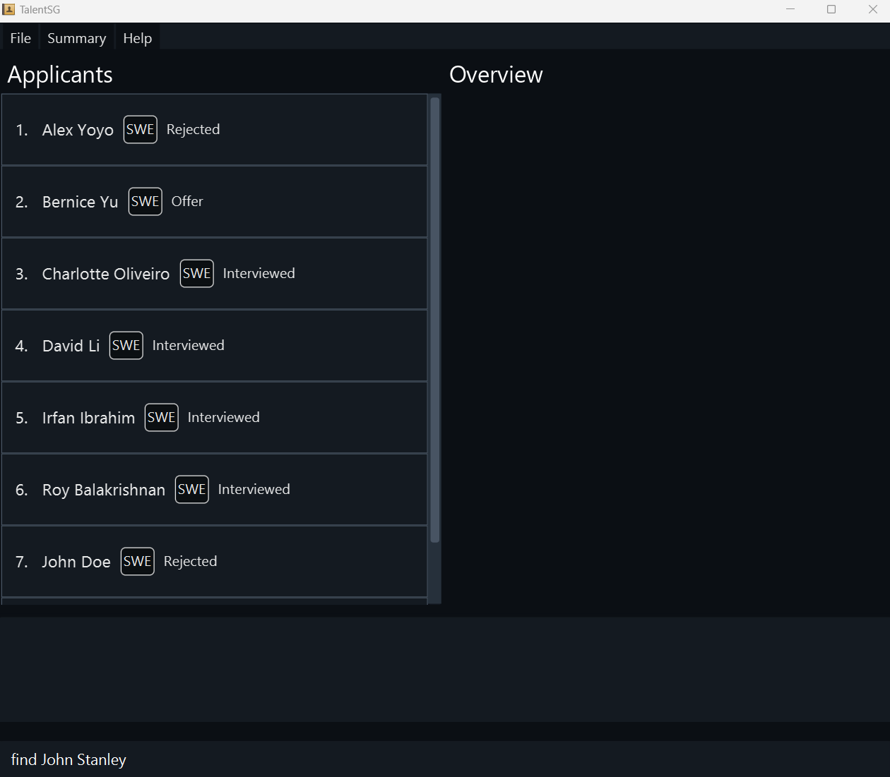
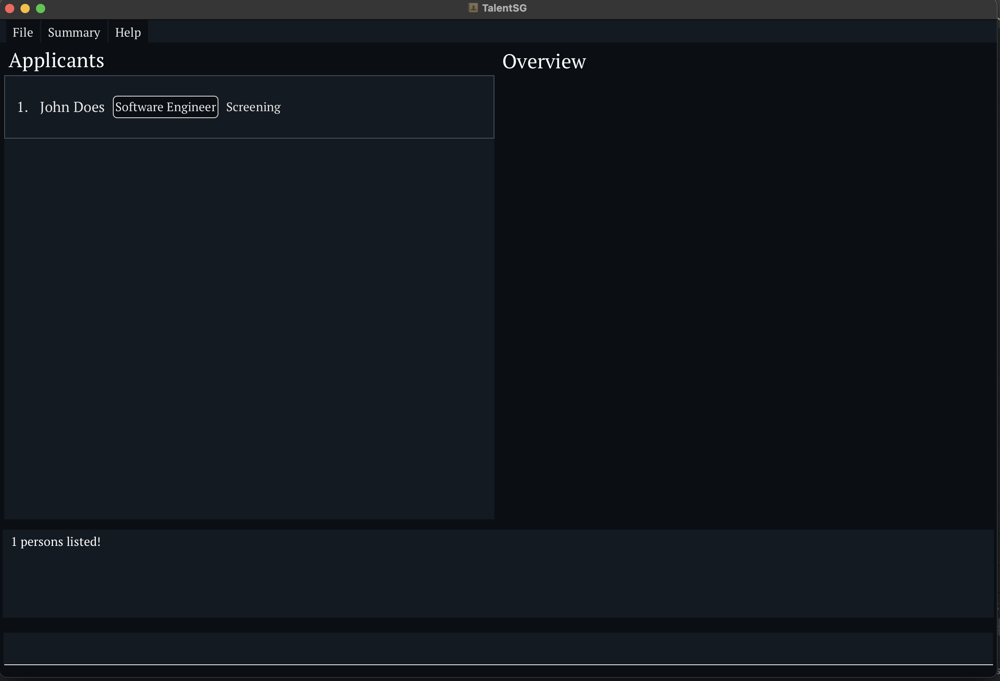

This app is a desktop app for managing candidates and job roles, **optimized for use via a Command Line Interface (CLI)** while still providing the benefits of a Graphical User Interface (GUI). If you can type fast, this app can help you manage your candidates and job roles faster than traditional GUI apps.
## Table of Contents

- [Quick Start](#quick-start)
- [Symbols and Tips](#symbols-and-tips)
- [Features ✨](#features-✨)
    - [Notes About the Command Format](#notes-about-the-command-format)
    - [Viewing Help: `help`](#📖-viewing-help--help)
    - [Adding a Person: `add`](#➕-adding-a-person-add)
    - [Listing All Persons: `list`](#📃-listing-all-persons--list)
    - [Editing a Person: `edit`](#✏️-editing-a-person--edit)
    - [Finding Persons by Name: `find`](#🔍-finding-persons-by-name-find)
    - [Deleting a Person: `delete`](#❌-deleting-a-person-delete)
    - [Filtering Contacts by Status: `filter`](#🔎-filtering-contacts-by-status-filter)
    - [Clearing All Entries: `clear`](#🧹-clearing-all-entries-clear)
    - [Exiting the Program: `exit`](#🚪-exiting-the-program-exit)
    - [Saving Data](#💾-saving-data)
    - [Editing the Data File](#✏️-editing-the-data-file)
    - [Archiving Data Files](#📦-archiving-data-files-coming-in-v20)
- [FAQ ❓](#faq-❓)
- [Known Issues 🐛](#known-issues-🐛)
- [Command Summary 📝](#command-summary-📝)
- [Glossary](#glossary)
- [Feedback and Support](#feedback-and-support)

--------------------------------------------------------------------------------------------------------------------

## Quick start 🚀

1. **Check Java Installation**: Ensure you have **Java 17** or above installed on your computer.
    - [Check Java version on Windows](https://www.wikihow.com/Check-Your-Java-Version-in-the-Windows-Command-Line)
    - [Check Java version on Mac](https://www.wikihow.com/Check-Java-Version-on-a-Mac)
    - If your computer does not have Java or its version is below Java 17, you may refer to:
        - [Install Java on Windows](https://docs.oracle.com/en/java/javase/17/install/installation-jdk-microsoft-windows-platforms.html)
        - [Install Java on Mac](https://docs.oracle.com/en/java/javase/17/install/installation-jdk-macos.html)

2. **Download TalentSG**: Get the latest `.jar` file from [here](https://github.com/AY2425S1-CS2103T-T09-2/tp/releases/tag/v1.3).


3. **Set Up Home Folder**: Copy the `TalentSG.jar` file to the Desktop to launch.

4. **Run the Application**:
    - Open a command terminal.
  
    - Navigate (`cd`) to the folder containing the `.jar` file.

    - Run the application with the command:
      ```
      java -jar TalentSg.jar
      ```

<br><br>A GUI similar to the one below should appear in a few seconds. <br>Note how the app contains some sample data. 🎉
<br>

5. **Interact with TalentSG**:
    - Type your command into the command box and press **Enter** to execute it.
    - For example, typing `help` and pressing Enter will display the help message. ✨

6. **Try Out Example Commands**:
    - `list` : Lists all contacts.
    - `add n/John Doe p/98765432 e/johnd@example.com a/123 Main St s/Java,Python st/Active note/Great candidate ex/5 years in HR dr/Software Engineer` : Adds a contact named `John Doe` to TalentSG.
    - `delete 3` : Deletes the 3rd contact shown in the current list.
    - `clear` : Deletes all contacts.
    - `exit` : Exits the app.

7. **Explore Features**: Refer to the [Features](#features) section for detailed information on each command.

---
## Symbols and Tips

Throughout this guide, you'll encounter several symbols to help you understand the content better:

- [💡 **Tip**]: Useful information to enhance your experience.
- [❗ **Note**]: Important information you should be aware of.
- [⚠️ **Caution**]: Critical information to prevent potential issues.

---
## Features ✨

TalentSG provides a variety of features to help you manage candidates and job roles effectively.

### Notes About the Command Format

- **UPPER_CASE**: Parameters to be supplied by the user.
    - E.g., in `add n/NAME`, `NAME` can be `John Doe`.
- **[Square Brackets]**: Optional items.
    - E.g., `n/NAME [t/TAG]` can be `n/John Doe t/friend` or `n/John Doe`.
- **Ellipsis (...)**: Items that can be used multiple times, including zero times.
    - E.g., `[t/TAG]...` can be `t/friend`, `t/friend t/family`, or omitted entirely.
- **Parameters Order**: Parameters can be in any order.
    - E.g., `n/NAME p/PHONE_NUMBER` is the same as `p/PHONE_NUMBER n/NAME`.
- **Extraneous Parameters**: Ignored for commands that do not take parameters.
    - E.g., `help 123` is interpreted as `help`.
- **Copying Commands**: Be cautious when copying multi-line commands from PDFs; line breaks may affect the command execution.


---

### 📖 Viewing help : `help`


Shows a message explaining how to access the help page.

Format: `help`


---

### ➕ Adding a Person: `add`

Adds a new candidate to TalentSG.

Format: `add n/NAME p/PHONE_NUMBER e/EMAIL a/ADDRESS dr/DESIRED_ROLE s/SKILLS ex/EXPERIENCE st/STATUS note/NOTE  [t/TAG]...`

#### Constraints

- **NAME**: Up to 20 characters, no special characters.
- **PHONE_NUMBER**: Numeric.
- **EMAIL**: Valid email format.
- **ADDRESS**: Valid address, should not be blank.
- **SKILLS**: Comma-separated values, e.g. `Java, Python`.
- **STATUS**: Predefined statuses (Applied, Screening, Interview Scheduled, Interviewed, Offer, Onboarding, Hired, Rejected).
- **EXPERIENCE**: Valid experience, should not be blank.
- **DESIRED_ROLE**: Desired job position, should not be blank.
- **Tags**: Optional and can be multiple, e.g. `t/friends t/owesMoney`.

[⚠️ **Caution**]: The required information except tags cannot be empty.

**Example**:

`add n/John Doe p/98765432 e/johnd@example.com a/311, Clementi Ave 2, #02-25 dr/Software Engineer s/Java, Python, C++ ex/Project Manager at Google from 2010-2020 st/Interviewed note/Super confident t/friends t/owesMoney`

**Image Example**

Command: ` add n/Jason Bill p/90065432 e/jason@example.com a/31, Clementi Ave 4, #02-20 dr/Software Engineer s/Java, Python, C++ ex/CTO at Google st/Applied note/Responsible t/friends `

Before the add command ran:
<br>

After the add command ran:
<br>

[⚠️ **Caution**]: You cannot add the same candidate twice. (same name and phone)

---

### 📃 Listing all persons : `list`

Shows a list of all applicants in TalentSG.

Format: `list`

**Image Example**

Command: ` list `

Before the list command ran:
<br>

After the list command ran:
<br>

---

### ✏️ Editing a person : `edit`

Edits an existing person in the address book.

Format: `edit INDEX [n/NAME] [p/PHONE] [e/EMAIL] [a/ADDRESS] [s/SKILLS] [st/STATUS] [note/NOTE] [ex/EXPERIENCE] [dr/DESIRED_ROLE] [t/TAG]...`

#### Constraints

- **INDEX**: Must be a positive integer corresponding to the candidate's position in the list.
- **At Least One Field**: Must be provided.
- **Existing Values**: Will be replaced with new inputs.

**Examples**:

- `edit 1 p/91234567 e/johndoe@example.com`: Updates phone and email of the first candidate.
- `edit 2 n/Betsy Crower t/`: Changes the name and clears all tags of the second candidate.

**Image Example**

Command: ` edit 1 st/Rejected note/arrogant `

Before the edit command ran:
<br>

After the edit command ran:
<br>

[⚠️ **Caution**]: You cannot edit a candidate to be a duplicate of another existing candidate.

---

### 🔍 Locating persons by name: `find`

Finds persons whose names contain any of the given keywords.

Format: `find KEYWORD [MORE_KEYWORDS]`

* The search is case-insensitive. e.g `hans` will match `Hans`
* The order of the keywords does not matter. e.g. `Hans Bo` will match `Bo Hans`
* Only the name is searched.
* Only full words will be matched e.g. `Han` will not match `Hans`
* Persons matching at least one keyword will be returned (i.e. `OR` search).
  e.g. `Hans Bo` will return `Hans Gruber`, `Bo Yang`

Examples:
* `find John` returns `john` and `John Doe`
* `find alex david` returns `Alex Yeoh`, `David Li`<br>


**Image Example**

Command: ` find John Stanley `

Before the find command ran:
<br>

After the find command ran:
<br>
---

### ❌ Deleting a Person: `delete`

Removes a candidate from TalentSG.

**Format**: `delete INDEX`

#### Constraints

- **INDEX**: Refers to the candidate's number in the current list.
- **Positive Integer**: Must be 1, 2, 3, etc.

**Examples**:

- `list` followed by `delete 2`: Deletes the second candidate.
- `find Betsy` followed by `delete 1`: Deletes the first candidate in the search results.

**Image Example**

Command: ` delete 2 `

Before the find command ran:
<br>

After the find command ran:
<br>

[⚠️ **Caution**]: Deleted entries cannot be recovered.

---

### 🔎 Filtering Contacts by Status: `filter`

Filters candidates based on their status.

**Format**: `filter st/STATUS`

#### Notes

- **Case-Insensitive**: The search is case-insensitive.
- **Available Statuses**: Active, Shortlisted, Hired, etc.

**Examples**:

- `filter st/Active`: Displays all active candidates.
- `filter st/Shortlisted`: Shows candidates marked as shortlisted.

**Image Example**

Command: ` filter screening `

Before the find command ran:
<br>

After the find command ran:
<br>

---

### 🧹 Clearing All Entries: `clear`

Removes all candidates from TalentSG.

**Format**: `clear`

[⚠️ **Caution**]: This action is irreversible.

---

### 🚪 Exiting the Program: `exit`

Closes the TalentSG application.

**Format**: `exit`

---

### 💾 Saving Data

Data is automatically saved in the hard disk after any command that changes the data. There is no need to save manually.

---

### ✏️ Editing the Data File

Advanced users can edit the data file located at `[JAR file location]/data/addressbook.json`.

[⚠️ **Caution**]:

- If your changes to the data file make its format invalid, TalentSG will discard all data and start with an empty data file at the next run.
- It is recommended to take a backup of the file before editing it.
- Certain edits can cause TalentSG to behave unexpectedly (e.g., if a value entered is outside of the acceptable range). Therefore, edit the data file only if you are confident that you can update it correctly.

---
---


### 📦 Archiving data files `[coming in v2.0]`

_Details coming soon ..._

--------------------------------------------------------------------------------------------------------------------

## FAQ ❓

**Q**: How do I transfer my data to another Computer?<br>
**A**: Install the app in the other computer and overwrite the empty data file it creates with the file that contains the data of your previous AddressBook home folder.

**Q**: Help! Double-clicking TalentSG.jar does not launch the application - what should I do?<br>
**A**: Trying running the application from the command line using the following command: `java -jar TalentSg.jar`. Windows users can use the Command Prompt application to do this while Mac users can use the Terminal application.

**Q**: When I minimise the application, the entire application has shrunk and now it is gone! Help!<br>
**A**: Currently our application do not allow diagonal or vertical resizing of the it. It is best not to resize the application at all and leave it as the maximized mode. For the this problem, we suggest that you try to maximise the application from the task manager or try to split the screen with another application so that StudyBuddyPro will resize back to normal. If the mentioned solutions fail, please do download TalentSg again!

**Q**: How do I save my data?<br>
**A**: TalentSG saves your data automatically after every command.

**Q**: How do I update to the latest version of TalentSG?<br>
**A**: Simply download the latest `.jar` file released on our GitHub page.

--------------------------------------------------------------------------------------------------------------------

## Known issues 🐛

1. **When using multiple screens**, if you move the application to a secondary screen, and later switch to using only the primary screen, the GUI will open off-screen. The remedy is to delete the `preferences.json` file created by the application before running the application again.
2. **If you minimize the Help Window** and then run the `help` command (or use the `Help` menu, or the keyboard shortcut `F1`) again, the original Help Window will remain minimized, and no new Help Window will appear. The remedy is to manually restore the minimized Help Window.

--------------------------------------------------------------------------------------------------------------------

## Command summary 📝

| Action     | Format, Examples                                                                                                                                                                                                            |
|------------|-----------------------------------------------------------------------------------------------------------------------------------------------------------------------------------------------------------------------------|
| **Add**    | `add n/NAME p/PHONE_NUMBER e/EMAIL a/ADDRESS s/SKILLS st/STATUS note/NOTE ex/EXPERIENCE dr/DESIRED_ROLE [t/TAG]...` <br> e.g., `add n/James Ho p/22224444 e/jamesho@example.com a/123 Clementi Rd, 1234665 s/Java t/friend` |
| **Clear**  | `clear`                                                                                                                                                                                                                     |
| **Delete** | `delete INDEX`<br> e.g., `delete 3`                                                                                                                                                                                         |
| **Edit**   | `edit INDEX [n/NAME] [p/PHONE] [e/EMAIL] [a/ADDRESS] [s/SKILLS] [st/STATUS] [note/NOTE] [ex/EXPERIENCE] [dr/DESIRED_ROLE] [t/TAG]...`<br> e.g., `edit 2 n/James Lee st/Active`                                              |
| **Find**   | `find KEYWORD [MORE_KEYWORDS]`<br> e.g., `find James`                                                                                                                                                                       |
| **List**   | `list`                                                                                                                                                                                                                      |
| **Help**   | `help`                                                                                                                                                                                                                      |
| **View**   | `view INDEX`<br> e.g., `view 2`                                                                                                                                                                                             |
| **Filter** | `filter st/STATUS`<br> e.g., `filter st/Shortlisted`                                                                                                                                                                        |

This project is based on the AddressBook-Level3 project created by the [SE-EDU initiative](https://se-education.org).

---

### Glossary

- **CLI**: Command Line Interface.
- **GUI**: Graphical User Interface.
- **Module**: A category or grouping for candidates, such as job roles or departments.
