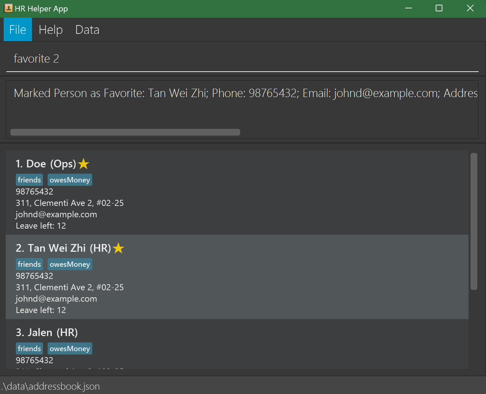

# HR Helper User Guide

<!-- * Table of Contents -->
<page-nav-print />

--------------------------------------------------------------------------------------------------------------------

### An Overview of the User Guide:
1. [**Introduction**](#1-introduction)
2. [**About**](#2-about)
3. [**Starting HR Helper**](#3-starting-hr-helper)
4. [**Features of HR Helper**](#4-features-of-hr-helper)
   
    4.1 [**Authentication**](#4-1-authentication)
    
    4.2 [**Viewing help**](#4-2-viewing-help-help)

    4.3 [**Adding an employee**](#4-3-adding-an-employee-add)

    4.4 [**Listing all employees**](#4-4-listing-all-employees-list)

    4.5 [**Counting employees**](#4-5-counting-employees-count)

    4.6 [**Editing an employee**](#4-6-editing-an-employee-edit)
    
    4.7 [**Locating employee by name**](#4-7-locating-employees-by-name-find)

    4.8 [**Deleting an employe**](#4-8-deleting-an-employee-delete)

    4.9 [**Sorting employees**](#4-9-sorting-employees-sort)

    4.10 [**Favoriting an employee**](#4-10-favoriting-an-employee-favorite)

    4.11 [**Clearing all entries**](#4-11-clearing-all-entries-clear)

    4.12 [**Exiting HR Helper**](#4-12-exiting-hr-helper-exit)

    4.13 [**Employee details window**](#4-13-employee-details-window)

5. [**Command Summary**](#5-command-summary)
6. [**FAQ**](#6-faq)
7. [**Known Issues**](#7-known-issues)

--------------------------------------------------------------------------------------------------------------------

## 1 Introduction
HR Helper is a **desktop app for managing employees, optimized for use via a Command Line Interface** (CLI) while still having the benefits of a Graphical User Interface (GUI).

HR Helper is mainly targeted at **fledgling companies** (e.g start-ups), who want to have an easy-to-use, intuitive human resource manager.
With its gentle learning curve and versatility, it can be easily picked up by anyone, and used by any type of company.

Whether it be 5 staff members or 500 employees, HR Helper has the capability to accommodate a wide range of company sizes and is sure to be an asset to your companies' management system!

--------------------------------------------------------------------------------------------------------------------

## 2 About

This user guide provides an overview for HR staff on the usage of HR Helper.

--------------------------------------------------------------------------------------------------------------------

## 3 Starting HR Helper

1. Ensure you have Java `17` or above installed in your Computer.

1. Download the latest `.jar` file from [here](https://github.com/AY2425S1-CS2103T-T16-1/tp/releases/tag/v1.5).

1. Copy the file to the folder you want to use as the _home folder_ for your HR Helper.

1. Open a command terminal, `cd` into the folder you put the jar file in, and use the `java -jar HRHelper.v1.5.jar` command to run the application. 
   A GUI similar to the below should appear in a few seconds. Note how the app contains some sample data. 
   

1. Type the command in the command box and press Enter to execute it. e.g. typing **`help`** and pressing Enter will open the help window. 
   
2. Some example commands you can try:

   * `list` : Lists all employees.

   * `add n/John Doe p/98765432 e/johnd@example.com a/311, Clementi Ave 2, #02-25 t/friends t/owesMoney f/ d/HR l/12 1` : Adds an employee named `John Doe` to the HR Helper list.

   * `delete 3` : Deletes the 3rd employee shown in the current list.

   * `clear` : Deletes all employees.

   * `exit` : Exits the app.

--------------------------------------------------------------------------------------------------------------------

## 4 Features of HR Helper

<box type="info" seamless>

**Notes about the command format:** 

* Words in `UPPER_CASE` are the parameters to be supplied by the user. 
  e.g. in `add n/NAME`, `NAME` is a parameter which can be used as `add n/John Doe`.

* Items in square brackets are optional. 
  e.g `n/NAME [t/TAG]` can be used as `n/John Doe t/friend` or as `n/John Doe`.

* Items with `…`​ after them can be used multiple times including zero times. 
  e.g. `[t/TAG]…​` can be used as ` ` (i.e. 0 times), `t/friend`, `t/friend t/family` etc.

* Parameters can be in any order. 
  e.g. if the command specifies `n/NAME p/PHONE_NUMBER`, `p/PHONE_NUMBER n/NAME` is also acceptable.

* Extraneous parameters for commands that do not take in parameters (such as `help`, `list`, `exit` and `clear`) will be ignored. 
  e.g. if the command specifies `help 123`, it will be interpreted as `help`.

* If you are using a PDF version of this document, be careful when copying and pasting commands that span multiple lines as space characters surrounding line-breaks may be omitted when copied over to the application.
</box>

### 4.1 Authentication :

Login to HR Helper with your username and password.

Format:

<box type="tip" seamless>

**Tip:** Press `Enter` to go to the next field!
</box>

Examples:
* For this version, the username is `admin` and password is `12345678`.

<box type="warning" seamless>

**Warning:** Keep your credentials secure.
</box>

### 4.2 Viewing help : `help`

Shows a message explaining how to access the help page.

Format: `help`

<box type="tip" seamless>

**Tip:** Use the help command anytime to quickly refresh on command usage.
</box>

Examples:

 

<box type="warning" seamless>

**Warning:** Clicking on the link will leave HR Helper.
</box>

### 4.3 Adding an employee : `add`

Adds an employee to the HR Helper.

Format: `add n/NAME p/PHONE_NUMBER e/EMAIL a/ADDRESS [t/TAG]…​ [f/FAVORITE] [d/DEPARTMENT] [l/LEAVE]`

<box type="tip" seamless>

**Tip:** An employee can have any number of tags (including 0)
</box>

Examples:
* `add n/John Doe p/98765432 e/johnd@example.com a/John street, block 123, #01-01 f/true d/Operations l/12`
* `add n/Betsy Crowe t/friend e/betsycrowe@example.com a/Newgate Road p/1234567 t/lazy f/true d/Marketing l/10`

<box type="warning" seamless>

**Warning:** Duplicate employees with the same name cannot be added.
</box>

### 4.4 Listing all employees : `list`

Shows a list of all employees in HR Helper.

Format: `list`

<box type="tip" seamless>

**Tip:** `list` can be used to show all employees after using the `find` command.
</box>

Example:
* `list` shows all employees.

<box type="warning" seamless>

**Warning:** Use this command before other commands like delete or edit to ensure you’re modifying the correct entry.
</box>

### 4.5 Counting employees : `count`

Counts number of employees.

Format: `count`(for counting the filtered list), `count tag/TAG`(for counting employees with given TAG)

* If counting the entire list, use `count`.
* If counting employees with specified TAG, add TAG to end of the command.

<box type="tip" seamless>

**Tip:** Use count with tags to quickly assess team sizes within specific departments or roles
</box>

Examples:
* `count`
* `count tag/Colleagues`

<box type="warning" seamless>

**Warning:** When using count t/TAG, ensure that the TAG exists and is spelled accurately; otherwise, the command may return zero results.
</box>

### 4.6 Editing an employee : `edit`

Edits an existing employee in the HR Helper.

Format: `edit INDEX n/NAME p/PHONE_NUMBER e/EMAIL a/ADDRESS [t/TAG]…​ [f/Boolean] [d/DEPARTMENT] [l/LEAVE]`

* Edits the employee at the specified `INDEX`. The index refers to the index number shown in the displayed employee list. The index **must be a positive integer** 1, 2, 3, …​
* At least one of the optional fields must be provided.
* Existing values will be updated to the input values.
* When editing tags, the existing tags of the employee will be removed i.e adding of tags is not cumulative.
* You can remove all the employee’s tags by typing `t/` without
    specifying any tags after it.

<box type="tip" seamless>

**Tip:** To remove all tags, use t/ without specifying tags (e.g., edit 1 t/).
</box>

Examples:
*  `edit 1 p/91234567 e/johndoe@example.com` Edits the phone number and email address of the 1st employee to be `91234567` and `johndoe@example.com` respectively.
*  `edit 2 n/Betsy Crower t/` Edits the name of the 2nd employee to be `Betsy Crower` and clears all existing tags.

<box type="warning" seamless>

**Warning:** Changes overwrite current data. Double-check inputs before saving.
</box>

### 4.7 Locating employees by name: `find`

Finds employees whose names contain any of the given keywords.

Format: `find KEYWORD [MORE_KEYWORDS]`

* The search is case-insensitive. e.g `hans` will match `Hans`
* The order of the keywords does not matter. e.g. `Hans Bo` will match `Bo Hans`
* Only the name is searched.
* Only full words will be matched e.g. `Han` will not match `Hans`
* Employees matching at least one keyword will be returned (i.e. `OR` search).
  e.g. `Hans Bo` will return `Hans Gruber`, `Bo Yang`

<box type="tip" seamless>

**Tip:** Use partial keywords to broaden your search (e.g., find Jo matches John and Joan).
</box>

Examples:
* `find John` returns `john` and `John Doe`
* `find alex david` returns `Alex Yeoh`, `David Li` 
  

<box type="warning" seamless>

**Warning:** The find command only searches names. Ensure that names are correctly spelled.
</box>

### 4.8 Deleting an employee : `delete`

Deletes the specified employee from HR Helper.

Format: `delete INDEX`

* Deletes the employee at the specified `INDEX`.
* The index refers to the index number shown in the displayed employee list.
* The index **must be a positive integer** 1, 2, 3, …​

<box type="tip" seamless>

**Tip:** Use delete carefully, especially after sorting or filtering, as index positions may change.
</box>

Examples:
* `list` followed by `delete 2` deletes the 2nd employee in HR Helper.
* `find Betsy` followed by `delete 1` deletes the 1st employee in the results of the `find` command.

<box type="warning" seamless>

**Warning:** This action is irreversible. Use list before delete to confirm the index.
</box>

### 4.9 Sorting Employees: `sort`

Sorts the displayed employees based on specified tags.

Format: `sort TAG`

* Sorts the employees according to the specified tags.
* You can specify multiple tags for sorting.
* If no tags are specified, all employees will be displayed in their original order.

<box type="tip" seamless>

**Tip:** For large lists, use sort with commonly used tags to improve data visibility.
</box>

Examples:
* `sort friend` Sorts and displays all employees tagged as friend.
* `sort friend family` Sorts and displays employees tagged as either friend or family.

<box type="warning" seamless>

**Warning:** Sorting by multiple tags may combine various groups, which can affect other commands relying on order.
</box>

### 4.10 Favoriting an employee : `favorite`

Favorites the specified employee from HR Helper.

Format: `favorite INDEX`

* Favorites the employee at the specified `INDEX`.
* The index refers to the index number shown in the displayed employee list.
* The index **must be a positive integer** 1, 2, 3, …​
  
<box type="tip" seamless>

**Tip:** Use favorite for high-priority employees, making them easier to locate with filtering or sorting.
</box>

Examples:
* `list` followed by `favorite 2` favorites the 2nd employee in HR Helper.
* `find Betsy` followed by `favorite 1` favorites the 1st employee in the results of the `find` command.

<box type="warning" seamless>

**Warning:** Avoid favoriting too many employees, as an excessive number of favorites can make it challenging to identify key employees quickly.
</box>

### 4.11 Clearing all entries : `clear`

Clears all entries from HR Helper.

Format: `clear`

<box type="tip" seamless>

**Tip:** Use clear only when resetting the database is intentional.
</box>

Examples:
* `clear` resets the database in HR Helper.

<box type="warning" seamless>

**Warning:** This action is irreversible. Back up data if necessary before clearing.
</box>

### 4.12 Exiting HR Helper : `exit`

Exits HR Helper.

Format: `exit`

<box type="tip" seamless>

**Tip:** Use exit only after confirming that all changes have been saved, as the program automatically saves data with each command.
</box>

<box type="warning" seamless>

**Warning:** Exiting abruptly may interrupt ongoing processes. Use the exit command instead of closing the window directly to ensure a clean shutdown.
</box>

### 4.13 Employee Details Window

The **Employee Details Window** allows HR personnel to view and edit detailed information about each employee efficiently. This guide provides a concise overview of how to use this feature effectively.

- **Keyboard Shortcut:**
    - Select a employee from the **Employee List**.
    - Press the `Enter` key to open the **Employee Details Window**.

- **Name:** Editable text field displaying the employee's full name.
- **Phone:** Editable text field for the employee's contact number.
- **Email:** Editable text field for the employee's email address.
- **Address:** Editable text field for the employee's residential or mailing address.
- **Department:** Editable text field indicating the employee's department within the organization.
- **Leave:** Editable text field showing the remaining leave days available to the employee.
- **Favorite:** Checkbox to mark the employee as a favorite for quick access.

**Editing Information**

- **Modify Fields:**
    - Press `Enter` on keyboard on any text field (e.g., **Name**, **Phone**) to edit the information.
    - For the **Favorite** checkbox, press `space` bar to toggle the favorite status.
  
- **Navigate Between Fields:**
    - **Tab Key / Down Arrow (`↓`):** Move to the next field.
    - **Shift + Tab Key / Up Arrow (`↑`):** Move to the previous field.

- **Save Changes:**
    - Press the `Enter` key to save all modifications.
    - The window will close, and changes will reflect in the **Employee List**.

- **Cancel Changes:**
    - Press the `Esc` key to discard all changes and close the window without saving.

**Validation and Error Handling**

- **Mandatory Fields:**
    - All fields are required. Ensure no field is left empty before saving.

- **Format Requirements:**
    - **Phone:** Must be a valid phone number format.
    - **Email:** Must follow standard email formatting (e.g., `example@domain.com`).

- **Error Messages:**
    - If invalid data is entered, an error dialog will appear prompting correction.
    - Follow the on-screen instructions to rectify any issues.

### Saving the data

HR Helper data are saved in the hard disk automatically after any command that changes the data. There is no need to save manually.

### Editing the data file

HR Helper data are saved automatically as a JSON file `[JAR file location]/data/addressbook.json`. Advanced users are welcome to update data directly by editing that data file.

<box type="warning" seamless>

**Warning:**
If your changes to the data file makes its format invalid, HR Helper will discard all data and start with an empty data file at the next run.  Hence, it is recommended to take a backup of the file before editing it. 
Furthermore, certain edits can cause the AddressBook to behave in unexpected ways (e.g., if a value entered is outside the acceptable range). Therefore, edit the data file only if you are confident that you can update it correctly.
</box>

### Archiving data files `[coming in v2.0]`

_Details coming soon ..._

--------------------------------------------------------------------------------------------------------------------

## 5 Command summary

| Action       | Format                                                                               | Examples                                                                                                |
|--------------|--------------------------------------------------------------------------------------|---------------------------------------------------------------------------------------------------------|
| **Add**      | `add n/NAME p/PHONE_NUMBER e/EMAIL a/ADDRESS [t/TAG]…​`                              | e.g. `add n/James Ho p/22224444 e/jamesho@example.com a/123, Clementi Rd, 1234665 t/friend t/colleague` |
| **Clear**    | `clear`                                                                              |                                                                                                         |
| **Count**    | `count`: counts entire employee list  `count tag/TAG`: counts people in given tag | e.g. `count tag/Colleagues`                                                                             |
| **Delete**   | `delete INDEX`                                                                       | e.g. `delete 3`                                                                                         |
| **Edit**     | `edit INDEX [n/NAME] [p/PHONE_NUMBER] [e/EMAIL] [a/ADDRESS] [t/TAG]…​`               | e.g. `edit 2 n/James Lee e/jameslee@example.com`                                                        |
| **Favorite** | `favorite INDEX`                                                                     | e.g. `favorite 3`                                                                                       |
| **Find**     | `find KEYWORD [MORE_KEYWORDS]`                                                       | e.g. `find James Jake`                                                                                  |
| **Help**     | `help`                                                                               |                                                                                                         |
| **List**     | `list`                                                                               |                                                                                                         |
| **Sort**     | `sort TAG`                                                                           | e.g. `sort managers`                                                                                    |

--------------------------------------------------------------------------------------------------------------------

## 6 FAQ

**Q**: How do I transfer my data to another Computer? 
**A**: Install the app in the other computer and overwrite the empty data file it creates with the file that contains the data of your previous AddressBook home folder.

--------------------------------------------------------------------------------------------------------------------

## 7 Known issues

1. **When using multiple screens**, if you move the application to a secondary screen, and later switch to using only the primary screen, the GUI will open off-screen. The remedy is to delete the `preferences.json` file created by the application before running the application again.
2. **If you minimize the Help Window** and then run the `help` command (or use the `Help` menu, or the keyboard shortcut `F1`) again, the original Help Window will remain minimized, and no new Help Window will appear. The remedy is to manually restore the minimized Help Window.
3. **Does not track maternity leave up to 6 months**, which is not part of annual leave.
4. **Add issues here**
