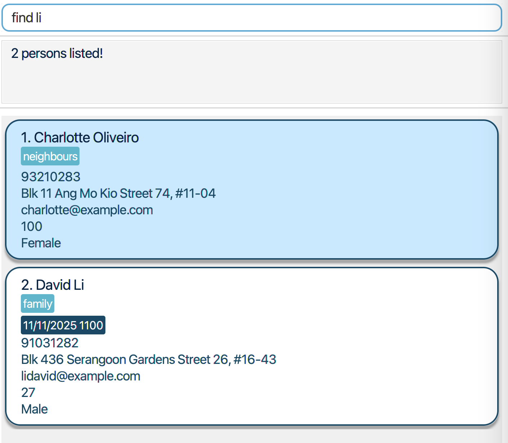

# SocialBook User Guide

SocialBook is a **desktop app specifically designed to ease the administrative process for social workers.**

By providing a **comprehensive way to store the personal details** of those they are helping, as well as **functionalities 
to make the information managing process efficient**, SocialBook streamlines the process for social workers. 

SocialBook is **optimized for use via a Command Line Interface** (CLI) while still having the benefits of a 
Graphical User Interface (GUI). If you can type fast, SocialBook can get your contact management tasks done faster 
than traditional GUI apps.

<!-- * Table of Contents -->
<page-nav-print />

--------------------------------------------------------------------------------------------------------------------

## Quick start

1. Ensure you have **Java 17 or above** installed in your Computer.
   *  How To Install Java 17 ([Windows](https://se-education.org/guides/tutorials/javaInstallationWindows.html) | [MacOS](https://se-education.org/guides/tutorials/javaInstallationMac.html) | [Linux](https://se-education.org/guides/tutorials/javaInstallationLinux.html))

2. Download the latest `.jar` file from [here](https://github.com/AY2425S1-CS2103T-F14b-1/tp/releases).
   * From the link, under the **Assets** of the latest version of SocialBook, you should find the latest downloadable `.jar` file named `socialbook.jar`.

3. Copy the `socialbook.jar` file into a _folder_ you want to use to put SocialBook.
   * Ensure that this _folder_ is **empty**.

4. Open a command terminal, `cd` into the folder you put the `socialbook.jar` file in. After which enter `java -jar socialbook.jar` in the command terminal to run the application.
   * How To Open Command Terminal ([Windows](https://www.lifewire.com/how-to-open-command-prompt-2618089) | [MacOS](https://support.apple.com/en-sg/guide/terminal/apd5265185d-f365-44cb-8b09-71a064a42125/mac) | [Linux](https://ubuntu.com/tutorials/command-line-for-beginners#3-opening-a-terminal))
   * How To Change Directory (`cd`) To Folder ([Windows](https://learn.microsoft.com/en-us/windows-server/administration/windows-commands/cd) | [MacOS](https://www.macworld.com/article/221277/command-line-navigating-files-folders-mac-terminal.html) | [Linux](https://phoenixnap.com/kb/linux-cd-command))
   
If done correctly, a GUI similar to the image below should appear in a few seconds. Note that the app will contain some sample data for you to get started and familiarise with.  

5. Type the commands where "Enter command here..." is seen in the command box and press the **enter / return** key on your computer to execute it. e.g. typing **`help`** and pressing enter / return will open a help window.  
   Some example commands you can try:

   * `list`: Lists all current (i.e. not archived) contacts.

   * `add n/John Doe p/98765432 e/johnd@example.com a/311, Clementi Ave 2 #02-25 dob/1999-03-09`: Adds a contact named `John Doe` to SocialBook with these specified details.

   * `delete 3`: Deletes the 3rd contact shown in the current list.

   * `clear`: Deletes all contacts.

   * `exit`: Exits the app.
<box type="info" seamless>

**Relaunching App:** For relaunching of app, simply run step 4 again.
</box>

 6. Refer to the [Features](#features) below for the details of each command.

--------------------------------------------------------------------------------------------------------------------

## User Input

In SocialBook, a person has multiple **details** that can be added/edited by you. Here are some notes regarding these details:

### Compulsory Fields: 

1. NAME: Names should only contain alphanumeric characters (letters and digits) and spaces, and should not be blank. **Duplicate names are not allowed**.   Prefix: `n/` 
    * Valid Examples: `John Doe`, `Alice Tan`
    * Invalid Examples: `#John Do&`, `@l!ce T@n`

<box type="tip" seamless>

**Tip:** For names with special characters, use either the full or an alternative form of the name.   
 - "John s/o Doe" can be added as "John son of Doe".
 - "Björn" can be added as "Bjorn"
</box>

2. ADDRESS: Addresses can take any values, and should not be blank.   Prefix: `a/`
    * Valid Examples: `Blk 10 Serangoon Ave 3, #12-12`, `Blk 410 Clementi Ave 2, #08-08`

3. PHONE NUMBER: Phone numbers should contain only numbers, and should be at least 3 digits long.   Prefix: `p/`
    * Valid Examples: `81234567`, `69876543`
    * Invalid Examples: `99`, `9123 4567`, `9 1 2 3 4 5 6 7`

4. EMAIL: Emails should be of the format local-part@domain. **Most common emails will be accepted** but refer to the specifications below if you need more information:   Prefix: `e/`
   * "local-part" can only contain alphanumeric characters and the following special characters: .+_- (Cannot start/end with any special characters)
   * Domain name is made up of domain labels separated by periods. The domain name must: 
     * End with a domain label at least 2 characters long
     * Have each domain label start and end with alphanumeric characters
     * Have each domain label consist of alphanumeric characters, and only separated by hyphens (if any)
   * Valid Examples: `john.doe@example.com`, `jane-doe123@example.com`
   * Invalid Examples: `john.doe.@example.com`, `john.doe@exa_mple.com`

5. DATE OF BIRTH: Date of birth must not be a future date. Input must follow the format yyyy-MM-dd.   Prefix: `dob/`
    * Valid Examples: `2000-01-01`, `1990-12-29`
    * Invalid Examples: `01-01-2001`, `1st Dec 1996`, `2030-02-01`

### Optional Fields:

1. PRIORITY: Priority should be HIGH, MEDIUM, or LOW. The input is case-insensitive, meaning `high` is the same as `HIGH`. Default: LOW   Prefix: `pri/` 
    * Valid Examples: `HIGH`, `medium`
    * Invalid Examples: `middle`, `less`

2. INCOME: Income should be a non-negative decimal number. Default: 0   Prefix: `income/`
    * Valid Examples: `2000.00`, `1500`
    * Invalid Examples: `-10`, `80.0%`

3. FAMILY SIZE: Family size should be a positive integer. Default: 1   Prefix: `famsize/`
    * Valid Examples: `5`, `10`
    * Invalid Examples: `0`, `-3`, `2.5`

4. TAGS: Tag names should be alphanumeric.   Prefix: `t/`
    * Valid Examples: `childcare`, `educational`
    * Invalid Examples: `#needslegalhelp`, `almost-done`

<box type="info" seamless>

**Duplicate Handling:** Since two persons are not allowed to have the same name, in rare cases where you have more than one contact with the exact same full name, it is up to your discretion how you want to differentiate them.  
- For instance, if two contacts with the name "John Doe" needs to be added, a possibility is adding the first person as "John Doe 1" and the second as "John Doe 2".
</box>

--------------------------------------------------------------------------------------------------------------------

## Features

<box type="info" seamless>

**Notes about the command format:** 

* Words in `UPPER_CASE` are the parameters to be supplied by the user. 
  e.g. in `add n/NAME`, `NAME` is a parameter to be determined by user e.g. `add n/John Doe`.

* Items in square brackets are optional parameters for the user to fill in. 
  e.g. `n/NAME [t/TAG]` can be used as `n/John Doe t/friend` or as `n/John Doe`.

* Items with `…`​ after them can be used multiple times including zero times. 
  e.g. `[t/TAG]…​` can be used as ` ` (i.e. 0 times), `t/friend`, `t/friend t/family` etc.

* Parameters can be in any order. 
  e.g. if the command specifies `n/NAME p/PHONE_NUMBER`, `p/PHONE_NUMBER n/NAME` is also acceptable.

* Extraneous parameters for commands that do not take in parameters (such as `listappt`, `statistics`, `undo`, `clear` and `exit`) will be ignored. 
  e.g. if the input specifies `statistics 123`, it will be interpreted as `statistics`.

<box type="warning" seamless>
**Caution**
If you are using a PDF version of this document, be careful when copying and pasting commands that span multiple lines as space characters surrounding line-breaks may be omitted when copied over to the application. 
e.g. if you copy `add n/John Doe p/98765432` and `p/98765432` is on a new line in the PDF, when copied over into the command box, it may be copied as `add n/John Doep/98765432` instead which is an invalid command format.
</box>

</box>

### Viewing help: `help`

Shows a display message with all the available commands as well as the link to the User Guide. 
If `[COMMAND]` is specified, the help message for that command will be displayed.

Format: `help [COMMAND]`

Examples:
* `help` 
* `help add`
* `help edit`

### Adding a person: `add`

Adds a person and their details to SocialBook.

Format: `add n/NAME p/PHONE e/EMAIL a/ADDRESS dob/DATE_OF_BIRTH [pri/PRIORITY = LOW] [income/INCOME = 0] [famsize/FAMILY_SIZE = 1] [t/TAG]...`

* Names are case-insensitive e.g. `JOHN DOE` is the same as `john doe`.
* Extra whitespaces between names are trimmed e.g. <code>John&nbsp;&nbsp;&nbsp;&nbsp;&nbsp;Doe</code> is the same as `John Doe`.
* Adding persons with the same name is not allowed as it is considered a duplicate person.
* For full information on the input parameters, refer to [User Input](#user-input) above.

<box type="info" seamless>

**Info:** The input value for the income field is automatically rounded to the nearest 2 decimal places, so values like `900.01` remain unchanged, while values like `900.015` are rounded to `900.02`.
</box>

<box type="tip" seamless>

**Tip:** A person can have any number of tags (including 0)
</box>

Examples:

* `add n/John Doe p/98765432 e/johnd@gmail.com a/311, Clementi Ave 2, #02-25 dob/1999-03-09 famsize/3 income/5000`
* `add n/Betsy Crowe t/friend e/betsycrowe@outlook.com a/Newgate Prison p/12345678 dob/2002-12-25 pri/MEDIUM t/criminal`

### Listing all persons: `list`

Shows the list of persons in SocialBook, sorted according to the latest sorting order specified by the `sort` command. If no sorting order has been specified, the list will be sorted by priority from HIGH to LOW.

<box type="tip" seamless>

Format: `list [archive/] [all/]`

- `list`: Shows the list of people who are unarchived
- `list archive/`: Shows the list of people who are archived
- `list all/`: Shows the list of all people (i.e. both archived and unarchived)

<box type="warning" seamless>

**Caution:**
- Should not be used with both `archive/` and `all/` concurrently, e.g. `list archive/ all/` ❌, `list archive/` ✅
- `archive/` and `all/` should not have parameter values, e.g. `list archive/bob` ❌, `list archive/` ✅
- Parameters other than `archive/` and `all/` are disallowed, e.g. `list 1` ❌, `list archie/` ❌
</box>

### Editing a person: `edit`

Edits an existing person's details in SocialBook.

Format: `edit INDEX [n/NAME] [p/PHONE] [e/EMAIL] [a/ADDRESS] [dob/DATE_OF_BIRTH] [pri/PRIORITY] [income/INCOME] [famsize/FAMILY_SIZE] [t/TAG]…​`

* Edits the person at the specified `INDEX`. 
* The index refers to the index number shown in the **last viewed person list**. 
* The index **must be a positive integer** not exceeding the last index number in the last viewed person list.
* At least one of the fields must be provided. Refer to [User Input](#user-input) above for more information on the fields.
* Existing values will be updated based on the provided input values.
* When editing tags, all existing tags of the person will be removed and replaced with updated values i.e editing of tags does not cumulatively add them to existing tags.
* You can remove all the person's tags by typing `edit INDEX t/` where `INDEX` is the person's index.

Examples:
*  `edit 1 p/91234567 e/johndoe@gmail.com` Edits the phone number and email address of the 1st person to be `91234567` and `johndoe@gmail.com` respectively.
*  `edit 2 n/Betsy Crower t/` Edits the name of the 2nd person to be `Betsy Crower` and clears all existing tags.

### Finding persons: `find`

Finds persons that match the specified filters.

Format: `find [n/START_OF_NAME]... [a/PART_OF_ADDRESS]... [pri/PRIORITY]... [income/INCOME]...`

* The search is case-insensitive. e.g. `n/alice` will match `Alice`.
* At least one filter must be specified (i.e. no empty `find` command).
* For **names**, only those that **start** with the given filter will be matched e.g. `find n/A` returns all persons whose first name starts with A only. 
* For **addresses**, those that **contain** the part of the address given are returned e.g. `find a/clementi` returns all persons who stay at clementi only. 
* For **priorities**, exact priorities must be specified to filter accurately e.g. `find pri/high` returns all persons with high priority only.
* For **income**, those with income **less than or equal** to the specified value are listed e.g. `find income/2000` returns all persons with income less than or equal to 2000.00 only.
* To specify multiple filters of the **same type**, use the corresponding prefix for every new filter e.g. `find n/alex n/david n/bobby`
* Per type of prefix, all persons matching any of the filters given will be returned (i.e. `OR`search) but when combined, only those who also pass the filters of other types are are returned (i.e. `AND` search) e.g. `find n/A n/B pri/HIGH` returns all persons whose name starts with either A or B but also have high priority. 

Examples:
* `find pri/high` returns `Alice Tan` and `David Wong` (from sample data)
* `find n/a n/b n/c pri/high pri/medium` returns `Alice Tan` and `Benny Lim` 
  

<box type="warning" seamless>

**Caution:** Finding is applied on the currently displayed list of persons. If you have narrowed down the list using the `find` command previously, and are trying to find someone not part of this filtered list, execute the `list` command with the appropriate format and execute the `find` command again. Refer to the [list](#listing-all-persons-list) feature above for the exact format required. 
- Example: `find n/Alice` filters the list to only those whose names start with "Alice". Then, to find "David" in SocialBook, `list all/` followed by `find n/David` will help to find David, regardless of whether he is archived or not. 
</box>

### Sorting persons: `sort`

Sorts persons in the order of the specified parameter.

Format: `sort [name] [address] [priority] [income] [updated]`

* The only valid parameters are exactly as above: `name`, `address`, `priority`, `income`, `updated`.
* Only one parameter can be specified at any time.
* At least one parameter must be specified (i.e. no empty `sort` command).
* The parameter is case-insensitive. e.g. `sort name` works the same as `sort NAME`.
* For **name**, the sorting is in alphabetical order.
* For **address**, the sorting is in **lexicographical order** (similar to alphabetical order but also takes the special characters and numerical digits into account). 
  * Because numbers are considered "smaller" than letters in this ordering, sorting by address is perhaps best used after filtering the contact list by a region e.g. `find a/clementi` followed by `sort address` will sort the contact list of those staying in Clementi in order of their address. 
* For **priority**, the sorting is in order from **HIGH to LOW**.
* For **income**, the sorting order is in **increasing order** from the lowest to highest.
* For **updated**, the sorting order is from the person updated **least recently** to the one updated **most recently**.

Examples:
* `sort updated`
* `sort name`  
  

<box type="info" seamless>

**Auto-sorting:**
- Whenever SocialBook is launched, persons are automatically sorted in order of their priority from HIGH to LOW.
- If the sorting order is changed, as long as SocialBook is not closed, the persons will remain sorted according to the latest specified sorting order.
- Closing and relaunching SocialBook will default the persons to be sorted by the above stated priority order once again.
</box>

### Deleting people: `delete`

Deletes the specified people from SocialBook.

Format: `delete INDEXES`

* Deletes the people at the specified `INDEXES`.
* The indexes refer to the index numbers shown in the **last viewed person list**.
* If multiple indexes specified, they are to be separated using a `,`.
* The indexes **must be positive integers** not exceeding the last index number in the last viewed person list.​
* The indexes can be in **any order**.
* Duplicated valid index inputs would be treated as unique index inputs.

Examples:
* `list` followed by `delete 2,3` or `delete 3,2` deletes the 2nd and 3rd person from unarchived persons.
* `find Betsy` followed by `delete 1` deletes the 1st person from last viewed person list.
* `list all/` followed by `delete 1,1,2` deletes the 1st and 2nd person from all persons.

### Getting parameters of these people: `get` 

Gets the specified parameters of each individual person in last viewed person list.

Format: `get [name] [phone] [email] [address]`

* The only valid parameters are: name, phone, email, address.
  * At least one parameter must be specified (i.e. no empty `get` command).
  * Parameters are not case-sensitive, which means `get PHONE name` will return both the phone number and name details of last viewed person list.
* All specified parameters must be valid for the details to be displayed.
* The details will be displayed in the order of the specified parameters.
* Executing the same parameter multiple times in the same command will still only return one set of that parameter.

Examples:
* `list` followed by `get phone EMAIL` gets the phone numbers followed by the emails of the unarchived people in SocialBook.
* `list archive/` followed by `get pHone phone` gets only one set of the phone numbers of the archived people in SocialBook.
* `find pri/HIGH` followed by `get nAmE ADDress` gets the names followed by the addresses of the high priority people in the last viewed person list.

### Clearing all entries: `clear`

Clears all entries from SocialBook.

Format: `clear`

* Both unarchived and archived entries, including those not currently shown in the last viewed person list, will be deleted.

Examples:
* `find n/John` followed by `clear` will delete all persons in SocialBook and not just those with `John` in their names.

### Adding an appointment: `addappt`

Adds an appointment with a person in SocialBook.

Format: `addappt INDEX date/yyyy-MM-dd from/HH:mm to/HH:mm`

* Adds an appointment with a person at the specified `INDEX`.
* The index refers to the index number shown in the **last viewed person list**.
* The index should be a **positive integer** not exceeding the last index number in the last viewed person list.
* `date` specifies the date of the appointment in the `yyyy-MM-dd` format, where:
  * `yyyy` is the four-digit year (e.g., `2024`)
  * `MM` is the two-digit month (e.g., `01`)
  * `dd` is the two-digit day of the month (e.g., `08`)
* `from` and `to` specify the start and end times of the appointment in the `HH:mm` format (24-hour clock).
* The start time should be before the end time, and the appointment time should not conflict with any existing appointments.

For more details on the command format, refer to the [notes about the command format](#features).

<box type="info" seamless>
Adding appointments in the past is allowed for record-keeping purposes and to store historical data,
as future appointments will eventually become past appointments.
</box>

<box type="tip" seamless>
To add an appointment that spans multiple days, add separate consecutive appointments for each day
to cover the entire period. 
e.g. To add appointment with 1st person from 2024-11-29, 21:00 to 2024-11-30, 10:00, you can do `addappt 1 date/2024-11-29 from/21:00 to/23:59` followed by `addappt 1 date/2024-11-30 from/00:00 to/10:00`.
</box>

Examples:
* `addappt 1 date/2024-11-08 from/16:00 to/17:00`
* `addappt 2 date/2024-11-26 from/17:00 to/18:30`

### Listing all appointments: `listappt`

Displays a list of all appointments in SocialBook.

Format: `listappt`

<box type="info">
Appointments are displayed in order of date and time, with the earliest shown first.
</box>

### Editing an appointment: `editappt`

Edits an existing appointment in the address book.

Format: `editappt INDEX [date/yyyy-MM-dd] [from/HH:mm] [to/HH:mm]`

* Edits the appointment at the specified `INDEX`.
* The index refers to the index number shown in the **last viewed appointment list**.
* The index should be a **positive integer** not exceeding the last index number in the last viewed appointment list.
* `date` specifies the new date of the appointment in the `yyyy-MM-dd` format, where:
    * `yyyy` is the four-digit year (e.g., `2024`)
    * `MM` is the two-digit month (e.g., `01`)
    * `dd` is the two-digit day of the month (e.g., `08`)
* `from` and `to` specify the new start and end times of the appointment in the `HH:mm` format (24-hour clock).
* The start time should be before the end time, and the updated appointment should not conflict with any existing appointments.
* At least one of the optional fields must be provided.

For more details on the command format, refer to the [notes about the command format](#features).

Examples:

* `editappt 1 date/2024-11-15 from/16:00 to/18:00`: Updates the first appointment to November 15, 2024, from 4:00 to 6:00 PM.
* `editappt 2 from/10:00 to/11:30`: Updates the start and end times of the second appointment to 10:00 AM and 11:30 AM, respectively, on the same date.

### Deleting an appointment: `deleteappt`

Deletes the specified appointment from SocialBook.

Format: `deleteappt INDEX`

* Deletes the appointment at the specified `INDEX`.
* The index refers to the index number shown in the **last viewed appointment list**.
* The index should be a **positive integer** not exceeding the last index number in the last viewed appointment list.

Examples:

* `listappt` followed by `deleteappt 2` deletes the second appointment from the address book.

### Displaying overall statistics: `statistics`

Displays the statistics of the last viewed person list.

Format: `statistics`

Statistics include: 
* Total Number of People
* Number of HIGH Priority People
* Number of MEDIUM Priority People
* Number of LOW Priority People
* Number of Appointments Scheduled Within Next 7 Days From Current Date
* Number of People Eligible for At Least One Scheme

Examples:
* `find pri/HIGH` followed by `statistics` shows the above statistics for the high priority people in last viewed person list.

### Displaying eligible schemes: `scheme`

Displays the schemes that person from SocialBook is eligible for.

Format: `scheme INDEX`

* Displays schemes eligible for the person at the specified `INDEX`.
* The index refer to the index numbers shown in the **last viewed person list**.
* The index **must be a positive integer** not exceeding the last index number in the last viewed person list.

Examples:
* `scheme 1` shows schemes that the 1st person in SocialBook is eligible for.

### Adding a scheme to a person: `addscheme`

Adds a scheme to the specified person in SocialBook.

Format: `addscheme PERSON_INDEX i/SCHEME_INDEX`

* Adds the scheme at the specified `SCHEME_INDEX` to the person at the specified `PERSON_INDEX`.
* The `PERSON_INDEX` refers to the index number shown in the **last viewed person list**.
* The `SCHEME_INDEX` refers to the index number shown in the displayed scheme list from the `scheme PERSON_INDEX` command.
* Both index **must be positive integers** not exceeding the last index number in the last viewed person list.​

Examples:
* `addscheme 1 i/1` adds the 1st scheme from the list of eligible schemes to the 1st person in last viewed person list.

### Viewing schemes attached to a person: `viewscheme`

Displays the schemes attatched to the specified person in SocialBook.

Format: `viewscheme INDEX`
* Displays the schemes that the person at the specified `INDEX` is attached to.
* The indexes refer to the index numbers shown in the **last viewed person list**.
* The indexes **must be positive integers** not exceeding the last index number in the last viewed person list.​

Examples:
* `viewscheme 1` shows the schemes currently attached to the 1st person in last viewed person list.

### Delete a scheme from a person: `deletescheme`

Deletes the specified schemes from the specified person in SocialBook.

Format: `deletescheme PERSON_INDEX i/SCHEME_INDEXS`

* Deletes the schemes at the specified `SCHEME_INDEXES` from the person at the specified `PERSON_INDEX`.
* The `PERSON_INDEX` refers to the index number shown in the **last viewed person list**.
  * The index in `PERSON_INDEX` **must be a positive integer** not exceeding the last index number in the last viewed person list.
* The `SCHEME_INDEXES` refers to the index numbers shown in the **displayed scheme list from the `viewscheme PERSON_INDEX` command**.
  * If multiple indexes specified in `SCHEME_INDEXES`, they are to be separated using a `,`.
  * The indexes in `SCHEME_INDEXES` **must be positive integers** not exceeding the last index number in the displayed scheme list from the `viewscheme PERSON_INDEX` command.​
  * The indexes in `SCHEME_INDEXES` can be in **any order**.
  * Duplicated valid scheme index inputs would be treated as unique scheme index inputs.

Examples:
* `deletescheme 1 i/1` deletes the 1st scheme from the 1st person in the last viewed person list.
* `deletescheme 1 i/1,2` deletes the 1st and 2nd scheme from the 1st person in the last viewed person list.

### Archiving a person: `archive`

Archives the specified person from SocialBook.

Format: `archive INDEX`

* Archives the person at the specified `INDEX`.
* The indexes refer to the index numbers shown in the **last viewed person list**.
* The indexes **must be positive integers** not exceeding the last index number in the last viewed person list.
* The specified person must not currently be archived.

Examples:
* `list` followed by `archive 2` archives the 2nd person in SocialBook.

<box type="info" seamless>

**Info:** It is still possible to make edits to archived people.
</box>

### Unarchiving a person: `unarchive`

Unarchives the specified person from SocialBook.

Format: `unarchive INDEX`

* Unarchives the person at the specified `INDEX`.
* The indexes refer to the index numbers shown in the **last viewed person list**.
* The indexes **must be positive integers** not exceeding the last index number in the last viewed person list.​
* The specified person must be currently archived.

Examples:
* `list archive/` followed by `unarchive 1` unarchives the 1st person in the archived person list.

### Undo the previous command: `undo`

Undoes the previous command from SocialBook.

Format: `undo`

* Undo works only to undo commands that alter the contents of SocialBook: `add, edit, delete, clear, addappt, deleteappt, editappt, addscheme, deletescheme, archive, unarchive`
* Undo can be called multiple times till there is no longer a previous command to execute.

<box type="info" seamless>
If you exit and reopen the app, `undo` would not work to undo past commands that were executed before the app was exited.
</box>

Examples:
* `delete 1,2` followed by `undo` will add these previously deleted persons back to SocialBook.
* `clear` followed by `undo` will retrieve back the uncleared SocialBook.
* `edit 1 n/John` followed by `undo` will change name back to what it was previously.

### Exiting the program: `exit`

Exits the program.

Format: `exit`

### Saving the data

SocialBook data are saved in the hard disk automatically after any command that changes the data. There is no need to save manually.

### Editing the data file

SocialBook data are saved automatically as a JSON file `[JAR file location]/data/socialbook.json`. Advanced users are welcome to update data directly by editing that data file.

<box type="warning" seamless>

**Caution:**
If your changes to the data file makes its format invalid, SocialBook will discard all data and start with an empty data file at the next run.  Hence, it is recommended to take a backup of the file before editing it. 
Furthermore, certain edits can cause the SocialBook to behave in unexpected ways (e.g., if a value entered is outside the acceptable range). Therefore, edit the data file only if you are confident that you can update it correctly.
</box>

### Going through entered commands

Commands entered into SocialBook are automatically saved while it is running. To go through previously entered commands, use the up and down arrow keys to go to the previous command and next command respectively.   
You can press the up key to go through the previous commands until the command entered earliest is reached. Once there are no more previous commands to retrieve, pressing the up key has no effect, and remains at the command entered earliest.   
On the other hand, you can press the down key until the command entered most recently is reached, and then pressing the down key once more empties the command field for a new command to be entered. Subsequent presses of the down key has no effect, and leaves the command field empty.

<box type="warning" seamless>

**Caution:**
- Previously entered commands are only saved and accessible **while SocialBook is running**. Closing SocialBook and relaunching it causes those commands to no longer be accessible.
</box>

--------------------------------------------------------------------------------------------------------------------

## Calendar

The calendar UI allows you to visualize your appointments throughout the day.

The **right side of the calendar** shows a timeline view of today's appointments. Each appointment is represented
by a blue box with the person's name. For appointments lasting 30 minutes or more, the start time is also displayed.
The height of the box represents the duration of the appointment.

The **left side of the calendar** shows a monthly calendar view along with an agenda view that lists appointments 
for the next 30 days, including today (e.g., November 7 to December 7). The agenda view provides detailed information
for each appointment, including the person's name and the start and end times.

You can also navigate the calendar using these keyboard shortcuts:

* `Ctrl + P`: Go to the previous day
* `Ctrl + N`: Go to the next day
* `Ctrl + T`: Go to today

<box type="info" seamless>
The current time marker (denoted by the red line on the right side of the calendar) is updated every 10 seconds.
</box>

--------------------------------------------------------------------------------------------------------------------

## FAQ

**Q**: How do I transfer my data to another computer? 
**A**: Install the app in the other computer and overwrite the empty data file it creates with the file that contains the data of your previous AddressBook home folder.

--------------------------------------------------------------------------------------------------------------------

## Known issues

1. **When using multiple screens**, if you move the application to a secondary screen, and later switch to using only the primary screen, the GUI will open off-screen. The remedy is to delete the `preferences.json` file created by the application before running the application again.
2. **If you minimize the Help Window** and then run the `help` command (or use the `Help` menu, or the keyboard shortcut `F1`) again, the original Help Window will remain minimized, and no new Help Window will appear. The remedy is to manually restore the minimized Help Window.

--------------------------------------------------------------------------------------------------------------------

## Command summary

| Command          | Format, Examples                                                                                                                                                                                    |
|------------------|-----------------------------------------------------------------------------------------------------------------------------------------------------------------------------------------------------|
| **help**         | `help [COMMAND]`                                                                                                                                                                                    |
| **add**          | `add n/NAME p/PHONE_NUMBER e/EMAIL a/ADDRESS [t/TAG]…`   e.g., `add n/James Ho p/98765432 e/jamesho@example.com a/123, Clementi Rd, 1234665 t/friend t/colleague`                                |
| **list**         | `list [archive/] [all/]`   e.g., `list`, `list archive/`, `list all/`                                                                                                                            |
| **edit**         | `edit INDEX [n/NAME] [p/PHONE_NUMBER] [e/EMAIL] [a/ADDRESS] [dob/DATE_OF_BIRTH] [pri/PRIORITY] [income/INCOME] [famsize/FAMILY_SIZE] [t/TAG]…`  e.g.,`edit 2 n/James Lee e/jameslee@example.com` |
| **find**         | `find [n/START_OF_NAME]... [a/PART_OF_ADDRESS]... [pri/PRIORITY]... [income/INCOME]...`  e.g.,`find n/A n/B a/clementi pri/High`                                                                 |
| **sort**         | `sort [name] [address] [priority] [income] [updated]`  e.g.,`sort name`                                                                                                                          |
| **delete**       | `delete INDEXES`  e.g., `delete 2,3`                                                                                                                                                             |
| **get**          | `get [name] [phone] [email] [address]`  e.g.,`get email phone`                                                                                                                                   |
| **clear**        | `clear`                                                                                                                                                                                             |
| **addappt**      | `addappt INDEX date/yyyy-MM-dd from/HH:mm to/HH:mm`  e.g., `addappt 1 date/2024-11-08 from/16:00 to/17:00`                                                                                       |
| **listappt**     | `listappt`                                                                                                                                                                                          |
| **editappt**     | `editappt INDEX [date/yyyy-MM-dd] [from/HH:mm] [to/HH:mm]`  e.g., `editappt 2 from/10:00 to/11:30`                                                                                               |
| **deleteappt**   | `deleteappt INDEX`                                                                                                                                                                                  |
| **statistics**   | `statistic`                                                                                                                                                                                         |
| **scheme**       | `scheme INDEX`   e.g., `scheme 1`                                                                                                                                                                |
| **addscheme**    | `addscheme PERSON_INDEX i/SCHEME_INDEX`   e.g., `addscheme 1 i/1`                                                                                                                                |
| **viewscheme**   | `viewscheme INDEX`   e.g., `viewscheme 1`                                                                                                                                                        |
| **deletescheme** | `deletescheme PERSON_INDEX i/SCHEME_INDEX`   e.g., `deletescheme 1 i/1`                                                                                                                          |
| **archive**      | `archive INDEX`   e.g., `archive 1`                                                                                                                                                              |
| **unarchive**    | `unarchive INDEX`   e.g., `unarchive 1`                                                                                                                                                          |
| **undo**         | `undo`                                                                                                                                                                                              |
| **exit**         | `exit`                                                                                                                                                                                              |
