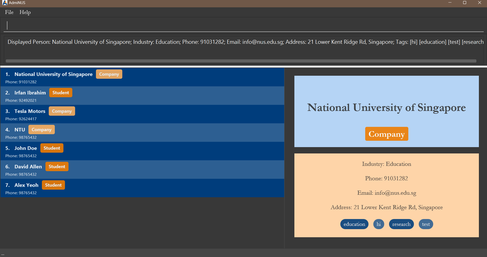
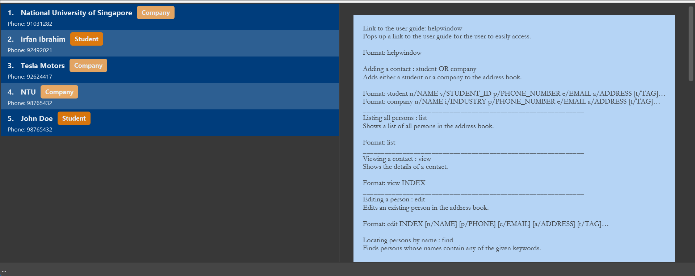
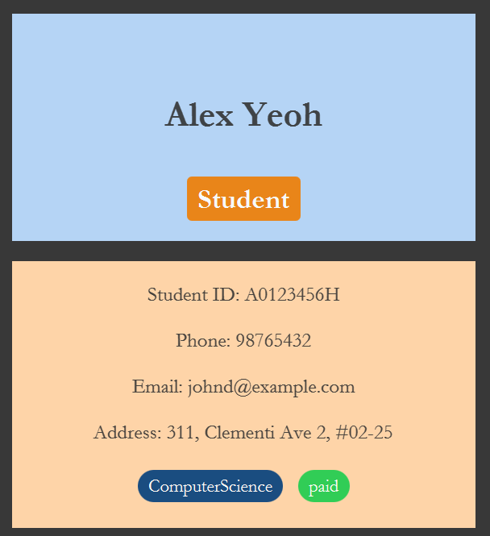

AdmiNUS is a contact management tool designed for NUS club administrators, student leaders, and event coordinators. It provides an easy and efficient way to manage contacts via a Command Line Interface (CLI), making it perfect for users who prefer typing over navigating complex menus.

---

## Table of Contents

- [Quick start](#Quick-start)
- [Features](#Features)

  - [Basic Commands](#basic-commands)
    - [Viewing help: `help`](#viewing-help-help)
    - [Link to the user guide: `helpwindow`](#link-to-the-user-guide-helpwindow)
    - [Listing all contacts: `list`](#listing-all-contacts-list)
    - [Viewing a contact: `view`](#viewing-a-contact-view)
    - [Clearing all entries: `clear`](#clearing-all-entries-clear)
    - [Exiting the program: `exit`](#exiting-the-program-exit)
  - [Contact Management](#contact-management)
    - [Adding a student: `student`](#adding-a-student-student-)
    - [Adding a company: `company`](#adding-a-company-company)
    - [Editing a contact: `edit`](#editing-a-contact-edit)
    - [Deleting contact(s): `delete`](#deleting-contacts-delete)
  - [Advanced Commands](#advanced-commands)
    - [Locating persons by name: `find`](#locating-persons-by-name-find)
    - [Filtering contacts by tag: `filtertag`](#filtering-contacts-by-tags-filtertag)
    - [Tracking contacts by category: `track`](#tracking-contacts-by-category-track)
    - [Adding tag(s) to contact: `tag`](#adding-tags-to-contact-tag)
    - [Deleting tag(s) from contact: `deletetag`](#deleting-tags-from-contact-deletetag)
  - [File Operations](#file-operations)
    - [Importing CSV files: `import`](#importing-csv-files-import)
    - [Exporting CSV files: `export`](#exporting-csv-files-export)

- [Glossary](#glossary)
- [FAQ](#faq)
- [Known issues](#known-issues)
- [Command summary](#command-summary)

---

## Quick start

1. Ensure you have Java `17` or above installed in your Computer.

2. Download the latest `.jar` file from [here](https://github.com/AY2425S1-CS2103T-T14-2/tp/releases).

3. Copy the file to the folder you want to use as the _home folder_ for your AdmiNUS.

4. Open a command terminal, type `cd your_file_path` into the folder you put the jar file in, and use the `java -jar adminus.jar` command to run the application.<br>
   A GUI similar to the below should appear in a few seconds. Note how the app contains some sample data.<br>
   

5. Type the command into the command box and press "Enter" to execute it. e.g. typing **`help`** and pressing "Enter" will open the help window.<br>
   Some example commands you can try:

   - `list`: Lists all contacts.

   - `student n/John Doe id/A0123456Z p/98765432 e/johnd@example.com a/John street, block 123, #01-01`: Adds a student named `John Doe` to the AdmiNUS.

   - `delete 3`: Deletes the 3rd contact shown in the current list.

   - `clear`: Deletes all contacts.

   - `exit`: Exits the app.

6. Refer to the [Features](#features) below for details of each command.

---

## Features

<div markdown="block" class="alert alert-info">

🔔 **Notes about the command format**: <br>

- Words in `UPPER_CASE` are the parameters to be supplied by the user.<br>
  e.g. in `add n/NAME`, `NAME` is a parameter which can be used as `add n/John Doe`.

- Items in square brackets are optional.<br>
  e.g `n/NAME [t/TAG]` can be used as `n/John Doe t/friend` or as `n/John Doe`.

- Items with `…`​ after them can be used from zero times to multiple times.<br>
  e.g. `[t/TAG]…​` can be used as:

  - ` ` (i.e. 0 times),
  - `t/paid` (i.e. 1 times),
  - `t/paid t/Computing` (i.e. 2 times), or
  - `t/paid t/Computing t/year2 t/CS2103T t/SWE` (i.e. 5 times) etc.

- Parameters can be in any order.<br>
  e.g. if the command specifies `n/NAME p/PHONE_NUMBER`, `p/PHONE_NUMBER n/NAME` is also acceptable.

- Extraneous parameters for commands that do not take in parameters (such as `help`, `list`, `exit` and `clear`) will be ignored.<br>
  e.g. if the command specifies `help 123`, it will be interpreted as `help`.

- If you are using a PDF version of this document, be careful when copying and pasting commands that span multiple lines as space characters surrounding line-breaks may be omitted when copied over to the application.

</div>

### Basic Commands

#### Viewing help: `help`

Shows a message explaining the various commands available.

**Format**: `help`




#### Link to the user guide: `helpwindow`

Pops up a window, where there is a link to the user guide for the user to easily access.

**Format**: `helpwindow`


#### Listing all contacts: `list`

Shows a list of all persons in AdmiNUS.

**Format**: `list`


#### Viewing a contact: `view`

Shows the details of a contact.

**Format**: `view INDEX`

**Example**:

- `view 1` shows the details of the first contact in the list.


#### Clearing all entries: `clear`

Clears all entries from AdmiNUS.

**Format**: `clear`

#### Exiting the program: `exit`

Exits the program.

**Format**: `exit`

---

### Contact Management

#### Adding a student: `student`

Adds a student to AdmiNUS.

**Format**:

```shell
student n/NAME id/STUDENT_ID p/PHONE_NUMBER e/EMAIL a/ADDRESS [t/TAG]…​
```

| Parameter Name   | Description                                                                              | Required   |
| ---------------- | ---------------------------------------------------------------------------------------- | ---------- |
| `n/NAME`         | Name of the student                                                                      | Compulsory |
| `id/STUDENT_ID`  | Student ID issued by NUS (must be 7 digits enclosed with two alphabets, e.g., A1234567Z) | Compulsory |
| `p/PHONE_NUMBER` | Contact number                                                                           | Compulsory |
| `e/EMAIL`        | Email address                                                                            | Compulsory |
| `a/ADDRESS`      | Physical address                                                                         | Compulsory |
| `t/TAG`          | Tags to categorize contact (cannot contain spaces)                                       | Optional   |

<div markdown="span" class="alert alert-info"> 🔔 **Note**: Each student is uniquely identified by their Student ID, meaning you cannot add multiple students with the same Student ID. </div>

<div markdown="span" class="alert alert-primary">💡 **Tip:**
A student can have any number of tags (including 0).
</div>

**Examples**:

- `student n/John Doe id/A0123456X p/98765432 e/johnd@example.com a/John street, block 123, #01-01` adds a student named John Doe to AdmiNUS


#### Adding a company: `company`

Adds a company to AdmiNUS.

**Format**:

```
company n/NAME i/INDUSTRY p/PHONE_NUMBER e/EMAIL a/ADDRESS [t/TAG]…​`
```

| Parameter Name   | Description                                        | Required   |
| ---------------- | -------------------------------------------------- | ---------- |
| `n/NAME`         | Name of the company                                | Compulsory |
| `i/INDUSTRY`     | Industry type (e.g., Security, Education)          | Compulsory |
| `p/PHONE_NUMBER` | Contact number                                     | Compulsory |
| `e/EMAIL`        | Email address                                      | Compulsory |
| `a/ADDRESS`      | Physical address                                   | Compulsory |
| `t/TAG`          | Tags to categorize contact (cannot contain spaces) | Optional   |

<div markdown="span" class="alert alert-info"> 🔔 **Note**: Each company is uniquely identified by a combination of its name and industry, meaning you cannot add multiple companies with the same name and the same industry. However, companies with the same name but different industries are allowed. </div>

Example:

- Company name: `Tesla`, Industry:`Automotives` and Company name: `Tesla`, Industry: `Education` is acceptable.
- Company name: `Tesla`, Industry:`Automotives` and Company name: `Tesla`, Industry:`Automotives` is NOT acceptable.

<div markdown="span" class="alert alert-primary">💡 **Tip:**
A company can have any number of tags (including 0)
</div>

Examples:

- `company n/Newgate Prison i/Security e/newgateprison@example.com a/Newgate Prison p/1234567 t/prison facility` adds a company name Newgate Prison to AdmiNUS


#### Editing a contact: `edit`

Edits an existing contact in AdmiNUS.

**Format**:

```
edit INDEX [n/NAME] [id/STUDENT_ID] [i/INDUSTRY] [p/PHONE] [e/EMAIL] [a/ADDRESS] [t/TAG]…​
```

| Parameter Name   | Description                                                   | Required   |
| ---------------- | ------------------------------------------------------------- | ---------- |
| `INDEX`          | Index number of the contact to edit                           | Compulsory |
| `n/NAME`         | Updated name of the contact                                   | Optional   |
| `id/STUDENT_ID`  | Updated student ID (for students only)                        | Optional   |
| `i/INDUSTRY`     | Updated industry type (for companies only)                    | Optional   |
| `p/PHONE_NUMBER` | Updated phone number                                          | Optional   |
| `e/EMAIL`        | Updated email address                                         | Optional   |
| `a/ADDRESS`      | Updated physical address                                      | Optional   |
| `t/TAG`          | Updated tags (replaces existing tags, cannot contains spaces) | Optional   |

<div markdown="block" class="alert alert-info">

🔔 **Notes**: <br>

- The index refers to the index number shown in the displayed person list. The index must be a positive integer (1, 2, 3, ...).

- At least one of the optional fields must be provided.

- For student contact, editing industry field is **prohibited**.

- For company contact, editing student id field is **prohibited**.

- Existing values will be updated to the input values.

- When editing tags, the existing tags of the person will be removed i.e adding of tags is not cumulative.

</div>

**Examples**:

- `edit 1 p/91234567 e/johndoe@example.com` Edits the phone number and email address of the 1st contact to be `91234567` and `johndoe@example.com` respectively.
- `edit 2 n/Betsy Crower t/` Edits the name of the 2nd person to be `Betsy Crower` and clears all existing tags.

<div markdown="span" class="alert alert-primary">💡 **Tip**:

You can remove all the person’s tags by typing `t/` without
specifying any tags after it. </div>


#### Deleting contact(s): `delete`

Deletes the contact(s) at the specified indices from AdmiNUS.

**Format**: `delete INDEX [MORE_INDEX]…​`

| Parameter Name | Description                                                         | Required   |
| -------------- | ------------------------------------------------------------------- | ---------- |
| `INDEX`        | Index number of the contact to delete or `all` to delete all contacts from the list                               | Compulsory |
| `MORE_INDEX`   | Additional index numbers of contacts to delete (separate by spaces) | Optional   |

<div markdown="block" class="alert alert-info">

🔔 **Notes**: <br>

- Split the indices by spaces.

- The index refers to the index number shown in the displayed person list.

* The index must be a positive integer (1, 2, 3, ...).

* `delete all` deletes all contacts currently shown in the list, not all contacts in the database.

</div>

<div markdown="span" class="alert alert-primary">💡 **Tip**:

To delete all students with the `oneYearMembership` tag, simply use `filtertag t/oneYearMembership` followed by `delete all`
 </div>

**Examples**:

* `list` followed by `delete 2 3` deletes the 2nd and 3rd contacts in AdmiNUS
* `find Betsy` followed by `delete all` deletes all contacts in the results of the `find` command.

---

### Advanced Commands

#### Locating persons by name: `find`

Finds persons whose names contain any of the given keywords.

**Format**: `find KEYWORD [MORE_KEYWORDS]…​`

| Parameter Name | Description                                       | Required   |
|----------------|---------------------------------------------------| ---------- |
| `KEYWORD`      | Keyword of the contact's name to search           | Compulsory |
| `MORE_KEYWORD` | Additional keyword to search (separate by spaces) | Optional   |

<div markdown="block" class="alert alert-info">

🔔 **Notes**: <br>

- The search is case-insensitive. For example, `hans` will match `Hans`.

- The order of the keywords does not matter. e.g. `Hans Bo` will match `Bo Hans`.

- Only the name is searched.

- Only full words will be matched e.g. `Han` will not match `Hans`.

- Persons matching at least one keyword will be returned (i.e. `OR` search). <br>
  e.g. `Hans Bo` will return `Hans Gruber`, `Bo Yang`.

</div>

**Examples**:

- `find John` returns `john` and `John Doe`
- `find alex david` returns `Alex Yeoh`, `David Allen`<br>

  

#### Filtering contacts by tags: `filtertag`

Finds contacts whose tags are the same as the specified keyword.

**Format**: `filtertag KEYWORD [MORE_KEYWORD]…​`

| Parameter Name | Description                                                       | Required   |
|----------------|-------------------------------------------------------------------| ---------- |
| `KEYWORD`      | Keyword of the tag's name to filter through the list of contacts. | Compulsory |
| `MORE_KEYWORD` | More keywords to filter                                           | Optional   |

**Examples**:

- `filtertag paidFee` finds contacts who have tags saved as `paidFee`


#### Tracking contacts by category: `track`

Tracks and lists all contacts who are in the category of the specified keyword.

| Parameter Name | Description                         | Required   |
|----------------|-------------------------------------| ---------- |
| `CATEGORY`     | Either student or company to filter | Compulsory |

**Examples**:

- `track student` finds contacts with category `student`
- `track company` finds contacts with category `company`


<div markdown="block" class="alert alert-info">

🔔 **Notes**: <br>

- `CATEGORY` must be from the predefined list of categories (student or company).

- `CATEGORY` is case-insensitive. For example, `student` will match `Student`.

- Only full words will be matched e.g. `student` will not match `students`.

</div>


#### Adding tag(s) to contact: `tag`
Adds additional specified tag(s) to the specified contact or all contacts without overwriting existing tags.

**Format 1**: `tag INDEX t/TAG [t/MORE_TAG]…​`

| Parameter Name | Description                         | Required   |
|----------------|-------------------------------------|------------|
| `INDEX`        | Index number of the contact to tag  | Compulsory |
| `t/TAG`        | Tag to add to the specified contact | Compulsory |
| `t/MORE_TAG` |  More tags to add | Optional|

**Format 2**: `tag all t/TAG [t/MORE_TAG]…​`

| Parameter Name | Description                                                              | Required   |
|----------------|--------------------------------------------------------------------------|------------|
| `all`          | Indicates that the tagging operation applies to all contacts in the list | Compulsory |
| `t/TAG`        | Tag to add to every contact in the list                                  | Compulsory |
| `t/MORE_TAG`   | More tags to add                                                         | Optional|

* Adds specified `TAG` (and `MORE_TAG` if present) to all contacts in the list provided <br>
  no duplicate tag(s) are found in all contacts.

<div markdown="block" class="alert alert-info">

🔔 **Notes**: <br>

* The index refers to the index number shown in the displayed person list.
* The index **must be a positive integer** 1, 2, 3, …​
* The tag is case-insensitive. For example, `partner` will match `PartnEr`.
* Only full words will be matched e.g. `partner` will not match `partners`.
* The added tags are displayed on the contact in alphabetical order. <br>
  e.g. `t/partner t/education` will display `education` before `partner`.

</div>

**Examples**:

- `tag 1 t/computerScience t/Y2` adds the tags `computerScience` and `Y2` to the first contact in the list

<div markdown="span" class="alert alert-primary">💡 **Tip:**
Tag labelled with "paid" will have green background to indicate student has paid their membership fee.
</div>



#### Deleting tag(s) from contact: `deletetag`

Deletes the specified tag(s) from the specified contact.

**Format 1**: `deletetag INDEX t/TAG [t/MORE_TAG]`

| Parameter Name | Description                                  | Required   |
|----------------|----------------------------------------------|------------|
| `INDEX`        | Index number of the contact to delete tag    | Compulsory |
| `t/TAG`        | Tag to be deleted from the specified contact | Compulsory |
| `t/MORE_TAG` | More tags to be deleted                      | Optional|

<div markdown="block" class="alert alert-info">

🔔 **Notes**: <br>

* The index refers to the index number shown in the displayed person list.
* The index **must be a positive integer** 1, 2, 3, …​

</div>

**Format 2**: `deletetag ALL t/TAG [t/MORE_TAG]`

| Parameter Name | Description                                                               | Required   |
|----------------|---------------------------------------------------------------------------|------------|
| `ALL`          | Indicates that the deletion operation applies to all contacts in the list | Compulsory |
| `t/TAG`        | Tag to be deleted from every contact in the list associated with the tag  | Compulsory |
| `t/MORE_TAG`   | More tags to be deleted                                                   | Optional   |


**Examples**:

* `deletetag 1 t/senior t/Y2` deletes the `senior` and `Y2` tags from the first contact in the list
* `deletetag all t/senior t/Y2` deletes the `senior` and `Y2` tags from all contacts in the list

---

### File Operations

#### Importing CSV Files: `import`

**Format**: `import FILE_PATH`

**Absolute Path**:
- Specifies the full path from the root directory.
- **Unix/Linux/Mac**: `/home/user/data/hackers_2022.csv`
- **Windows**: `C:\\Users\\user\\data\\hackers_2022.csv`

**Relative Path**:
- Starts from the current working directory of the application.
- Example: `data/File.csv` or `./data/hackers_2022.csv`
- If the application runs in `/home/user/project`, `import data/File.csv` points to `/home/user/project/data/File.csv`.

**Examples**:
- Absolute: `import /home/user/data/hackers_2022.csv`
- Relative: `import ./data/hackers_2022.csv`

<div markdown="span" class="alert alert-info"> 📂 **Important Notes**:
- Windows paths use backslashes (e.g., `C:\\Users\\username\\data\\File.csv`).
- Verify file format and read permissions.
</div>

**Troubleshooting**:
- For errors like "file not found," confirm the path type (absolute vs. relative) and the file's existence.

#### Exporting CSV Files: `export`

**Format**: `export FILE_PATH`

**Absolute Path**:
- Specifies the full path, starting from the root directory.
- **Unix/Linux/Mac**: `/home/user/data/output_data.csv`
- **Windows**: `C:\\Users\\user\\data\\output_data.csv`

**Relative Path**:
- Refers to paths relative to the current directory.
- Example: `./data/Output.csv` saves to `data` in the current directory.

**Examples**:
- Absolute: `export /home/user/data/output_data.csv`
- Relative: `export ./data/Output.csv`

<div markdown="span" class="alert alert-info"> 📂 **Important Notes**:
- Ensure directories exist before exporting. For Windows, use `\\` or `\\`.
- Files may be overwritten without warning.
</div>

**Troubleshooting**:
- Confirm the file path is valid and distinguish between absolute and relative paths as needed. Adjust directory permissions if "permission denied" errors occur.

### Saving the data

AdmiNUS data are saved in the hard disk automatically after any command that changes the data. There is no need to save manually.

### Editing the data file

AdmiNUS data are saved automatically as a JSON file `[JAR file location]/data/addressbook.json`. Advanced users are welcome to update data directly by editing that data file.

<div markdown="span" class="alert alert-warning">:exclamation: **Caution:**
If your changes to the data file make its format invalid, AdmiNUS will discard all data and start with an empty data file at the next run. It is recommended to take a backup of the file before editing it.
Furthermore, certain edits can cause AdmiNUS to behave in unexpected ways (e.g., if a value entered is outside of the acceptable range). Therefore, edit the data file only if you are confident that you can update it correctly.
</div>


---

## Glossary

- **_Absolute Path_** : A full path that specifies the exact location of a file or directory from the root of the file system.
- **_Category_** : A label that represents the type of contact (e.g., student, company) used for filtering and sorting contacts.
- **_CLI (Command Line Interface)_** : A text-based user interface through which users interact with the application by typing commands.
- **_CSV (Comma-separated values)_** : A text file format that uses commas to separate values, and newlines to separate records.
- **_GUI (Graphical User Interface)_** : The part of the application that users interact with, which includes graphical components like command boxes and task lists.
- **_NUS Club Administrator_** : An NUS club admin user responsible for managing contacts of students, companies, etc.
- **_Relative Path_** : A file path that is relative to the current working directory of the user or application.
- **_Student ID_** : The student ID associated with each student in NUS. It has the format AxxxxxxxX (e.g. A0123456Z).
- **_Tag_** : A keyword or label associated with a contact that allows for easy grouping and filtering.

---

## FAQ

**Q**: How do I transfer my data to another computer?<br>
**A**: Install the app on the new computer, then replace its default data file with the data file from your previous AdmiNUS home folder.<br>
**Alternative Option**: Export your data to a CSV file from the original computer and import it on the new computer using the import command.

---

## Known issues

1. **When using multiple screens**, if you move the application to a secondary screen, and later switch to using only the primary screen, the GUI will open off-screen. The remedy is to delete the `preferences.json` file created by the application before running the application again.
2. **If you minimize the Help Window** and then run the `help` command (or use the `Help` menu, or the keyboard shortcut `F1`) again, the original Help Window will remain minimized, and no new Help Window will appear. The remedy is to manually restore the minimized Help Window.

---

## Command summary

| Action            | Format                                                                                              | Example                                                                                                             |
|-------------------|-----------------------------------------------------------------------------------------------------|---------------------------------------------------------------------------------------------------------------------|
| **Add a student** | `student n/NAME id/STUDENT ID p/PHONE_NUMBER e/EMAIL a/ADDRESS [t/TAG]…​`                           | `student n/James Ho id/A0123456X p/22224444 e/jamesho@example.com a/123, Clementi Rd, 1234665 t/friend t/colleague` |
| **Add a company** | `company n/NAME i/INDUSTRY p/PHONE_NUMBER e/EMAIL a/ADDRESS [t/TAG]…​`                              | `company n/Newgate Prison i/Security e/newgateprison@example.com a/Newgate Prison p/1234567 t/prison facility`      |
| **Clear**         | `clear`                                                                                             | `clear`                                                                                                             |
| **Delete**        | `delete INDEX [MORE_INDEX]`                                                                         | `delete 3` or `delete 2 4`                                                                                          |
| **Edit**          | `edit INDEX [n/NAME] [id/STUDENT ID] [i/INDUSTRY] [p/PHONE_NUMBER] [e/EMAIL] [a/ADDRESS] [t/TAG]…​` | `edit 2 n/James Lee e/jameslee@example.com`                                                                         |
| **Filtertag**     | `filtertag KEYWORD [MORE_KEYWORDS]`                                                                 | `filtertag bestie` or `filtertag bestie slay`                                                                       |
| **Find**          | `find KEYWORD [MORE_KEYWORDS]`                                                                      | `find James Jake`                                                                                                   |
| **List**          | `list`                                                                                              | `list`                                                                                                              |
| **Help**          | `help`                                                                                              | `help`                                                                                                              |
| **Help Window**   | `helpwindow`                                                                                        | `helpwindow`                                                                                                        |
| **Track**         | `track CATEGORY`                                                                                    | `track student`                                                                                                     |
| **View**          | `view INDEX`                                                                                        | `view 1`                                                                                                            |
| **Add tag**       | `tag INDEX t/TAG [t/MORE_TAG]`                                                                      | `tag 1 t/year2 t/computerScience`                                                                                   |
| **Delete tag**    | `deletetag INDEX t/TAG [t/MORE_TAG]`                                                                | `deletetag 1 t/senior t/Y2` or `deletetag all t/senior t/Y2`                                                        |
| **Import CSV**    | `import FILE_PATH`                                                                                  | `import C:\Users\user\data\File.csv` or `import data/File.csv`                                                      |
| **Export CSV**    | `export FILE_PATH`                                                                                  | `export C:\Users\user\data\File.csv` or `import data/File.csv`                                                      |
| **Exit**          | `exit`                                                                                              | `exit`                                                                                                              |

[Back to the top](#table-of-contents)
