layout: default.md
title: "User Guide"
pageNav: 3
---

# TechConnect User Guide

TechConnect is a **desktop app for managing internship applications, optimized for use via a Command Line Interface** (CLI) while still having the benefits of a Graphical User Interface (GUI). If you can are looking for job opportunities, TechConnect can help you manage your applications more efficiently than traditional GUI apps.

<!-- * Table of Contents -->
<page-nav-print />

---
# Table of Contents

1. [Glossary](#glossary)
2. [Quick start](#quick-start)
3. [Features](#features)
    1. [Viewing help : `help`](#viewing-help--help)
    2. [Adding a company: `add`](#adding-a-company-add)
        - [Special Tag Values](#special-tag-values)
    3. [Listing all companies : `list`](#listing-all-companies--list)
    4. [Bookmarking a company : `bookmark`](#bookmarking-a-company--bookmark)
    5. [Removing a bookmark from a bookmarked company : `removebm`](#removing-a-bookmark-from-a-bookmarked-company--removebm)
    6. [Listing all bookmarked companies : `bmlist`](#listing-all-bookmarked-companies--bmlist)
    7. [Editing a company : `edit`](#editing-a-company--edit)
    8. [Editing a company's remark : `remark`](#editing-a-companys-remark--remark)
    9. [Locating companies by name: `find`](#locating-companies-by-name-find)
    10. [Deleting a company : `delete`](#deleting-a-company--delete)
    11. [Editing an application status: `status`](#editing-an-application-status-status)
    12. [Clearing all entries : `clear`](#clearing-all-entries--clear)
    13. [Exiting the program : `exit`](#exiting-the-program--exit)
3. [FAQ](#faq)
4. [Command Summary](#command-summary)
---
## Glossary

| Term                     | Definition                                                                                                                                                                                   |
|--------------------------|----------------------------------------------------------------------------------------------------------------------------------------------------------------------------------------------|
| **Command Line Interface (CLI)** | A text-based user interface that allows users to type commands to perform specific tasks, rather than using graphical elements like buttons.                                         |
| **Graphical User Interface (GUI)** | A visual interface that includes graphical elements (such as windows, icons, and buttons) for users to interact with applications.                                                    |
| **JSON (JavaScript Object Notation)** | A lightweight data-interchange format often used for data storage and communication between applications. TechConnect saves data in JSON format for easy access and modification. |
| **Parameter**            | Information or input provided to a command to specify how it should operate. For example, in `add n/NAME`, `NAME` is a parameter that specifies the company name to add.                    |
| **Jar File (.jar)**      | A Java ARchive file, which is a package file format used to distribute Java applications. Running the `.jar` file will start the TechConnect application.                                  |
---
## Quick start

1. Ensure you have Java `17` or above installed in your Computer.

2. Download the latest `.jar` file from [here](https://github.com/AY2425S1-CS2103T-F10-4/tp/releases).

3. Copy the file to the folder you want to use as the _home folder_ for TechConnect.

4. Open a command terminal, `cd` into the folder you put the jar file in, and use the `java -jar techconnect.jar` command to run the application.<br>
   A GUI similar to the below should appear in a few seconds. Note how the app contains some sample data.<br>
   

5. Type the command in the command box and press Enter to execute it. e.g., typing **`help`** and pressing Enter will open the help window.<br>
   Some example commands you can try:
    - `list` : Lists all companies.
    - `add n/Google p/98765432 e/google@example.com a/John street, block 123, #01-01 cp/www.google-career-url.com r/Search engine giant t/Tech` : Adds a company named `Google` to the Address Book.
    - `bookmark 1` : Bookmarks the 1st company shown in the current list.
    - `bmlist` : Shows a list of all the bookmarked companies in the address book.
    - `edit 2 p/91234567 e/grab@example.com` : Edits the phone number and email address of the 2nd company to be 91234567 and grab@example.com respectively.
    - `remark 3 r/Has good internship opportunities` : Edits the remark of the 3rd company to Has good internship opportunities.
    - `find Google` :  Finds companies whose name contain Google.
    - `delete 4` : Deletes the 4th company shown in the current list.
    - `status 5 as/Applied` : Edits the application status of the 5th company at index 5 to `Applied`
    - `clear` : Deletes all companies.
    - `exit` : Exits the app.

6. Refer to the [Features](#features) below for details of each command.
7. Refer to the [Glossary](#Glossary) for any unfamiliar terms.

---

## Features
### Notes about the Command Format

| Format Note                                                                                                                                                                                                                      | Example                                                                                                                                                                             |
|----------------------------------------------------------------------------------------------------------------------------------------------------------------------------------------------------------------------------------|-------------------------------------------------------------------------------------------------------------------------------------------------------------------------------------|
| Words in `UPPER_CASE` are parameters to be supplied by the user.                                                                                                                                                                 | e.g., in `add n/NAME`, `NAME` is a parameter which can be used as `add n/Google`.                                                                                                   |
| Items in square brackets are optional.                                                                                                                                                                                           | e.g., `n/NAME [t/TAG]` can be used as `n/Google t/bigTech` or as `n/Google`.                                                                                                        |
| Items with `…` after them can be used multiple times, including zero times.                                                                                                                                                      | e.g., `[t/TAG]…` can be used as ` ` (i.e., 0 times), `t/bigTech`, `t/bigTech t/BigCompany`, etc.                                                                                    |
| Parameters can be in any order.                                                                                                                                                                                                  | e.g., if the command specifies `n/NAME p/PHONE_NUMBER`, `p/PHONE_NUMBER n/NAME` is also acceptable.                                                                                 |
| Extraneous parameters for commands that do not take in parameters (such as `help`, `list`, `exit`, and `clear`) will be ignored.                                                                                                 | e.g., if the command specifies `help 123`, it will be interpreted as `help`.                                                                                                        |
| If you are using a PDF version of this document, be careful when copying and pasting commands that span multiple lines, as space characters surrounding line-breaks may be omitted when copied over to the application.            | N/A                                                                                                                                                                                 |
---
### Viewing help : `help`

Shows a message explaining how to access the help page.

Format: `help`


[Back to Table of Contents](#table-of-contents)

---


### Adding a company: `add`

Adds a company to the address book.

Format: `add n/NAME p/PHONE_NUMBER e/EMAIL a/ADDRESS cp/CAREER_PAGE_URL r/REMARK [t/TAG] …​`

**Tip:** A company can have any number of tags (including 0)
**Note:** The company name is not case-sensitive, both `Google` and `google` are the same

**Example**:

```
add n/Google p/98765432 e/google@example.com a/John street, block 123, #01-01 
cp/www.google-career-url.com r/Dream job
```
**Outcome**:

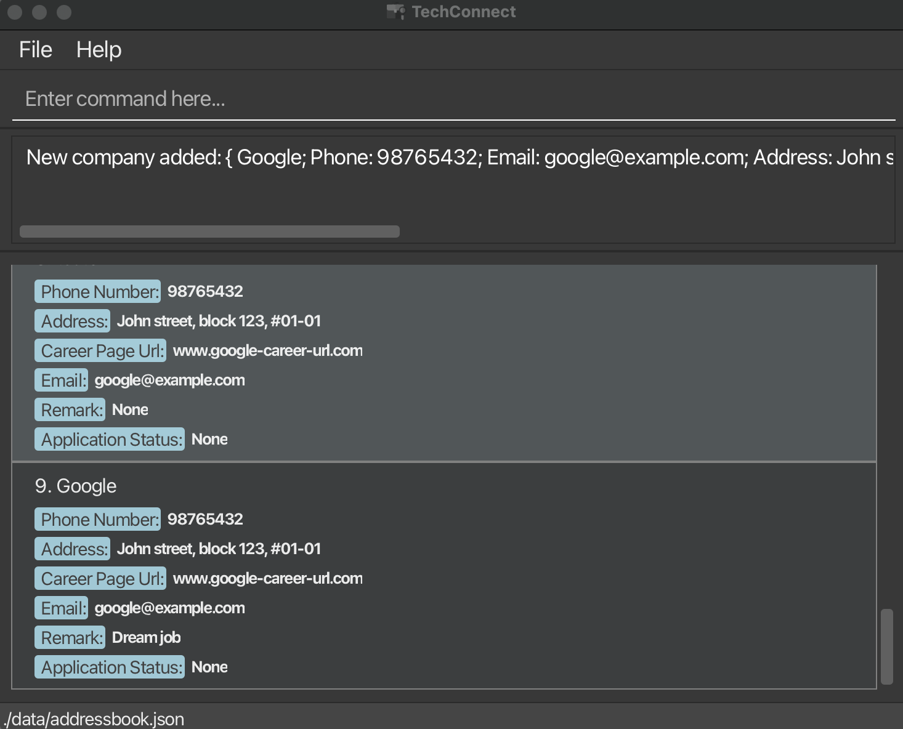

```
add n/Meta t/bigTech e/meta@example.com a/Newgate Prison 
p/1234567 t/salary_high cp/www.meta-career-url.com r/Leading tech company
```
**Outcome**:


[Back to Table of Contents](#table-of-contents)

---

### Special Tag Values

When using the `add` command, certain **tags** have special values.
Each Company can only have 1 tag for each type (e.g. can't have 2 Salary Tags)
**only the first tag value will be recorded** and any extra tags will be ignored

Below are the supported categories:

##### 1. Salary, Work-Life Balance, and Interview Difficulty Tags

These tags represent qualitative levels. The valid VALUES for these tags are:

- **Low**
- **Medium**
- **High**

These tags must be written using the following format (note the underscore):

- Salary tag: `t/salary_VALUE`
- Difficulty tag: `t/difficulty_VALUE`
- Work-Life Balance tag: `t/wlb_VALUE`

**Note:** Any additional underscores or characters after the given format, 
like in `t/salary_VALUE_extra`, will be ignored.

**Example:**
```
add n/Google p/98765432 e/google@example.com a/John street, block 123, 
#01-01 cp/www.google-career-url.com r/ t/salary_high t/wlb_medium t/difficulty_medium
```
**Outcome**:

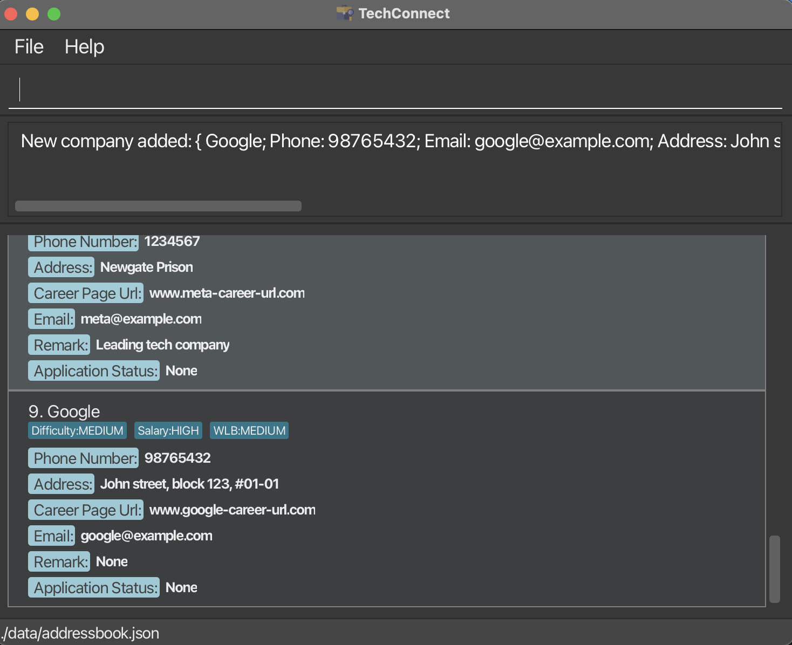

---

##### 2. **Period Tag**

The **`Period`** tag is used to specify:

- **SEASON**:

    - **Summer**
    - **Winter**
    - **Part-time**

- **YEAR**: Any year between **2000 and 2500**

Tag format: `t/period_SEASON_YEAR`

**Note:** Any additional underscores or characters after the given format,
like in `t/period_SEASON_YEAR_hello`, will be ignored.

**Example:**
```
add n/Shopee p/98765432 e/shopee@example.com a/John street, block 123, #01-01 r/ 
cp/www.shopee-career-url.com t/period_summer_2025
```
**Outcome**:


##### **Unsupported and Invalid Tag values**

- Only alphanumeric characters are allowed in the tag
- If you attempt to create tags with values that aren't in the supported list given above, the tag will appear
with whatever value you input. Example ```t/helloworld``` creates a tag called "helloworld".

Other Invalid tag example:
- Trying to create a tag like ```t/mytag_high``` or ```t/mytag high```  will fail as we will treat your tag value
as ```mytag_high``` and ```mytag high``` and the underscore/spacing is not a alphanumeric character

[Back to Table of Contents](#table-of-contents)

---

### Listing all companies : `list`

Shows a list of all companies in the address book.

Format: `list`

[Back to Table of Contents](#table-of-contents)

---
### Bookmarking a company : `bookmark`

Bookmarks a company in the address book.

Format: `bookmark INDEX`

- Bookmarks the company at the specified `INDEX`.
- The index refers to the index number shown in the displayed company list.
- The index **must be a positive integer** 1, 2, 3, …​, 
  - a negative integer will result in an invalid command message.
- Only one company can be bookmarked at a time using the command.
  - `bookmark 1 2 3` will result in an invalid command error message.

**Example**:
```dtd
bookmark 1
```
**Outcome**:

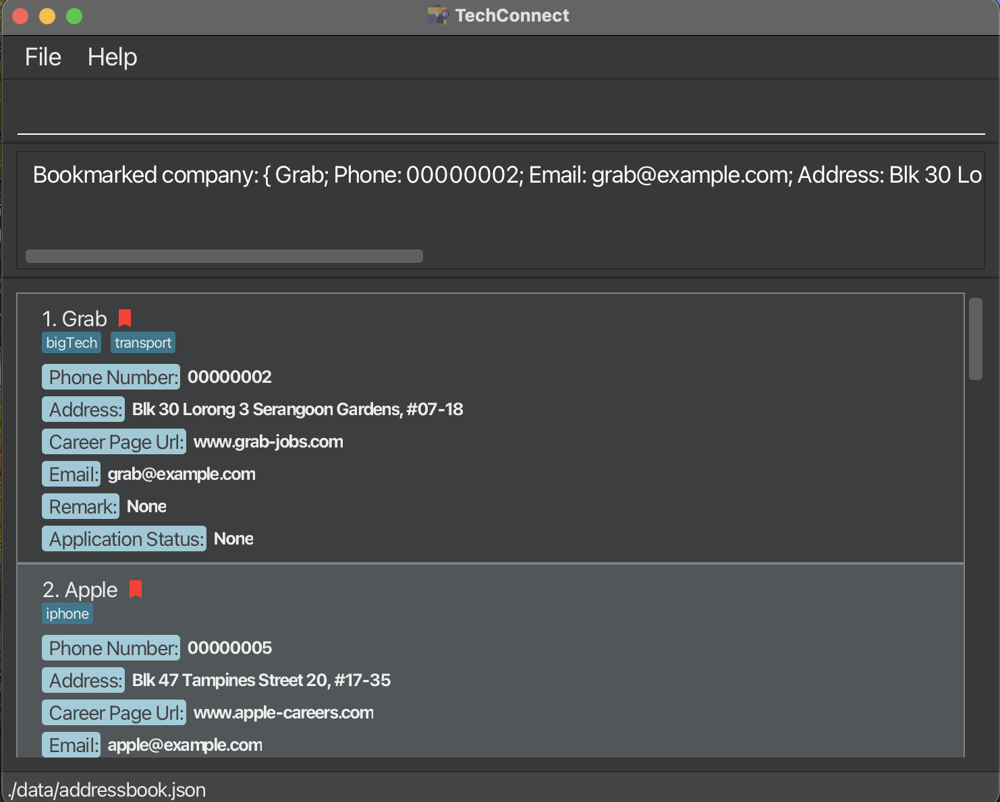

[Back to Table of Contents](#table-of-contents)

---
### Removing a bookmark from a bookmarked company : `removebm`

Removes a company from the list of bookmarked companies in the address book.

Format: `removebm INDEX`

- Removes a bookmark from a bookmarked company at the specified `INDEX`.
- The index refers to the index number shown in the displayed company list.
- The index **must be a positive integer** 1, 2, 3, …​
  - a negative integer will result in an invalid command message.

**Example**:
```dtd
removebm 1
```
**Outcome**:


[Back to Table of Contents](#table-of-contents)

---

### Listing all bookmarked companies : `bmlist`

Shows a list of all the bookmarked companies in the address book.

Format: `bmlist`

**Example**:
```dtd
bmlist
```

**Outcome**:

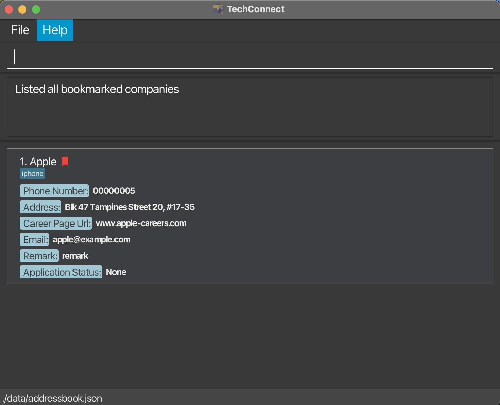

[Back to Table of Contents](#table-of-contents)

---

### Editing a company : `edit`

Edits an existing company in the address book.

Format: `edit INDEX [n/NAME] [p/PHONE_NUMBER] [e/EMAIL] [a/ADDRESS] [cp/CAREER_PAGE_URL] [t/TAG] …​`

- Edits the company at the specified `INDEX`. The index refers to the index number shown in the displayed company list. The index **must be a positive integer** 1, 2, 3, …​
- The index **must be a positive integer** 1, 2, 3, …​
  - a negative integer will result in an invalid command message.
- At least one of the optional fields must be provided.
- Existing values will be updated to the input values.
- When editing tags, the existing tags of the company will be removed; i.e., adding of tags is not cumulative.
- You can remove all the company’s tags by typing `t/` without specifying any tags after it.

**Examples**:

```
edit 1 p/91234567 e/grab@example.com
```
Edits the phone number and email address of the 1st company to be `91234567` and `grab@example.com` respectively.

**Outcome**:

**Before**

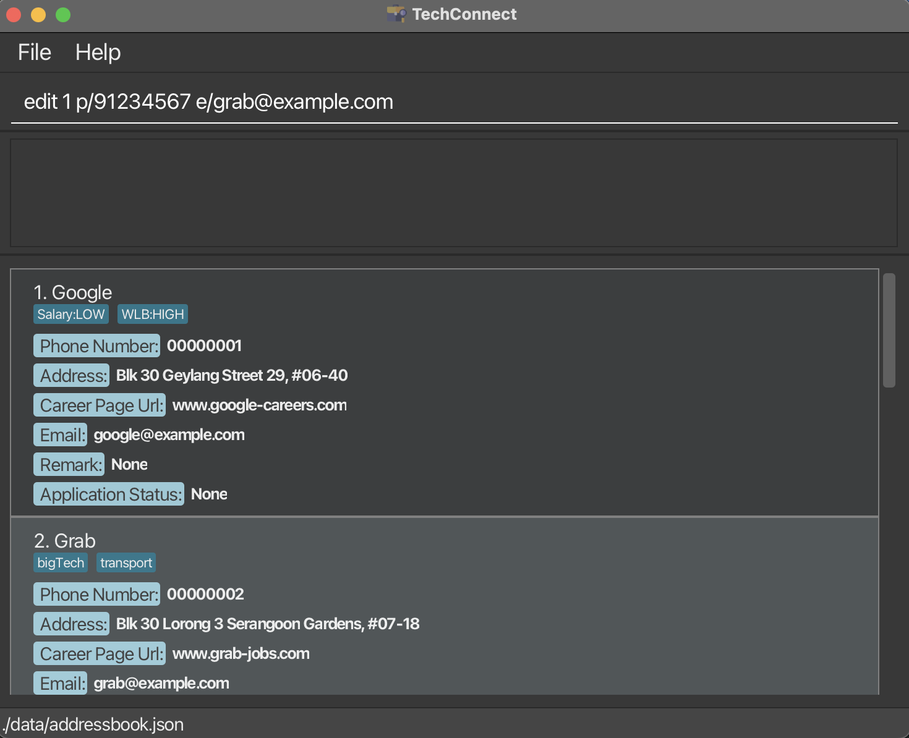

**After**

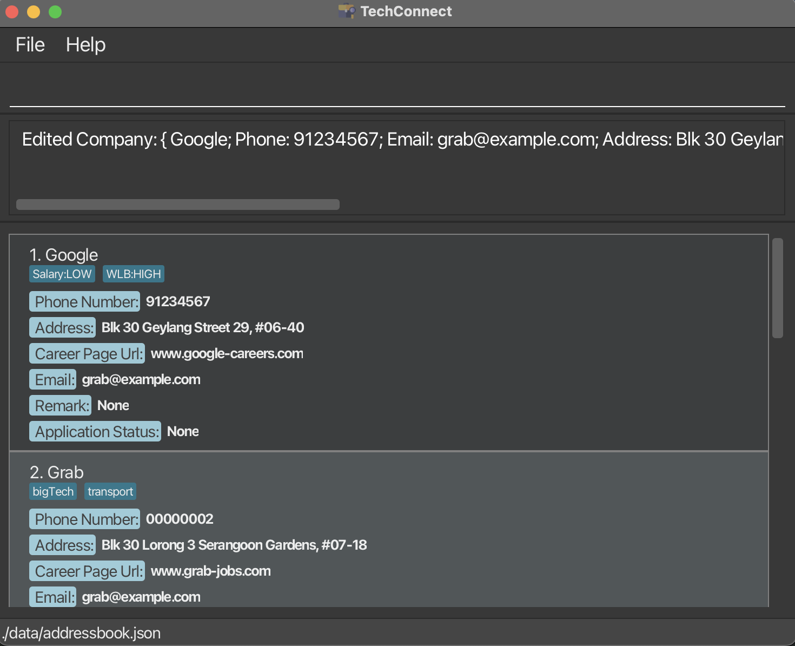

[Back to Table of Contents](#table-of-contents)

--- 

### Editing a company's remark : `remark`

Adds or edits the remark of an existing company in the address book.

Format: `remark INDEX r/REMARK`

- Edits the remark of the company at the specified `INDEX`.
- The index refers to the index number shown in the displayed company list.
- The index **must be a positive integer** 1, 2, 3, …​
  - a negative integer will result in an invalid command message.
- Existing remark will be overwritten by the input.
- You can remove the company's remark by typing `remark INDEX r/` without specifying any text after `r/`.

**Examples**:

```dtd
remark 2 r/Has good internship opportunities
```
Edits the remark of the 2nd company to `Has good internship opportunities`.

**Outcome**:

**Before**


**After**


```
remark 3 r/
```
Removes the remark from the 3rd company.

**Outcome**:

**Before**

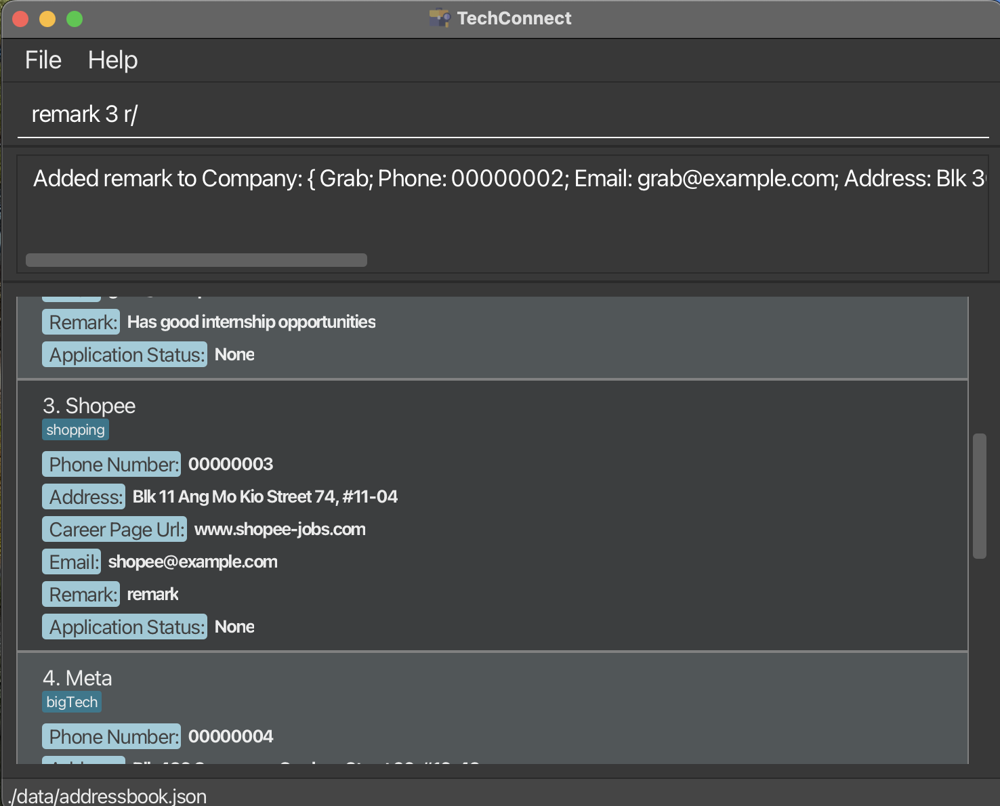

**After**

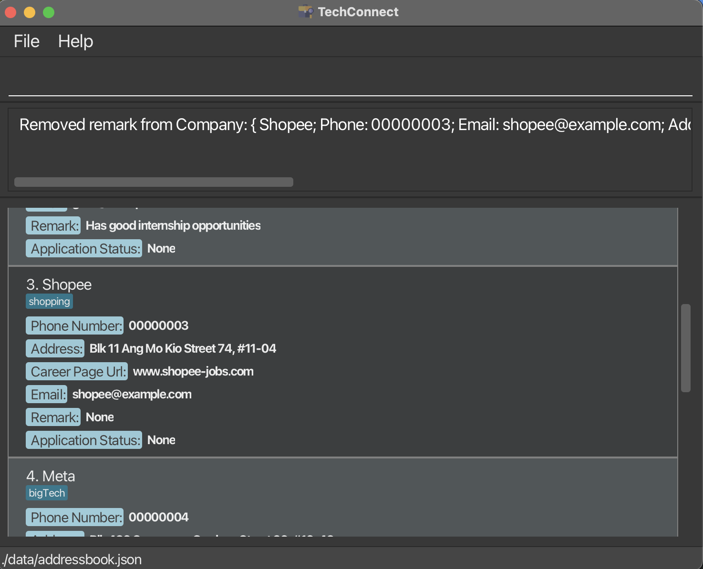

[Back to Table of Contents](#table-of-contents)

---
### Locating companies by name: `find`

Finds companies whose names or tags contain any of the given keywords.

Format: `find KEYWORD [MORE_KEYWORDS]…​`

- The search is case-insensitive. e.g., `google` will match `Google`
- The order of the keywords does not matter. e.g., `Google Amazon` will match `Amazon Google`
- Only the name and tags are searched.
- **Only full words will be matched** e.g., `Goog` will not match `Google`.
- Finding tag values requires you to provide the full tag value. e.g., 
`Salary:LOW` tag will not match `Salary` but matches `Salary:LOW`
- Companies matching at least one keyword will be returned (i.e., `OR` search).
  e.g., `Grab Food` will return `Grab Ride`, `Food Panda`

**Examples**:

```
find bigTech
```
returns companies with bigTech tag

**Outcome**:

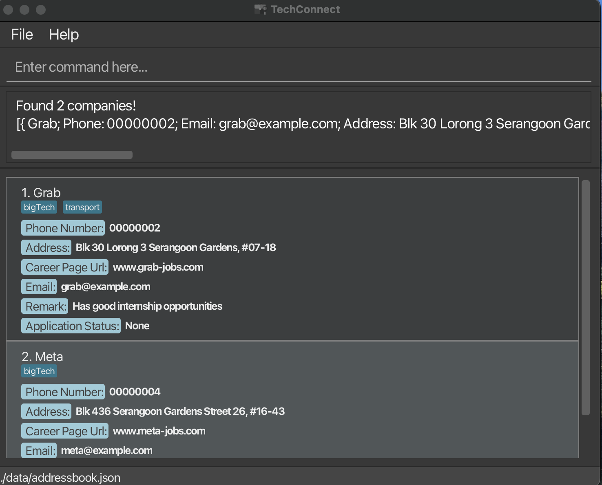

- `find Food` returns `Grab Food` and `Food Panda`
- `find Shop Fast` returns `Shop Back`, `Fast Food`<br>

[Back to Table of Contents](#table-of-contents)

---

### Deleting a company : `delete`

Deletes the specified company from the address book.

Format: `delete INDEX`

- Deletes the company at the specified `INDEX`.
- The index refers to the index number shown in the displayed company list.
- The index **must be a positive integer** 1, 2, 3, …​
  - a negative integer will result in an invalid command message.

Examples:

- `list` followed by `delete 2` deletes the 2nd company in the address book.
- `find Google` followed by `delete 1` deletes the 1st company in the results of the `find` command.

[Back to Table of Contents](#table-of-contents)

---
### Editing an application status: `status`

Edits the application status of a company.

Format: `status INDEX as/STATUS`

- Modifies the company at the specified `INDEX`.
- The index refers to the index number shown in the displayed company list.
- The index **must be a positive integer** 1, 2, 3, …​
  - a negative integer will result in an invalid command message.
- The `STATUS` can be any text that describes the current application status.
- You can remove the company's application status by typing `status INDEX as/` without specifying any text after `as/`.

**Examples**:

```
status 1 as/Applied
``` 
modifies the application status of the company at index 1 to `Applied`.
**Outcome**:

**Before**

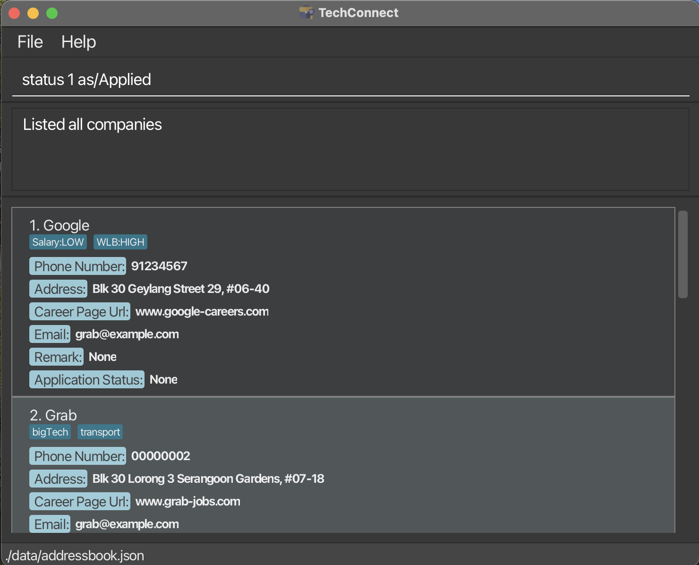

**After**

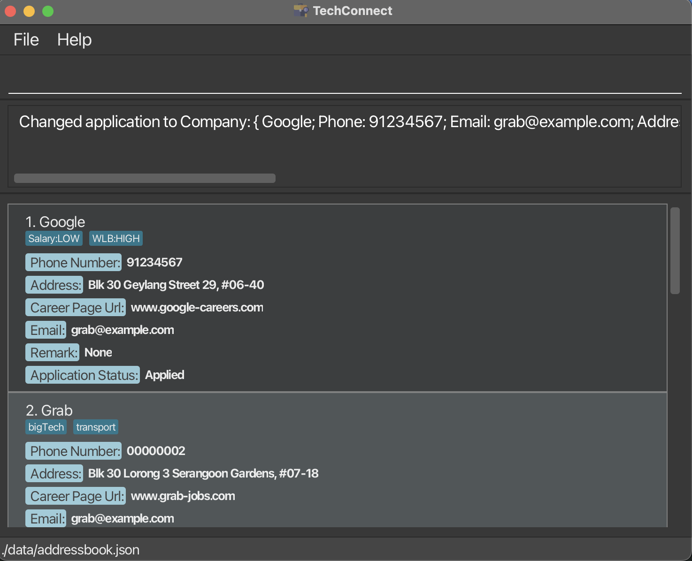

```
status 2 as/
``` 
Removes the remark from the 2nd company.

**Outcome**

**Before**

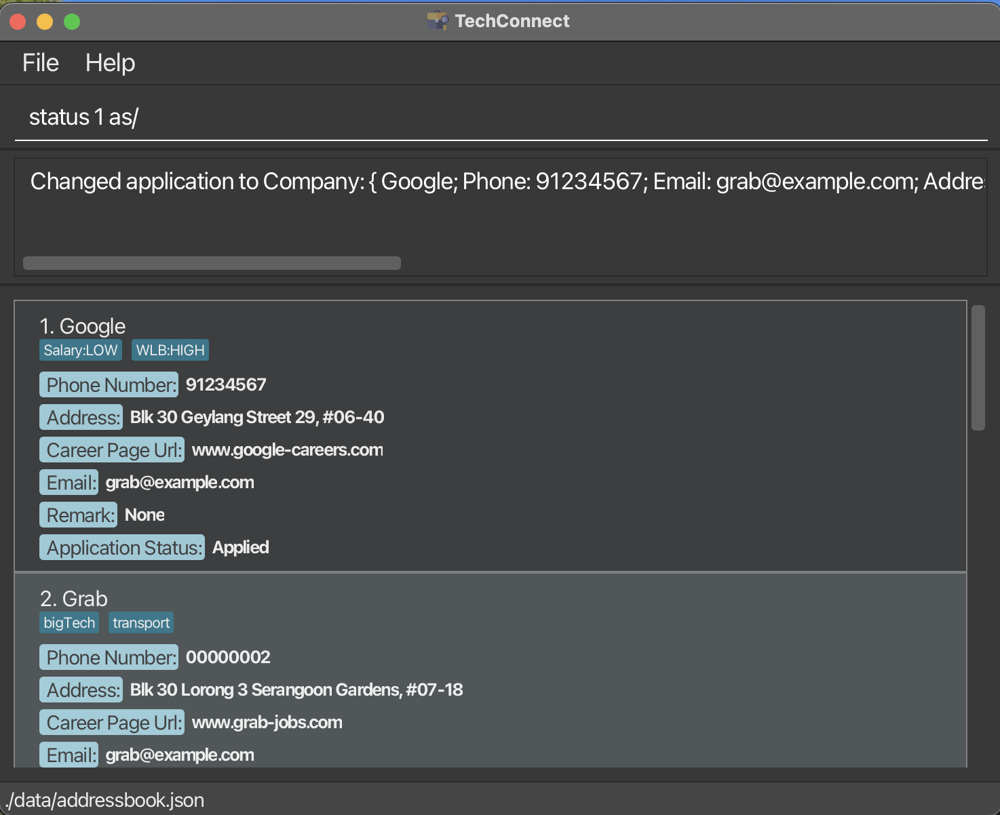

**After**


[Back to Table of Contents](#table-of-contents)

---
### Clearing all entries : `clear`

Clears all entries from the address book.

Format: `clear`

[Back to Table of Contents](#table-of-contents)

---

### Exiting the program : `exit`

Exits the program.

Format: `exit`

[Back to Table of Contents](#table-of-contents)

---
### Saving the data

TechConnect data are saved in the hard disk automatically after any command that changes the data. There is no need to save manually.

[Back to Table of Contents](#table-of-contents)

--- 

### Editing the data file

TechConnect data are saved automatically as a JSON file `[JAR file location]/data/addressbook.json`. Advanced users are welcome to update data directly by editing that data file.

**Caution:**
If your changes to the data file make its format invalid, TechConnect will discard all data and start with an empty data file at the next run. Hence, it is recommended to take a backup of the file before editing it.<br>
Furthermore, certain edits can cause the TechConnect to behave in unexpected ways (e.g., if a value entered is outside the acceptable range). Therefore, edit the data file only if you are confident that you can update it correctly.

[Back to Table of Contents](#table-of-contents)

---

## FAQ
**Q**: What platforms can TechConnect support?<br>
**A**: TechConnect is able to run on Windows, macOS and Linux environments. Please ensure that you have `Java 17` installed as stated in [Quick Start](#quick-start).

**Q**: Why is there data when I did not add any data when I launched the application?<br>
**A**: The data in TechConnect is sample data that already exists. The purpose is to allow users to try out the features of TechConnect based on sample data. To work on a fresh copy, simply use the `clear` command.

**Q**: How do I transfer my data to another computer?<br>
**A**: Install the app on the other computer and overwrite the empty data file it creates with the file that contains the data of your previous TechConnect home folder.

[Back to Table of Contents](#table-of-contents)

---

## Known issues

1. **When using multiple screens**, if you move the application to a secondary screen and later switch to using only the primary screen, the GUI will open off-screen.
- The remedy is to delete the `preferences.json` file created by the application before running the application again.
2. **If you minimize the Help Window** and then run the `help` command (or use the `Help` menu, or the keyboard shortcut `F1`) again, the original Help Window will remain minimized, and no new Help Window will appear. 
- The remedy is to manually restore the minimized Help Window.

[Back to Table of Contents](#table-of-contents)

---

## Command summary

| Action                        | Format, Examples                                                                                                                                                                                                                                        |
|-------------------------------|---------------------------------------------------------------------------------------------------------------------------------------------------------------------------------------------------------------------------------------------------------|
| **Add**                       | `add n/NAME p/PHONE_NUMBER e/EMAIL a/ADDRESS cp/CAREER_PAGE_URL r/REMARK [t/TAG]…​`<br>e.g., `add n/James Ho p/22224444 e/jamesho@example.com a/123, Clementi Rd, 1234665 cp/www.jamesho-career.com r/Looking forward to applying t/friend t/colleague` |
| **Bookmark**                  | `bookmark INDEX`<br>e.g., `bookmark 2`                                                                                                                                                                                                                  |
| **Remove bookmark**           | `removebm INDEX`<br>e.g., `removebm 2`                                                                                                                                                                                                                  |
| **Clear**                     | `clear`                                                                                                                                                                                                                                                 |
| **Delete**                    | `delete INDEX`<br>e.g., `delete 3`                                                                                                                                                                                                                      |
| **Edit**                      | `edit INDEX [n/NAME] [p/PHONE_NUMBER] [e/EMAIL] [a/ADDRESS] [cp/CAREER_PAGE_URL] [t/TAG]…​`<br>e.g.,`edit 2 n/James Lee e/jameslee@example.com`                                                                                                         |
| **Remark**                    | `remark INDEX r/REMARK`<br>e.g., `remark 2 r/Has good internship opportunities`                                                                                                                                                                         |
| **Find**                      | `find KEYWORD [MORE_KEYWORDS]…​`<br>e.g., `find James Jake`                                                                                                                                                                                             |
| **List**                      | `list`                                                                                                                                                                                                                                                  |
| **List bookmarked companies** | `bmlist`                                                                                                                                                                                                                                                |
| **Add application status**    | `status INDEX as/STATUS` <br>e.g., `status 2 as/Round 2 of interview`                                                                                                                                                                                   |
| **Help**                      | `help`                                                                                                                                                                                                                                                  |
[Back to Table of Contents](#table-of-contents)
