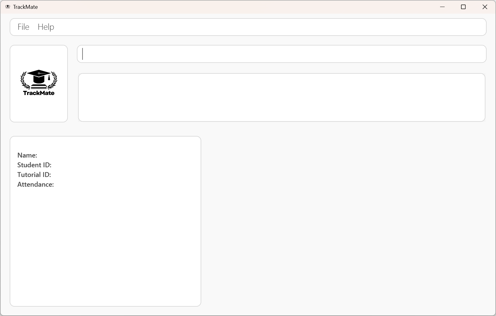
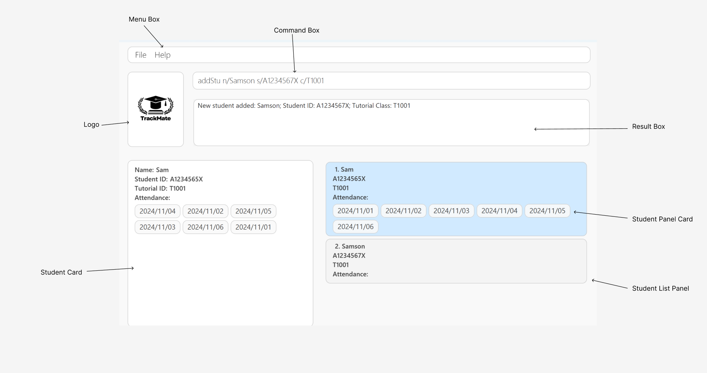

# TrackMate User Guide

## Welcome to the TrackMate User Guide

Welcome to the **TrackMate User Guide** - your essential supplementary tools in your teaching journey as a SOC
Teaching Assistant at National University of Singapore (NUS).

In this comprehensive user guide, we will take you to experience a full journey with TrackMate step by step.

--------------------------------------------------------------------------------------------------------------------

## Table of Content

[1. Introduction](#1-introduction)
- [1.1 What is TrackMate-NUS](#1-1-what-is-trackmate)
- [1.2 User Proficiency and Expectations](#1-2-user-proficiency-and-expectations)
- [1.3 Why This Guide Matters](#1-3-why-this-guide-matters)

[2. How to use this User Guide](#2-how-to-use-this-user-guide)
- [2.1 Navigating the Document](#2-1-navigating-the-document)
- [2.2 Sections](#2-2-sections)

[3. Getting Started](#3-getting-started)
- [3.1 Installation](#3-1-installation)
- [3.2 Graphical User Interface Layout](#3-2-graphical-user-interface-layout)
  - [3.2.1 User Interface Overview](#3-2-1-user-interface-overview)
  - [3.2.2 Additional UI Components](#3-2-2-additional-ui-components)
- [3.3 How to use TrackMate commands](#3-3-how-to-use-trackmate-commands)
  - [3.3.1 Parameter Prefixes](#3-3-1-parameter-prefixes)
  - [3.3.2 Parameters](#3-3-2-parameters)
  - [3.3.3 Command Format](#3-3-3-command-format)

[4. Commands](#4-commands)
- [4.1 Student Data Related Commands](#4-1-student-data-commands)
  - [4.1.1 Adding a student: `addStu`](#4-1-1-adding-a-student-addstu)
  - [4.1.2 Editing a student: `edit`](#4-1-2-edit-existing-student-detail-edit)
  - [4.1.3 Deleting a student: `deleteStu`](#4-1-3-delete-a-student-deletestu)
  - [4.1.4 Finding students: `find`](#4-1-4-find-students-find)
  - [4.1.5 Listing students: `list`](#4-1-5-listing-students-list)
- [4.2 Tutorial Data Related Commands](#4-2-tutorial-data-related-commands)
  - [4.2.1 Adding a tutorial: `addTut`](#4-2-1-adding-a-tutorial-addtut)
  - [4.2.2 Deleting a tutorial: `deleteTut`](#4-2-2-delete-a-tutorial-deletetut)
  - [4.2.3 Listing tutorials: `listTut`](#4-2-3-list-tutorials-listtut)
- [4.3 Assignment Data Related Commands](#4-3-assignment-data-related-commands)
  - [4.3.1 Adding an assignment: `addAsg`](#4-3-1-adding-an-assignment-addasg)
  - [4.3.2 Deleting an assignment: `deleteAsg`](#4-3-2-delete-an-assignment-deleteasg)
  - [4.3.3 Listing assignments: `listAsg`](#4-3-3-list-assignments-listasg)
  - [4.3.4 Marking an assignment: `markAsg`](#4-3-4-mark-an-assignment-markasg)
  - [4.3.5 Unmarking an assignment: `unmarkAsg`](#4-3-5-unmark-an-assignment-unmarkasg)
  - [4.3.6 Checking an assignment: `checkAsg`](#4-3-6-check-an-assignment-checkasg)
- [4.4 Attendance Data Related Commands](#4-4-attendance-data-related-commands)
  - [4.4.1 Marking an attendance: `markAtt`](#4-4-1-marking-an-attendance-markatt)
  - [4.4.2 Unmarking an attendance: `deleteAtt`](#4-4-2-unmarking-an-attendance-deleteatt)
- [4.5 General Commands](#4-5-general-commands)
  - [4.5.1 Viewing a Student on the Student Card](#4-5-1-viewing-a-student-on-the-student-card)
  - [4.5.2 Clearing all data: `clear`](#4-5-2-clearing-all-data-clear)
  - [4.5.3 Exiting the program: `exit`](#4-5-3-exiting-the-program-exit)
  - [4.5.4 Viewing help: `help`](#4-5-4-viewing-help-help)
- [4.6 Saving the Data](#4-6-saving-the-data)
- [4.7 Editing the Data File](#4-7-editing-the-data-file)

[5. FAQ](#5-faq)

[6. Known issues](#6-known-issues)

[7. Glossary](#7-glossary)

[8. Command summary](#8-command-summary)

--------------------------------------------------------------------------------------------------------------------

## 1. Introduction

### 1.1 What is TrackMate

TrackMate is a desktop application specifically designed for teaching assistants (TAs) who work at the School of
Computing (SoC) of National University of Singapore (NUS). By providing an efficient solution to manage student data,
TrackMate simplifies the process of tracking assignments, tutorials, and attendance. With its powerful Command Line
Interface (CLI), TrackMate allows TAs to efficiently manage student information while enhancing productivity in their
administrative tasks.

Overview of Main Features:
* Tutorial Management: Track student tutorial groups for each session.
* Attendance Monitoring: Record attendance effortlessly to ensure that student participation is logged accurately.
* Assignment Tracking: Easily add, update, and manage assignment submissions and statuses for students.

### 1.2 User Proficiency and Expectations

* Level of Relatedness: Users of TrackMate are TAs within SoC who are actively involved in managing students’
  academic progress, particularly in tutorials, assignments, and attendance tracking.

* Comprehension: Users are expected to have a working knowledge of academic processes such as student grading,
  tutorial scheduling, and attendance monitoring within the context of NUS.

* Prior Knowledge: TrackMate assumes users have basic computer proficiency, particularly in navigating CLI
  environments, and are comfortable managing data related to student performance.

* Desire for Efficiency: Users of TrackMate prioritize streamlined workflows, allowing them to manage student
  data effectively while reducing the time spent on repetitive tasks.

### 1.3 Why This Guide Matters

This guide is crafted to ensure that you make the most of TrackMate's functionality. Whether you are just starting
out or are an experienced TA, the guide will walk you through using the tool efficiently, offering shortcuts and tips
to enhance your experience. By following the steps outlined here, you'll be able to simplify your workflow, allowing
you to focus more on teaching and less on administrative tasks.

We’re here to help you make the most out of your TA experience with TrackMate. Let’s dive in and explore how TrackMate
can transform the way you manage student data at SoC!

--------------------------------------------------------------------------------------------------------------------

## 2. How to use this User Guide

This section is designed to help users effectively navigate the User Guide for TrackMate. Below, you'll find
information on how to interpret icons, formatting, and instructions provided throughout the document.

### 2.1 Navigating the Document:

- **Table of Contents:** Located at the beginning of the document, the Table of Contents provides an overview of the topics covered. Users can click on any section title to jump directly to that part of the guide.

- **Section Organization:** Each section is organized with headings and subheadings, breaking down information into manageable chunks. Users can easily locate specific topics or commands by scanning through the contents.

### 2.2 Sections:

Written below is a detailed overview of the main sections in this User Guide and what you can expect from each section.

- [Installation](#3-1-installation): New to TrackMate? Visit this section for a straightforward, step-by-step guide on installing the application.

- [Commands](#4-commands): Dive into the details of TrackMate's commands, with thorough explanations and practical examples to help you master command usage.

- [Command Summary](#8-command-summary): Designed for experienced users, this section provides a quick-reference list of all supported commands.

- [FAQ](#5-faq): If you have questions or encounter issues, this section covers frequently asked questions to help you resolve common concerns.

<box type="info" seamless>
First-time users are strongly encouraged to read the Getting Started section before beginning to use TrackMate.
</box>

--------------------------------------------------------------------------------------------------------------------
## 3. Getting Started

### 3.1 Installation

1. Ensure that you have Java `17` installed on your Computer. TrackMate works the best for the version,
   while there may be other versions that it can function on as well.

2. Download the latest `TrackMate.jar` file from the [link](https://github.com/AY2425S1-CS2103T-W08-1/tp/releases) here.

3. Move the file to the directory that you have as the home folder
   that you want to keep your `TrackMate.jar` file in.

4. Go to your command terminal by pressing Windows Key + R. A small window should pop up.

5. Then type in cmd into the box and press enter. A command terminal should pop up.

6. Navigate to the directory that holds the `TrackMate.jar` application by using the [cd command](https://www.ibm.com/docs/en/aix/7.1?topic=directories-changing-another-directory-cd-command).

7. After navigating to the directory, enter the `java -jar TrackMate.jar` command to run the application.

8. Wait a few seconds and a GUI should pop up, similar to the one shown below.

9. Type the command in the command box and press Enter to execute it. e.g. typing **`help`** and pressing Enter will open the help window. 
   Some example commands you can try:

* `list` : Lists all contacts.
* `addTut c/CS2103T c/T1001` : Adds a tutorial of name `CS2103T` and tutorial id `T1001`.
* `addStu n/Samson s/A1234567X c/T1001` : Adds a student to the application and assigns him to tutorial with tutorial id `T1001`.
* `markAtt s/A1234567X c/T1001 d/2024-01-24`: Adds student of id `A1234567X` attendance to the tutorial id `T1001` on the date `2024-01-24`.
* `clear` : Deletes all contacts.
* `exit` : Exits the app.

10. Refer to the [Command Section](#4-commands) below for details of
    all commands supported by TrackMate. Alternatively, refer to the [Command Summary](#8-command-summary) for a quick summary.

### 3.2 Graphical User Interface Layout:

#### 3.2.1 User Interface Overview:

The designated names for each component of the User Interface will be used consistently throughout the User Guide to ensure clarity and minimize confusion. Below is a detailed description of each component.

* **Menu Box:** Positioned at the top of the interface, the menu bar offers access to a variety of functions and features within TrackMate.

* **Logo:** This represents the logo of our application, TrackMate.

* **Command Box:** This designated area is where users can input commands for TrackMate to execute.

* **Result Box:** Prominently displayed on the interface, this box shows the results of executed commands.

* **Student List Panel:** This panel visually represents the roster of students stored within TrackMate.

* **Student Panel Card:** Within the Student List Panel, each student is depicted in a concise overview displayed in card format.

* **Student Card:** To view detailed information about an individual student, users can refer to the Student Card, which provides comprehensive details stored in the system.

#### 3.2.2 Additional UI Components:

* **Index:** This component indicates the position of each student in the Student List Panel.

* **Student Name:**  The Student Name appears in both the Student Card and Student Panel Card. It represents the name of the Student.

* **Student Id:** Every student will be assigned to a student id before being added to a system. Take note that the student id is unique and is an easy way to identify a student.
  
* **Tutorial Class allocated to student:** This component appears just below the student id. The component displays the tutorial class that the student is allocated to.
* Tutorial class are presented in the form of TXXXX, where "T" refers to a constant letter signifying that it is a tutorial and "X" refers to any integer between 0 and 9.
* However, if there are no tutorial class added to the student. Then it will display "No Tutorial Assigned" instead. 

* **Attendance Tag:** The attendance tag displays all of the dates in which the student has attended the tutorial class. 
* The tag uses a datetime format of the form `yyyy/mm/dd`.

* **Selected Student:** Highlighted in blue, this component indicates the selected Student Panel Card for viewing in the Student Card.

### 3.3 How to use TrackMate commands:

TrackMate operates primarily through text-based commands. Before we explore the specific commands in detail in the
Commands section, let’s familiarize ourselves with the basic components and format of a command.

#### 3.3.1 Parameter Prefixes:

In TrackMate, a parameter prefix acts as a delimiter for specifying different types of parameters in commands.
Here's a reference table for common parameter prefixes and their corresponding parameters:

| Parameter Prefix | Corresponding Parameter              |
|------------------|--------------------------------------|
| `n/`             | `STUDENT_NAME` or `ASSIGNMENT_TITLE` |
| `s/`             | `STUDENT_ID`                         |
| `tn/`            | `TUTORIAL_NAME`                      |
| `c/`             | `TUTORIAL_ID`                        |
| `d/`             | `ASSIGNMENT_DUE_DATE`                |
| `d/`             | `ATTENDANCE_DATE`                    |

#### 3.3.2 Parameters:

In TrackMate, a parameter represents a placeholder where users input data.
Parameters typically follow immediately after their corresponding Parameter Prefixes.
Essentially they are to be supplied by the user.

| Parameter             | Parameter Prefix | Description                                                                                                                                                                                                                                                                                                                                                                                                                                                                                                                                                                                        |
|-----------------------|------------------|----------------------------------------------------------------------------------------------------------------------------------------------------------------------------------------------------------------------------------------------------------------------------------------------------------------------------------------------------------------------------------------------------------------------------------------------------------------------------------------------------------------------------------------------------------------------------------------------------|
| `STUDENT_NAME`        | `n/`             | Specifies the name of a student.    **Requirements:** <ul><li>Names must contain only alphabetic characters and whitespace.</li><li>Names with only whitespace are not allowed.</li></ul>                                                                                                                                                                                                                                                                                                                                                                                         |
| `STUDENT_ID`          | `s/`             | Specifies the Student ID of a student.    **Requirements:** <ul><li>IDs must contain only alphanumeric characters.</li><li>The ID must start with a letter `A`, followed by exactly 7 digits, and end with a letter.</li><li>Each `STUDENT_ID` must be unique.</li></ul>                                                                                                                                                                                                                                                                                                                   |
| `TUTORIAL_NAME`       | `tn/`            | Specifies the name of a tutorial.    **Requirements:** <ul><li>Names must contain only alphanumeric characters and whitespaces.</li></ul>                                                                                                                                                                                                                                                                                                                                                                                                                                                  |
| `TUTORIAL_ID`         | `c/`             | Specifies the Tutorial ID of a tutorial.    **Requirements:** <ul><li>IDs must contain only alphanumeric characters.</li><li>The ID must start with the letter `T`, followed by exactly 4 digits.</li><li>Each `TUTORIAL_ID` must be unique.</li></ul>                                                                                                                                                                                                                                                                                                                                     |
| `ASSIGNMENT_TITLE`    | `n/`             | Specifies the name of an assignment.    **Requirements:** <ul><li>Names must contain only alphanumeric characters and whitespaces.</li><li>Each `ASSIGNMENT_TITLE` must be unique.</li><li>`ASSIGNMENT_TITLE` is case sensitive.</li></ul>                                                                                                                                                                                                                                                                                                                                                 |
| `ASSIGNMENT_DUE_DATE` | `d/`             | Specifies the due date of an assignment.    **Requirements:** <ul><li>The Assignment Due Date must contain only numerical digits, whitespace, and the hyphen `-` character.</li><li>The Assignment Due Date should be in the format of `yyyy-MM-dd`, followed by a whitespace and the time in `HHmm` format.</li><li>The format is strictly `yyyy-MM-dd HHmm`, where:<ul><li>`yyyy` represents the year.</li><li>`MM` represents the month.</li><li>`dd` represents the day.</li><li>`HH` represents the hour (in 24-hour format).</li><li>`mm` represents the minute.</li></ul></li></ul> |
| `ATTENDANCE_DATE`     | `d/`             | Specifies the attendance date of a student.    **Requirements:** <ul><li>The attendance date must contain only numerical digits and hyphen `-` characters.</li><li>The attendance date should be in the format of `yyyy-MM-dd`.</li><li>The format is strictly `yyyy-MM-dd`, where:<ul><li>`yyyy` represents the year.</li><li>`MM` represents the month.</li><li>`dd` represents the day.</li></ul></li></ul>                                                                                                                                                                    |
| `KEYWORD`             | Not Applicable   | Specifies the keywords to search for when finding students.    **Requirements:** <ul><li>Can contain alphanumeric characters and any special characters.</li><li>Whitespace characters will be treated as part of the `KEYWORD`.</li><li>The special character `/` will be ignored.</li>                                                                                                                                                                                                                                                                                          |
| `INDEX`               | Not Applicable   | Refers to the index number shown in the Student List Panel.    **Requirements:** <ul><li>Must be a positive integer, e.g., 1, 2, 3.</li><li>The value must fall within the range of 1 to 2,147,483,647.</li></ul>                                                                                                                                                                                                                                                                                                                                                                 |

#### 3.3.3 Command Format:

To understand how a full command is interpreted, we will utilise the following example.

**Example:** `addStu n/STUDENT_NAME s/STUDENT_ID [c/TUTORIAL_ID]`
>**Tip:** You can add a student without specifying a tutorial ID!

**Structure of Command:** 

|                | Component        | Description                                                    |
|----------------|------------------|----------------------------------------------------------------|
| `addStu`       | Command          | Execute Add Command to add a student.                          |
| `n/`           | Parameter Prefix | Unique prefix to distinguish `STUDENT_NAME` from other prefix. |
| `STUDENT_NAME` | Parameter        | Represents placeholder for name of the student.                |

**General Notes about TrackMate:** 

> **A command can be categorized into three formats:**
> 1. `COMMAND` + `PARAMETER_PREFIX` + `PARAMETER`
> 2. `COMMAND` + `PARAMETER`
> 3. `COMMAND`
>
> The second format applies specifically to deleteStu commands!

**Hint:** 
> Adding a tutorial before enrolling a student would make the process more efficient!

--------------------------------------------------------------------------------------------------------------------

## 4. Commands

This section provides comprehensive guidance on how to use each command, detailing their functionalities and
usage scenarios. For specific constraints related to each parameter, please refer to the [Parameter](#3-3-2-parameters)
section for detailed information

### 4.1 Student Data Commands:

#### 4.1.1 Adding a student: `addStu`

> Adds a student to the TrackMate application.

**Format:** `addStu n/NAME s/STUDENT_ID [c/TUTORIAL_ID]`

>**Tip:** You can add a student without specifying a tutorial ID!
>**Warning** You will need to add a tutorial before assign student to new tutorial

Command detail & constraints:

- This command registers a new student in the system with essential details like name and student ID, and optionally assigns them to a tutorial.
- The field format: `[c/TUTORIAL_ID]`is optional to add. If not provided, the student will not be assigned to any tutorial upon addition.
- Each student must have a unique student ID within the system.
- Duplicate name with different student ID is allowed

Note:
- Execute `addStu` command after `find` command will return the full list of students in TrackMate application

**Examples:**

- `addStu n/Samson s/A1234567X c/T1001` : Adds a student named "Samson" with the student ID "A1234567X" and assigns them to tutorial ID "T1001".
  >**Expected output:** New student added: Samson; Student ID: A1234567X; Tutorial Class: T1001
- `addStu n/Alice s/A1234567C` : Adds a student named "Alice" with the student ID "A1234567C" without assigning a tutorial ID.
  >**Expected output:** New student added: Alice; Student ID: A1234567C; Tutorial Class: No tutorial assigned

#### 4.1.2 Edit existing student detail: `edit`

> Edits an existing student details to the TrackMate application.

**Format:** `edit INDEX [n/NAME] [s/STUDENT_ID] [c/TUTORIAL_ID]`

Command detail & constraints

- This command allows you to specify new values for a student's name, student ID, and/or tutorial ID, ensuring that each student's information is up to date and accurately reflects any changes in their academic or tutorial assignments.
- Edits the student at the specified `INDEX`. The index refers to the index number shown in the displayed student list. The index must be a positive integer 1, 2, 3, …​
- At least one of the optional fields must be provided.
- Existing values will be updated to the input values.
- When a student’s tutorial class is updated, their attendance record will remain intact, as attendance is tracked at the module level, not by individual tutorial groups. This ensures that any classes the student attended before the change are still recorded accurately.

Note:
- Execute `edit` command after `find` command will edit the student data based on the filtered list after `find` command

**Examples:**

- `edit 1 n/Samson Chew s/A1234567M` : Edits the name and student ID of the 1st student to be "Samson Chew" and "A1234567M" respectively.
- `edit 2 c/T1002`  : Edits the tutorial ID of the 2nd student to be "T1002".

#### 4.1.3 Delete a student: `deleteStu`
> Delete a specified student from the TrackMate application.

Format: `deleteStu INDEX`

Command Details & Constraints:
* Deletes the student at the specified `INDEX`.
* The `INDEX` must not exceed the number of student in the displayed list.
* No prefix is required for `deleteStu` command.
* The command should only consist of exactly two words: `deleteStu` and a valid `INDEX`
* All parameters are required to adhere to their [respective constraints](#3-3-2-parameters).

Note:
- Execute `deleteStu` command after `find` command will delete the student data based on the filtered list after `find` command

Example:
1. `deleteStu 1` deletes the first person in the list displayed.

#### 4.1.4 Find students: `find`
> Finds persons whose names contain any of the given keywords.

Format: `find KEYWORD [KEYWORD]...`

Command Details & Constraints:
* The search is case-insensitive. e.g hans will match Hans
* The order of the keywords does not matter. e.g. Hans Bo will match Bo Hans
* Only the name is searched.
* Only full words will be matched e.g. Han will not match Hans
* Persons matching at least one keyword will be returned (i.e. OR search). e.g. Hans Bo will return Hans Gruber, Bo Yang

Example:
1. `find John` returns john and John Doe
2. `find alex david` returns Alex Yeoh, David Li

#### 4.1.5 Listing students: `list`

> Shows a list of all students in the TrackMate application

### 4.2 Tutorial Data Related Commands:

#### 4.2.1 Adding a tutorial: `addTut`

> Adds a tutorial with a specified tutorial name and tutorial id to the TrackMate application.
 
Format: `addTut tn/[TUTORIAL NAME] c/[TUTORIAL ID]`

Command Details & Constraints:
* Adds the tutorial based on its `TUTORIAL_NAME` and `TUTORIAL_ID`
* The `TUTORIAL_ID` should be alphanumeric with the following format `TXXXX` where `T` signifies that it is a tutorial code
and `X` must be an integer between 0 and 9.
* There cannot be tutorial classes of the same `TUTORIAL_ID` in the list even when their `TUTORIAL_NAME` is different.
* All parameters are required to adhere to their [respective constraints](#3-3-2-parameters).

Example:
1. `addTut tn/CS2103T c/T1001` adds a tutorial with Tutorial Name `CS2103T` and Tutorial ID `T1001`, provided that there is
no other tutorial with the Tutorial ID `T1001`.

#### 4.2.2 Delete a tutorial: `deleteTut`
> Delete a specified tutorial from the TrackMate application. 

Format: `deleteTut c/TUTORIAL_ID`

Command Details & Constraints:
* Deletes the tutorial based on the `TUTORIAL_ID`
  * The `TUTORIAL_ID` must exist in the tutorial list.
* Prefix is required for `deleteTut` command.
* All parameters are required to adhere to their [respective constraints](#3-3-2-parameters).

Example:
1. `deleteTut c/T1001` deletes the tutorial with Tutorial ID `T1001`, provided the tutorial exists.

#### 4.2.3 List tutorials: `listTut`

> List all of the tutorials that are currently stored in the application

Format: `listTut`

Command Details & Constraints:
* This command will display all Tutorials with details such as:
  * tutorial name
  * tutorial id

### 4.3 Assignment Data Related Commands:

#### 4.3.1 Adding an assignment: `addAsg`

> Add a new assignment with the given title and due date to the TrackMate application.

Format: `addAsg n/ASSIGNMENT_TITLE d/yyyy-MM-dd HHmm`

Command Details & Constraints:
* Create a new assignment with title ASSIGNMENT_TITLE and the specified due date.
* Due date is in the format yyyy-MM-dd HHmm.
* Duplicate assignment titles are not allowed.

Example:
1. `addAsg n/CS2103T Assignment 2 d/2024-10-25 2359`
2. `addAsg n/CS2101 CA1 d/2024-09-23 1200`

#### 4.3.2 Delete an assignment: `deleteAsg`

> Delete a specified assignment from the TrackMate application.

Format: `deleteAsg n/ASSIGNMENT_TITLE`

Command Details & Constraints:
* Deletes the assignment based on the `ASSIGNMENT_TITLE`
  * The `ASSIGNMENT_TITLE` must exist in the assignment list.
* Prefix is required for `deleteAsg` command.
* All parameters are required to adhere to their [respective constraints](#3-3-2-parameters).

Example:
1. `deleteAsg n/CS2101 CA3` deletes the assignment with Assignment Name `Assignment CS2101 CA3`, provided the assignment exists.

#### 4.3.3 List assignments: `listAsg`

> List all assignments tracked in the TrackMate application.

Format: `listAsg`

Command Details & Constraints:
* This command will display all assignments with details such as:
  * title
  * due date
  * number of students who have completed the assignment

#### 4.3.4 Mark an assignment: `markAsg`

> Mark the status of the given assignment for the student at specified index as completed.

Format: `markAsg INDEX n/ASSIGNMENT_TITLE`

Command Details & Constraints:
* Using the given index of the student, TrackMate will mark his/her assignment status as completed.
* Assignment with the given title must exist.
* Student at the specified index must exist.

Example:
1. `markAsg 1 n/CS2103T Assignment 2`
2. `markAsg 12 n/CS2101 CA1`

#### 4.3.5 Unmark an assignment: `unmarkAsg`

> Mark the status of the given assignment for the student at specified index as not completed.

Format: `unmarkAsg INDEX n/ASSIGNMENT_TITLE`

Command Details & Constraints:
* This command is the opposite of mark command.
* Using the given index of the student, TrackMate will mark his/her assignment status as not completed.
* Assignment with the given title must exist.
* Student at the specified index must exist.

Example:
1. `unmarkAsg 1 n/CS2103T Assignment 2`
2. `unmarkAsg 10 n/CS2101 CA1`

#### 4.3.6 Check an assignment: `checkAsg`

> Check the completion statistics of the specified assignment.

Format: `checkAsg n/ASSIGNMENT_TITLE`

Command Details & Constraints:
* This command will display the statistics for the given assignment. This includes:
  * Number of students who have completed the assignments
  * List of students who have completed the assignment.
  * List of students who have not completed the assignment.
* Assignment with the given title must exist.

Example:
1. `checkAsg n/CS2103T Assignment 2`
2. `checkAsg n/CS2101 CA1`

### 4.4 Attendance Data Related Commands:

#### 4.4.1 Marking an attendance: `markAtt`
> Maintain accurate records of student attendance across various tutorial classes.

Format: `markAtt s/STUDENT_ID c/TUTORIAL ID [d/ATTENDANCE_DATE]`

Command Details & Constraints:
* Mark the student attendance based on student ID and tutorial ID
* The tutorial ID given must exist in the tutorial list.
* Date is optional (default date is today)
* Marking a student's attendance for the same date repeatedly is allowed.

Example:
1. `markAtt s/A1234567X c/T1001 d/2024-02-21` marks the attendance of student with student ID A1234567X in tutorial class T1001 on 2024/02/21.
2. `markAtt s/A1234567X c/T1001` marks the attendance of student with student ID A1234567X in tutorial class T1001 on today's date.

#### 4.4.2 Unmarking an attendance: `deleteAtt`
> Remove records of student attendance across various tutorial classes.

Format: `deleteAtt s/STUDENT_ID c/TUTORIAL ID [d/ATTENDANCE_DATE]`

Command Details & Constraints:
* Delete the student attendance based on student ID and tutorial ID
* The tutorial ID given must exist in the tutorial list.
* Date is optional (default date is today)

Example:
1. `deleteAtt s/A01234567X c/T1001 d/2024-02-21` deletes the attendance of student with student ID A01234567X in tutorial class T1001 on 2024/02/21.
2. `deleteAtt s/A01234567X c/T1001` deletes the attendance of student with student ID A01234567X in tutorial class T1001 on today's date.

### 4.5 General Commands:

#### 4.5.1 Viewing a Student on the Student Card:

> View a single student's details in a formatted and organized manner.

**Method -  Using GUI**: Double-click on a specific Student Panel Card within the Student List Panel of the TrackMate User Interface.

#### 4.5.2 Clearing all data: `clear`

> Clears all data from TrackMate.

Format: `clear`

Command Details & Constraints:
* The command does not require any additional parameters; entered parameters will be disregarded.

#### 4.5.3 Exiting the program: `exit`

> Exits the TrackMate application.

Format: `exit`

Command Details & Constraints:
* The command does not require any additional parameters; entered parameters will be disregarded.

#### 4.5.4 Viewing help: `help`

> Shows a message explaining how to access the help page.

Format: `help`

Command Details & Constraints:
* The command does not require any additional parameters; entered parameters will be disregarded.
* The help message image provided offers clear instructions for users seeking assistance.

### 4.6 Saving the data

The data in the TrackMate application are saved in the hard disk automatically after any command that changes the data. There is no need to save manually.

### 4.7 Editing the data file

The TrackMate data are automatically saved as JSON files at the following locations:
- `[JAR file location]/data/addressbook.json`
- `[JAR file location]/data/tutorials.json`
- `[JAR file location]/data/assignments.json`

<box type="warning" seamless>
<b>Caution:</b>
If your changes to the data file makes its format invalid, the TrackMate application will discard all data and start with an empty data file at the next run.  Hence, it is recommended to take a backup of the file before editing it. 
Furthermore, certain edits can cause the TrackMate to behave in unexpected ways (e.g., if a value entered is outside the acceptable range). Therefore, edit the data file only if you are confident that you can update it correctly.
</box>

--------------------------------------------------------------------------------------------------------------------

## 5. FAQ

**Q**: How do I transfer my data to another Computer? 
**A**: Install the app in the other computer and overwrite the empty data file it creates with the file that contains the data of your previous TrackMate home folder.

--------------------------------------------------------------------------------------------------------------------

## 6 Known issues

1. **When using multiple screens**, if you move the application to a secondary screen, and later switch to using only the primary screen, the GUI will open off-screen. The remedy is to delete the `preferences.json` file created by the application before running the application again.
2. **`NAME` Parameter**, if you try to enter a name that contains `/` the application will show error message about invalid format for `NAME` but someone can have `/` in their legal name e.g `Prabhat S/O Radhe`, this limitation arises due to usage of `/` character for Internal use within the Application. The remedy is to use `|` i.e. pipe character in place of `/`. We Understand that this format doesn't comply with their Legal Names but Since Our Application identifies students based on their StudentID , this remedy doesn't limit the Capabilities of TrackMate in any possible way.

--------------------------------------------------------------------------------------------------------------------
## 7. Glossary

| Term           | Definition and or Explanation                                                                                                      |
|----------------|------------------------------------------------------------------------------------------------------------------------------------| 
| **NUS**        | National University of Singapore                                                                                                   |
| **TA**         | Teaching Assistant, a tutor who will conduct tutorials in National University of Singapore                                         |
| **SoC**        | School of Computing in National University of Singapore                                                                            |
| **Student ID** | A particular format of ID followed in NUS, Starting with a Alphabet followed by 7 digits and ending with an Alphabet e.g A0252195L |
| **GUI**        | Graphical User Interface , all the part of the application which you can interact with your mouse                                  |
| **CLI**        | Command Line Interface , part of application which can only be used with commands from the Keyboard                                |
| **CSV**        | Comma-Separated Values, a file format generally used to import data in Spreadsheets and Do analysis                                |
| **JSON**       | JavaScript Object Notation, a standard file format for data interchange                                                            |

--------------------------------------------------------------------------------------------------------------------

## 8. Command summary

| Action                | Format, Examples                                                                                               |
|-----------------------|----------------------------------------------------------------------------------------------------------------|
| **Add Student**       | `addStu n/NAME s/STUDENT_ID [c/TUTORIAL_ID]​`  e.g. `addStu n/Samson s/A1234567X c/T1001`                   |
| **Edit Student**      | `edit INDEX [n/NAME] [s/STUDENT_ID] [c/TUTORIAL_ID]​`  e.g., `edit 1 n/Samson Chew s/A1234567M`             |
| **Delete Student**    | `deleteStu INDEX`  e.g., `deleteStu 3`                                                                      |
| **Find Student**      | `find KEYWORD [KEYWORD]...`  e.g., `find Samson San Chian`                                                  |
| **List Students**     | `list`                                                                                                         |
| **Add Tutorial**      | `addTut tn/TUTORIAL NAME c/TUTORIAL ID`  e.g., `addTut tn/CS1010 c/T1011`                                   |
| **Delete Tutorial**   | `deleteTut c/TUTORIAL ID`  e.g., `deleteTut c/T1011`                                                        |
| **List Tutorials**    | `listTut`                                                                                                      |
| **Add Assignment**    | `addAsg n/ASSIGNMENT TITLE d/DUE DATE`  e.g., `addAsg n/Assignment 1 d/2024-10-23 1230`                     |
| **Delete Assignment** | `deleteAsg n/ASSIGNMENT TITLE`  e.g., `deleteAsg n/Assignment 1`                                            |
| **List Assignments**  | `listAsg`                                                                                                      |
| **Mark Assignment**   | `markAsg INDEX n/ASSIGNMENT TITLE`  e.g., `markAsg 1 n/Assignment 1`                                        |
| **Unmark Assignment** | `unmarkAsg INDEX n/ASSIGNMENT TITLE`  e.g., `unmarkAsg 1 n/Assignment 1`                                    |
| **Check Assignment**  | `checkAsg n/ASSIGNMENT TITLE`  e.g., `checkAsg n/Assignment 1`                                              |
| **Mark Attendance**   | `markAtt s/STUDENT_ID c/TUTORIAL ID [d/ATTENDANCE_DATE]`  e.g., `markAtt s/A1234567X c/T1001 d/2024-02-21`      |
| **Unmark Attendance** | `deleteAtt s/STUDENT_ID c/TUTORIAL ID [d/ATTENDANCE_DATE]`  e.g., `deleteAtt s/A01234567X c/T1001 d/2024-02-21` |
| **Clear**             | `clear`                                                                                                        |
| **Help**              | `help`                                                                                                         |
| **Exit**              | `exit`                                                                                                         |

--------------------------------------------------------------------------------------------------------------------

