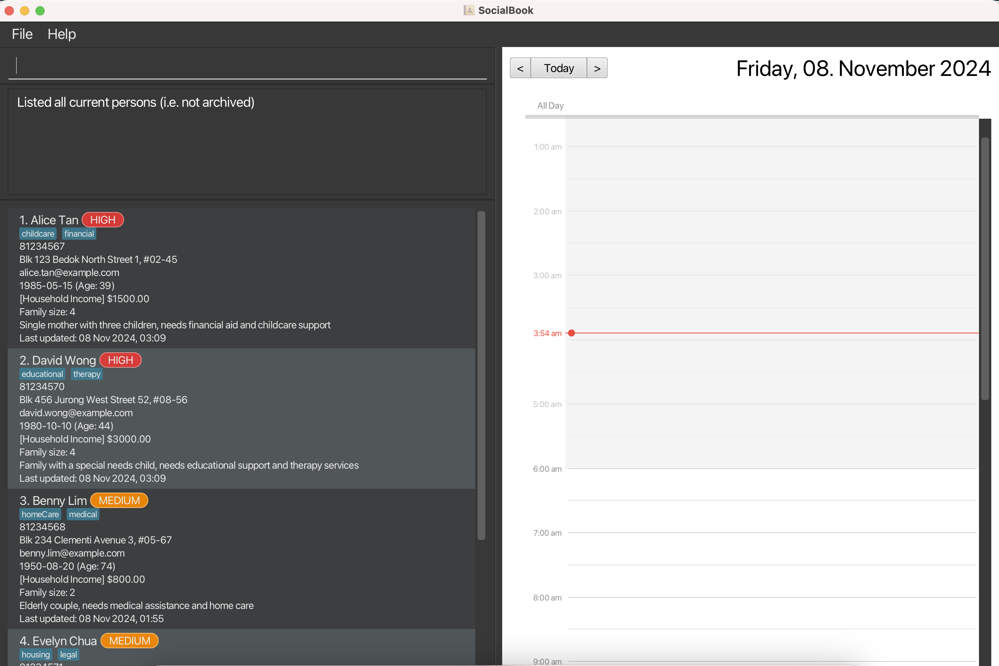

# SocialBook

**SocialBook is a desktop application for managing the contact details of families you are working with.** While it has a GUI (Graphical User Interface) with buttons for you to click, most of the user interactions happen using a CLI (Command Line Interface) where you type commands to use the application.

* If you are interested in using SocialBook, head over to the [_Quick Start_ section of the **User Guide**](UserGuide.html#quick-start).
* If you are interested about developing SocialBook, the [**Developer Guide**](DeveloperGuide.html) is a good place to start.

**Acknowledgements**

* Libraries used: [JavaFX](https://openjfx.io/), [Jackson](https://github.com/FasterXML/jackson), [JUnit5](https://github.com/junit-team/junit5)
