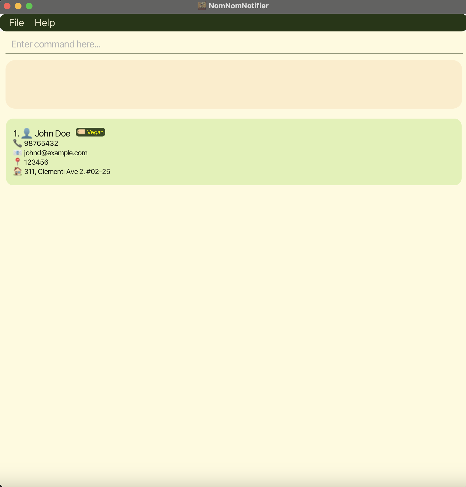

Nom Nom Notifier is a simple command-lind application designed for small eateries or restaurants to manage the customer details efficiently for delivery purposes.

* If you are interested in using NomNomNotifier, head over to the [_Quick Start_ section of the **User Guide**](UserGuide.html#quick-start).
* If you are interested about developing NomNomNotifier, the [**Developer Guide**](DeveloperGuide.html) is a good place to start.

**Acknowledgements**

* Libraries used: [JavaFX](https://openjfx.io/), [Jackson](https://github.com/FasterXML/jackson), [JUnit5](https://github.com/junit-team/junit5)
