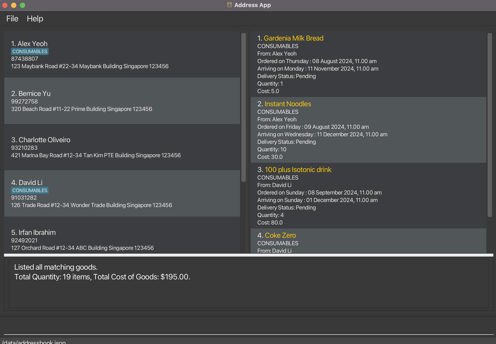

---

## SupplyCentral
`SupplyCentral` is a desktop app for business owners to manage their suppliers and goods.

Optimized for command-line-interface usage. Information is packaged nicely into a GUI interface, with colors! Also,
compatible with world's most popular data sheet, Excel.

## Core features
- Maintain a of list of suppliers and their contact information
- Keep track of the goods that you have ordered from each supplier
- Able to load supplier and goods information easily with **Excel**
- Able to filter goods and save them to **Excel**
- Able to save changes instantaneously to **Excel**

### Codebase and Documentation
* Written with Functional Programming & Object-Oriented Programming
* Written with test cases to ensure no uneventful mishaps
* Documentation up to date with the latest changes

For the detailed documentation of this project, see the **[SupplyCentral Product Website](https://ay2425s1-cs2103-f10-1.github.io/tp/)**.

### Acknowledgements
* This project is based on the AddressBook-Level3 project created by the [SE-EDU initiative](https://se-education.org).
