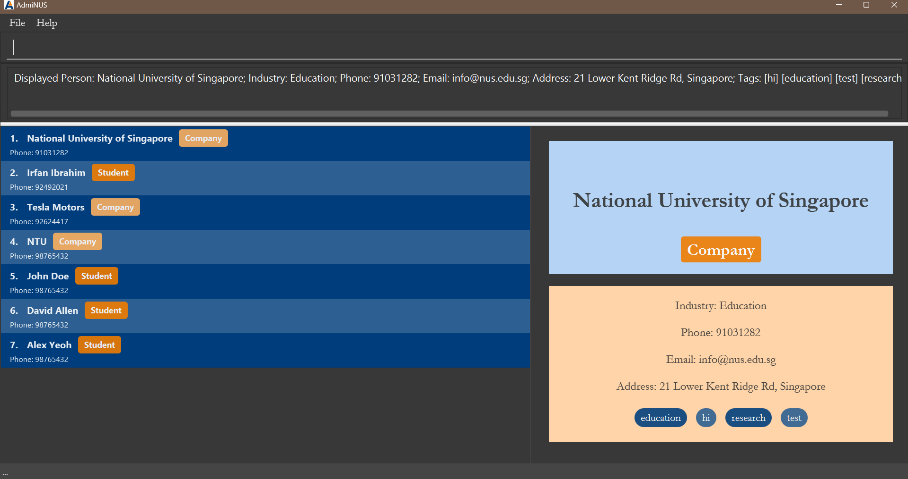

[](https://github.com/se-edu/addressbook-level3/actions)
[](https://codecov.io/gh/se-edu/addressbook-level3)

# AdmiNUS - Contact Management for NUS Clubs


AdmiNUS is a desktop application for managing contact details of NUS club administrators, student leaders, and event coordinators. It is optimized for Command Line Interface (CLI) users who prefer efficient and fast contact management without sacrificing the convenience of a Graphical User Interface (GUI).

## Features

AdmiNUS allows you to:

* Add, edit, delete, and search student and company contacts easily. 

* Track contacts by categories (e.g., students, companies) and tags.

* Use both CLI and GUI for seamless interaction.

* Import and export contact data via CSV files.

The application is designed for those who are constantly organizing events, managing multiple groups, and need a streamlined way to keep everything in order.

## Why Use AdmiNUS?

AdmiNUS makes contact management efficient by leveraging the speed of CLI commands alongside a simple, clear GUI. It's especially helpful for **NUS Club Admins** who need to organize contacts for events, vendors, and participants.

### Example Use Case

Suppose you are organizing an NUS event with over 200 participants, including student volunteers and vendors. With AdmiNUS, adding, editing, and filtering contacts is quick and straightforward. For example, to add a student:

```shell
student n/John Doe id/A0123456X p/98765432 e/johnd@example.com a/123 Clementi Rd, #02-01 t/volunteer
```

This command adds John Doe instantly, tagged as a volunteer. You can then use commands like `filtertag volunteer` to find all volunteers, saving time compared to traditional methods.

AdmiNUS helps you stay organized and efficient, letting you focus on running successful events.

## Getting Started
* If you are interested in using AdmiNUS, head over to the [_Quick Start_ section of the **User Guide**](UserGuide.html#quick-start).
* If you are interested about developing AdmiNUS, the [**Developer Guide**](DeveloperGuide.html) is a good place to start.


## Acknowledgements

AdmiNUS incorporates various libraries and tools, including:
- [JavaFX](https://openjfx.io/) for the GUI.
- [Jackson](https://github.com/FasterXML/jackson) for data serialization
- [JUnit5](https://github.com/junit-team/junit5) for testing

AdmiNUS is your comprehensive solution for efficient contact management, designed to meet the unique needs of NUS club administrators and event organizers.