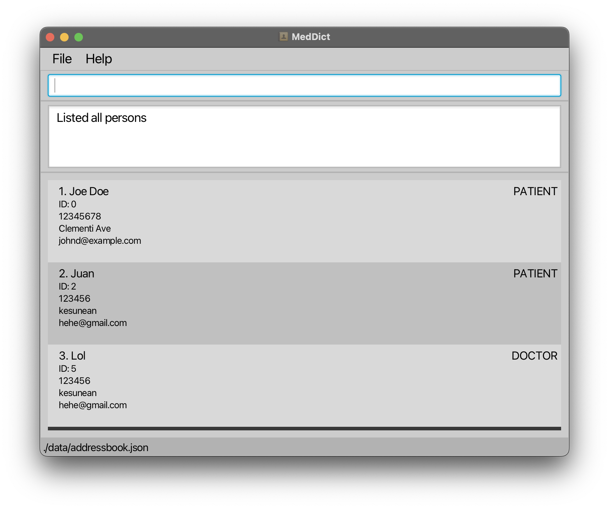

**MedDict**

MedDict is a desktop application designed for physiotherapists who manage a large number of patients. It simplifies data entry and retrieval, allowing quick access to contact details, patient conditions, and the progress of recurring or long-term patients. The application supports a streamlined process for tracking medical history, patient appointments, and treatment progress.

MedDict provides a specialized, all-in-one solution for physiotherapists to manage patient-related information, including medical history, treatment plans, and appointment tracking. The app is optimized for frequent use in clinical settings where speed and accuracy are essential.

While MedDict offers a graphical interface, most user interactions happen using a Command Line Interface (CLI), tailored for physiotherapists who prefer typing over mouse interactions and prioritize efficiency in managing patient information.

In other words, MedDict is formulated for physiotherapists who need quick and reliable access to patient information, prefer minimal time spent on data entry, and are comfortable using CLI-based apps for faster updates during consultations.

* If you're interested in using MedDict, head over to the [_Quick Start_ section of the **User Guide**](UserGuide.html#quick-start).
* If you are interested in developing MedDict, the [**Developer Guide**](DeveloperGuide.html) is a good place to start.

**Acknowledgements**
* This project is based on the AddressBook-Level3 project created by the [SE-EDU initiative](https://se-education.org).
* Libraries used: [JavaFX](https://openjfx.io/), [Jackson](https://github.com/FasterXML/jackson), [JUnit5](https://github.com/junit-team/junit5)
