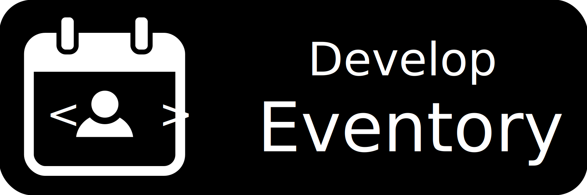

# Eventory

 

## Welcome to Eventory: Your Event Directory
Eventory is a **desktop app for managing contacts and events**, optimized for use via a Command Line Interface.

#### Say goodbye to using 3 different apps just to plan events.

    
    

 

### Custom Built For Event Planners

Effortlessly manage your network, streamline tasks, and enhance communication with our feature-packed platform designed for seamless organization and efficiency.

#### **Enhanced Contact Management**
<box type="success" seamless>
  Store All Your Contacts: Add phone numbers, emails, addresses, and tags
</box>
<box type="success" seamless>
  Contact Linking: Add contacts to events
</box>
<box type="success" seamless>
  Advanced Filters: Filter by name and tag
</box>

#### **Comprehensive Event Management**
<box type="success" seamless>
  Track All Your Events: Add locations, start dates, and tags
</box>
<box type="success" seamless>
  Timeline View: Countdown for upcoming events
</box>
<box type="success" seamless>
  Advanced Filters: Filter by name, tag, or date
</box>

#### **Automated Communication**
<box type="success" seamless>
  Automated Message Generation: Copy and send event summaries
</box>

### Powered By Leading Technologies

Eventory is built with reliable libraries and frameworks:
<box type="definition" seamless>

[JavaFX](https://openjfx.io/) for a rich graphical experience
</box>
<box type="definition" seamless>

[Jackson](https://github.com/FasterXML/jackson) for seamless data processing
</box>
<box type="definition" seamless>

[JUnit5](https://github.com/junit-team/junit5) to ensure quality and robustness
</box>
