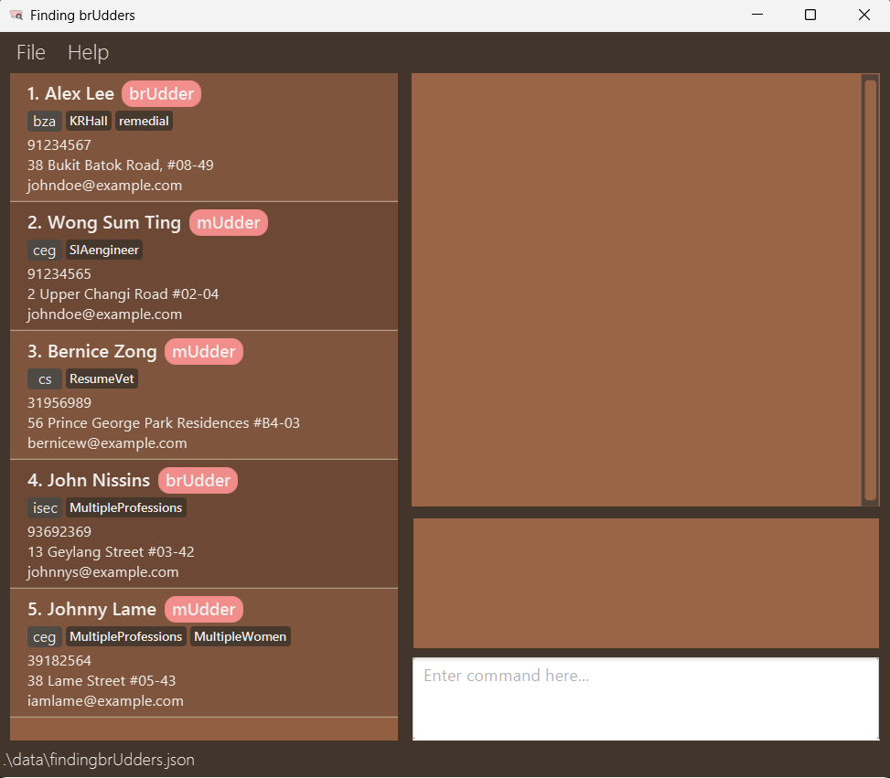

# KnottyPlanners 💍🎀
## Making Wedding Planning a Breeze! 🎉

**Welcome to KnottyPlanners!** Your ultimate desktop application for managing wedding planning details. While it has a GUI, most of the user interactions happen using a CLI (Command Line Interface).

## Features

- **Effortless Contact Management**: Easily add, edit, and delete contacts.
- **Comprehensive Wedding Planning**: Keep track of wedding details including venues and dates.
- **Tagging**: Organize contacts and weddings with customizable tags.
- **Search and Filter**: Quickly find contacts and weddings with powerful search and filter options.
- **Reliable Data Persistence**: Automatically saves your data to ensure nothing is lost.

## Why Choose KnottyPlanners?

- **User-Friendly**: Intuitive CLI commands make it easy to manage your data.
- **Reliable**: Built with robust technologies like JavaFX, Jackson, and JUnit5.
- **Community-Driven**: Join our community of users and developers to share tips and get support.

## Get Started Today! 🎉
* If you are interested in using KnottyPlanners, head over to the [_Quick Start_ section of the **User Guide**](UserGuide.html#quick-start).
* If you are interested about developing KnottyPlanners, the [**Developer Guide**](DeveloperGuide.html) is a good place to start.
* We value your feedback! Reach out to us with any suggestions or issues.

## Acknowledgements 🙏

- **Libraries Used**: [JavaFX](https://openjfx.io/), [Jackson](https://github.com/FasterXML/jackson), [JUnit5](https://github.com/junit-team/junit5)

## Contributors 🌟

* Check out our [**About Us page**](AboutUs.html) to learn more about the developers behind KnottyPlanners.

## Join Our Community! 🌐

- **Stay Updated**: Follow us on [GitHub](https://github.com/AY2425S1-CS2103T-W13-4/tp) for the latest updates and releases.
- **Get Involved**: Contribute to the project by reporting issues, suggesting features, or submitting pull requests.
- **Spread the Word**: Share KnottyPlanners with your friends and family who are planning their big day!

## Contact Us 📧

- **Email**: support@knottyplanners.com
- **Twitter**: [@KnottyPlanners](https://twitter.com/KnottyPlanners)
- **Facebook**: [KnottyPlanners](https://facebook.com/KnottyPlanners)

Let's make wedding planning fun and stress-free together! 🎊💖
