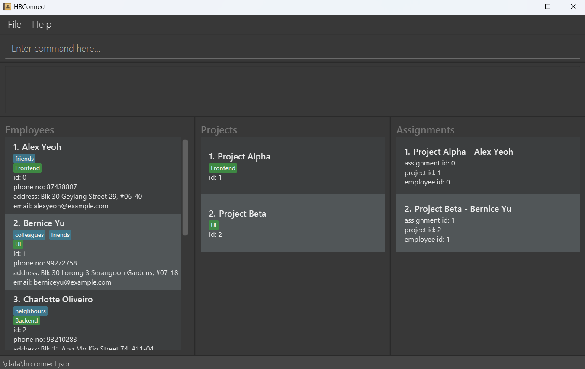

**HRConnect is a desktop app for managing human resources in relation to projects.** While it has a graphical display, user interactions are optimized for command line inputs.

* If you are interested in using HRConnect, head over to the [_Quick Start_ section of the **User Guide**](UserGuide.html#quick-start).
* If you are interested about developing HRConnect, the [**Developer Guide**](DeveloperGuide.html) is a good place to start.

**Acknowledgements**

* Libraries used: [JavaFX](https://openjfx.io/), [Jackson](https://github.com/FasterXML/jackson), [JUnit5](https://github.com/junit-team/junit5)
