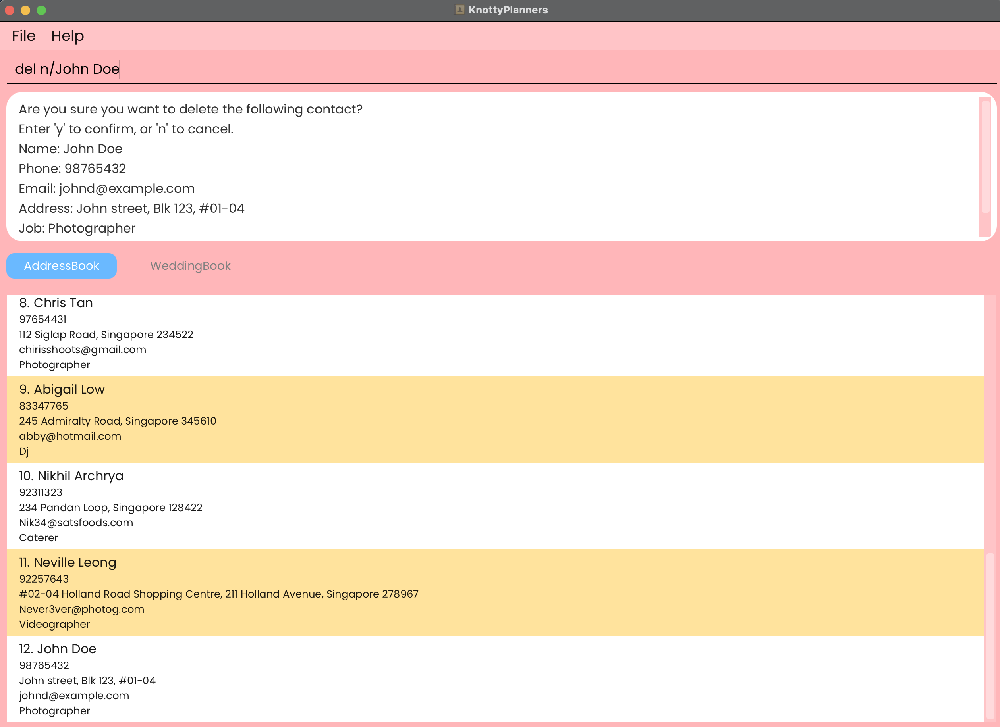

# Knotty Planner 💍🎀
## Making Wedding Planning a Breeze! 🎉

**Welcome to Knotty Planner!** Your ultimate desktop application for managing wedding planning details. While it has a GUI, most of the user interactions happen using a CLI (Command Line Interface).

## Features

- **Contact Management**: Easily add, edit, and delete contacts.
- **Wedding Planning**: Keep track of wedding details including venues and dates.
- **Tagging**: Organize contacts and weddings with customizable tags.
- **Search and Filter**: Quickly find contacts and weddings with powerful search and filter options.
- **Data Persistence**: Automatically saves your data to ensure nothing is lost.

## Why Choose Knotty Planner?

- **User-Friendly**: Intuitive CLI commands make it easy to manage your data.
- **Reliable**: Built with robust technologies like JavaFX, Jackson, and JUnit5.
- **Community-Driven**: Join our community of users and developers to share tips and get support.

## Why Wait?
* If you are interested in using Knotty Planner, head over to the [_Quick Start_ section of the **User Guide**](UserGuide.html#quick-start).
* If you are interested about developing Knotty Planner, the [**Developer Guide**](DeveloperGuide.html) is a good place to start.
* We value your feedback! Reach out to us with any suggestions or issues.

## Acknowledgements

- **Libraries Used**: [JavaFX](https://openjfx.io/), [Jackson](https://github.com/FasterXML/jackson), [JUnit5](https://github.com/junit-team/junit5)

