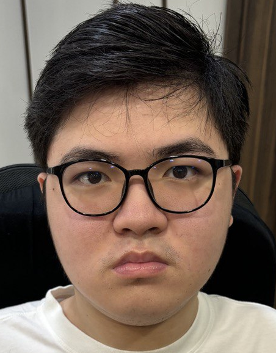

# I'm Aaron Sim, nice to meet you.

### About me

Currently studying Computer Science over at the **National University of Singapore (NUS)**.

Taking a swing at **software engineering** and **game development**.

### Skills
- **Web Development**: HTML, CSS, JavaScript, React, Node.js
- **Programming Languages**: C, C++, Java, Python
- **Data Analysis**: SQL
- **Game Development**: Godot

